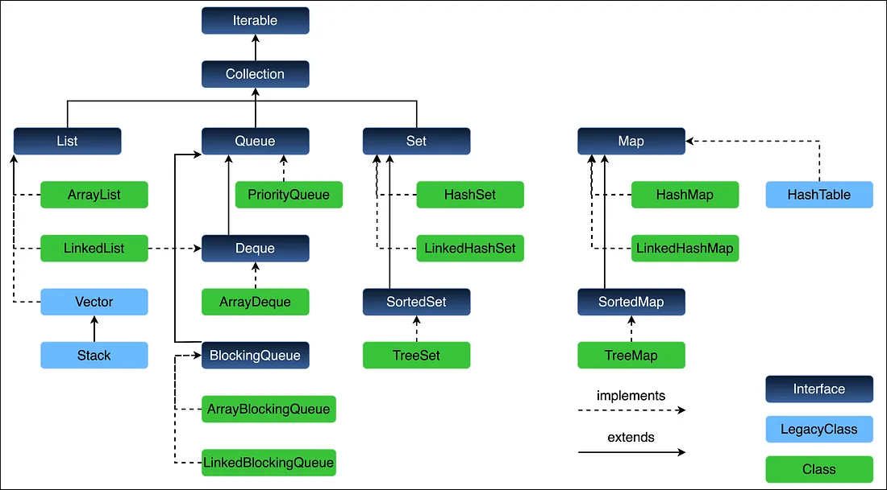

## **Collections Framework Hierarchy**

---

### 🔷 Introduction

The **Java Collections Framework (JCF)** is a **unified architecture** for representing and manipulating groups of objects. It consists of **interfaces**, **implementations (classes)**, and **algorithms** to handle various data structures like lists, sets, maps, queues, and deques efficiently.

For Enterprise-level systems, where performance, memory, and scalability are critical, understanding the **hierarchy** of this framework is essential to:

* Choose the right data structure for the use case
* Avoid performance bottlenecks
* Design extensible and type-safe systems

---

### 📊 High-Level Overview





> 🔑 **Map** is *not* a true child of `Collection`. It’s a separate hierarchy because it deals with key-value pairs instead of single elements.


---

### 🔹 1. `Iterable<T>` – 🔁 The Root of Iteration

* Base interface for all **iterable collections**
* Enables **enhanced `for-each` loop**
* Has one method: `Iterator<T> iterator();`

```java
for (String s : list) {
    System.out.println(s); // Uses Iterable
}
```

---

### 🔹 2. `Collection<E>` – 🧺 The Root of All Collections

Defines basic operations for adding, removing, and inspecting elements.

Key methods:

* `add(E e)`
* `remove(Object o)`
* `contains(Object o)`
* `size()`, `clear()`, `isEmpty()`

> All **List**, **Set**, **Queue**, and **Deque** interfaces extend `Collection`.

---

### 🔹 3. `List<E>` – 📋 Ordered, Indexed, Duplicates Allowed

A sequence of elements that allows **random access** and **preserves insertion order**.

| Implementation | Characteristics                               |
| -------------- | --------------------------------------------- |
| `ArrayList`    | Backed by a dynamic array, fast random access |
| `LinkedList`   | Doubly-linked list, fast insertion/deletion   |
| `Vector`       | Synchronized version of ArrayList             |
| `Stack`        | LIFO stack built on Vector                    |

---

### 🔹 4. `Set<E>` – 🚫 No Duplicates

Represents a collection that contains **no duplicate elements**.

| Subinterface   | Use Case                                      |
| -------------- | --------------------------------------------- |
| `SortedSet`    | Maintains sorted order                        |
| `NavigableSet` | Navigable methods like `floor()`, `ceiling()` |

| Implementation  | Characteristics                      |
| --------------- | ------------------------------------ |
| `HashSet`       | Backed by `HashMap`, O(1) operations |
| `LinkedHashSet` | Maintains insertion order            |
| `TreeSet`       | Backed by a `TreeMap`, sorted set    |

---

### 🔹 5. `Queue<E>` – 📥 FIFO Structure

Designed for **holding elements before processing**. Supports insertion/removal from **ends** depending on the type.

| Subinterface | Description                                         |
| ------------ | --------------------------------------------------- |
| `Deque<E>`   | Double-ended queue; supports stack/queue operations |

| Implementation  | Use Case                            |
| --------------- | ----------------------------------- |
| `PriorityQueue` | Min-heap based implementation       |
| `ArrayDeque`    | High-performance double-ended queue |
| `LinkedList`    | Implements both List and Deque      |

---

### 🔹 6. `Deque<E>` – 🔁 Double-Ended Queue

Supports insertion and removal at both ends.

Used for:

* **Stacks** (LIFO)
* **Queues** (FIFO)
* **Palindrome checks**, **sliding window problems**

---

### 🔹 7. `Map<K, V>` – 🗺️ Key-Value Pairs (Separate Hierarchy)

Stores mappings of keys to values, with **no duplicate keys** allowed.

| Subinterface    | Purpose                                           |
| --------------- | ------------------------------------------------- |
| `SortedMap`     | Maintains keys in sorted order                    |
| `NavigableMap`  | Extended with navigational methods                |
| `ConcurrentMap` | For concurrent access (e.g., `ConcurrentHashMap`) |

| Implementation      | Description                         |
| ------------------- | ----------------------------------- |
| `HashMap`           | Default hash table map              |
| `LinkedHashMap`     | Maintains insertion order           |
| `TreeMap`           | Keys kept in sorted order           |
| `WeakHashMap`       | Keys eligible for GC                |
| `IdentityHashMap`   | Uses `==` instead of `equals()`     |
| `ConcurrentHashMap` | High-concurrency lock-splitting map |

---

### 🔹 8. Utility Classes and Interfaces

| Class / Interface | Purpose                                                                    |
| ----------------- | -------------------------------------------------------------------------- |
| `Collections`     | Static utility methods (`sort`, `shuffle`, `unmodifiable`, `synchronized`) |
| `Arrays`          | Convert arrays to collections and vice versa                               |
| `Comparator<T>`   | External comparison logic                                                  |
| `Comparable<T>`   | Natural ordering logic                                                     |

---

### 🔍 Enterprise-LEVEL Insights

#### ✅ Why Learn the Hierarchy?

1. **Optimal Data Structure Selection**

   * Ex: Use `ArrayDeque` over `Stack` for LIFO performance
   * Use `TreeMap` when you need **range queries** on keys

2. **System Design Interviews**

   * Graphs → `Map<Node, List<Node>>`
   * Caches → `LinkedHashMap` for LRU logic
   * Scheduling → `PriorityQueue`, `Deque` for tasks

3. **Concurrent Systems**

   * Know when to switch to `ConcurrentHashMap`, `BlockingQueue`, etc.

4. **Type Abstraction**

   * Interface-based design (e.g., `List<String> list = new ArrayList<>();`) allows for **flexibility and dependency injection**

---

### 🧠 Common Interview Questions

| Question                                     | Key Concept                                                                                     |
| -------------------------------------------- | ----------------------------------------------------------------------------------------------- |
| Why doesn't Map extend Collection?           | Because it works with pairs (keys and values) instead of single elements                        |
| Difference between HashMap and TreeMap?      | `HashMap` is unordered, O(1); `TreeMap` is sorted, O(log n)                                     |
| Which collection guarantees insertion order? | `LinkedHashSet`, `LinkedHashMap`                                                                |
| What is NavigableMap used for?               | Efficient floor, ceiling, higher, lower operations (used in interval scheduling, memory blocks) |
| Stack vs Deque vs Queue?                     | Deque is more flexible and modern alternative                                                   |

---

### ✅ Summary Table: Major Interfaces

| Interface | Description        | Duplicate Allowed | Ordered?                | Sorted?       | Nulls Allowed                                   |
| --------- | ------------------ | ----------------- | ----------------------- | ------------- | ----------------------------------------------- |
| `List`    | Indexed collection | ✅ Yes             | ✅ Yes                   | ❌ No          | ✅ Yes                                           |
| `Set`     | Unique elements    | ❌ No              | ❌ No (`HashSet`)        | ✅ (`TreeSet`) | `HashSet` ✅, `TreeSet` ❌ (nulls not comparable) |
| `Queue`   | FIFO               | ✅ Yes             | ✅ Often                 | ❌ No          | Usually ✅                                       |
| `Deque`   | Double-ended       | ✅ Yes             | ✅ Yes                   | ❌ No          | ✅                                               |
| `Map`     | Key-Value pairs    | ❌ Keys No         | ❌ Unordered (`HashMap`) | ✅ (`TreeMap`) | `HashMap` allows null keys; `TreeMap` doesn't   |

---

### 🧩 Visual Summary

```
                Iterable
                   │
               Collection
      ┌─────────┼──────────────┐
      │         │              │
     List      Set           Queue
      │         │              │
      │     SortedSet       Deque
      │         │
      │    NavigableSet

              Map
         ┌────┼───────┐
     SortedMap   ConcurrentMap
         │
   NavigableMap
```

---

### 🔚 Conclusion

The **Java Collections Framework hierarchy** provides a consistent, extensible, and efficient structure for manipulating data. It abstracts away implementation details and enables clean, modular, and high-performance code.

> 🔥 At Enterprise scale, knowing which interface to use — and **why** — can directly influence the scalability, latency, and maintainability of a system.


