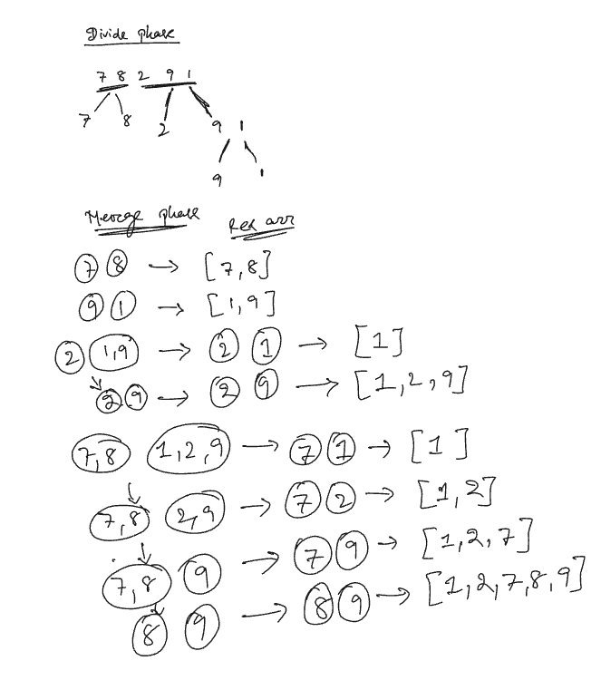

## 📘 Algorithms – Sorting

### 🔹 Topic: **Mergesort (with Merge Logic)**

---

## 🔹 1. What is Mergesort?

**Mergesort** is a classic **Divide and Conquer** sorting algorithm that:

1. **Divides** the array into two halves recursively until each half has one element
2. **Merges** the sorted halves into a single sorted array

> It is known for its consistent O(n log n) time complexity across best, average, and worst cases.

---

## 🔹 2. Why Mergesort?

* **Stable**: Equal elements retain original order
* **Predictable performance**: Always O(n log n)
* **Used in hybrid algorithms** (like Timsort)
* **Efficient on linked lists** (no shifting needed)

---

## 🔹 3. Merge Sort Algorithm Steps

### ✅ Algorithm (Top-Down Recursive):

```python
def merge_sort(arr):
    if len(arr) > 1:
        mid = len(arr) // 2
        left = arr[:mid]
        right = arr[mid:]

        merge_sort(left)
        merge_sort(right)

        merge(arr, left, right)
```

---

### ✅ Merge Function (Core Logic):

```python
def merge(arr, left, right):
    i = j = k = 0  # i for left, j for right, k for merged arr

    while i < len(left) and j < len(right):
        if left[i] <= right[j]:   # Stable: <= instead of <
            arr[k] = left[i]
            i += 1
        else:
            arr[k] = right[j]
            j += 1
        k += 1

    # Copy remaining elements
    while i < len(left):
        arr[k] = left[i]
        i += 1
        k += 1
    while j < len(right):
        arr[k] = right[j]
        j += 1
        k += 1
```

---

## 🔹 4. Dry Run Example

For input: `[38, 27, 43, 3, 9, 82, 10]`

### Divide Phase:

* `[38, 27, 43, 3, 9, 82, 10]`
  → `[38, 27, 43]` and `[3, 9, 82, 10]`
  → Further divided into single-element subarrays

### Merge Phase:

* Merge `[38]` and `[27]` → `[27, 38]`
* Merge `[27, 38]` and `[43]` → `[27, 38, 43]`
* …continue merging till full array is sorted

✅ Final Output: `[3, 9, 10, 27, 38, 43, 82]`

---

## 🔹 5. Time and Space Complexity

| Case    | Time Complexity | Reason                          |
| ------- | --------------- | ------------------------------- |
| Best    | O(n log n)      | Always divides into halves      |
| Average | O(n log n)      | Consistent performance          |
| Worst   | O(n log n)      | Still log splits × linear merge |

* **Space Complexity**: O(n) auxiliary space (new arrays in merge step)
* **In-place**: ❌ No (it uses extra memory)
* **Stable**: ✅ Yes (equal elements remain in order)

---

## 🔹 6. Recurrence Relation

### For input size `n`:

* Divide: 2 subproblems of size `n/2`
* Merge step takes linear time: O(n)

So,

```
T(n) = 2T(n/2) + O(n)
```

Using **Master Theorem**:

* a = 2, b = 2, f(n) = O(n)
  → Case 2: a = b^d → T(n) = Θ(n log n)

✅ Final Time: **T(n) = Θ(n log n)**

---

## 🔹 7. Comparison with Other Sorting Algorithms

| Algorithm | Time (Worst) | Space    | Stable | Adaptive |
| --------- | ------------ | -------- | ------ | -------- |
| Mergesort | O(n log n)   | O(n)     | ✅ Yes  | ❌ No     |
| Quicksort | O(n²)        | O(log n) | ❌ No   | ❌ No     |
| Insertion | O(n²)        | O(1)     | ✅ Yes  | ✅ Yes    |

---

## 🔹 8. GATE PYQ-Style MCQs

### Q1. What is the worst-case time complexity of mergesort?

**A.** O(n²)
**B.** O(n)
**C.** O(n log n)
**D.** O(log n)

✅ **Answer:** C

---

### Q2. Which of the following is TRUE about mergesort?

**A.** It is in-place
**B.** It is unstable
**C.** It has worst-case O(n log n) time
**D.** It requires no recursion

✅ **Answer:** C

---

### Q3. In the recurrence `T(n) = 2T(n/2) + n`, what is the time complexity?

**A.** O(n²)
**B.** O(n log n)
**C.** O(log n)
**D.** O(n)

✅ **Answer:** B

---

## 🔹 9. Practical Uses

* Sorting linked lists efficiently (as linked lists allow O(1) insertions/merges)
* Used in **external sorting** (e.g., large files)
* Component of **Timsort** in Python and Java

---

## ✅ Final GATE Tips

* **Mergesort is stable** and always **O(n log n)**
* Understand **merge step clearly** — GATE may test array state after one merge
* Be ready to write or identify **recurrence relation**
* Don’t confuse it with Quicksort, which is in-place but not stable
* Practice tracing 2–3 merge steps manually for MCQ-type tracing questions


### Example : Dry Run 

Let’s do a **step-by-step dry run of Merge Sort** on the input array:

---

## 🔢 Input:

```
[7, 8, 2, 9, 1]
```

---

## 📘 Step 1: Divide Phase (Recursive Splitting)

We recursively divide the array until we get single-element arrays:

```
Original:         [7, 8, 2, 9, 1]
Split into:       [7, 8]       [2, 9, 1]
Further Split:    [7] [8]      [2] [9, 1]
Further Split:                  [9] [1]
```

Final leaf nodes:

```
[7], [8], [2], [9], [1]
```

---

## 🔄 Step 2: Merge Phase (Bottom-Up)

Now we merge the sorted subarrays step-by-step.

### 🔸 Merge \[7] and \[8]:

```text
Compare 7 and 8 → 7 < 8 → Result: [7, 8]
```

### 🔸 Merge \[9] and \[1]:

```text
Compare 9 and 1 → 1 < 9 → Result: [1, 9]
```

### 🔸 Merge \[2] and \[1, 9]:

Now merge \[2] with \[1, 9]:

* Compare 2 and 1 → 1 < 2 → \[1]
* Compare 2 and 9 → 2 < 9 → \[1, 2]
* Remaining → 9 → \[1, 2, 9]

### 🔸 Final Merge: \[7, 8] and \[1, 2, 9]

Merge step-by-step:

* Compare 7 and 1 → 1 < 7 → \[1]
* Compare 7 and 2 → 2 < 7 → \[1, 2]
* Compare 7 and 9 → 7 < 9 → \[1, 2, 7]
* Compare 8 and 9 → 8 < 9 → \[1, 2, 7, 8]
* Remaining → 9 → \[1, 2, 7, 8, 9]

---

## ✅ Final Sorted Array:

```
[1, 2, 7, 8, 9]
```

---

## Summary of Merge Steps:

| Step                    | Result           |
| ----------------------- | ---------------- |
| Merge \[7] & \[8]       | \[7, 8]          |
| Merge \[9] & \[1]       | \[1, 9]          |
| Merge \[2] & \[1,9]     | \[1, 2, 9]       |
| Merge \[7,8] & \[1,2,9] | \[1, 2, 7, 8, 9] |

