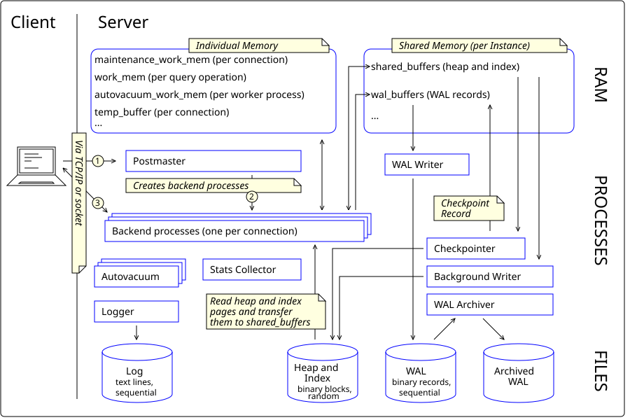

## **Architecture Overview**

---

PostgreSQL is a powerful, open-source, object-relational database management system (ORDBMS) known for its ACID compliance, extensibility, and standards conformance. To fully leverage PostgreSQL in production-grade systems, especially at large scale, a deep understanding of its **internal architecture** is critical.

---

### 🧠 **High-Level Architecture Overview**

PostgreSQL follows a **client-server model** with a **multi-process architecture**, not multithreaded. Each client connection is handled by a separate process, providing fault isolation and ease of debugging.

```
         ┌─────────────┐
         │   Clients   │
         └─────┬───────┘
               │
         ┌─────▼───────┐
         │  Postmaster │ ← Master process (a.k.a. postgres)
         └─────┬───────┘
    ┌──────────┴─────────────┐
    │                        │
┌───▼────┐             ┌─────▼────┐
│ Backend│             │ Background│
│Process │             │ Processes │
└────────┘             └───────────┘
```

---

### 🧩 **Core Architectural Components**

#### 1. **Postmaster (Main Server Process)**

* Acts as a **process manager**.
* Listens for client connection requests.
* Forks a **new backend process** for each connection.
* Monitors child processes, restarts background workers on failure.

---

#### 2. **Backend Process (Client Handler)**

* One per client.
* Executes SQL queries.
* Manages parsing, planning, optimization, and execution.
* Manages buffers and caching for that session.

**🔒 Isolation:** Crashing one backend does **not** affect others—important for reliability at scale.

---

#### 3. **Shared Memory**

Used for inter-process communication (IPC), containing:

* **Buffer Cache**: In-memory page cache for frequently accessed table/index data.
* **WAL Buffers**: For write-ahead logging (crash safety).
* **Lock Table**: Manages concurrency and MVCC.
* **Commit Log (CLOG)**: Tracks transaction status.
* **Statistics Collector Info**: Runtime metrics.
* **Background Writer Info**.

All backends and background processes interact with shared memory.

---

#### 4. **Background Processes**

Essential daemons launched by the postmaster:

| Process                           | Responsibility                                                             |
| --------------------------------- | -------------------------------------------------------------------------- |
| **WAL Writer**                    | Flushes write-ahead log buffers to disk.                                   |
| **Background Writer**             | Flushes dirty shared buffers to disk to reduce backend I/O burden.         |
| **Checkpointer**                  | Periodically writes all dirty pages to disk; triggers fsync.               |
| **Autovacuum Daemon**             | Reclaims space by removing dead tuples (crucial for MVCC performance).     |
| **Stats Collector**               | Gathers query statistics used by the planner.                              |
| **Archiver**                      | Copies WAL segments to archive location for point-in-time recovery (PITR). |
| **Logical Replication Workers**   | Applies changes from upstream nodes in logical replication setup.          |
| **BGWorker (Background Workers)** | Plugin/extension-defined long-running background processes.                |

---

#### 5. **Storage System**

PostgreSQL uses a file-based storage model:

* Data stored in **8KB pages**, mapped to files in the `$PGDATA/base/` directory.
* One file per table/index segment per 1GB size.
* WAL stored in `$PGDATA/pg_wal/`.

**Data Flow:**

1. SQL writes → buffer pool → WAL → checkpoint → data file
2. WAL ensures durability, allowing crash recovery.

---

#### 6. **Write-Ahead Logging (WAL)**

* Implements **Durability** in ACID.
* Logs all modifications **before** writing to disk.
* Enables **Crash Recovery** and **Replication**.
* WAL files are appended-only, periodically archived or cleaned.

---

#### 7. **Query Execution Pipeline**

| Stage        | Description                                                    |
| ------------ | -------------------------------------------------------------- |
| **Parser**   | Converts SQL into a parse tree.                                |
| **Analyzer** | Performs semantic analysis and adds type information.          |
| **Planner**  | Chooses the most efficient plan using cost-based optimization. |
| **Executor** | Executes the chosen plan using iterators (pipelines or loops). |

⚙️ Large-scale systems often rely on **custom planners**, **JIT compilation**, or **parallel execution** for faster throughput.

---

#### 8. **Concurrency Control (MVCC)**

PostgreSQL implements **Multiversion Concurrency Control (MVCC)**:

* Each transaction sees a **snapshot** of the database.
* Writes create new tuple versions; old versions remain for other transactions.
* Enables **non-blocking reads**, isolation without locking.

**Visibility Tracking**:

* `xmin`, `xmax` fields on each row version.
* Commit status tracked in **CLOG**.

---

#### 9. **Extensions and Plugin System**

PostgreSQL is highly extensible:

* You can add **custom data types**, **index types**, **foreign data wrappers**, and **background workers**.
* Examples: `PostGIS`, `pg_partman`, `pg_stat_statements`.

---

### 🧵 **Process Lifecycle Summary**

1. `postmaster` starts.
2. Waits for client connection.
3. For each client, forks a new backend.
4. Client sends SQL → backend processes → uses shared memory → returns result.
5. Writes → WAL → disk via checkpoint.
6. Background daemons maintain performance, cleanup, and logging.

---

### 🏗️ **Performance Implications**

| Feature                      | Impact at Scale                                                               |
| ---------------------------- | ----------------------------------------------------------------------------- |
| **MVCC**                     | Enables high-concurrency reads; needs regular autovacuum tuning.              |
| **WAL + Checkpoint**         | Ensures crash-safety; tuning `wal_buffers`, `checkpoint_timeout` is critical. |
| **Buffer Pool**              | Must be right-sized to minimize disk I/O.                                     |
| **Query Planner**            | Cost-based planning requires accurate stats (run ANALYZE or use extensions).  |
| **Parallel Execution & JIT** | Speed up analytical queries (e.g., for OLAP).                                 |
| **Connection Scaling**       | Use **connection pooling** (e.g., PgBouncer) to avoid fork overhead.          |
| **Replication**              | Streaming or logical replication for horizontal scaling and HA.               |

---

### 🧪 **Real-World Scenarios**

* **Amazon Aurora (PostgreSQL-compatible)** uses a custom storage engine with PostgreSQL-compatible query layer.
* **Citus** (distributed PostgreSQL extension) enables horizontal sharding at petabyte scale.
* **Airbnb**, **Netflix**, and **Apple** use PostgreSQL for transactional workloads and event sourcing due to its robust architecture.

---

### 🧩 Summary

| Layer                | Components                                                               |
| -------------------- | ------------------------------------------------------------------------ |
| **Connection Layer** | `postmaster`, backend process per connection                             |
| **Execution Layer**  | Parser → Analyzer → Planner → Executor                                   |
| **Memory Layer**     | Shared Buffers, WAL Buffers, Lock Table, CLOG                            |
| **Storage Layer**    | Page-based data files, WAL, base directory, TOAST tables                 |
| **Daemon Layer**     | Background Writer, WAL Writer, Checkpointer, Autovacuum, Stats Collector |

---

This architecture enables **reliability, extensibility, and high performance**—critical for scaling systems like e-commerce platforms, real-time analytics engines, and microservices-based backends in Enterprise-like environments.

---

## Architecture High Level Overview: 



This diagram illustrates the **PostgreSQL internal architecture** at a high level. It shows the flow of a database request from a client, how PostgreSQL handles memory, process management, and data I/O between memory and disk.

Let’s break it down step-by-step:

---

### 🧭 **Main Sections in the Diagram**

1. **Client Request Path (Left side, top to bottom)**
2. **Memory Layers:**

   * **Individual Memory** (per backend process)
   * **Shared Memory** (shared by all processes in an instance)
3. **Backend and Background Processes**
4. **Disk I/O Components and Flow**
5. **Data Files on Disk (Bottom row)**

---

### 🔄 **Flow Description**

---

#### **1. Client Connection**

* A client connects to PostgreSQL **via TCP/IP or a local Unix socket**.
* This request is received by the **Postmaster** process.

#### **2. Postmaster Process**

* The **Postmaster** (also known as the parent server process) listens for incoming connections.
* Once a request is received, it **forks a new backend process** to handle that specific client.
* This gives PostgreSQL its **process-per-connection model**.

---

### 🧠 **Memory Architecture**

---

#### **🔹 Individual Memory**

* Each backend process has its **own local memory**:

  * Work memory for sorting, hashing.
  * Temporary buffers for operations like joins, sorting.
  * Executor context during query execution.

---

#### **🔹 Shared Memory**

* Allocated **once per database instance**.
* Accessible by all backend and background processes.
* Includes:

  * `shared_buffers`: In-memory cache for table and index pages.
  * `WAL Buffers`: For write-ahead logging.
  * `CLOG`: Transaction status.
  * Lock table and other metadata.

> This helps reduce disk I/O and facilitates inter-process communication.

---

### ⚙️ **Backend Process Flow**

---

1. The **backend process** receives SQL commands from the client.
2. It performs **parsing, planning, and execution** of the SQL query.
3. For data access, it may read from:

   * **Shared buffers** (if data is already cached),
   * Or **heap/index pages** from disk.

> These pages are loaded into `shared_buffers` for further operations.

---

### 📀 **Data I/O and Disk Interaction**

* When data is **not in memory**, PostgreSQL reads the **heap and index pages from disk** and transfers them into the `shared_buffers`.
* Pages are modified in memory (dirty pages).
* Eventually, they are flushed to disk by the **checkpoint process** or **background writer**.

---

### 🔁 **Write-Ahead Logging (WAL)**

* Changes are first written to the **WAL buffers** and then persisted to WAL files.
* This ensures **durability and crash recovery**.
* WAL is replayed during recovery to restore consistency.

---

### 🧰 **Background Processes**

These include:

| Process               | Function                                                             |
| --------------------- | -------------------------------------------------------------------- |
| **WAL Writer**        | Writes buffered WAL entries to disk.                                 |
| **Background Writer** | Flushes dirty pages from `shared_buffers` to disk periodically.      |
| **Checkpointer**      | Triggers periodic full checkpoints, writing all dirty pages to disk. |
| **Autovacuum**        | Reclaims dead tuples (not explicitly shown but essential).           |
| **Stats Collector**   | Tracks database statistics for the planner.                          |

> Checkpoints are essential to bound WAL size and help speed up recovery.

---

### 📦 **Data Files on Disk**

The bottom row represents physical files on disk:

* **Base Tables**: Actual table data stored in heap format.
* **Index Files**: B-trees, GiST, GIN, etc.
* **WAL Files**: Sequential log of all changes.
* **Control Files / Checkpoint Info**: Metadata and status tracking.

---

### 🧩 **Putting It Together**

Here's the sequence again, summarized:

1. **Client** connects → `Postmaster` spawns **backend**.
2. Backend allocates **individual memory**, accesses **shared memory**.
3. SQL is parsed and executed.
4. Pages are fetched from disk → loaded into `shared_buffers`.
5. Data changes are logged to **WAL** → flushed by WAL writer.
6. **Background writer** and **checkpointer** ensure durable storage.
7. Autovacuum and stats collector maintain DB health and performance.

---

### 🧠 Observations

* **Scalability Challenge**: One backend per connection = expensive. Use PgBouncer or connection pooling.
* **Tuning Critical**: `shared_buffers`, `work_mem`, `checkpoint_timeout`, and `wal_writer_delay` must be fine-tuned for high throughput.
* **Observability**: Metrics from `pg_stat_activity`, `pg_stat_bgwriter`, and WAL lag must be monitored in real-time.
* **Crash Safety**: WAL + Checkpoints provide a solid recovery foundation.

---


## A breakdown of each background process:


Here’s a detailed breakdown of each **PostgreSQL background process**, explaining **what they do, why they're important**, and how they affect **performance, durability, and scalability**.

---

## 🔧 PostgreSQL Background Processes – Deep Dive

PostgreSQL launches several **autonomous background processes** alongside the `postmaster` and `backend` processes. These daemons handle everything from writing WAL files to vacuuming dead rows — enabling high performance, crash recovery, and concurrency.

| Background Process    | Purpose                                  | Frequency         | Critical For                       |
| --------------------- | ---------------------------------------- | ----------------- | ---------------------------------- |
| `checkpointer`        | Flushes dirty buffers at checkpoints     | Periodic          | Durability, Recovery               |
| `background writer`   | Spreads out buffer flushing              | Constantly active | Performance, I/O load              |
| `WAL writer`          | Writes WAL changes from memory to disk   | Frequent          | Durability, Recovery               |
| `autovacuum launcher` | Launches vacuums on tables               | Periodic trigger  | MVCC, Disk cleanup                 |
| `stats collector`     | Gathers runtime stats                    | Passive tracking  | Query optimization                 |
| `logical replication` | Handles logical stream apply/replication | Configured use    | High availability                  |
| `archiver`            | Archives WAL for PITR                    | Configured use    | Backups, PITR                      |
| `bgworker (custom)`   | Extension or plugin-defined daemons      | On demand         | Extensions like TimescaleDB, Citus |

---

### 🔹 1. `checkpointer`

**🧠 Purpose**: Ensures durability by writing all dirty pages (modified pages in `shared_buffers`) to disk during **checkpoint events**.

* **When it runs**: Based on `checkpoint_timeout` or if WAL size exceeds `max_wal_size`.
* **What it writes**:

  * Heap data
  * Index data
  * WAL checkpoint record
* **Why it matters**:

  * Shortens recovery time after a crash.
  * Reduces WAL bloat.
* **Tuning**: `checkpoint_completion_target` (spread checkpoint over time), `checkpoint_timeout`

---

### 🔹 2. `background writer`

**🧠 Purpose**: Proactively writes dirty buffers to disk **before** the checkpointer is triggered, reducing I/O spikes.

* **Runs continuously** in the background.
* Uses `bgwriter_delay`, `bgwriter_lru_maxpages`, and `bgwriter_lru_multiplier` to control pace.
* **Improves performance** by ensuring backend processes don’t need to flush dirty pages.
* **Analogy**: Like garbage collection in JVM – smooths memory usage and latency.

---

### 🔹 3. `WAL writer`

**🧠 Purpose**: Flushes **Write-Ahead Log** buffers from memory to disk frequently to ensure durability.

* Triggered at `wal_writer_delay` intervals.
* Writes data to `pg_wal/` directory.
* **Prevents data loss** by logging all changes **before** actual data is written to disk.
* Works closely with `wal_buffers`, `wal_writer_flush_after`.

---

### 🔹 4. `autovacuum launcher` (and workers)

**🧠 Purpose**: Launches **autovacuum workers** that reclaim storage and maintain MVCC health by:

* Removing dead tuples
* Freezing old transactions
* Updating table statistics

**Core for**:

* Preventing **transaction ID wraparound**
* Avoiding table bloat
* Improving **query planner accuracy**

**Key Parameters**:

* `autovacuum_vacuum_threshold`
* `autovacuum_naptime`
* `autovacuum_max_workers`

🧪 **Important tip**: On write-heavy systems, tune autovacuum aggressively or schedule manual vacuums during low-load periods.

---

### 🔹 5. `stats collector`

**🧠 Purpose**: Gathers stats for:

* Table/index access frequency
* Tuple reads/inserts/updates/deletes
* Row cache hits

**Why it matters**:

* The **query planner** depends on these stats to generate **optimal plans**.
* Data is exposed in `pg_stat_*` views.

**Configurable With**:

* `track_io_timing`
* `track_activities`
* `track_counts`

---

### 🔹 6. `archiver`

**🧠 Purpose**: Used when `archive_mode = on`. Copies completed WAL segments to a secure location (filesystem, S3, etc.).

* Enables **Point-in-Time Recovery (PITR)**.
* Runs an `archive_command` when a WAL segment is ready.

```sql
archive_command = 'cp %p /mnt/backup/%f'
```

* **Important for**: Disaster recovery, backup integrity, compliance in regulated environments.

---

### 🔹 7. `logical replication workers`

**🧠 Purpose**: Supports **logical replication**, which streams **row-level changes** (INSERT/UPDATE/DELETE) to subscribers.

* Launched for each subscription.
* Works with `pgoutput`, `wal2json`, or other output plugins.
* Enables:

  * Cross-version upgrades
  * Real-time analytics
  * Data migration

---

### 🔹 8. `custom background workers`

**🧠 Purpose**: User-defined workers introduced via PostgreSQL extensions or internal code.

* Useful for:

  * Periodic job scheduling (e.g., pg\_cron)
  * Metrics aggregation
  * Real-time processing (TimescaleDB background workers)

Example:

```c
BackgroundWorker bgw;
bgw.bgw_name = "My Custom Worker";
bgw.bgw_main = my_worker_main;
```

🧪 **Use Case**: Large-scale products often build **custom telemetry/metrics exporters**, **cache refreshers**, or **job schedulers** using this.

---

## ⚖️ Summary Table

| Process             | Responsibility                  | Impact Area            | Tunable Params                       |
| ------------------- | ------------------------------- | ---------------------- | ------------------------------------ |
| `checkpointer`      | Flush dirty pages at checkpoint | Durability, Recovery   | `checkpoint_timeout`, `max_wal_size` |
| `background writer` | Smooth out buffer writes        | Performance, Latency   | `bgwriter_*` settings                |
| `WAL writer`        | Flush WAL buffer                | Durability             | `wal_writer_delay`                   |
| `autovacuum`        | Clean dead rows, update stats   | MVCC, Bloat            | `autovacuum_*` settings              |
| `stats collector`   | Gather statistics for planner   | Optimization           | `track_*`                            |
| `archiver`          | Archive WAL for PITR            | Backups                | `archive_mode`, `archive_command`    |
| `logical workers`   | Stream changes to subscribers   | Replication, Migration | `wal_level`, `max_replication_slots` |
| `bgworkers`         | Custom extensions               | Observability, Jobs    | Depends on extension                 |

---

### 💡 Final Tips

* **Tuning autovacuum** is *mission-critical* in high-write applications (like logs, events, or user activity).
* **Enable WAL archiving** and **set a PITR retention policy** if regulatory or financial recovery needs exist.
* **Monitor background processes** using `pg_stat_activity`, `pg_stat_bgwriter`, and Prometheus exporters.
* Use tools like `pg_stat_statements`, `pg_repack`, and `pg_cron` to extend observability and maintenance.

---

Let me know if you’d like:

* A custom `postgresql.conf` tuning template for high-throughput systems.
* Examples of using `bgworkers` in real-time use cases (e.g., TimescaleDB or Citus).
* System architecture with high availability (streaming + logical replication).


## WAL crash recovery steps or buffer eviction strategy:

Here is a **Enterprise-level detailed explanation** of:

---

## 🛡️ PostgreSQL WAL Crash Recovery Steps + Buffer Eviction Strategy

---

## 🔁 Part 1: **WAL Crash Recovery Workflow**

PostgreSQL uses **Write-Ahead Logging (WAL)** to ensure *durability* and *atomicity* in compliance with ACID properties. After a crash (e.g., power failure, kill -9), PostgreSQL automatically runs **crash recovery** using the WAL logs.

---

### 🧠 **Key Principles of WAL**

* **"Write-Ahead"** means: *All changes must be logged to the WAL before being applied to actual data files.*
* WAL is **append-only** and stored in `pg_wal/` directory.
* PostgreSQL uses **physical log shipping** and/or **logical WAL streaming**.

---

### 🧩 **Crash Recovery Steps (Auto-triggered on startup)**

When PostgreSQL restarts after a crash:

#### 🔹 Step 1: Detect Last Consistent State

* PostgreSQL finds the last **checkpoint record** in the WAL using control files (`pg_control`).
* This checkpoint defines the last known-consistent state on disk.

#### 🔹 Step 2: REDO Phase (Roll Forward)

* It replays WAL records **forward from the last checkpoint**.
* Applies **all logged operations** to bring the data files to the latest committed state.
* Only WAL entries that represent **committed transactions** are replayed.

> This step ensures that **no committed data is lost** even if it was not flushed to disk before the crash.

#### 🔹 Step 3: UNDO Phase (Roll Back Uncommitted)

* PostgreSQL identifies **uncommitted transactions** using CLOG/transaction status data.
* It discards (does *not* apply) their changes during recovery.
* Since PostgreSQL uses **MVCC**, this step is minimal — mostly cleaning up remnants.

> Unlike Oracle, PostgreSQL doesn’t have a complex rollback segment because it never overwrites old data — it just ignores uncommitted versions.

#### 🔹 Step 4: Update Control Files

* Once WAL replay is complete:

  * PostgreSQL updates `pg_control` with the new checkpoint.
  * The instance is marked as consistent and ready to accept connections.

---

### 📦 WAL Recovery Pseudocode (Conceptual)

```bash
STARTUP:
  last_checkpoint = read_pg_control()
  for wal_record in WAL[last_checkpoint..end]:
      if wal_record.txn_status == COMMITTED:
          apply(wal_record)
      else:
          skip(wal_record)
  mark_system_as_consistent()
```

---

### 📌 Notes:

* WAL recovery is **fast** because changes are applied at the block/page level.
* If `archive_mode` is enabled, PostgreSQL can recover even from *older backups* using `restore_command`.

---

## 🔁 Part 2: **Buffer Eviction Strategy (Buffer Replacement Policy)**

PostgreSQL stores data pages in **`shared_buffers`**, a memory cache of disk pages.

When `shared_buffers` is full and a new page is requested, **some page must be evicted** — this is the **buffer eviction strategy**, also known as the **buffer replacement policy**.

---

### 🚨 Why It Matters

* Poor eviction strategy = high cache misses = more disk I/O = **slower queries**.
* At scale (e.g., Enterprise-scale workloads), eviction policy affects **latency** and **throughput** drastically.

---

### ⚙️ PostgreSQL Buffer Eviction Algorithm

PostgreSQL uses a **clock-sweep algorithm**, a variant of **Least Recently Used (LRU)**.

#### 🕓 Clock-Sweep Basics:

* Imagine `shared_buffers` as a circular list (like a clock).
* Each buffer has a **usage\_count** (integer).
* A **sweep pointer** moves around checking pages to evict.

#### 🔁 Eviction Steps:

1. If `usage_count == 0` → **Evict** the page (if it's clean or write it if dirty).
2. Else → **Decrement `usage_count` by 1**, move to next.
3. Repeat until an evictable page is found.

---

### 🧠 Buffer Flags Used

Each buffer descriptor holds:

* `usage_count`: Recent access indicator.
* `refcount`: # of processes currently using this buffer (can’t evict if > 0).
* `is_dirty`: True if page has unflushed changes.

---

### ✅ Optimization Tips

| Goal                        | What to Tune                            |
| --------------------------- | --------------------------------------- |
| Reduce eviction frequency   | Increase `shared_buffers`               |
| Tune read/write balance     | Tune `effective_cache_size`, `work_mem` |
| Reduce dirty buffer buildup | Use `bgwriter_*` and `checkpoint_*`     |
| Minimize disk I/O           | Avoid `random_page_cost = high`         |

---

## 🚀 Real-World Enterprise Considerations

| Scenario                    | WAL Tuning                                                | Buffer Strategy                                   |
| --------------------------- | --------------------------------------------------------- | ------------------------------------------------- |
| Write-heavy OLTP system     | Lower `wal_writer_delay`, enable WAL compression          | Increase `shared_buffers`, optimize autovacuum    |
| Analytical warehouse (OLAP) | Enable parallel WAL restore, logical decoding             | Use `work_mem` and `effective_cache_size` smartly |
| Streaming replication       | Use `wal_keep_size`, `max_wal_senders`, `archive_command` | Minimize page churn to avoid replication lag      |

---

## 🔐 Key Parameters (for WAL + Buffers)

```conf
# WAL
wal_level = replica | logical
wal_buffers = 16MB
wal_writer_delay = 200ms
max_wal_size = 1GB
archive_mode = on

# Buffer and Eviction
shared_buffers = 25% of RAM
effective_cache_size = 75% of RAM
bgwriter_lru_maxpages = 100
checkpoint_timeout = 5min
```

---

## 🧪 Summary

| Topic              | Purpose                                     | Impact Area          |
| ------------------ | ------------------------------------------- | -------------------- |
| WAL Crash Recovery | Restore latest consistent state after crash | Durability, Recovery |
| Buffer Eviction    | Manage shared\_buffers space usage          | Performance, Latency |

---

Let me know if you want:

* A **WAL vs REDO log vs UNDO log** comparison
* A **real crash recovery log** walkthrough (`pg_waldump`, `pg_resetwal`)
* A **PostgreSQL tuning file** for production settings


 
