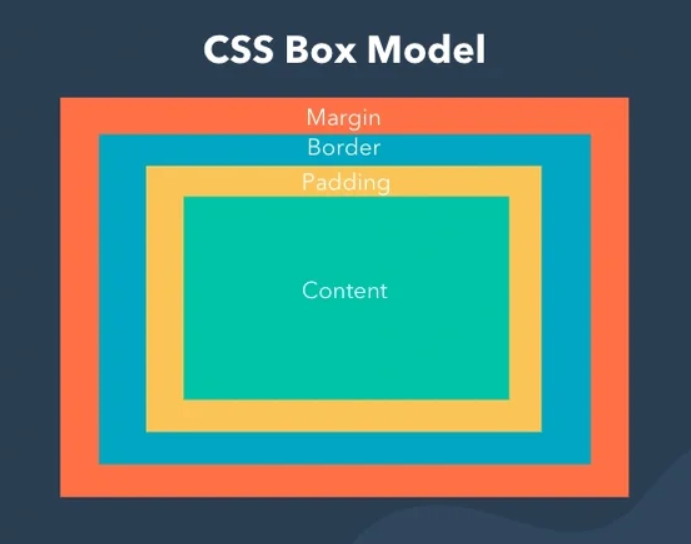

## **Box Model (`content`, `padding`, `border`, `margin`)**

---

## 🎯 Overview

The **CSS Box Model** is the **foundation of layout and spacing in web development**. Every HTML element is rendered as a **rectangular box**, and understanding how these boxes are calculated and interact is essential for building reliable, responsive, and visually consistent UIs.

At large scale, UI bugs caused by miscalculated box sizes can lead to layout shifts, rendering performance issues, and inconsistent cross-browser behavior. Mastery of the Box Model is non-negotiable in production-grade frontend systems.

---

## 🧱 Components of the Box Model

Each element's box consists of the following areas, from innermost to outermost:



---

### 🔹 1. `content`

#### 📌 What it is:

* The actual area where text, images, and child elements appear.

#### 📐 Affected by:

* `width`, `height`, `line-height`, `font-size`, `white-space`, etc.

#### 🧠 Best Practices:

* Set `width` and `height` on the content box **only if you fully control inner spacing**.
* Use `box-sizing: border-box` (explained later) to account for padding/border.

---

### 🔹 2. `padding`

#### 📌 What it is:

* Space **between the content and the border**.
* Adds inner breathing room **inside the element**.

```css
.card {
  padding: 16px;
}
```

#### ⚠️ Important Notes:

* Padding is **inside** the element box.
* It **increases the total size** unless using `box-sizing: border-box`.

---

### 🔹 3. `border`

#### 📌 What it is:

* The edge of the element — sits between padding and margin.
* Can be styled (`solid`, `dashed`, `none`), colored, and given rounded corners.

```css
.card {
  border: 1px solid #ddd;
}
```

#### 🧠 Real-World Usage:

* Use borders to define component outlines (cards, inputs, containers).
* Border-radius for rounded corners: `border-radius: 8px;`.

---

### 🔹 4. `margin`

#### 📌 What it is:

* The **outermost layer** of spacing — the distance between this element and its neighbors.

```css
.card {
  margin: 20px 0;
}
```

#### ⚠️ Key Features:

* Collapses vertically with adjacent margins (`margin collapsing`).
* Can be negative (`margin-top: -10px`), but use cautiously.

---

## 🧮 Total Element Dimensions

By default (`box-sizing: content-box`):

```plaintext
Total width  = width + padding-left + padding-right + border-left + border-right
Total height = height + padding-top + padding-bottom + border-top + border-bottom
```

---

### 💡 `box-sizing` Property

#### ✅ Recommended:

```css
* {
  box-sizing: border-box;
}
```

* With `border-box`, padding and border are **included in the declared width/height**.
* Avoids layout surprises when adding padding/border to elements.

---

## 📊 Example Comparison

### HTML:

```html
<div class="box"></div>
```

### CSS:

```css
.box {
  width: 200px;
  height: 100px;
  padding: 20px;
  border: 5px solid #000;
  margin: 10px;
}
```

### If `box-sizing: content-box`:

* Total width = 200 + 40 (padding) + 10 (border) = **250px**
* Total height = 100 + 40 + 10 = **150px**

### If `box-sizing: border-box`:

* `width` and `height` **include** padding and border
* Content shrinks to fit the box
* Total size remains **200 × 100px**


> Reference [link](https://developer.mozilla.org/en-US/docs/Web/CSS/box-sizing).


---

## 🧠 Real-World Use Cases

### 🔹 Card Component:

```css
.card {
  width: 100%;
  padding: 1rem;
  border: 1px solid #eee;
  margin-bottom: 1rem;
  box-sizing: border-box;
}
```

* ✅ Predictable layout within flex/grid parent
* ✅ Consistent spacing between cards

### 🔹 Button with Icon:

```css
.button {
  padding: 0.5rem 1rem;
  border: none;
  margin-right: 0.5rem;
}
```

* Padding defines **internal click target**.
* Margin ensures **external spacing** between adjacent buttons.

---

## 🧠 Advanced Layout Tips

| Use Case               | Strategy                                            |
| ---------------------- | --------------------------------------------------- |
| Align elements tightly | Reduce or zero out `margin`, `padding`              |
| Overlap elements       | Use `margin-top: -Xpx`, or `position: absolute`     |
| Responsive boxes       | Use `padding: %` for **aspect-ratio tricks**        |
| Prevent overflow bugs  | Add `box-sizing: border-box` and `overflow: hidden` |

---

## 🔍 Visual Debugging Tools

* ✅ Use **browser dev tools** → "Inspect" → "Box Model tab" to:

  * See exact dimensions
  * Test padding/margin interactively
  * Debug why layout is misaligned

---

## 🧪 Interview Insight

> **Q:** Why is `box-sizing: border-box` preferred in modern layouts?

> **A:** It simplifies calculations by making the total width/height **fixed and predictable**, regardless of padding or borders. It also reduces unexpected layout shifts and makes responsive design more maintainable — especially important in grid/flexbox-heavy designs.

---

## 🧠 Best Practices

* ✅ Always use `box-sizing: border-box` as a global reset.
* ✅ Avoid `margin` for layout inside components; use **gap**, **flex/grid spacing** instead.
* ✅ Use `padding` for **internal spacing**, not positioning.
* ✅ Use tools like Chrome DevTools to **inspect and debug** layout quickly.
* ✅ Understand how padding/margin behave inside **flex and grid containers**.

---

Would you like a follow-up note on:

* `box-sizing`, `overflow`, and `display` interactions?
* Margin collapsing and how to prevent it?
* How box model behaves in `flex` and `grid` layouts?

Let me know!
