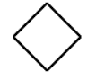

## **ER Diagrams and Entity Types**

---

### 🔷 What is an ER Model?

The **Entity-Relationship (ER) Model** is a **high-level conceptual data model** that describes the **structure of a database** in terms of:

* **Entities** (real-world objects)
* **Attributes** (properties of entities)
* **Relationships** (associations among entities)

It is used during **database design (conceptual design phase)** before converting into relational schema.

---

### 🔶 ER Diagram (ERD)

An **ER Diagram** is a graphical representation of the ER model.

#### 🔑 Components of an ER Diagram:

| Component                    | Representation       | Shape |Description                                     |
| ---------------------------- | -------------------- |-----| ----------------------------------------------- |
| **Entity**                   | Rectangle     |        | A real-world object or concept                  |
| **Attribute**                | Oval      |           | Property of an entity                           |
| **Relationship**             | Diamond  |            | Association between entities                    |
| **Primary Key**              | Underlined  Attribute | | Uniquely identifies each entity                 |
| **Multivalued Attribute**    | Double Oval    |      | Attribute with multiple values                  |
| **Derived Attribute**        | Dashed Oval    |      | Attribute that can be derived                   |
| **Weak Entity**              | Double Rectangle |    | Entity that cannot exist without another entity |
| **Identifying Relationship** | Double Diamond   |    | Links weak entity to owner entity               |


---

### 🧩 Types of Entities

#### 1. **Strong (Regular) Entity**

* Exists independently.
* Has a **primary key**.
* Represented using a **single rectangle**.

📌 *Example*:
Entity: `Student`
Attributes: `RollNo (PK)`, `Name`, `Dept`

---

#### 2. **Weak Entity**

* Cannot exist without a related strong entity.
* Doesn’t have a primary key on its own.
* Identified by a **partial key** and an **identifying relationship**.

📌 *Example*:
Entity: `Dependent` (of an employee)

* No independent existence
* Partial key: `Name`
* Identified via relationship with `Employee`

🔸Notation:

* Weak Entity: **Double rectangle**
* Identifying Relationship: **Double diamond**

---

### 🧩 Types of Attributes

| Attribute Type      | Description                    | Example                      |
| ------------------- | ------------------------------ | ---------------------------- |
| **Simple (Atomic)** | Cannot be broken further       | `Age`, `RollNo`              |
| **Composite**       | Can be divided into subparts   | `Name → FirstName, LastName` |
| **Derived**         | Computed from other attributes | `Age` from `DOB`             |
| **Multivalued**     | Can have multiple values       | `PhoneNumbers`               |
| **Key Attribute**   | Uniquely identifies entity     | `RollNo` in `Student`        |

---

### 🔗 Relationships

A **relationship** is an association among **two or more entities**.

#### Relationship Notation:

* Shown using a **diamond**
* Connects entities through lines

#### Relationship Degree:

* **Unary (1-ary)**: Entity related to itself (e.g., `Manager` manages `Employee`)
* **Binary**: Between 2 entities (most common)
* **Ternary**: Among 3 entities

#### Relationship Cardinality:

* Defines **number of instances** involved

| Type     | Meaning                                               |
| -------- | ----------------------------------------------------- |
| **1:1**  | One entity instance related to exactly one in another |
| **1\:N** | One entity related to many in the other               |
| **M\:N** | Many in one related to many in the other              |

#### Participation Constraints:

* **Total (Mandatory)**: Entity must participate (double line)
* **Partial (Optional)**: May or may not participate (single line)

---

### 🔁 Mapping ER to Relational Model (Overview)

| ER Concept            | Relational Model Equivalent            |
| --------------------- | -------------------------------------- |
| Entity                | Table                                  |
| Attribute             | Column                                 |
| Primary Key           | Primary Key Constraint                 |
| Relationship          | Foreign Key / Join Table               |
| Multivalued Attribute | Separate Table                         |
| Weak Entity           | Table with Foreign Key and Partial Key |

---

### 📌 Example ER Diagram

Let’s model a basic ER for a University:

* Entities: `Student`, `Course`, `Instructor`
* Relationships:

  * `Enrolls (Student-Course)` \[M\:N]
  * `Teaches (Instructor-Course)` \[1\:N]

---

### 🎯 GATE Exam Tips

* Focus on **diagram-to-table mapping** (e.g., how to convert multivalued attributes)
* Understand **partial key vs composite key**
* Know **relationship cardinality and participation** notations
* Practice identifying **entity types from case-based questions**
* Expected to **draw ERDs** and convert to **relational schema**

---

### 📚 Practice Questions

1. Convert the given ER diagram with weak entities and multivalued attributes to relational schema.
2. Identify the total vs partial participation constraints in a given ER.
3. For a ternary relationship, how is it mapped into a relational schema?


---

## Example: 

Here's a **GATE-level practical example** that:

1. Creates an **ER Diagram** (conceptually)
2. **Maps it to a relational schema** covering all essential aspects:
   ✅ strong & weak entities,
   ✅ relationships,
   ✅ key/partial key,
   ✅ multivalued & derived attributes,
   ✅ participation constraints,
   ✅ mapping rules

---

## 🧩 **Real-World Scenario: University Database**

> Design a database for a **university system** where:

* Each `Student` has a unique roll number, name, email, and date of birth.
* A `Student` can enroll in multiple `Courses`.
* Each `Course` has a course ID, title, and credits.
* Each `Course` is taught by exactly one `Instructor`.
* Each `Instructor` has a unique ID, name, and phone number(s) (multivalued).
* A student may have multiple `Dependents` (weak entities), each dependent has name and relationship.
* A student’s `age` is derived from the date of birth.

---

## ✅ 1. **Conceptual ER Diagram Breakdown**

### 🎓 Entities

#### 🟩 Student (Strong Entity)

* **Attributes**: RollNo (PK), Name, Email, DOB, *Age (Derived)*
* **Multivalued**: ❌
* **Derived**: Age ← DOB

#### 🟩 Instructor (Strong Entity)

* **Attributes**: InstID (PK), Name
* **Multivalued**: PhoneNumbers

#### 🟩 Course (Strong Entity)

* **Attributes**: CourseID (PK), Title, Credits

#### 🟥 Dependent (Weak Entity)

* **Partial Key**: Name
* **Attributes**: Relationship
* **Related to**: Student (1\:N)

---

### 🔷 Relationships

#### 🔗 Enrolls (Student-Course)

* **M\:N Relationship**
* Attributes: Grade (can be modeled optionally)

#### 🔗 Teaches (Instructor-Course)

* **1\:N** (Instructor teaches many courses)

#### 🔗 HasDependent (Student-Dependent)

* Weak entity relationship
* **Total participation** of Dependent

---

### ✍️ ERD Notation Summary (Textual)

* Student (RollNo\*, Name, Email, DOB, \*Age)
* Instructor (InstID\*, Name, {Phone})
* Course (CourseID\*, Title, Credits)
* Dependent (Name, Relationship) — **Weak Entity**
* Enrolls(Student ↔ Course) \[M\:N]
* Teaches(Instructor → Course) \[1\:N]
* HasDependent(Student → Dependent) \[1\:N], total participation

---

## ✅ 2. **Mapping ER Diagram to Relational Schema**

We now map each element into a **normalized relational schema**.

---

### 🔹 Strong Entities

```sql
Student(RollNo PRIMARY KEY, Name, Email, DOB)
-- Age is derived: NOT stored in DB
```

```sql
Instructor(InstID PRIMARY KEY, Name)
```

```sql
InstructorPhones(InstID, Phone)
-- Multivalued → separate table
-- FOREIGN KEY (InstID) REFERENCES Instructor
```

```sql
Course(CourseID PRIMARY KEY, Title, Credits)
```

---

### 🔸 Weak Entity

```sql
Dependent(RollNo, Name, Relationship,
          PRIMARY KEY(RollNo, Name),
          FOREIGN KEY(RollNo) REFERENCES Student)
```

> `RollNo` is owner entity's PK
> `Name` is partial key

---

### 🔹 Relationships

#### Enrolls (M\:N)

```sql
Enrolls(RollNo, CourseID, Grade,
        PRIMARY KEY(RollNo, CourseID),
        FOREIGN KEY(RollNo) REFERENCES Student,
        FOREIGN KEY(CourseID) REFERENCES Course)
```

#### Teaches (1\:N)

```sql
Course(CourseID PRIMARY KEY, Title, Credits, InstID,
       FOREIGN KEY(InstID) REFERENCES Instructor)
```

> Teaches can be modeled by adding `InstID` as FK to `Course`

---

### 🎯 Notes:

* **Derived attributes** (like `Age`) are **not stored**, but **calculated at query time**:

  ```sql
  SELECT Name, FLOOR(DATEDIFF(CURDATE(), DOB)/365) AS Age FROM Student;
  ```

* **Multivalued attributes** (like `Phone`) go into **separate relations**.

* **Weak entity** must be connected via identifying relationship and include **owner’s PK + partial key**.

---

## 🔍 What This Covers (GATE Syllabus Mapping)

| Concept                             | Covered? | Location                 |
| ----------------------------------- | -------- | ------------------------ |
| Entity Types (Strong, Weak)         | ✅        | Student, Dependent       |
| Attributes (Simple, Derived, Multi) | ✅        | DOB/Age, PhoneNumbers    |
| Primary Key & Partial Key           | ✅        | RollNo, Name (Dependent) |
| Relationship Types (1\:N, M\:N)     | ✅        | Teaches, Enrolls         |
| Participation Constraints           | ✅        | Total in HasDependent    |
| Mapping to Schema                   | ✅        | SQL Tables shown         |

---

## 🧠 Practice Tip for GATE

You might be given:

* A textual description like above
* Asked to draw ERD
* Convert it to normalized schema
* And possibly apply **normalization** or ask for **query design**

---

Would you like a **diagrammatic ERD image** for this example too? I can generate it.
