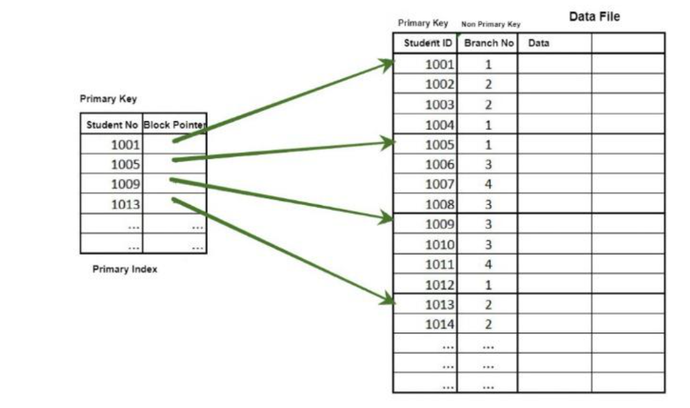
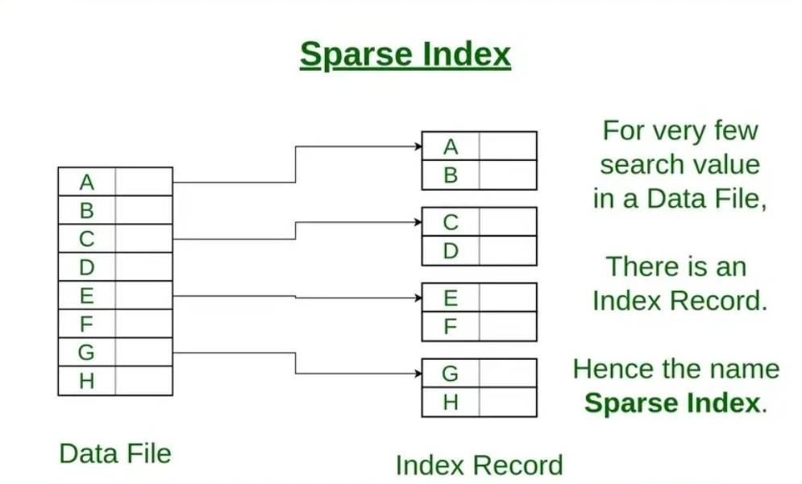
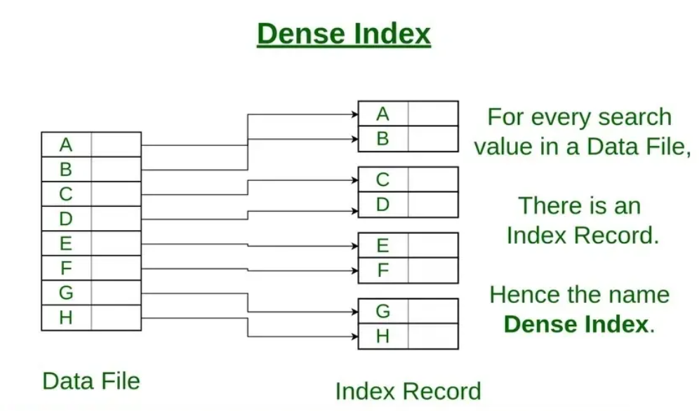

## **Primary and Secondary Indexes**

---

### 🧠 What is an Index in Databases?

An **index** is a data structure that **improves the speed of data retrieval** from a table at the cost of **additional writes and storage space**.

* Think of it like a **book’s index** – instead of scanning every page, you go straight to the relevant location.
* In databases, indexes are typically implemented using **B-Trees**, **B+ Trees**, or **Hashing**.

---

## 🔷 Primary Index (Clustering Index)

### ✅ Definition:

A **Primary Index** is an index that is built **on the primary key or on the field that determines the physical order of the data** in the table.


### 🧩 Characteristics:

* The data **in the table is stored in the order of this index** (clustered).
* There is **only one primary index per table**.
* It is also called a **Clustering Index**.
* The index entries **point to actual data blocks** (not row IDs).

### 📌 When it applies:

* If a table is ==sorted== physically by a key attribute (e.g., `StudentID`), then that key can be used for the primary index.

### 📊 Example:

Assume `Student(StudentID, Name, Age)` is **sorted by StudentID**.





* Block 1 stores records for StudentID 1001 to 1004
* Block 2 stores 1005 to 1009, and so on.

---

### 📦 Dense vs Sparse Primary Index:

* **Sparse** index: 1 entry per block → Less space



* **Dense** index: 1 entry per record → More space, faster lookup



Primary index is usually **sparse** if file is ordered.

---

## 🔶 Secondary Index (Non-Clustering Index)

### ✅ Definition:

A **Secondary Index** is an index on **non-primary or non-ordering attributes**. The data **==is not sorted==** on this attribute.

### 🧩 Characteristics:

* Can be built on **any attribute**, even if it’s **not unique**.
* There can be **multiple secondary indexes** in a table.
* Also called **Non-Clustering Index**.
* Uses **Record Pointers (Row IDs or Block Addresses)**.

### 📊 Example:

Using the same `Student(StudentID, Name, Age)` table:

Let’s say we create an index on `Name`, but data is **not sorted by Name**.

```text
Secondary Index (on Name):
+---------+-------------+
| Name    | Record Ptr  |
+---------+-------------+
| Alice   | Addr: 0x32  |
| Bob     | Addr: 0x45  |
| Charlie | Addr: 0x67  |
+---------+-------------+
```

### 🔍 Important:

* **==Secondary indexes are always dense==** – they need to store one entry per record because the file is **not sorted**.

---

## 🔁 Comparison Table

| Feature                  | Primary Index                      | Secondary Index                   |
| ------------------------ | ---------------------------------- | --------------------------------- |
| Sorting                  | File is sorted by this key         | File is not sorted by this key    |
| Uniqueness               | Usually unique (e.g., primary key) | Can be non-unique                 |
| Clustering               | Yes (Clustering Index)             | No (Non-Clustering)               |
| Count per Table          | Only one                           | Many possible                     |
| Index Type               | Sparse or Dense                    | Always Dense                      |
| Speed (on target column) | Faster (less seek operations)      | Slightly slower (more disk seeks) |
| Space                    | Takes less space (if sparse)       | More space (dense)                |

---

## 🎯 GATE Tips & Concepts

* Understand when **sparse index** is sufficient (ordered file + primary key).
* **Secondary indexes** must be **dense**, since unordered files can't use block skipping.
* Multiple **secondary indexes** can exist; only **one primary index** possible.
* GATE may ask: "Which index type requires one entry per record?" → **Answer: Dense / Secondary**

---

## 📚 Sample GATE Question

> Consider a table where data is stored ordered by attribute `ID`. An index is created on attribute `Name` which is not sorted. What type of index is this?

✅ **Answer**: Secondary (Dense) Index

---

## 🧠 Summary

| Concept         | Details                                                        |
| --------------- | -------------------------------------------------------------- |
| Primary Index   | On sorted key; only one; clustered; sparse/dense               |
| Secondary Index | On unsorted attribute; many possible; always dense             |
| Dense Index     | 1 entry per record (used in secondary indexes)                 |
| Sparse Index    | 1 entry per block (used in primary indexes with ordered files) |

---

# Example: 

Here’s a **real-world, detailed example** illustrating both **Primary** and **Secondary Indexes** using a **Banking System** — something relatable and often used in GATE and practical interviews.

---

## 🏦 Real-World Scenario: Banking Database

### 🎯 Problem:

We’re managing a `Customer` table in a **banking system**.

```sql
Customer(
    AccountNumber INT PRIMARY KEY,
    Name VARCHAR(100),
    Email VARCHAR(100),
    City VARCHAR(100),
    Balance DECIMAL(12,2)
)
```

---

## 🔷 Primary Index Example (Clustering Index)

### ⚙️ Use Case:

Most queries in the bank are based on `AccountNumber`, such as:

```sql
SELECT * FROM Customer WHERE AccountNumber = 20012345;
```

### 💡 Implementation:

Since `AccountNumber` is the **Primary Key** and data is **physically stored sorted by AccountNumber**, a **Primary Index** (Clustering Index) is created on `AccountNumber`.

#### 📂 Indexed File Storage (Sparse Index Example):

Assume 1000 customers are stored in **blocks of 100 records each**, ordered by `AccountNumber`.

| Index Entry | Block Address |
| ----------- | ------------- |
| 20000001    | Block 1       |
| 20000101    | Block 2       |
| 20000201    | Block 3       |
| ...         | ...           |

* This is a **sparse index** — one entry per block.
* A query like `AccountNumber = 20000113` will locate Block 2 directly and scan inside it.
* Extremely efficient for **range queries** too:

```sql
SELECT * FROM Customer 
WHERE AccountNumber BETWEEN 20000050 AND 20000150;
```

✅ **Performance**: Fast retrieval, optimized storage, and one index per table.

---

## 🔶 Secondary Index Example (Non-Clustering Index)

### ⚙️ Use Case:

Bank staff wants to find customers based on `City`, like:

```sql
SELECT * FROM Customer WHERE City = 'Mumbai';
```

But:

* Data is **not sorted** by City
* Multiple customers can live in the same city
* So, we build a **Secondary Index** on `City`

### 🧩 Index Structure (Dense Index):

```text
Secondary Index on City:
+-----------+----------------+
| City      | Record Pointers|
+-----------+----------------+
| Mumbai    | [0x12, 0x36, 0x4F]  |
| Delhi     | [0x21, 0x9A]        |
| Chennai   | [0x18, 0x22, 0x55]  |
+-----------+----------------+
```

* This index is ==**dense**==: one pointer per matching record.
* It returns all customers in `Mumbai` quickly without scanning the whole table.

---

## 🔍 Key Differences in Action

| Query                                                    | Uses Which Index?                | Why?                                |
| -------------------------------------------------------- | -------------------------------- | ----------------------------------- |
| `SELECT * FROM Customer WHERE AccountNumber = 20000112;` | ✅ Primary Index                  | Sorted by AccountNumber             |
| `SELECT * FROM Customer WHERE City = 'Mumbai';`          | ✅ Secondary Index                | City is unsorted, needs dense index |
| `SELECT * FROM Customer WHERE Name = 'Raj';`             | ✅ Secondary Index (optional)     | Requires additional index if needed |
| `SELECT * FROM Customer WHERE Balance > 1,00,000;`       | ❌ Full scan or specialized index | Needs range index on Balance        |

---

## 🔧 Real Optimization Decision

In large-scale banking systems:

* Primary Index is **guaranteed** on `AccountNumber`
* Secondary Indexes are **strategically added** to columns like:

  * `City` (geo reporting)
  * `Email` (notifications)
  * `Balance` (high-net-worth filtering)

Adding unnecessary secondary indexes slows down **INSERT/UPDATE**, so they’re used **based on access patterns**.

---

## 📌 Summary

| Index Type      | Attribute     | Sorted? | Unique? | Index Type   | Purpose                              |
| --------------- | ------------- | ------- | ------- | ------------ | ------------------------------------ |
| Primary Index   | AccountNumber | ✅ Yes   | ✅ Yes   | Sparse/Dense | Fast lookup on key                   |
| Secondary Index | City          | ❌ No    | ❌ No    | Dense        | Fast filtering on non-key attributes |

---

## 🧠 Tip for GATE & Interviews

In questions:

* Sparse indexes: 1 per block, used for sorted files.
* Dense indexes: 1 per record, required for unsorted attributes.
* For **multi-valued attributes**, **inverted indexes** are better (not in this scope, but common in search engines like Elasticsearch).

---

> Q. __To do primary indexing, is it done by database itself or manually has to be done?__


So,

## ✅ Is Primary Indexing Done Automatically or Manually?

### 🔷 Short Answer:
> ✅ **Primary indexing is done automatically by the database** **when you define a primary key**.

---

## 📌 Detailed Explanation:

### 🔹 When You Define a `PRIMARY KEY`:
Most **relational databases** (like PostgreSQL, MySQL, SQL Server, Oracle) **automatically** create a **clustered index** (a.k.a. primary index) on that column.

### ✅ Example:
```sql
CREATE TABLE Customer (
  AccountNumber INT PRIMARY KEY,
  Name VARCHAR(100),
  City VARCHAR(100)
);
```

🟢 Result:
- The DBMS **automatically creates a clustered index** on `AccountNumber`.
- Rows in storage will be **physically ordered** by `AccountNumber`.
- You do **not** have to manually define the index unless you want to customize it.

---

## ⚙️ Behind the Scenes:
- **PostgreSQL**: Creates a **B-Tree index** on primary key by default.
- **MySQL (InnoDB)**: Automatically uses a **clustered index** on the primary key.
- **SQL Server**: Primary key constraint creates a **clustered index** unless you override it.

---

## 🔧 Can You Customize It?
Yes, but rarely needed.

You can:
- Manually create an index with specific storage options.
- Change a clustered index to a different column (but only **one** per table).
  
```sql
CREATE UNIQUE CLUSTERED INDEX idx_customer_id
ON Customer (AccountNumber);
```

---

## 🔥 Pro Tip:
- You **only get one clustered index** per table because there can only be **one physical ordering**.
- Secondary indexes are **non-clustered** and ==must be added **manually**==, based on query needs.

---

## 🧠 Summary

| Question                            | Answer                                       |
|-------------------------------------|----------------------------------------------|
| Is primary index created manually?  | ❌ No, created automatically with PRIMARY KEY |
| Is physical order affected?         | ✅ Yes, rows are stored in key order (if clustered) |
| Can I create one myself?            | ✅ Yes, but usually not needed for PRIMARY KEY |


---

> Q. ==__Give An example how secondary index is done on city using PostgreSql__== 


Let’s walk through a practical **PostgreSQL example** of creating a **secondary index** on a non-primary column like `City`.

---

## 🏦 Example Table: `Customer`

```sql
CREATE TABLE Customer (
    AccountNumber SERIAL PRIMARY KEY,
    Name VARCHAR(100),
    Email VARCHAR(100),
    City VARCHAR(100),
    Balance NUMERIC(12,2)
);
```

* ✅ `AccountNumber` is the **primary key** → PostgreSQL **automatically creates a primary (clustered) index** on it.
* ❌ `City` is **not** unique and **not sorted**, so queries like:

```sql
SELECT * FROM Customer WHERE City = 'Mumbai';
```

...would otherwise cause a **sequential scan** — slow for large tables.

---

## 🔍 Step-by-Step: Creating a **Secondary Index** on `City`

### ✅ 1. Create the index manually:

```sql
CREATE INDEX idx_customer_city ON Customer (City);
```

* This creates a **non-clustered B-tree index** on the `City` column.
* PostgreSQL will now use this index to speed up lookups and filters involving `City`.

---

### ✅ 2. Run EXPLAIN to see if index is used:

```sql
EXPLAIN ANALYZE
SELECT * FROM Customer WHERE City = 'Mumbai';
```

🔍 If the table is large and `City` has sufficient selectivity, the planner will show:

```
Index Scan using idx_customer_city on customer ...
```

Otherwise, PostgreSQL might still choose a sequential scan for small tables or unselective queries.

---

### ✅ 3. Composite Index Example (Optional)

If most of your queries also filter on both `City` and `Balance`, create a composite index:

```sql
CREATE INDEX idx_city_balance ON Customer (City, Balance);
```

Then run:

```sql
EXPLAIN ANALYZE
SELECT * FROM Customer WHERE City = 'Mumbai' AND Balance > 50000;
```

It will likely use the **composite index** for much faster access.

---

## 🧠 Summary

| Task                             | Command                                             |
| -------------------------------- | --------------------------------------------------- |
| Create table with primary key    | `CREATE TABLE ... PRIMARY KEY (...)`                |
| Create secondary index on column | `CREATE INDEX idx_customer_city ON Customer(City);` |
| Check if used                    | `EXPLAIN ANALYZE SELECT ...`                        |

---

## 🔥 Pro Tip:

* PostgreSQL by default creates **B-Tree** indexes.
* For full-text search or JSON indexing, consider `GIN`, `GiST`, or `HASH` indexes.


