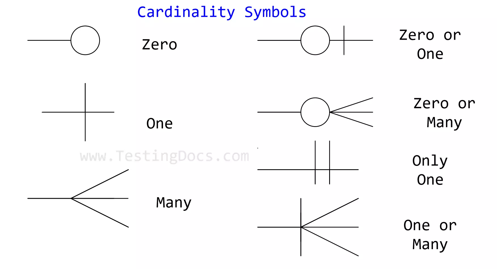

# Attributes, Keys, and Constraints

---

## 🧩 Introduction to ER Model

The **Entity-Relationship (ER) Model** is a high-level conceptual data model used in database design. It visually represents data as:

* **Entities** (objects)
* **Attributes** (properties)
* **Relationships** (associations between entities)

A key part of the ER Model is understanding how **attributes, keys, and constraints** define the **structure and integrity** of the data.

---

## 📌 1. Attributes

### ✅ Definition:

An **attribute** is a property or characteristic of an entity or a relationship.

### 🧷 Types of Attributes:

| Attribute Type      | Description                                  | Example                            |
| ------------------- | -------------------------------------------- | ---------------------------------- |
| **Simple (Atomic)** | Cannot be broken further                     | `Name`, `Age`                      |
| **Composite**       | Composed of multiple sub-parts               | `FullName = {FirstName, LastName}` |
| **Derived**         | Can be calculated from other attributes      | `Age` (from `DOB`)                 |
| **Multivalued**     | Can have multiple values for a single entity | `PhoneNumbers = {9876, 1234}`      |
| **Null-valued**     | May not have a value for all entities        | `MiddleName`                       |

---

### 🔵 Representation in ER Diagrams:

* **Simple attribute**: Ellipse
* **Composite attribute**: Ellipse with ellipses for sub-parts
* **Derived attribute**: Dashed ellipse
* **Multivalued attribute**: Double ellipse

---

### ✅ Example:

For an entity `Student`:

```
       +-------------+
       |   Student   |
       +-------------+
          /   |   \
  RollNo Name  PhoneNumbers
         / \
     First Last
```

* `Name` is **composite**
* `PhoneNumbers` is **multivalued**
* `RollNo` is **simple and likely a key**

---

## 📌 2. Keys

### ✅ Definition:

A **key** is an attribute (or a set of attributes) that **uniquely identifies** an entity in an entity set.

---

### Types of Keys:

| Key Type          | Description                                                               | Example                 |
| ----------------- | ------------------------------------------------------------------------- | ----------------------- |
| **Candidate Key** | Minimal set of attributes that can uniquely identify an entity            | `RollNo`, `Email`       |
| **Primary Key**   | One of the candidate keys **chosen by the designer** to identify entities | `RollNo`                |
| **Super Key**     | Any superset of a candidate key                                           | `{RollNo, Name}`        |
| **Composite Key** | A key with multiple attributes                                            | `{CourseID, StudentID}` |

---

### 🔍 Properties of Keys:

* **Uniqueness**: No two entities share the same key value
* **Minimality**: No subset of a candidate key is also a key
* **Immutability**: Should not change over time

---

### Key in ER Diagram:

* Represented by **underlining** the attribute name.

Example:

```
       +-------------+
       |   Student   |
       +-------------+
         |   |   |
     *RollNo Name Age
```

---

## 📌 3. Constraints

Constraints define rules to **ensure the correctness** and **validity** of the data.

---

### 3.1 Cardinality Constraints (Mapping Constraints)

| Mapping Type | Meaning                | Example         |
| ------------ | ---------------------- | --------------- |
| **1:1**      | One entity maps to one | Person–Passport |
| **1\:N**     | One maps to many       | Dept–Employees  |
| **M\:N**     | Many to many           | Student–Courses |

Represented with line notations:

* 1: straight line
* N or M: crow’s foot




---

### 3.2 Participation Constraints

| Type                             | Meaning                       | Example                                 |
| -------------------------------- | ----------------------------- | --------------------------------------- |
| **Total (Existence Dependency)** | Every entity must participate | Employee → Department                   |
| **Partial**                      | Some may not participate      | Student may not register for any course |

In ER diagram:

* **Total**: double line between entity and relationship
* **Partial**: single line


---

### 3.3 Key Constraints on Relationships

If an entity can appear **at most once** in a relationship set, that side is a **key** for the relationship.

Example:
A person **can have at most one passport**, so Person is a **key** in the `Owns` relationship.

---

### 3.4 Referential Integrity

* Ensures that a referenced entity **actually exists**.
* Enforced using **foreign keys** in relational schema (after conversion from ER to relational model).

---

## 🧠 GATE Summary Table

| Concept     | Type                                    | Diagram Notation      | Notes                        |
| ----------- | --------------------------------------- | --------------------- | ---------------------------- |
| Attributes  | Simple, Composite, Derived, Multivalued | Ellipses              | Multivalued = Double ellipse |
| Keys        | Primary, Candidate, Composite, Super    | Underline             | Uniquely identifies entity   |
| Constraints | Cardinality, Participation, Key         | Lines, 1\:N notations | Prevents invalid data        |

---

## 🧪 GATE-Style Example

**Entity**: Employee
**Attributes**: `EmpID` (PK), `Name`, `Age`, `PhoneNumbers (multi)`, `DOB (used to derive Age)`

**Relationship**: Works\_In (between Employee and Department)

* One Employee works in **one** Department (1\:N)
* Every Employee must work in a Department (total participation)

---

## 🧾 Real-Life Analogy

Think of an **employee database**:

* Attributes = things you fill in forms (Name, Age, ID)
* Keys = your unique ID or Aadhaar number
* Constraints = rules like "every employee must be in a department", or "no two employees can share the same ID"

---

## 🧪 GATE Practice Problem

**Q.** Consider an ER diagram with a multivalued attribute. Which of the following is correct?

a) It is represented by a dashed ellipse
b) It is represented by a double ellipse
c) It must be a derived attribute
d) It must be a foreign key

✅ **Answer**: b) It is represented by a double ellipse

