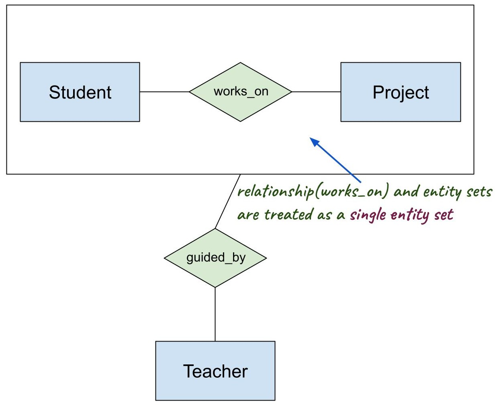

# Weak Entities and Aggregation

---

## 🧩 Introduction

The ER (Entity-Relationship) Model provides a structured and intuitive way to model databases conceptually. Two advanced components used in complex scenarios are:

1. **Weak Entity Sets**
2. **Aggregation**

These are essential for accurately representing real-world constraints in database design and are often tested in the **GATE exam**.

---

## 📌 1. Weak Entity Sets

---

### ✅ Definition:
A **Weak Entity** is an entity that **cannot be uniquely identified by its own attributes alone**. It depends on a **related strong entity** (called its **owner**) for identification.

---

### 🔐 Key Characteristics:

| Feature | Description |
|---------|-------------|
| **No Primary Key** | Lacks a complete key of its own |
| **Partial Key (Discriminator)** | Identifies the weak entity **within the context** of the strong entity |
| **Total Participation** | Always has **total participation** in the identifying relationship |
| **Existence Dependency** | Cannot exist without the corresponding strong entity |

---

### 🧷 Example:
Consider the relationship:  
`Customer` and `Dependent`

- A `Dependent` (like a child or spouse) has only `Name` and `Age`.
- Multiple dependents can have the same name.
- So we can't identify a `Dependent` without knowing the `Customer` they belong to.

➡️ `Dependent` is a **weak entity**.

---

### ✅ ER Diagram Notation:

- **Weak entity**: Rectangle with **double border**
- **Identifying relationship**: Diamond with **double border**
- **Partial key**: Attribute with **dashed underline**
- **Total participation**: **Double line** between weak entity and relationship

```
   +----------------+       +--------------------+
   |    Customer    |       |     Dependent      |
   +----------------+       +--------------------+
           |                            |
           |<==========| total          |
        Identifies                  partial key: Name (dashed underline)
```

---

### 🧪 GATE Example:

**Given**: A hospital has `Doctor` and `Appointment`. Each `Appointment` is uniquely identified only by `(DoctorID, Time)`.

➡️ `Appointment` is a weak entity.

---

### 🔎 Mapping to Relational Model:

For weak entity `W` with identifying entity `E`:

```sql
Table W (
  partial_key,  -- Discriminator
  E_primary_key,  -- Foreign key from E
  ...other attributes...
  PRIMARY KEY (partial_key, E_primary_key)
)
```

---

## 📌 2. Aggregation

---

### ✅ Definition:
**Aggregation** is an abstraction used when a **relationship** itself needs to participate in another relationship.

It is useful for representing **"relationship on a relationship"** in complex scenarios.

---

### 🔐 Use Case:
When a **relationship** needs to be treated as a higher-level entity set so that it can **participate in another relationship**, aggregation is required.

---

### 🧷 Example 1:

Let’s model the statement:

> "A `Manager` monitors the `works_on` relationship between `Employee` and `Project`."

- `works_on` is a relationship between `Employee` and `Project`
- `Manager` monitors this `works_on` relationship

➡️ This is a **relationship on a relationship**, so we **aggregate** `works_on` and then relate it to `Manager`.


### Example 2: 




---

### ✅ ER Diagram Notation:

- Enclose the `works_on` relationship in a **box** to form an **aggregated entity**.
- Then connect it to the new relationship (`monitors`).

```
   Employee       Project
      \            /
     works_on (aggregated)
         |
      Monitors
         |
      Manager
```

---

### 🧠 GATE Points to Remember:

| Concept | Weak Entity | Aggregation |
|--------|-------------|-------------|
| Purpose | Represents entities without full identity | Models relationships that need to participate in other relationships |
| Needs a strong entity? | ✅ Yes | ❌ No |
| ER Diagram | Double rectangle, double diamond | Box around relationship set |
| Real-world Use | Dependents, Appointments, Order Items | Monitoring, Auditing, Supervision |
| Participates in relationship? | Yes, via identifying relationship | Yes, as an **aggregate unit** |

---

## 🧾 Real-Life Analogy

- **Weak Entity**: Think of a `Bank Account` and `Transactions`. A transaction ID is only meaningful in the context of a particular account.

- **Aggregation**: Suppose an auditor supervises which employee worked on which project. The auditor is linked **not to the entities**, but to their **interaction**.

---

## 🧪 GATE Practice Problem

**Q1.** Which of the following is true about weak entities?

a) They have their own primary key  
b) They never participate in relationships  
c) They have partial keys and total participation  
d) They are always derived attributes

✅ **Answer**: c) They have partial keys and total participation

---

**Q2.** In an ER diagram, when does aggregation become necessary?

a) When two entities are related by many-to-many  
b) When a relationship participates in another relationship  
c) When an entity is weak  
d) When foreign keys are used

✅ **Answer**: b) When a relationship participates in another relationship

