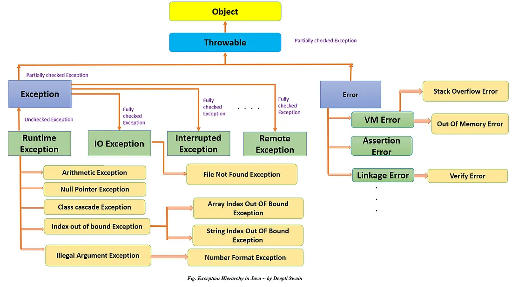

# **What is an Exception?**

---

## 🔷 What is an Exception in Java?

In Java, an **exception** is an **event that disrupts the normal flow of a program's execution**. It represents **an abnormal condition**—typically a runtime error—that a program encounters during execution, such as:

* Dividing by zero
* Accessing an invalid index in an array
* Opening a file that doesn't exist
* Calling a method on a null object reference

An **exception object** is created and "thrown" at the point where the error occurs and can be "caught" and handled using specific constructs.

---

## 🔍 Why Exceptions Matter in Java

* ✅ Promote **robust, fault-tolerant applications**
* ✅ Separate **normal logic** from **error-handling logic**
* ✅ Enable **graceful recovery** from runtime failures
* ✅ Support clean **propagation of errors up the call stack**
* ✅ Integrate well with **logging, monitoring, and alerting systems** in production environments

---

## 🔶 Exception vs Error vs Bug

| Concept       | Meaning                                                                       |
| ------------- | ----------------------------------------------------------------------------- |
| **Exception** | A *recoverable* condition (e.g., `IOException`, `NullPointerException`)       |
| **Error**     | An *irrecoverable* condition (e.g., `OutOfMemoryError`, `StackOverflowError`) |
| **Bug**       | A *logic flaw* in code that may result in an exception or incorrect output    |

---

## 📚 Exception is an Object (Hierarchy)

All exceptions are objects that inherit from the `Throwable` class.

```java
java.lang.Object
  ↳ java.lang.Throwable
      ↳ java.lang.Error          // Irrecoverable
      ↳ java.lang.Exception      // Recoverable
          ↳ java.lang.RuntimeException  // Unchecked
```

Given below in a diagram, 





---

## 🧩 Categories of Exceptions

| Type                    | Checked / Unchecked         | Example                                            | Notes                             |
| ----------------------- | --------------------------- | -------------------------------------------------- | --------------------------------- |
| **Checked Exception**   | Must be handled or declared | `IOException`, `SQLException`                      | Detected at **compile-time**      |
| **Unchecked Exception** | Not mandatory to handle     | `NullPointerException`, `IllegalArgumentException` | Occur at **runtime**              |
| **Error**               | Unchecked                   | `OutOfMemoryError`, `StackOverflowError`           | Fatal issues, shouldn't be caught |

---

## 📌 Anatomy of an Exception (Object Content)

An Exception object typically contains:

* `message` → Description of the problem
* `stack trace` → Call stack at the moment the exception was thrown
* `cause` → The underlying exception (for chaining)

---

## 🚀 Example: Basic Exception Generation

```java
public class Example {
    public static void main(String[] args) {
        int[] arr = new int[3];
        System.out.println(arr[5]); // throws ArrayIndexOutOfBoundsException
    }
}
```

This throws a **runtime exception** and terminates the program if uncaught.

---

## 📦 Real-world Analogy

Think of an exception like an **emergency stop button** in a factory:

* The machine stops immediately when something goes wrong.
* A human (developer) must then **handle** the situation (fix, restart, log).
* If ignored, the entire system could fail.

---

## 💡 Tip: Exception-Driven Design

Top companies use exception handling to:

* Enforce API contracts (`IllegalArgumentException`, `CustomBusinessException`)
* Avoid nulls using **Optional**, fail-fast using **`Objects.requireNonNull()`**
* Build resilient systems with **fallback mechanisms** (e.g., circuit breakers in microservices)
* Instrument errors for **observability** via tools like Sentry, ELK, Prometheus

---

## 🧠 Interview-Ready Summary

> An exception in Java is a runtime event representing an error that disrupts normal program flow. Java uses an object-oriented model to throw, catch, and handle exceptions, promoting clean separation of logic and improving reliability in real-world applications.

