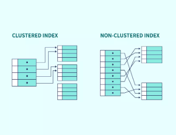

Here are the **most commonly asked interview questions with answers** on **SQL Indexing: Clustered vs Non-Clustered**, tailored for **Java Full Stack interviews** (Wipro, TCS, Infosys, Product Companies) for **7+ years of experience**.

---

### ✅ **1. What is an Index in a database?**

**Answer:**
An **index** is a database object that improves the **speed of data retrieval** operations on a table by maintaining a **lookup structure**, similar to an index in a book.

Indexes are created on **columns** to avoid full table scans.

---

### ✅ **2. What is a Clustered Index?**


**Answer:**




* A **Clustered Index** determines the **physical order** of rows in the table.
* The **table data is sorted** and stored based on the **Clustered Index key**.
* **Each table can have only one clustered index**, because rows can be stored in only one order.

**Example:**

```sql
CREATE CLUSTERED INDEX idx_emp_id ON Employees(emp_id);
```

> If you perform many **range queries** or **ORDER BY** on `emp_id`, a clustered index improves performance.

> __Note__ : A clustered index can be created on sorted or unsorted data — but once created, it physically reorganizes the table to match the index's sort order.

---

### ✅ **3. What is a Non-Clustered Index?**

**Answer:**

> ref: https://byjus.com/gate/indexing-in-dbms-notes/

* A **Non-Clustered Index** is a separate structure that **contains a pointer to the actual row** in the table.
* It stores only the indexed column and a **row locator** (row ID or clustered index key).
* **A table can have multiple non-clustered indexes**.

**Example:**

```sql
CREATE NONCLUSTERED INDEX idx_emp_name ON Employees(emp_name);
```

> Ideal when filtering on `emp_name` frequently, but it's not the primary sort order.

> __Note__:  The non-clustered index itself is stored in sorted order, but it does not change the physical order of the rows in the table. But the actual table is unordered. 

> So because of clustered index affect table.. it can be created once. While there can be many non-clustered index because it doesn't affect table.  


---

### ✅ **4. What is the key difference between Clustered and Non-Clustered Indexes?**

| Feature               | Clustered Index                   | Non-Clustered Index                              |
| --------------------- | --------------------------------- | ------------------------------------------------ |
| Storage               | Alters **physical row order**     | Does **not** alter physical order                |
| Number per table      | **Only one**                      | **Multiple** allowed                             |
| Speed (range queries) | Faster for large **sorted** scans | Slower for range, faster for point lookups       |
| Pointer               | Row data is part of index         | Points to actual row in data table               |
| Extra lookup needed?  | No (data is inline)               | Yes (requires extra lookup: **bookmark lookup**) |
| Use case              | Sorting, PKs, joins               | Filtering, searching on non-key fields           |

---

### ✅ **5. When would you use a Clustered vs Non-Clustered Index?**

**Clustered Index** — Use when:

* You do **frequent range queries** or **ORDER BY** on a column.
* You query the table in **sorted order**.
* Column has **unique** values (e.g., primary key).

**Non-Clustered Index** — Use when:

* You need **fast lookup** on other columns (not the sort key).
* You perform **joins** on foreign keys.
* The column is frequently used in **WHERE**, but not suitable for clustering.

---

### ✅ **6. Can a table have both Clustered and Non-Clustered Indexes?**

**Answer:**
Yes. A table can have:

* **One clustered index**
* **Many non-clustered indexes**

> E.g., Clustered on `emp_id`, non-clustered on `email`, `last_name`, etc.

---

### ✅ **7. What are some performance considerations with indexes?**

* Too many indexes = **slow writes** (INSERT/UPDATE/DELETE)
* Choose indexed columns carefully based on:

  * **Selectivity** (unique values)
  * **Query patterns**
  * **Join conditions**

---

### ✅ **8. How are indexes represented in PostgreSQL / MySQL?**

* **PostgreSQL**: Uses **B-Trees** for both clustered and non-clustered indexes.

  * Clustering is optional (with `CLUSTER` command); it's not maintained automatically.
* **MySQL (InnoDB)**:

  * **Primary Key** = Clustered Index
  * Other indexes = Non-Clustered


> Note: A B-Tree (Balanced Tree) is a self-balancing tree data structure that maintains sorted order of keys

---

### ✅ **9. What is a Covering Index?**

**Answer:**
A **covering index** includes **all columns** required by the query — avoiding the need to access the base table.

```sql
SELECT emp_id, emp_name FROM Employees WHERE emp_id = 10;
-- Covered if index is on (emp_id, emp_name)
```

> This improves performance by **avoiding table lookups** entirely.

---

### ✅ **10. How to check index usage in a query?**

* Use **`EXPLAIN`** (MySQL/PostgreSQL) to view the execution plan.
* It shows whether indexes are used or a full table scan occurs.

```sql
EXPLAIN SELECT * FROM Employees WHERE emp_id = 100;
```

---

Would you like:

* **MCQs + Quiz format**
* **Real-world use cases with PostgreSQL/MySQL**
* **STAR examples from projects where you optimized queries using indexing**?
