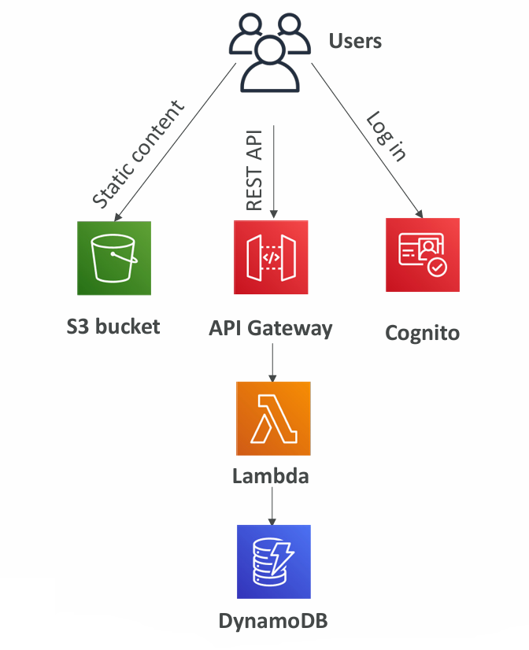

# ☁️ What is Serverless? | Serverless in AWS Explained with Real-World Architecture

The term **serverless** may sound like magic, but it simply means **you don’t manage the servers yourself**. It's a powerful paradigm that shifts infrastructure responsibilities from developers to the cloud provider—so teams can focus solely on writing and shipping code.

Let’s demystify serverless, explore its key components, and understand how **AWS implements serverless computing** in real-world apps.

---

## 🧠 What is Serverless?

Serverless is a **cloud-native development model** that allows you to **build and run applications without managing servers**.

### ✅ Key Highlights:

- 🚫 You **don’t provision, scale, or patch** servers — the cloud provider does it.
- 👨‍💻 You just deploy **functions or code**.
- 📦 Initially, serverless referred to **FaaS (Function as a Service)**, like AWS Lambda.
- 📚 Now it covers everything **managed on your behalf** — from databases and authentication to queues and storage.

> **Note:** Serverless doesn’t mean *“no servers exist”* — it means **you don’t have to think about them**.

---

## ⚙️ How Serverless Works in AWS

AWS offers a wide range of services that fall under the serverless category. Let’s go over the key building blocks of a serverless application in AWS:

---

### 🧱 Core AWS Serverless Services

| Category | Services |
|----------|----------|
| **Compute** | **AWS Lambda**, AWS Fargate |
| **Database** | **DynamoDB**, Aurora Serverless |
| **API Gateway** | **Amazon API Gateway** (exposes REST/HTTP endpoints) |
| **Authentication** | **AWS Cognito** (user sign-in, federated login) |
| **Storage** | **Amazon S3** (for static files, images, frontend) |
| **Messaging** | **SNS** (pub/sub), **SQS** (queues), **Kinesis Firehose** |
| **Workflow Orchestration** | **Step Functions** |

---

## 🏗️ Example Serverless Architecture

Let’s say you’re building a modern serverless web app. Here's how it would look using AWS:

### 👨‍💻 Users Interact via:
- 🔐 **Cognito** for login/signup and user authentication
- 🌐 **API Gateway** for accessing backend APIs
- 📂 **S3 Bucket** to fetch static files like HTML/CSS/JS

### ⚙️ Behind the Scenes:
- ⚡ **Lambda** functions handle the actual backend logic (FaaS).
- 🗄️ **DynamoDB** stores data (e.g., products, users, orders).
- 📬 **SNS/SQS** or **Step Functions** handle async communication and workflows.

### 🔁 Full Flow:
1. User logs in → Cognito handles auth.
2. User requests data → API Gateway forwards the request to Lambda.
3. Lambda executes logic and reads/writes from DynamoDB.
4. Response is sent back to user via API Gateway.
5. Static content (images, frontend) is served directly from S3.

---

## 🚀 Benefits of Serverless

| Benefit | Why It Matters |
|--------|----------------|
| ⚡ **Automatic Scaling** | Handles traffic spikes without manual effort. |
| 💸 **Pay-per-use** | Billed only for actual execution time (no idle costs). |
| 🛠 **Focus on Code** | No infrastructure maintenance = faster dev cycles. |
| 📦 **Seamless Integration** | Native support across all AWS services. |
| 🔒 **Secure by Default** | Fine-grained permissions with IAM, no SSH/RDP needed. |

---

## ❗️Caveats of Serverless

| Challenge | Workaround |
|----------|------------|
| 🕰️ **Cold Start Latency** | Use provisioned concurrency in Lambda. |
| ⛓ **Tight Vendor Lock-in** | Use abstractions or frameworks like Serverless Framework. |
| 📉 **Limited Execution Time** | Split long-running tasks using Step Functions. |
| ⚙️ **Complex Debugging** | Use tools like CloudWatch, X-Ray, or local emulators. |

---

## 🧪 When to Use Serverless

- ✅ Event-driven apps (e.g., file uploads, user signups)
- ✅ Microservices and modular APIs
- ✅ Real-time data processing (IoT, logs, streams)
- ✅ Fast MVP or prototype development

---

## 🧠 Final Thoughts

Serverless is more than a buzzword—it's a production-ready paradigm used by top tech companies to build **highly scalable, low-maintenance, cost-effective** systems.

If you're building modern web or mobile apps, especially on AWS, **serverless is a superpower** you should absolutely embrace.

