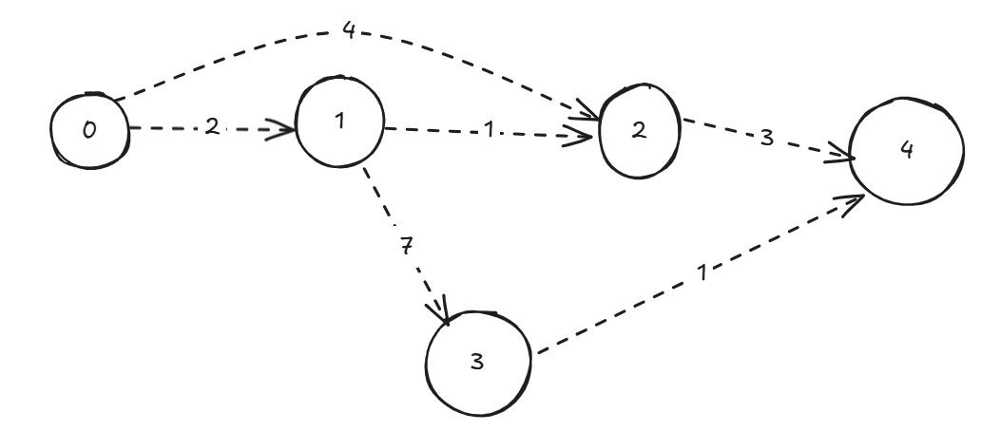

# 🛣️ Dijkstra’s Algorithm – Find Shortest Path in Weighted Graphs (No Negative Weights)

Dijkstra’s Algorithm is one of the most important **Greedy algorithms** used to find the **shortest path** from a **source node** to all other nodes in a **weighted, non-negative graph**.

---

## 🧠 Core Intuition

Dijkstra’s algorithm is like throwing a stone in a lake — it **spreads out** from the source node, always expanding to the **closest unvisited node**. By doing this, it guarantees the shortest path because once a node is visited, there’s **no shorter way to reach it**.

---

## 🚦 When to Use Dijkstra

* You have a **weighted graph**.
* All **edge weights are non-negative**.
* You want to find **shortest paths from a single source** to all other nodes.
* Common in **routing algorithms**, **GPS navigation**, **network routing**.

---

## 📊 Time & Space Complexity

| Implementation | Time Complexity  | Data Structures Used                  |
| -------------- | ---------------- | ------------------------------------- |
| Naive          | O(V²)            | Adjacency Matrix + Linear Search      |
| Using Min-Heap | O((V + E) log V) | Adjacency List + PriorityQueue (Heap) |

* `V`: number of vertices
* `E`: number of edges

👉 For **sparse graphs**, use **min-heap** version with **Adjacency List** (standard in interviews).

---

## 🛠️ Data Structures You Need

* **Priority Queue / Min Heap** (Java: `PriorityQueue`)
* **Adjacency List** to store graph
* **Distance Array** to track minimum distances

---

## 🧱 Step-by-Step Explanation

1. Initialize `dist[]` array with `Infinity`, and set `dist[src] = 0`.
2. Use a **priority queue** (min-heap) to always pick the node with the shortest known distance.
3. For the current node, explore all its neighbors:

   * If going through the current node gives a shorter path, **update the distance** and **add neighbor to the queue**.
4. Repeat until the priority queue is empty.

---

## 💻 Java Implementation

```java
import java.util.*;

class Dijkstra {
    static class Pair {
        int node, dist;
        Pair(int d, int n) {
            dist = d;
            node = n;
        }
    }

    public static int[] dijkstra(int V, List<List<int[]>> adj, int src) {
        int[] dist = new int[V];
        Arrays.fill(dist, Integer.MAX_VALUE);
        dist[src] = 0;

        PriorityQueue<Pair> pq = new PriorityQueue<>(Comparator.comparingInt(a -> a.dist));
        pq.offer(new Pair(0, src));

        while (!pq.isEmpty()) {
            Pair curr = pq.poll();
            int u = curr.node;

            for (int[] edge : adj.get(u)) {
                int v = edge[0];
                int weight = edge[1];

                if (dist[u] + weight < dist[v]) {
                    dist[v] = dist[u] + weight;
                    pq.offer(new Pair(dist[v], v));
                }
            }
        }
        return dist;
    }

    // Sample usage
    public static void main(String[] args) {
        int V = 5;
        List<List<int[]>> adj = new ArrayList<>();
        for (int i = 0; i < V; i++) adj.add(new ArrayList<>());

        // Add edges: from -> to, weight
        adj.get(0).add(new int[]{1, 2});
        adj.get(0).add(new int[]{2, 4});
        adj.get(1).add(new int[]{2, 1});
        adj.get(1).add(new int[]{3, 7});
        adj.get(2).add(new int[]{4, 3});
        adj.get(3).add(new int[]{4, 1});

        int[] shortest = dijkstra(V, adj, 0);

        System.out.println("Shortest distances from source 0:");
        for (int i = 0; i < V; i++) {
            System.out.println("Node " + i + " : " + shortest[i]);
        }
    }
}
```

> Q. How it uses here new Pair while Pair class is static 
> 
> Ans : [Refer....](#confusion-in-pair-class)


---

## 🧪 Dry Run Example

Let’s say you have a graph:


* Start from node `0`
* Shortest path to `2`: 0 → 1 → 2 (cost 3), not 0 → 2 directly (cost 4)

Dijkstra always expands **cheapest edge first**, so it gets optimal paths.

---

## 🚫 Common Mistakes

* ❌ **Using Dijkstra with negative weights** → it gives wrong results.
* ❌ **Updating nodes multiple times without checking if they already had a better distance**.
* ❌ **Forgetting to use min-heap** – leads to higher time complexity.

---

## 🔍 Real-World Applications

* GPS & Map Routing (Google Maps, Uber)
* Network Routing (OSPF Protocol)
* Flight Booking Systems
* Game AI Pathfinding

---

## 🧠 Dijkstra vs Bellman-Ford

| Feature              | Dijkstra       | Bellman-Ford    |
| -------------------- | -------------- | --------------- |
| Edge Weights         | Non-negative   | Can be negative |
| Time Complexity      | O((V+E) log V) | O(V × E)        |
| Negative Cycle Check | ❌ Not possible | ✅ Supported     |
| Practical Usage      | More common    | Less frequent   |

---

## 📚 LeetCode Problems to Practice

1. 🔗 [743. Network Delay Time](https://leetcode.com/problems/network-delay-time/)
2. 🔗 [787. Cheapest Flights Within K Stops](https://leetcode.com/problems/cheapest-flights-within-k-stops/) (modified Dijkstra)
3. 🔗 [1631. Path With Minimum Effort](https://leetcode.com/problems/path-with-minimum-effort/)
4. 🔗 [1514. Path with Maximum Probability](https://leetcode.com/problems/path-with-maximum-probability/)

---

## ✅ Final Tips

* Always track the current distance and neighbor’s updated distance.
* Use a priority queue for best performance.
* Stick to Dijkstra **only if** there are **no negative weights**.

> 🎯 “Dijkstra’s is the first tool you reach for when solving single-source shortest path problems in real-world applications.”

---

> Note : Dijkstra’s Algorithm is same like BFS but instead of queue in bfs it uses priority queue with order based on distance.


### 🔁 Dijkstra’s Algorithm vs. BFS

| Feature           | **BFS**                       | **Dijkstra**                                       |
| ----------------- | ----------------------------- | -------------------------------------------------- |
| Graph type        | Unweighted                    | Weighted (non-negative)                            |
| Data structure    | Queue (`FIFO`)                | Priority Queue (min-heap based on distance)        |
| Distance tracking | Level-based (1 step = 1 unit) | Minimum total cost from source                     |
| Update condition  | If not visited                | If new path is shorter                             |
| Time complexity   | O(V + E)                      | O((V + E) log V) with priority queue (binary heap) |

---

### 🧠 Intuition:

> Dijkstra is like BFS, but it chooses the **closest unvisited node** next using a **priority queue** based on current `distance`.

---

### 🔧 Dijkstra uses:

```java
PriorityQueue<Pair> pq = new PriorityQueue<>(Comparator.comparingInt(p -> p.distance));
```

Where `Pair` holds: `node` and `distance`.


---


### ❓Confusion in `Pair` class:

> The `Pair` class is marked `static`, but we're doing `new Pair(...)` inside `main` and `dijkstra`. How does this work?

---

### ✅ Key Concept: Static Nested Class in Java

When you define a **static nested class** (like `Pair` inside `Dijkstra`), it's **not tied to an instance** of the outer class (`Dijkstra`). Instead, it behaves like a **normal top-level class**, but it's namespaced under `Dijkstra`.

```java
static class Pair {
    int node, dist;
    ...
}
```

You **can directly instantiate** it using `new Pair(...)` **inside static methods** like `main` or `dijkstra`, because:

* It doesn't need an instance of `Dijkstra` to exist.
* It's just like writing a separate top-level class `Pair` in the same file, but namespaced for clarity.

---

### 🧠 Analogy:

If it were a **non-static inner class**, you'd need to do this:

```java
Dijkstra outer = new Dijkstra();
Dijkstra.Pair p = outer.new Pair(5, 2);
```

But because `Pair` is `static`, you can simply do:

```java
Pair p = new Pair(5, 2);
```

Even inside `main` or any `static` method of the outer class.

---

### 🛠️ Why Use `static` for Pair?

It makes sense here because `Pair` is just a utility holder (like a struct) and:

* Doesn’t access outer class fields.
* Makes instantiation easier in static context.
* Prevents unnecessary memory link to the outer class.

---

### ✅ Summary

| Modifier   | Access to Outer Class Instance? | How to Instantiate    |
| ---------- | ------------------------------- | --------------------- |
| `static`   | ❌ No                            | `new Pair(...)`       |
| non-static | ✅ Yes                           | `outer.new Pair(...)` |

This code is correct and clean for how you're using `Pair`.


> ==Q. Can you directly use Pair() with out new keyword?==

No, in **Java**, you **cannot use `Pair()` without the `new` keyword** to create an instance of a class.

---

### ✅ Reason:

In Java, objects (except for primitives and some literals like Strings or arrays in special cases) are **always created using the `new` keyword**.

Example:

```java
Pair p = new Pair(5, 2);  // ✅ Correct
Pair p = Pair(5, 2);      // ❌ Compilation Error
```

This is because `Pair(...)` looks like a function call, and Java doesn't have **constructor shorthand** like Python or JavaScript.

---

### 🛠️ When can you *avoid* `new`?

Only in these special situations:

* Calling a **static factory method** that returns an object:

  ```java
  Integer x = Integer.valueOf(5);  // No `new`
  ```
* Using **records** (Java 14+), but still need `new` under the hood:

  ```java
  record Point(int x, int y) {}
  Point p = new Point(1, 2);  // still needs `new`
  ```

---

### 🔁 Alternate: Static Factory Pattern

If you really want to **avoid `new`**, you can create a helper:

```java
static Pair of(int dist, int node) {
    return new Pair(dist, node);
}

// Then call:
Pair p = Pair.of(5, 2);  // Clean and reusable
```

> ==Q. If its a method then?==

If `Pair()` were a **method**, then yes — you could call it without `new`, **but**:

1. **It must return an object**, like `new Pair(...)` inside it.
2. It must be declared as a **static method** (or be accessed through an instance).

---

### ✅ Example: Using a method instead of `new`

```java
static class Pair {
    int node, dist;
    Pair(int d, int n) {
        dist = d;
        node = n;
    }

    // Static factory method
    static Pair create(int d, int n) {
        return new Pair(d, n);  // internally still uses `new`
    }
}
```

Now you can do:

```java
Pair p = Pair.create(3, 5);  // ✅ No `new` here, but still creates object internally
```

---

### ❌ But this would NOT work:

```java
Pair p = Pair(3, 5); // ❌ Only works in languages like Kotlin or Python, not Java
```

Java is strict — **constructors need `new`**, and **methods need to be defined** before they can be called.

---

### 🔁 Summary:

| What you write           | Will it work in Java? | Why?                              |
| ------------------------ | --------------------- | --------------------------------- |
| `new Pair(3, 5)`         | ✅ Yes                 | Normal constructor call           |
| `Pair(3, 5)`             | ❌ No                  | Not a function call syntax        |
| `Pair.create(3, 5)`      | ✅ Yes                 | Static method returning obj       |
| `create(3, 5)` (outside) | ❌ No                  | Needs static import or class name |

