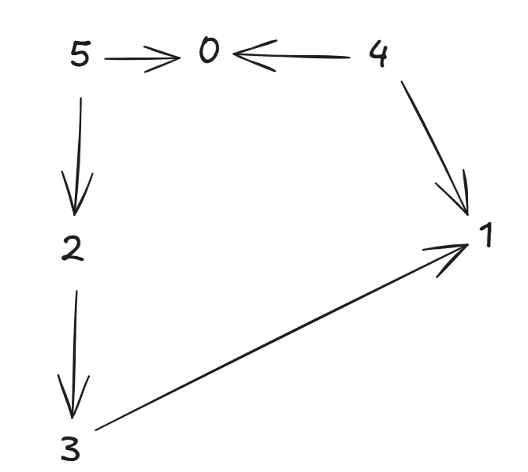
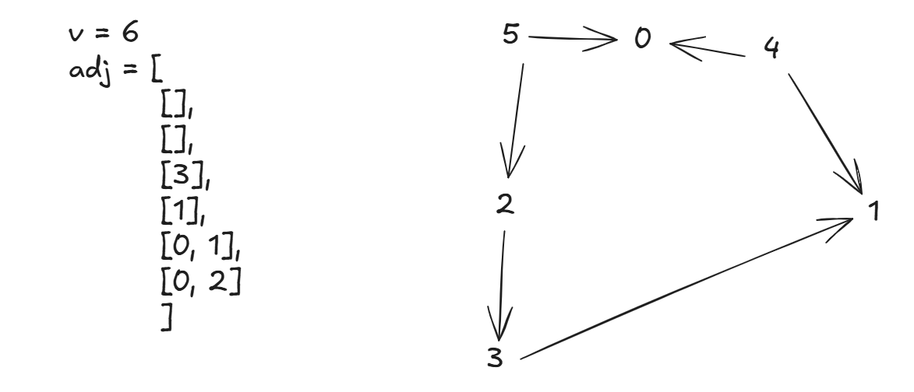

## 🚀 **What is Kahn's Algorithm?**

Kahn’s Algorithm is a method for **topological sorting** of a **Directed Acyclic Graph (DAG)** using **BFS (Breadth-First Search)**.

---

## 🧠 **Goal of Topological Sort:**

To **linearize** the nodes of a DAG such that for every directed edge `u → v`, `u` comes **before** `v` in the result.

---

## 🧩 **Core Idea of Kahn’s Algorithm:**

1. **Indegree**: Count incoming edges for every node.
2. **Queue**: Start with nodes that have `indegree = 0` (no dependencies).
3. **Process**:

   * Remove node from queue → add to result.
   * Decrease indegree of its neighbors.
   * If neighbor’s indegree becomes 0 → add to queue.
4. Repeat until the queue is empty.

---

## 🧮 **Step-by-Step Example**

Consider the graph:

```
5 → 0 ← 4  
↓         ↘  
2           1 ← 3
↓
3 → 1
```




---

### ✅ Step 1: Build Indegree Table

Count incoming edges for each node:

```
0: from 4, 5 → indegree[0] = 2  
1: from 3, 4 → indegree[1] = 2  
2: from 5 → indegree[2] = 1  
3: from 2 → indegree[3] = 1  
4: no incoming → indegree[4] = 0  
5: no incoming → indegree[5] = 0  
```

```java
indegree = {
  0: 2, 1: 2, 2: 1, 3: 1, 4: 0, 5: 0
}
```

---

### ✅ Step 2: Initialize Queue

Push all nodes with `indegree = 0`:

```
Queue: [4, 5]
```

---

### ✅ Step 3: Start BFS

We'll maintain a result list: `topoOrder = []`

---

### 🔄 Process node `4`

* Add `4` → `topoOrder = [4]`
* `4 → 0` → indegree\[0] = 2 → 1
* `4 → 1` → indegree\[1] = 2 → 1
* Queue: `[5]`

---

### 🔄 Process node `5`

* Add `5` → `topoOrder = [4, 5]`
* `5 → 0` → indegree\[0] = 1 → 0 
* `5 → 2` → indegree\[2] = 1 → 0 
* Queue: `[0, 2]`

---

### 🔄 Process node `0`

* Add `0` → `topoOrder = [4, 5, 0]`
* `0` has no outgoing edges
* Queue: `[2]`

---

### 🔄 Process node `2`

* Add `2` → `topoOrder = [4, 5, 0, 2]`
* `2 → 3` → indegree\[3] = 1 → 0 
* Queue: `[3]`

---

### 🔄 Process node `3`

* Add `3` → `topoOrder = [4, 5, 0, 2, 3]`
* `3 → 1` → indegree\[1] = 1 → 0 
* Queue: `[1]`

---

### 🔄 Process node `1`

* Add `1` → `topoOrder = [4, 5, 0, 2, 3, 1]`
* Queue is now empty ✅

---

## ✅ Final Output:

```
Topological Order: [4, 5, 0, 2, 3, 1]
```

---

## ✅ Java Code for Kahn’s Algorithm:

```java
public List<Integer> topologicalSort(int V, List<List<Integer>> adj) {
    int[] indegree = new int[V];

    // Step 1: Compute indegree
    for (int u = 0; u < V; u++) {
        for (int v : adj.get(u)) {
            indegree[v]++;
        }
    }

    // Step 2: Queue of all nodes with indegree 0
    Queue<Integer> queue = new LinkedList<>();
    for (int i = 0; i < V; i++) {
        if (indegree[i] == 0) {
            queue.offer(i);
        }
    }

    // Step 3: BFS to build topological order
    List<Integer> topoOrder = new ArrayList<>();
    while (!queue.isEmpty()) {
        int node = queue.poll();
        topoOrder.add(node);
        for (int neighbor : adj.get(node)) {
            indegree[neighbor]--;
            if (indegree[neighbor] == 0) {
                queue.offer(neighbor);
            }
        }
    }

    return topoOrder;
}
```


Based on the above graph, the **adjacency list representation** (for a **directed graph**) suitable for your `topologicalSort(int V, List<List<Integer>> adj)` function is:

```java
int V = 6;
List<List<Integer>> adj = new ArrayList<>();
for (int i = 0; i < V; i++) adj.add(new ArrayList<>());

// Add edges as per the diagram
adj.get(5).add(0);  // 5 → 0
adj.get(5).add(2);  // 5 → 2
adj.get(2).add(3);  // 2 → 3
adj.get(3).add(1);  // 3 → 1
adj.get(4).add(0);  // 4 → 0
adj.get(4).add(1);  // 4 → 1
```

### Visual Mapping:



This structure will work directly with the `topologicalSort` method and produce a valid topological ordering like:

```
[4, 5, 2, 3, 0, 1]
```

---

### How we get the indegrees? 

Let’s walk through the **indegree calculation** using this graph and adjacency list:

---

### ✅ **Graph Structure from Image:**

Edges:

* `5 → 0`
* `5 → 2`
* `4 → 0`
* `4 → 1`
* `2 → 3`
* `3 → 1`

---

### ✅ **Adjacency List (V = 6):**

```java
adj = [
  [],         // 0
  [],         // 1
  [3],        // 2 → 3
  [1],        // 3 → 1
  [0, 1],     // 4 → 0, 1
  [0, 2]      // 5 → 0, 2
];
```

---

### ✅ **Indegree Calculation Loop:**

```java
int[] indegree = new int[V];

for (int u = 0; u < V; u++) {
    for (int v : adj.get(u)) {
        indegree[v]++;
    }
}
```

Now step by step:

| `u` | `adj[u]` | Action                         | Resulting `indegree[]` |
| --- | -------- | ------------------------------ | ---------------------- |
| 0   | `[]`     | —                              | `[0, 0, 0, 0, 0, 0]`   |
| 1   | `[]`     | —                              | `[0, 0, 0, 0, 0, 0]`   |
| 2   | `[3]`    | `indegree[3]++`                | `[0, 0, 0, 1, 0, 0]`   |
| 3   | `[1]`    | `indegree[1]++`                | `[0, 1, 0, 1, 0, 0]`   |
| 4   | `[0, 1]` | `indegree[0]++, indegree[1]++` | `[1, 2, 0, 1, 0, 0]`   |
| 5   | `[0, 2]` | `indegree[0]++, indegree[2]++` | `[2, 2, 1, 1, 0, 0]`   |

---

### ✅ Final `indegree[]` Array:

```java
indegree = [2, 2, 1, 1, 0, 0];
```

---

### ✅ Meaning:

* `indegree[0] = 2` → from `4` and `5`
* `indegree[1] = 2` → from `3` and `4`
* `indegree[2] = 1` → from `5`
* `indegree[3] = 1` → from `2`
* `indegree[4] = 0` → no incoming edges
* `indegree[5] = 0` → no incoming edges


---

## ❗ Cycle Detection

If `topoOrder.size() < V`, then the graph contains a **cycle**, and topological sort is **not possible**.

---

## 📌 Summary Table

| Step                   | Action                                   |
| ---------------------- | ---------------------------------------- |
| Build indegree         | Count incoming edges for all nodes       |
| Init queue             | Add all `indegree == 0` nodes            |
| BFS loop               | Pop → Add to result → Decrease neighbors |
| Add neighbors to queue | If `indegree == 0`                       |
| Check for cycle        | If result size < V                       |


