## 📊 Basic Statistical Techniques for Describing and Understanding Data

Statistics plays a foundational role in **data analysis, decision-making, prediction, and understanding trends**—especially in fields such as **business, economics, healthcare, and research**. This note covers the key statistical techniques required to describe and interpret data effectively.

---

### 🟦 1. Graphical Representation of Data

Visualizing data allows for quick and intuitive understanding of trends, distributions, and outliers.

#### 🔸 Bar Charts

* Best for **categorical data**.
* Height of bars reflects frequency or magnitude.
* **Example:** Comparing soap sales in different Indian regions.

#### 🔸 Histograms

* Used for **interval/ratio data** (numeric).
* Represents frequency distribution using **bins**.
* **Example:** Visualizing defect frequency in a manufacturing process.

#### 🔸 Pie Charts

* Shows **proportions of categories** as slices of a circle.
* Useful for illustrating part-to-whole relationships.
* **Example:** Retail sales distribution across product categories like groceries, apparel, and electronics.

#### 🔸 Line Graphs

* Ideal for **time-series data**.
* Plots data points over time to reveal trends and cycles.
* **Example:** New mobile subscriber growth over months for a telecom company.

---

### 🟦 2. Measures of Central Tendency

These values summarize a dataset with a **single representative figure**.

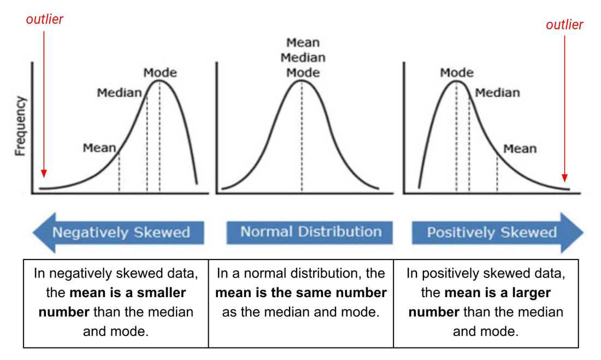

#### 🔸 Mean (Average)

* **Formula:** Mean = (Sum of all values) / (Number of values)
* Affected by outliers.
* **Example:** Mean income skewed by a CEO's high salary.

#### 🔸 Median

* The **middle value** in an ordered dataset.
* **Robust against outliers**.
* **Example:** Median salary better reflects typical earnings when some values are unusually high.

#### 🔸 Mode

* Most **frequently occurring value**.
* Can be used for categorical data.
* **Example:** "Digital wallets" being the mode for preferred payment methods.

---

### 🟦 3. Measures of Dispersion

These measures describe **how spread out** data points are around the central tendency.

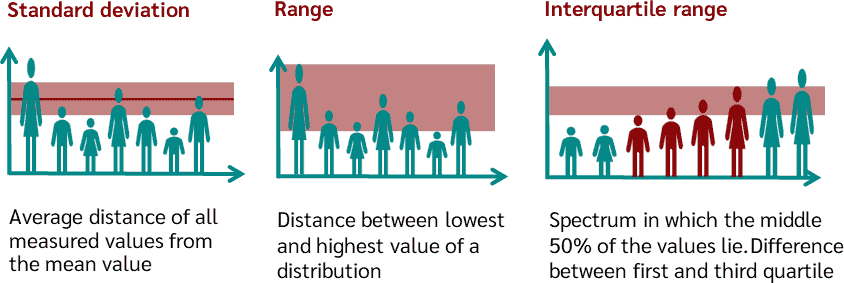

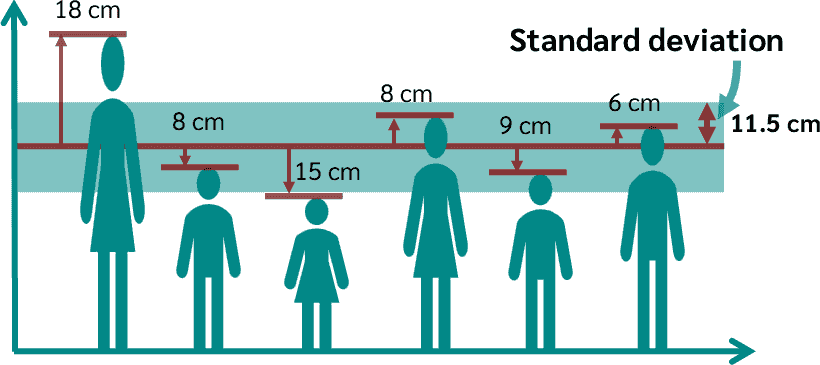

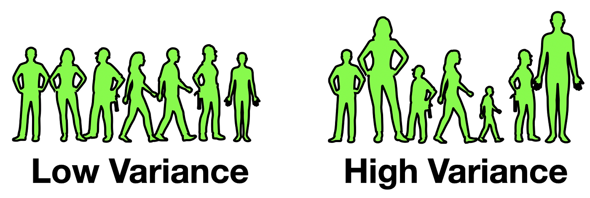

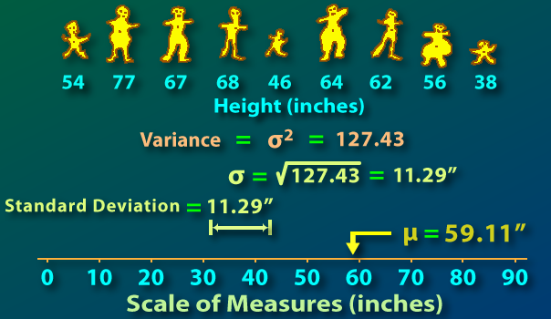

#### 🔸 Range

* **Formula:** Max value − Min value
* Simple but sensitive to outliers.
* **Example:** Range of exam scores = 95 − 35 = 60

#### 🔸 Variance

* Measures the **average squared deviation** from the mean.
* Indicates **how spread out** the data is.
* Higher variance = more variability.

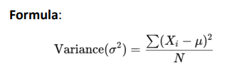

#### 🔸 Standard Deviation (SD)

* **Square root of variance**.
* Easier to interpret (in same units as data).
* **Low SD** → tightly clustered data, **High SD** → widely spread.
* **Example:** Low SD in student marks = most students scored close to the average.

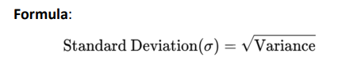

---

### 🟦 4. Skewness and Kurtosis

These describe the **shape** of a distribution.

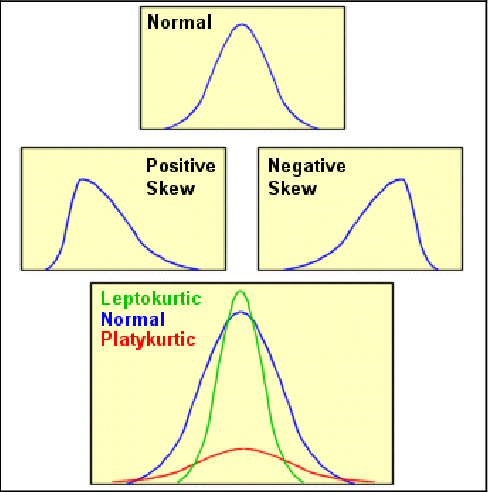

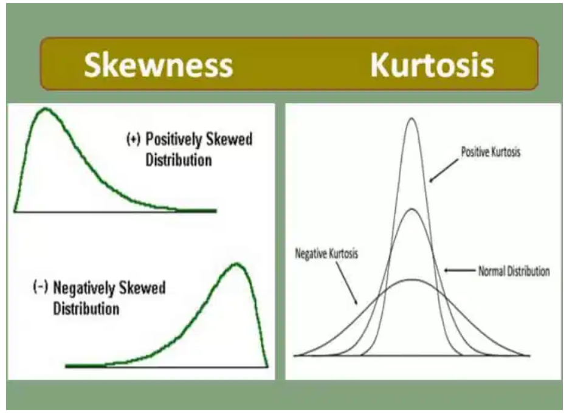

#### 🔸 Skewness

* Indicates **asymmetry** in distribution.
* **Positive skew** = long right tail, **Negative skew** = long left tail.
* **Example:** Income distribution is often positively skewed in developing countries.

#### 🔸 Kurtosis

* Measures **peakedness** and **tail heaviness**.
* High kurtosis = more outliers (fat tails).
* **Example:** Stock return data with high kurtosis suggests frequent extreme values.

---

### 🟦 5. Correlation and Covariance

These metrics show **how variables are related**.

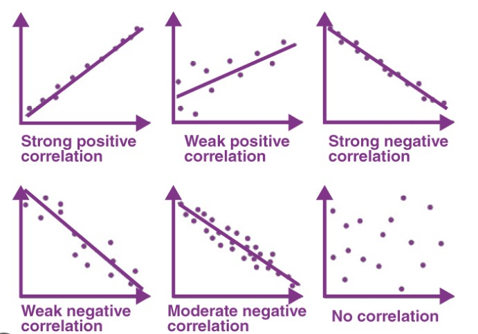

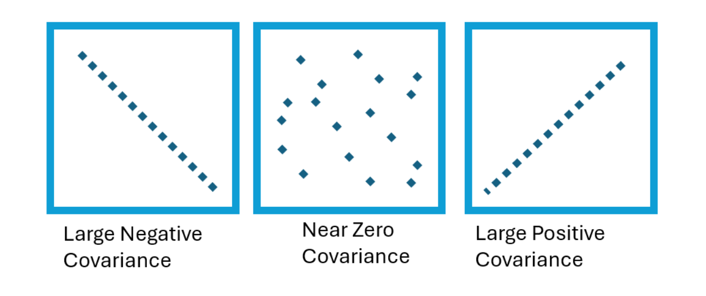

#### 🔸 Correlation (r)

* Ranges from **−1 to +1**
* **+1:** perfect positive relation, **−1:** perfect negative, **0:** no relation.
* **Example:** GDP and employment rates may have a positive correlation.

#### 🔸 Covariance

* Measures **direction of relationship**, not strength.
* **Positive covariance**: variables move together.
* **Negative covariance**: move in opposite directions.
* **Example:** In a stock portfolio, covariance helps assess asset diversification.

> Note: Covariance and correlation both measure the relationship between two variables, but correlation is a standardized measure of covariance, meaning it is always between -1 and +1, while covariance can take any value. Covariance indicates the direction of the relationship (positive or negative), while correlation indicates both the direction and the strength of the linear relationship

---

### 🟦 6. Probability Distributions

Probability distributions describe **likelihoods of outcomes**.

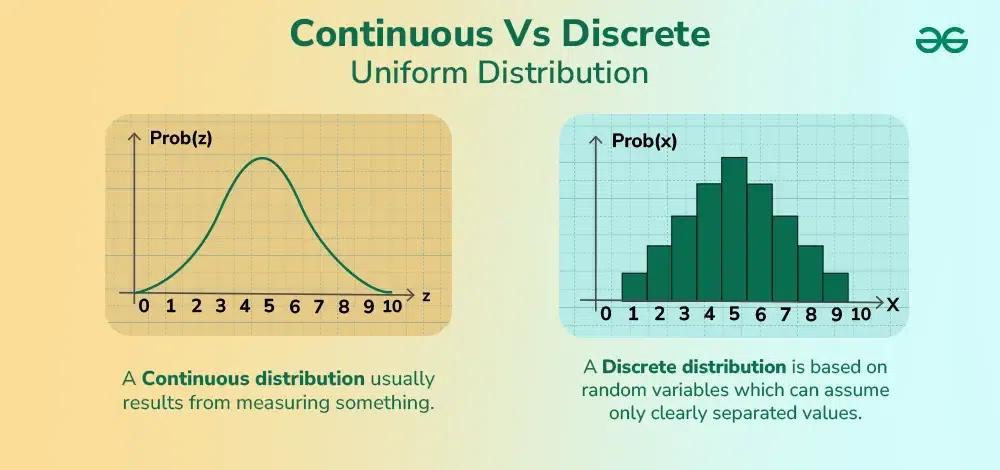

#### 🔸 Discrete Distributions

* For data with **countable outcomes**.
* **Example:** Binomial distribution used for modeling the number of defective products in a batch.

#### 🔸 Continuous Distributions

* For **any value within a range**.
* **Example:** Human height follows a **normal distribution** (bell-shaped curve).

---

### 🟦 7. Hypothesis Testing

Used to **validate assumptions** using sample data.

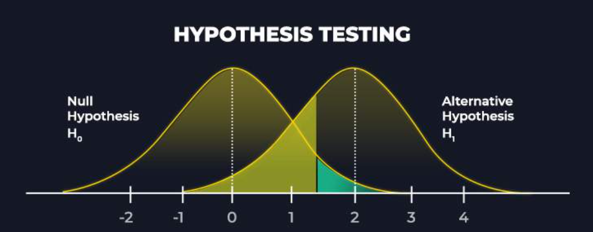

#### 🔹 Steps:

1. **Form Hypotheses**:

   * Null Hypothesis (H₀): No effect
   * Alternative Hypothesis (H₁): Effect exists
2. **Select Significance Level** (usually 0.05)
3. **Compute Test Statistic**
4. **Make a Decision**: Reject or fail to reject H₀

#### 🔸 Example:

An Indian pharma company tests if a new drug is more effective than an existing one.

---

### 🟦 8. Confidence Intervals (CI)

Provides a **range** within which a population parameter lies with a certain **confidence level** (e.g., 95%).

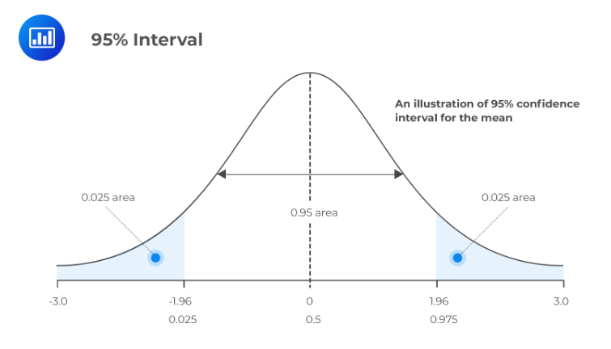

#### 🔸 Formula:

CI = Sample Mean ± Z \* (Standard Error)

#### 🔸 Example:

A company estimates average customer satisfaction to be 8.2 with a 95% CI of ±0.4 → true value likely lies between 7.8 and 8.6.

---

### 🟦 9. Regression Analysis

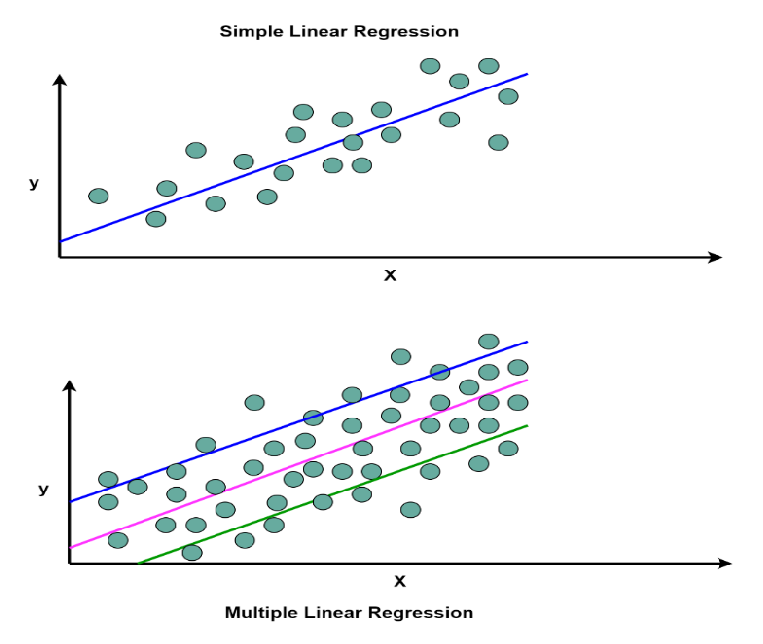

Used to **model relationships** and **make predictions**.

#### 🔸 Simple Linear Regression

* **Formula:** Y = β₀ + β₁X
* Y: dependent variable, X: independent variable

#### 🔸 Multiple Regression

* Uses multiple independent variables.
* **Example:** Predicting loan default using income, credit score, and job status.

---

### 🟦 10. Time Series Analysis

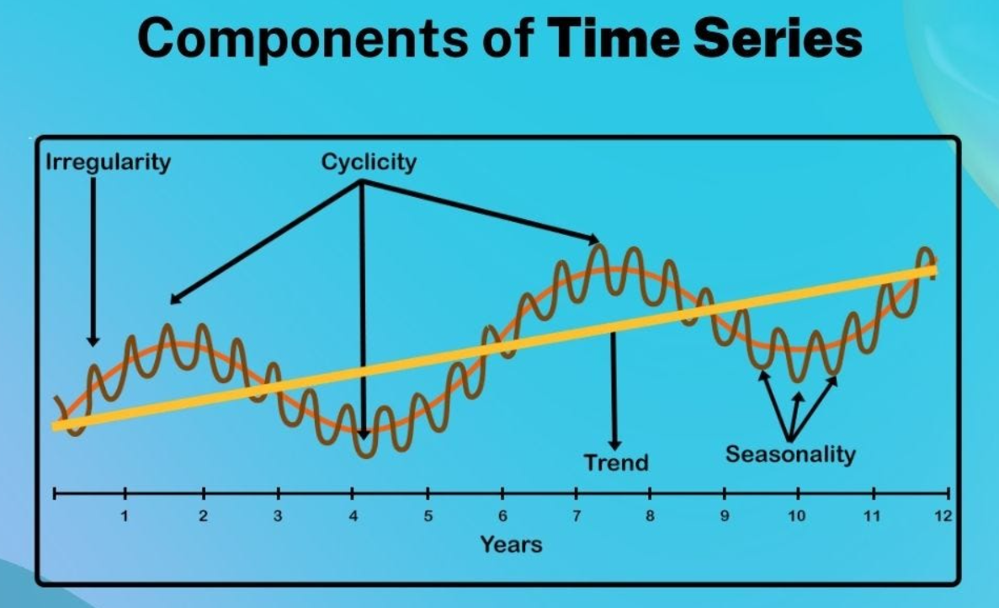

Analyzes data points collected **over time**.

#### 🔹 Components:

* **Trend**: Long-term direction
* **Seasonality**: Recurring patterns (e.g., monthly, quarterly)
* **Moving Average**: Smoothens fluctuations

#### 🔸 Example:

An agricultural company forecasts crop yield using past weather and planting data.

---

## ✅ Summary Table

| **Technique**             | **Purpose**                    | **Example**                                        |
| ------------------------- | ------------------------------ | -------------------------------------------------- |
| Bar/Pie/Line Charts       | Visualize data                 | Product sales, market share, time-based trends     |
| Mean/Median/Mode          | Find central value             | Average salary, most common customer choice        |
| Range/SD/Variance         | Measure data spread            | Marks distribution, financial risk                 |
| Skewness/Kurtosis         | Analyze distribution shape     | Income inequality, market volatility               |
| Correlation/Covariance    | Analyze variable relationships | GDP vs Employment, stock portfolio management      |
| Probability Distributions | Model uncertainty              | Stock returns, quality control                     |
| Hypothesis Testing        | Validate assumptions           | New drug effectiveness, customer behavior analysis |
| Confidence Intervals      | Estimate population parameters | Customer satisfaction, survey results              |
| Regression Analysis       | Predict outcomes               | Loan defaults, sales forecasting                   |
| Time Series Analysis      | Forecast trends over time      | Crop yields, revenue forecasting                   |

