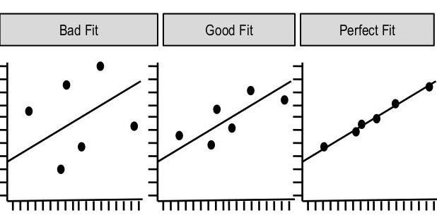

# 📘 Introduction to Probability and Random Variables

---

## 🔹 A. Probability

**Probability** is a mathematical concept used to quantify uncertainty and predict the likelihood of various outcomes in business, economics, and daily life. It is especially valuable for **risk assessment, forecasting, decision-making**, and **quality control**.

---

### 📌 Definition

**Probability** is defined as the **likelihood** of an event occurring out of all possible outcomes.

* **Formula:**

  $$
  P(E) = \frac{\text{Number of favorable outcomes}}{\text{Total number of outcomes}}
  $$
* **Range:**

  $$
  0 \leq P(E) \leq 1
  $$

---

### 📚 Basic Terminology

* **Experiment:** A process with uncertain outcomes (e.g., tossing a coin).
* **Sample Space (S):** Set of all possible outcomes.
  *Example:* Tossing a die → $S = \{1, 2, 3, 4, 5, 6\}$
* **Event (E):** A subset of the sample space.
  *Example:* Rolling an even number → $E = \{2, 4, 6\}$
* **P(E):** Probability of event E occurring.

---

### 📊 Types of Probability

1. **Theoretical Probability**
   Based on known possible outcomes.

   $$
   P(E) = \frac{\text{favorable outcomes}}{\text{total outcomes}}
   $$

   *Example:* Flipping a fair coin → $P(\text{Head}) = \frac{1}{2}$

2. **Experimental Probability**
   Based on trials and observations.

   $$
   P(E) = \frac{\text{Observed frequency of E}}{\text{Total trials}}
   $$

   *Example:* 45 heads in 100 flips → $P(\text{Head}) = \frac{45}{100}$

3. **Subjective Probability**
   Based on intuition or judgment, not calculations.
   *Example:* A cricket expert predicting a team’s win chance.

---

### 📐 Rules of Probability

#### ➕ Addition Rule

For mutually exclusive events A and B:

$$
P(A \text{ or } B) = P(A) + P(B)
$$

*Example:* Rolling 1 or 2 → $P = \frac{1}{6} + \frac{1}{6} = \frac{1}{3}$

#### ✖ Multiplication Rule

For independent events A and B:

$$
P(A \text{ and } B) = P(A) \times P(B)
$$

*Example:* P(Head on coin and 3 on die) → $\frac{1}{2} \times \frac{1}{6} = \frac{1}{12}$

#### 🔄 Complement Rule

$$
P(\text{Not A}) = 1 - P(A)
$$

*Example:* If P(Rain) = 0.3, then P(No Rain) = 0.7

---

### 🔄 Conditional Probability

It calculates the probability of event A **given** event B has occurred:

$$
P(A|B) = \frac{P(A \cap B)}{P(B)}
$$

*Example:* Drawing 2 aces from a deck without replacement.

---

## 🔹 B. Random Variables

A **random variable** assigns numerical values to outcomes of a random experiment.

---

### Types:

#### 1. **Discrete Random Variables**

* Takes **finite or countable** values.
* Described by a **Probability Mass Function (PMF)**.
* *Example:* Number on a die roll.

#### 2. **Continuous Random Variables**

* Takes **any value in an interval**.
* Described by a **Probability Density Function (PDF)**.
* *Example:* Height, temperature, time.

---

### 📈 Probability Distributions

#### a. **Discrete Distribution**

Gives probabilities for each possible value (via PMF).
*Example:*

$$
P(X=1) = \frac{1}{6}, ..., P(X=6) = \frac{1}{6}
$$

#### b. **Continuous Distribution**

PDF defines probabilities over intervals, not points.
*Example:* **Normal Distribution (Bell Curve)**
Used in natural phenomena like height, IQ, weight, etc.

---

### 🎯 Expected Value (Mean)

Expected value is the **average outcome** if the experiment is repeated infinitely.

* **Formula (Discrete):**

  $$
  E(X) = \sum x_i \cdot P(x_i)
  $$

*Example:* Expected value of rolling a die →

$$
E(X) = \frac{1+2+3+4+5+6}{6} = 3.5
$$

---

### 📏 Variance and Standard Deviation

* **Variance:**

  $$
  Var(X) = E[(X - \mu)^2]
  $$

* **Standard Deviation:**

  $$
  \sigma = \sqrt{Var(X)}
  $$

*Interpretation:*
Low variance → values close to mean.
High variance → values widely spread.

---

## 🔹 C. Basics of Correlation and Regression

---

### 🔄 Correlation

**Correlation** quantifies the **strength and direction** of linear relationship between two variables.

* **Positive Correlation:** Both increase or decrease together.
  *Example:* Study time vs exam marks

* **Negative Correlation:** One increases, other decreases.
  *Example:* Price vs quantity demanded

* **No Correlation:** No relationship
  *Example:* Number of books vs outside temperature

* **Correlation Coefficient (r):**

  $$
  -1 \leq r \leq 1
  $$

---

### 📉 Regression Analysis

Used to **model and predict** the relationship between dependent and independent variables.

#### a. **Simple Linear Regression**

$$
Y = a + bX
$$

Where:

* **Y**: Dependent variable
* **X**: Independent variable
* **a**: Intercept
* **b**: Slope

*Example:* Predicting marks from study hours.

#### b. **Multiple Regression**

$$
Y = a + b_1X_1 + b_2X_2 + \dots + b_nX_n
$$

*Example:* Predicting sales using ad spend, number of salespersons.

---

### 📊 Goodness of Fit (R²)

* Measures **how well** the regression explains variability in Y.
* R² = 0 → No fit, R² = 1 → Perfect fit
  *Example:* R² = 0.85 means 85% of variation in Y is explained.

---

## 🔹 D. Applications in Business

| Use Case        | Application                                                             |
| --------------- | ----------------------------------------------------------------------- |
| Risk Assessment | Insurance firms use probability to estimate premiums and claims.        |
| Market Research | Regression used to study impact of ads on sales.                        |
| Quality Control | Statistical sampling identifies product defects in manufacturing.       |
| Forecasting     | Regression and time series methods forecast sales, trends, demand, etc. |

---

## ✅ Summary Table

| Concept              | Definition/Use                          | Example                      |
| -------------------- | --------------------------------------- | ---------------------------- |
| Probability          | Likelihood of event                     | Tossing a coin               |
| Random Variable      | Maps outcomes to numerical values       | Dice roll result             |
| Discrete Variable    | Finite/countable outcomes               | Number of heads in 10 tosses |
| Continuous Variable  | Infinite values in range                | Height of students           |
| Expected Value       | Long-run average                        | E(X) for die = 3.5           |
| Variance & SD        | Measures spread of data                 | Scores near/far from average |
| Correlation          | Relationship strength between variables | Hours studied vs Marks       |
| Regression           | Predict dependent variable              | Sales from ads & salespeople |
| R² (Goodness of Fit) | % variation in Y explained by model     | R² = 0.85 → 85% explained    |
