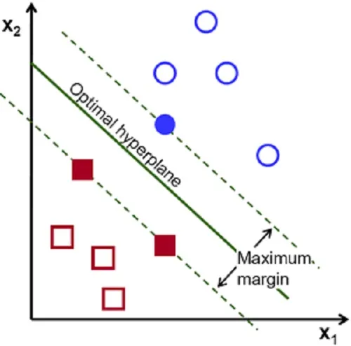
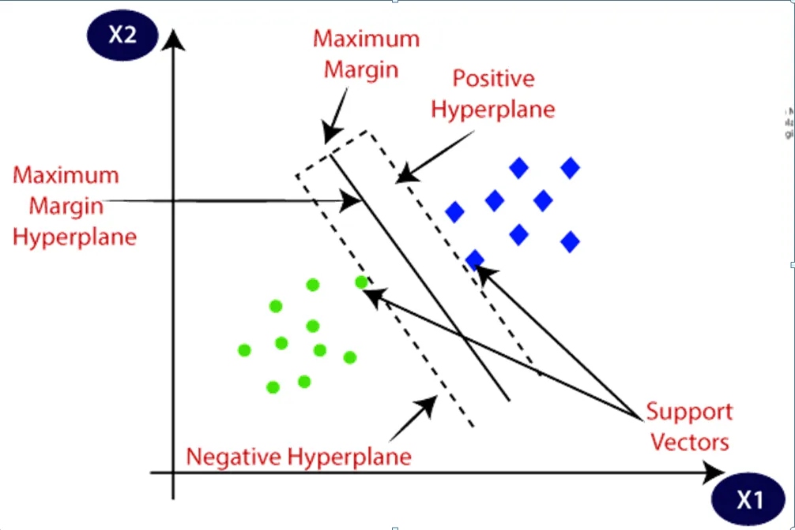
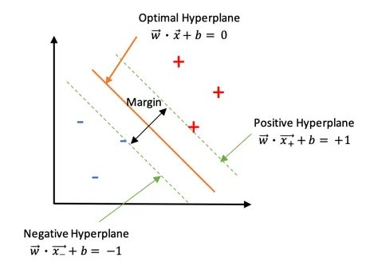
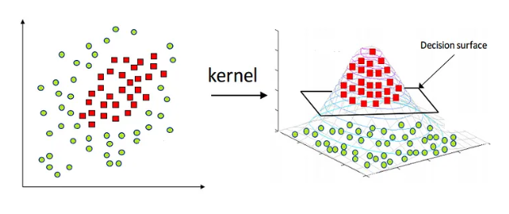
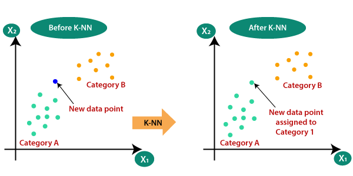
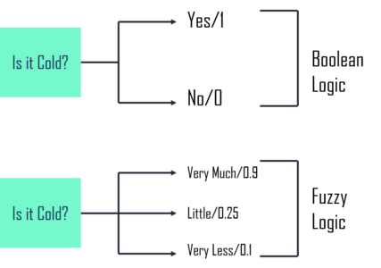

## 🧠 Introduction to Support Vector Machines (SVMs) and Classification Using Frequent Patterns

### 🔹 What are Support Vector Machines (SVMs)?

SVMs are **supervised learning models** used primarily for classification. They are especially useful in **high-dimensional spaces** and ==work well even with limited data==.

* **Core Idea**: Find the **optimal hyperplane** that best separates different classes in a dataset.
> 
* **Maximum Margin**: The hyperplane is selected such that the margin (distance between the closest points of the classes) is **maximized**, improving generalization.
> 
* **Real-World Example**: Classifying emails into *spam* and *non-spam* using word frequency, sender info, etc.


---

### 🔹 Mathematics Behind SVMs

SVM aims to solve the optimization problem:

> Maximize margin while classifying all points correctly (or with minimal errors in soft-margin cases).



Hyperplane Equation:

```
w • x + b = 0
```

* `w`: weight vector (direction)
* `x`: input features
* `b`: bias (shifts the hyperplane)

Constraint for correct classification:

```
yᵢ(w • xᵢ + b) ≥ 1
```

For non-linearly separable data, **slack variables** are added, allowing some misclassifications (soft margin).

---

### 🔹 Kernel Trick in SVMs

To classify **non-linear** data, SVM uses **kernel functions** to map data into higher dimensions where linear separation is possible:

**Common Kernel Types**:

1. **Linear**: No transformation.
2. **Polynomial**: Maps input to polynomial space.
3. **RBF (Gaussian)**: Maps to infinite-dimensional space (best for complex decision boundaries).

> 🧠 Example: RBF is used in face recognition to classify based on nonlinear relationships in pixel values.

> Note : The kernel trick in Support Vector Machines (SVMs) is a technique that allows SVMs to classify data that is not linearly separable by mapping it into a higher-dimensional space where it becomes linearly separable
> 
> 


---

## 📊 Classification Using Frequent Patterns

### 🔹 Frequent Pattern Classification

It uses **repeating patterns or itemsets** found in data to build classification models. Ideal for scenarios like **market basket analysis** or **text classification**.

**Popular Algorithms**:

* **Apriori**
* **FP-Growth**

> Example: Finding that customers who buy **diapers** often also buy **wipes**, and using this insight for future recommendations or promotions.

---

## 🔍 k-Nearest Neighbour (k-NN) and Fuzzy Set Classifiers

### 🔹 k-Nearest Neighbour (k-NN)



A **simple, non-parametric** classification method based on **similarity**:

**Steps**:

1. Select `k` (number of neighbors).
2. Compute distance (usually **Euclidean**) between test point and all training points.
3. Pick `k` nearest points.
4. Classify based on the **majority label**.

> 🧠 Example: Classifying a fruit based on its closeness to known fruits in the dataset.

**Pros**:

* Easy to implement.
* No training phase.

**Cons**:

* Slow for large data.
* Sensitive to irrelevant features and noise.
* Requires good choice of `k`.

---

### 🔹 Fuzzy-Set Approach Classifier

**Fuzzy classification** allows a data point to **partially belong** to multiple classes using **membership functions** (values between 0 and 1).

**Components**:

1. **Fuzzy Sets** – soft boundaries.
2. **Fuzzy Rules** – e.g., "If temperature is high, then chance of thunderstorm is high".
3. **Inference System** – combines rules and generates the final output.

> 🧠 Example: In medical diagnosis, symptoms can suggest multiple diseases with varying degrees of confidence.

**Advantages**:

* Deals with uncertainty and imprecision.
* Useful in **expert systems**, **pattern recognition**, **CRM**, etc.

> Fuzzy Logic: 
>  

---

### 🔸 Comparison: k-NN vs Fuzzy-Set Classifier

| Feature             | k-NN                             | Fuzzy-Set                                 |
| ------------------- | -------------------------------- | ----------------------------------------- |
| Classification Type | Crisp (hard class)               | Soft (partial membership)                 |
| Best For            | Clear, linearly separable data   | Overlapping, uncertain or vague data      |
| Limitation          | Slow on large datasets           | Complex rule management                   |
| Use Case Example    | Grouping users by purchase value | Categorizing customer satisfaction levels |

---

## ✅ Summary

* **SVMs**: Great for high-dimensional classification using the concept of maximum margin and kernels.
* **Frequent Pattern Mining**: Helps in generating interpretable and pattern-driven classifiers.
* **k-NN**: Effective for small, clean datasets with simple structure.
* **Fuzzy Logic**: Ideal for fuzzy or ambiguous classification problems in real-world settings.


