## 🔍 Introduction to Clustering Methods

**Clustering** is an unsupervised learning technique used to group similar data points into clusters, such that:

* **Intra-cluster similarity** is high.
* **Inter-cluster similarity** is low.

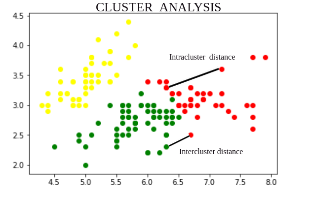

Clustering is widely used in **marketing**, **bioinformatics**, **image processing**, **text mining**, and more.

---

## 🔹 K-Means Clustering

**Definition**:
K-Means divides a dataset into **k predefined clusters**, each represented by the **mean (centroid)** of the data points within it.

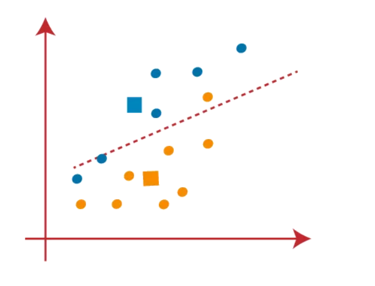

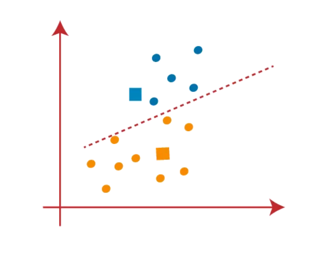

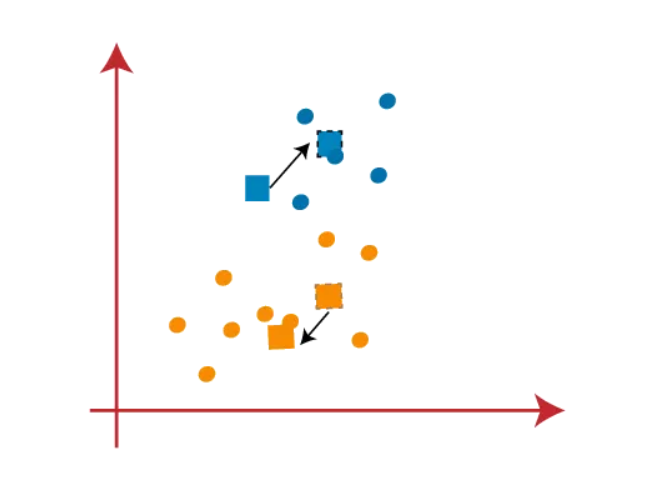

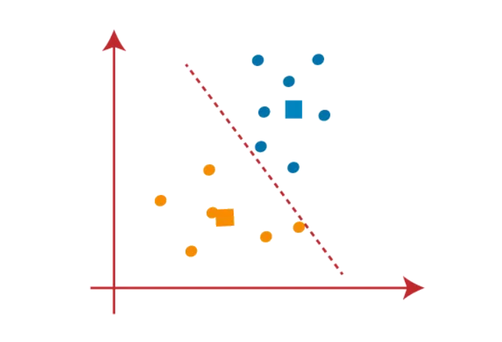

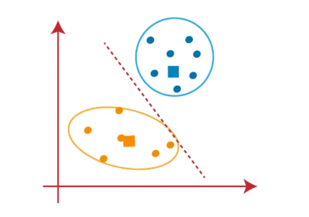

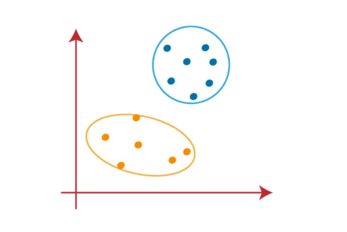

### 🔁 Algorithm Steps:

1. **Initialization**: Choose `k` random data points as centroids.
2. **Assignment**: Assign each point to the nearest centroid.
3. **Update**: Recalculate centroids as the mean of points in each cluster.
4. **Repeat** until centroids converge.

### ✅ Advantages:

* Easy to implement.
* Efficient with time complexity O(n × k × i).
* Scales well to large datasets.

### ❌ Disadvantages:

* Sensitive to initial centroid placement.
* Requires pre-defined `k`.
* Sensitive to **outliers** and **non-spherical clusters**.

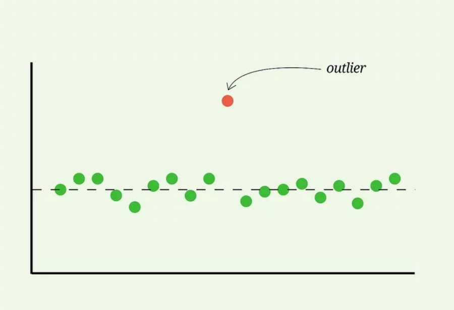

### 📌 Use Case Example:

Segmenting retail customers as:

* Heavy consumers
* Infrequent consumers
* Promotional consumers

### 📊 Optimization:

* Use **K-Means++** for better initialization.
* Apply the **Elbow Method** to find optimal `k`.

> The Elbow Method is a technique used in cluster analysis, primarily with the K-Means algorithm, to help determine the optimal number of clusters (represented by k) for a given dataset.
>  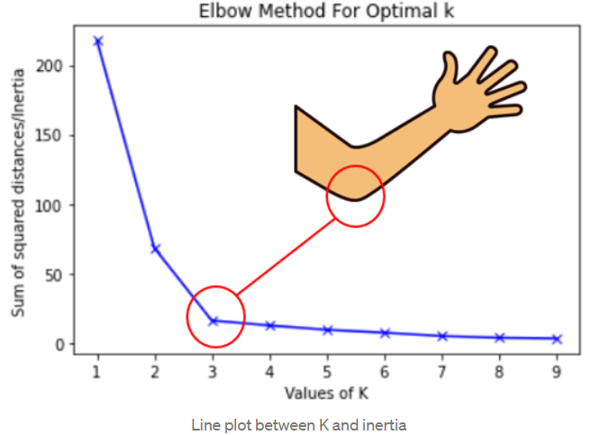

---

## 🔹 k-Medoids Clustering

**Definition**:
An alternative to K-Means where clusters are formed around **actual data points (medoids)** instead of centroids.

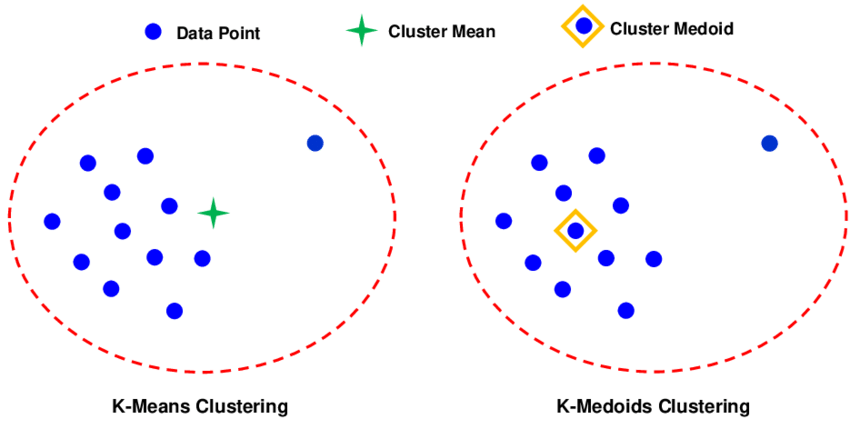

### 🔁 Algorithm Steps:

1. **Initialization**: Select `k` medoids randomly.
2. **Assignment**: Assign points to the nearest medoid.
3. **Update**: Choose the data point within the cluster that minimizes the **total dissimilarity** as the new medoid.
4. **Repeat** until medoids stabilize.

### ✅ Advantages:

* **Robust to outliers**.
* Medoids are real data points → better interpretability.

### ❌ Disadvantages:

* More **computationally expensive** than K-Means.
* Less scalable for large datasets.

### 📌 Use Case Example:

Grouping patients in healthcare based on symptom similarity; each medoid represents a real patient case.

> Note :
>  
> __Computational cost:__ K-Medoids is generally more computationally expensive than K-Means.
> 
> __Robustness vs. speed:__ The increased robustness of K-Medoids comes at the cost of slower performance compared to K-Means

---

## 🔹 Agglomerative Hierarchical Clustering

**Definition**:
A **bottom-up** clustering method where each data point starts as its own cluster. Closest clusters are merged iteratively.

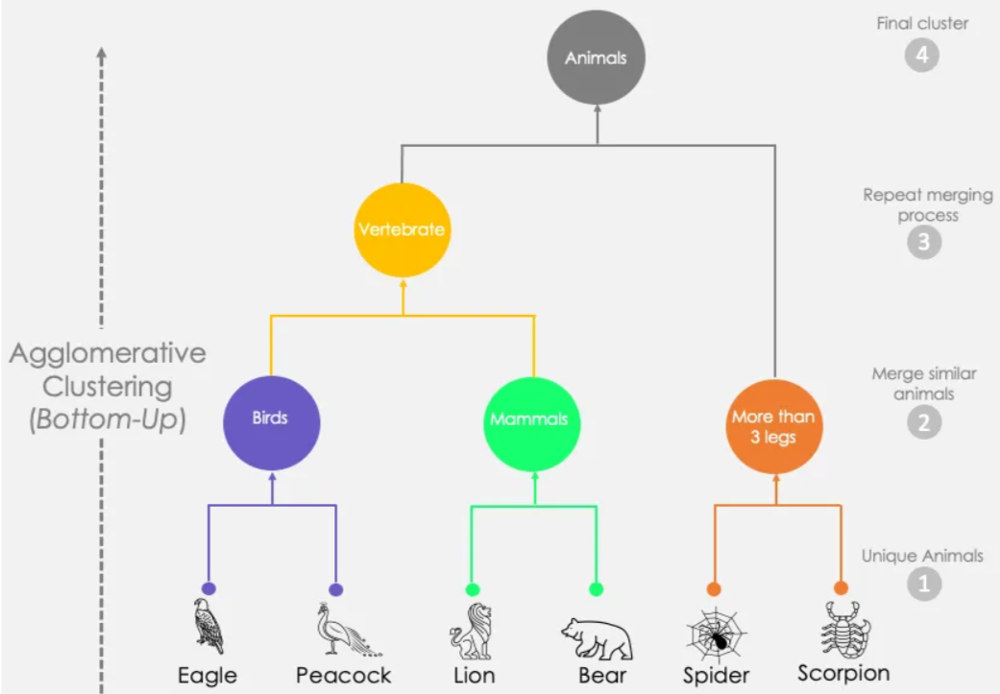

### 🔁 Algorithm Steps:

1. Treat each data point as a separate cluster.
2. Merge the two closest clusters based on a distance metric.
3. Repeat until a single cluster remains or a stopping condition is met.

### ✅ Advantages:

* No need to pre-define `k`.
* **Dendrogram** helps visualize and decide clusters.

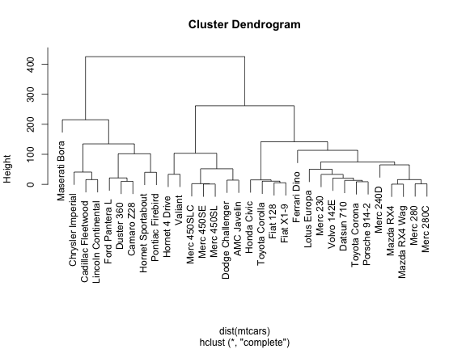

### ❌ Disadvantages:

* High **computational cost**.
* Sensitive to **distance metrics** and **linkage criteria** (single, complete, average).

> Distance metrics: 
> 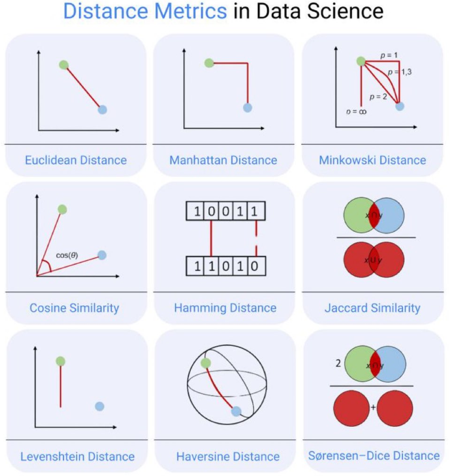

> Linkages: 
> 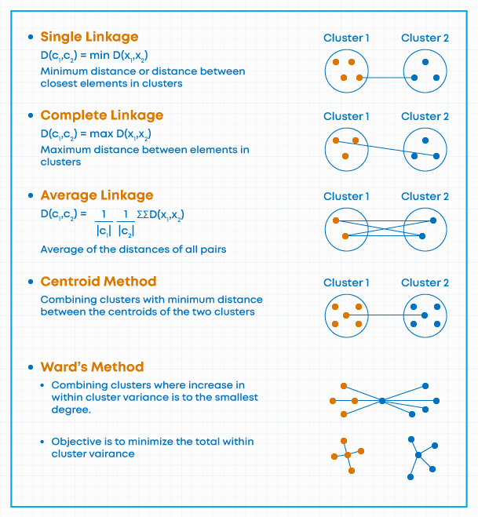

### 📌 Use Case Example:

Taxonomic classification in biology using genetic similarity.

---

## 🔹 Divisive Hierarchical Clustering

**Definition**:
A **top-down** approach where all data starts in a single cluster, then is recursively split.

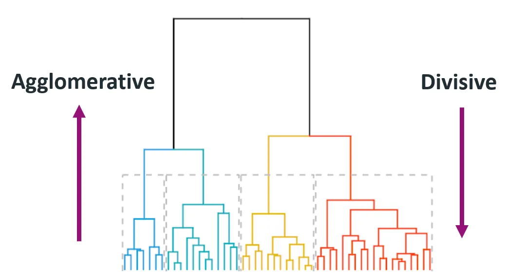

### 🔁 Algorithm Steps:

1. Begin with one big cluster.
2. Iteratively split clusters that improve **homogeneity**.
3. Repeat until desired granularity is achieved.

### ✅ Advantages:

* Natural hierarchy creation.
* Useful for **organization structures** and **corporate segmentation**.

### ❌ Disadvantages:

* More computationally expensive than agglomerative.
* Hard to decide the best split at each step.

### 📌 Use Case Example:

Market segmentation starting from a global audience, then dividing by region, then customer type.

---

## 🔹 Mean-Shift Clustering

**Definition**:
A **non-parametric**, density-based clustering algorithm that moves each point towards the **mode** (densest region).

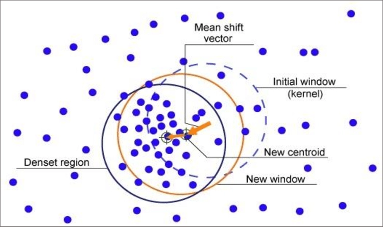

### 🔁 Algorithm Steps:

1. Start with a point as the initial cluster center.
2. Compute the **mean of points** within a given bandwidth.
3. Shift center to the mean and repeat until convergence.
4. Group all points converging to the same mode into a cluster.

### ✅ Advantages:

* No need to define `k`.
* Detects clusters of **arbitrary shapes**.

### ❌ Disadvantages:

* Computationally intensive.
* Choosing the right **bandwidth** is tricky.

### 📌 Use Case Example:

Image segmentation in **medical imaging** (e.g., identifying tissue types).

---

## 📏 Distance Measures in Clustering

Clustering heavily depends on **distance/similarity** metrics to measure closeness between data points:

| Measure               | Formula                     | Use Case                            |       |                               |   |                                      |   |   |   |                          |
| --------------------- | --------------------------- | ----------------------------------- | ----- | ----------------------------- | - | ------------------------------------ | - | - | - | ------------------------ |
| **Euclidean**         | √\[(x₂ − x₁)² + (y₂ − y₁)²] | Geometric data (K-Means, K-Medoids) |       |                               |   |                                      |   |   |   |                          |
| **Manhattan**         |                             | x₂ − x₁                             | +     | y₂ − y₁                       |   | Grid-based data (finance, logistics) |   |   |   |                          |
| **Cosine Similarity** | (A · B) / (                 |                                     | A     |                               |   |                                      | B |   | ) | Text/document clustering |
| **Minkowski**         | \[Σ                         | xᵢ − yᵢ                             | ᵖ]¹/ᵖ | Generalized form (p = 1 or 2) |   |                                      |   |   |   |                          |

> Example: Cosine similarity is more suitable than Euclidean distance for clustering text documents, where **direction of feature vectors** matters more than magnitude.

---

## 🧠 Summary

| Method        | Predefined k | Outlier Robustness | Complexity | Shape Flexibility | Interpretability  | Suitable For                        |
| ------------- | ------------ | ------------------ | ---------- | ----------------- | ----------------- | ----------------------------------- |
| K-Means       | Yes          | Low                | Low        | Low (spherical)   | Medium            | Large datasets, fast clustering     |
| k-Medoids     | Yes          | High               | High       | Medium            | High              | Healthcare, finance                 |
| Agglomerative | No           | Medium             | High       | Any               | High (dendrogram) | Taxonomy, bioinformatics            |
| Divisive      | No           | Medium             | Very High  | Any               | High              | Organizational analysis             |
| Mean-Shift    | No           | High               | High       | Very High         | Medium            | Image processing, anomaly detection |

