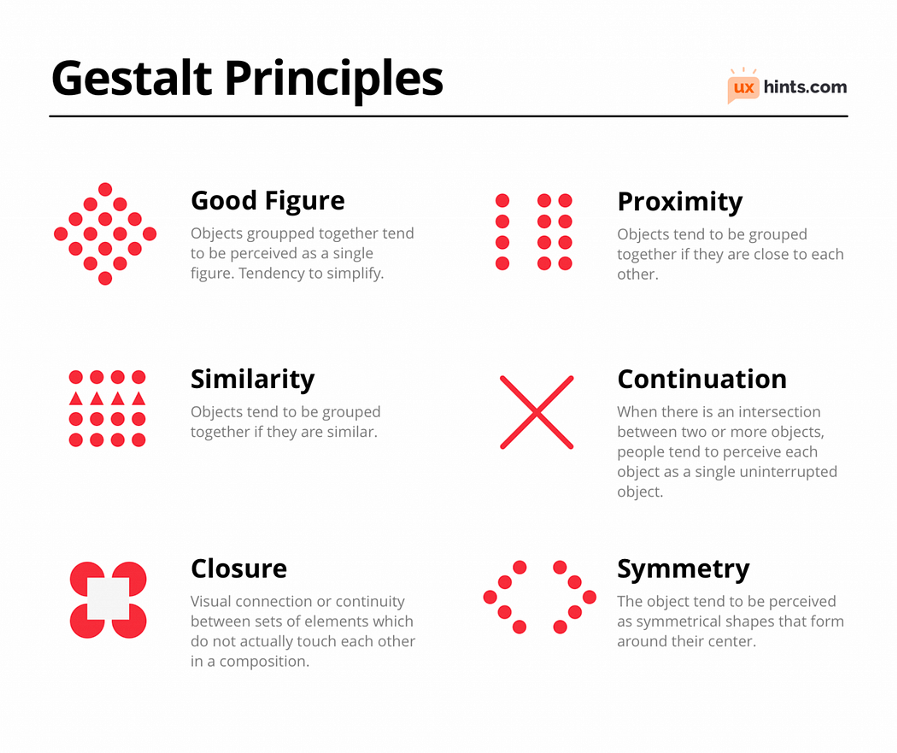

## 🧠 Principles of Perception in Data Visualization

Visual perception is how the human brain processes and interprets visual stimuli. Leveraging perceptual psychology, especially **Gestalt principles**, helps create visuals that are more **intuitive**, **meaningful**, and **easier to understand**.

### 🔹 Gestalt Principles

1. **Proximity**: Items placed close together are perceived as related.
   *📊 Example*: Clusters in a scatter plot represent grouped data.

2. **Similarity**: Objects with similar shapes, colors, or sizes are grouped mentally.
   *📊 Example*: Same-colored lines in a line graph are seen as part of one group.

3. **Closure**: Viewers tend to fill in missing elements to perceive a complete image.
   *📊 Example*: Dashed lines are still interpreted as continuous trends.

4. **Continuity**: Viewers follow visual paths, curves, or lines naturally.
   *📊 Example*: Line charts or flow diagrams rely on this principle to show trends.

---

### 🔹 Visual Hierarchy

It ensures that important information catches attention first, using:

* **Size**: Bigger elements appear more significant.
* **Color & Contrast**: Brighter or contrasting colors draw focus.
* **Position**: Top or center placement receives priority in visual scanning.

---

### 🔹 Pre-attentive Attributes

These are features the brain processes instantly without conscious effort:

* **Color**: Use red for alerts, green for growth.
* **Size**: Larger icons indicate importance.
* **Shape**: Unusual shapes grab attention.
* **Orientation**: Tilted or rotated elements stand out.

---

## 🎨 Principles of Colour in Data Visualization

### 🔹 Colour Theory Basics

* **Hue**: Base color (red, blue, yellow) – ideal for **categorical data**.
* **Saturation**: Intensity of color – high saturation = high visibility.
* **Brightness**: Lightness or darkness – used for showing magnitude in **heatmaps**.

### 🔹 Types of Colour Schemes

1. **Sequential**: Gradient scale for ordered data (light to dark).
2. **Diverging**: Two contrasting hues with a neutral midpoint (e.g., temperature maps).
3. **Categorical**: Distinct colors for separate groups (used in pie/bar charts).

### 🔹 Colour Accessibility (Colour Blindness)

* Use **high contrast** color combinations (e.g., blue-yellow, not red-green).
* Incorporate **patterns or textures** alongside color.
* Use **color blindness simulators** to test visuals for accessibility.

---

## ✏️ Principles of Design in Data Visualization

### 🔹 Simplicity and Clarity

* Avoid clutter. Eliminate unnecessary gridlines or chartjunk.
* Use **clear labels, concise legends, and minimalist design**.
* Ensure that the chart **communicates the message at a glance**.

### 🔹 Balance and Alignment

* **Balance**: Distribute visual weight evenly across the layout.
* **Alignment**: Ensure charts, text, and labels are organized and aligned for flow.

### 🔹 Consistency

* Keep **fonts, colors, and shapes consistent** across charts.
* Repeating visual elements helps build pattern recognition and understanding.

### 🔹 Emphasis and Focus

* Highlight key insights using **bold colors, large font sizes, or distinct shapes**.
* De-emphasize background or less important data using muted tones or transparency.

---

## 🔍 Principles of Evaluation in Data Visualization

### 🔹 Usability Testing

* Real users test visualizations to see if they can find patterns or extract insights.
* Helps identify confusing layouts, misleading scales, or hidden insights.

### 🔹 Heuristic Evaluation

* Experts assess visuals using guidelines like:

  * Avoid 3D if it distorts interpretation.
  * Ensure text is readable without zooming.
  * Avoid unnecessary animations or effects.

### 🔹 Feedback and Iteration

* Use surveys, observations, or interviews to collect feedback.
* Iterate and improve the visualization based on user insights.

### 🔹 Effectiveness Metrics

* **Quantitative**: Time to find info, error rate.
* **Qualitative**: User satisfaction, perceived clarity.

> *Example*: A dashboard that reduces decision-making time by 30% indicates successful visualization.

---

## 🔄 Integrating All Principles: Creating Effective Visualizations

To design impactful data visuals:

1. **Understand the Audience**: Tailor the visual complexity and content to the target user (executive vs. analyst).
2. **Select the Right Tools and Techniques**:

   * Bar chart → category comparison
   * Line chart → time series
   * Heatmap → intensity
   * PCA → reduce high-dimensional data
3. **Continuous Improvement**: Collect feedback regularly, monitor performance, and revise visuals.

---

## ✅ Summary Table

| Principle      | Key Focus                      | Application Example                       |
| -------------- | ------------------------------ | ----------------------------------------- |
| **Perception** | Visual grouping & hierarchy    | Use proximity and size to guide attention |
| **Colour**     | Emphasis, distinction, emotion | Use sequential gradient for heatmaps      |
| **Design**     | Layout, clarity, readability   | Align charts, use consistent fonts/colors |
| **Evaluation** | Usability, feedback, metrics   | Run A/B tests, track decision accuracy    |

