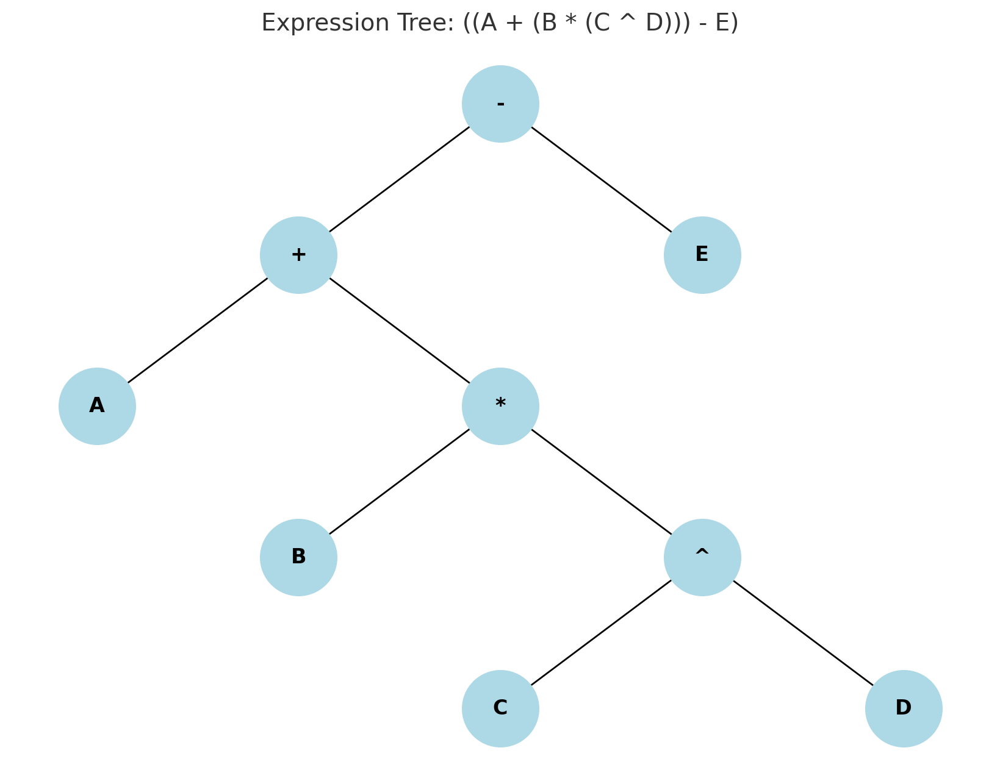

## Precedence Table (C/Java)


## ✅ **Operator Precedence Table**

| **Precedence** | **Operator**    | **Description**                                   | **Associativity**                          |               |               |
| -------------- | --------------- | ------------------------------------------------- | ------------------------------------------ | ------------- | ------------- |
| 1              | `()`            | Parentheses (function call)                       | ==Left-to-Right==                              |               |               |
|                | `[]`            | Array Subscript (Square Brackets)                 |                                            |               |               |
|                | `.`             | Dot Operator                                      |                                            |               |               |
|                | `->`            | Structure Pointer Operator                        |                                            |               |               |
|                | `++`, `--`      | Postfix increment, decrement                      |                                            |               |               |
| 2              | `++`, `--`      | Prefix increment, decrement                       | **Right-to-Left**                              |               |               |
|                | `+`, `-`        | Unary plus, minus                                 |                                            |               |               |
|                | `!`, `~`        | Logical NOT, Bitwise complement                   |                                            |               |               |
|                | `(type)`        | Cast Operator                                     |                                            |               |               |
|                | `*`             | Dereference Operator                              |                                            |               |               |
|                | `&`             | Addressof Operator                                |                                            |               |               |
|                | `sizeof`        | Determine size in bytes                           |                                            |               |               |
| 3              | `*`, `/`, `%`   | Multiplication, division, modulus                 | ==Left-to-Right==                              |               |               |
| 4              | `+`, `-`        | Addition, subtraction                             | ==Left-to-Right==                              |               |               |
| 5              | `<<`, `>>`      | Bitwise shift left, Bitwise shift right           | ==Left-to-Right==                              |               |               |
| 6              | `<`, `<=`       | Relational less than, less than or equal to       | ==Left-to-Right==                              |               |               |
|                | `>`, `>=`       | Relational greater than, greater than or equal to |                                            |               |               |
| 7              | `==`, `!=`      | Relational is equal to, is not equal to |            ==Left-to-Right==                              |               |               |
| 8              | `&`             | Bitwise AND                                       | ==Left-to-Right==                              |               |               |
| 9              | `^`             | Bitwise exclusive OR                              | ==Left-to-Right==                              |               |               |
| 10             | `\|`              |  Bitwise inclusive OR                           | ==Left-to-Right== |               |
| 11             | `&&`            | Logical AND                                       | ==Left-to-Right==                              |               |               |
| 12             | `\|\|`             |    Logical OR                                                                                   | ==Left-to-Right== |
| 13             | `?:`            | Ternary conditional                               | **Right-to-Left**                              |               |               |
| 14             | `=` | Assignment                                        | **Right-to-Left**                              |               |               |
|                | `+=`, `-=`      | Addition, subtraction assignment               |                                            |               |               |
|                | `*=`, `/=`      | Multiplication, division assignment               |                                            |               |               |
|                | `%=`, `&=`      | Modulus, bitwise AND assignment                   |                                            |               |               |
|                | `^=`, `\|=`                                                       | Bitwise exclusive, inclusive OR assignment
|                | `<<=`, `>>=`    | Bitwise shift left, right assignment              |                                            |               |               |
| 15             | `,`             | Comma (expression separator)                      | ==Left-to-Right==                              |               |               |

---


### 🧠 Tips:

* **Parentheses** `()` override everything.
* **Right to Left** associativity is important for things like exponentiation and assignment.
* Exponentiation is not always supported in all languages as `^`; in Python, it’s `**`.


---

## Associativity

Associativity is used in **infix-to-postfix conversion** and **expression evaluation** when two operators have the **same precedence**. It defines **which one should be applied first**.

---

## 🧠 **Associativity Rules**

| Operator | Associativity | Example     | Evaluation Direction |
| -------- | ------------- | ----------- | -------------------- |
| `+`, `-` | Left-to-right | `A - B - C` | `(A - B) - C`        |
| `*`, `/` | Left-to-right | `A / B * C` | `(A / B) * C`        |
| `^`      | Right-to-left | `A ^ B ^ C` | `A ^ (B ^ C)`        |

---

## 🔁 Where Associativity is Used

In the **Shunting Yard algorithm** (infix ➝ postfix), associativity is used **when comparing the top of the stack** with the current operator.

### ✨ Logic:

```text
While stack is not empty AND
    (
      (top has higher precedence)
      OR
      (top has equal precedence AND associativity is LEFT)
    )
→ pop from stack to output
```

---

## ✅ Examples

### 🔸 Left-to-Right Associativity (e.g., `-` and `/`)

#### ➤ Expression: `A - B - C`

| Token | Stack | Output    | Action                                       |
| ----- | ----- | --------- | -------------------------------------------- |
| A     |       | A         | Operand                                      |
| -     | -     | A         | Operator → stack                             |
| B     | -     | A B       | Operand                                      |
| -     | -     | A B -     | Second `-`, pop previous (same prec, L-to-R) |
| C     | -     | A B - C   | Operand                                      |
| End   |       | A B - C - | Final pop                                    |

**Postfix**: `A B - C -`

---

### 🔸 Right-to-Left Associativity (e.g., `^`)

#### ➤ Expression: `A ^ B ^ C`

| Token | Stack | Output    | Action                                              |
| ----- | ----- | --------- | --------------------------------------------------- |
| A     |       | A         | Operand                                             |
| ^     | ^     | A         | Operator → stack                                    |
| B     | ^     | A B       | Operand                                             |
| ^     | ^ ^   | A B       | Second `^` (same prec, but R-to-L) → **do not pop** |
| C     | ^ ^   | A B C     | Operand                                             |
| End   |       | A B C ^ ^ | Final pop                                           |

**Postfix**: `A B C ^ ^`

---

### 🔸 Mixed Example: `A + B * C ^ D - E`

* `^` (right), `*` (left), `+`, `-` (left)

**Postfix**: `A B C D ^ * + E -`

---

## ✅ Summary

| Precedence | Operators | Associativity | Action if same precedence |
| ---------- | --------- | ------------- | ------------------------- |
| 1          | `+`, `-`  | Left-to-right | Pop and then push         |
| 2          | `*`, `/`  | Left-to-right | Pop and then push         |
| 3          | `^`       | Right-to-left | Push directly             |

---

Here’s how **parentheses (brackets)** would look for each of the 3 examples to reflect their **associativity** and **precedence**:

---

### 🔸 1. `A - B - C`

**Associativity:** Left to Right
**Evaluated as:** `(A - B) - C`
**Postfix:** `A B - C -`

---

### 🔸 2. `A ^ B ^ C`

**Associativity:** Right to Left
**Evaluated as:** `A ^ (B ^ C)`
**Postfix:** `A B C ^ ^`

---

### 🔸 3. `A + B * C ^ D - E`

**Mixed Precedence & Associativity:**

* `^` (highest, right)
* `*` (middle, left)
* `+`, `-` (lowest, left)

**Evaluated as:** `((A + (B * (C ^ D))) - E)`
**Postfix:** `A B C D ^ * + E -`



---

## About the precedence of `^` (==Bit Operator (in C, Java, Javascript etc.)== vs ==Exponential (in Maths)==) : 

> Here in the above table ==^== has less precedence that + and ==*== . But it can have more precedence than that of ==+== and ==*== . Is'nt it?  

Yes, correct. **For C/C++ and JavaScript**, where `^` is:

* **Bitwise XOR**, not exponentiation
* Has **lower precedence than `*` and `+`**
* Is **left-to-right associative**

---

### ✅ Infix-to-Postfix (Math vs Programming Contexts):

| Context                      | `^` means      | Precedence | Associativity        |
| ---------------------------- | -------------- | ---------- | -------------------- |
| **Math** (e.g., calculators) | Exponentiation | Highest    | **Right to Left** 🔁 |
| **C / C++ / JavaScript**     | Bitwise XOR    | **Low**    | Left to Right        |

---

### So to clarify:

If you're writing an **infix to postfix converter** for **mathematical expressions**:

* Treat `^` as **exponentiation**, with highest precedence and **right associativity**

If you're writing for **C/C++ syntax parsing**:

* Treat `^` as **bitwise XOR**, with lower precedence than `*`, `/`, `+`, etc.

---

### For example:

Since an expressions like `A + B * C ^ D`, it looks **mathematical**, so:

* Use:

  ```
  Precedence:    ^ > * = / > + = -
  Associativity: ^ → Right-to-left, others → Left-to-right
  ```

If its given C or Java like programming language. Consider `^` has lesser precedence. Since `^` is considered a bit wise operator in programming language.  