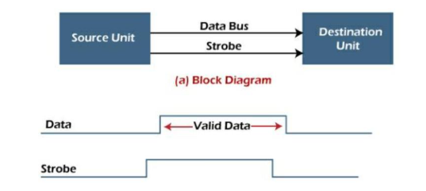

## 🛰️ Asynchronous Data Transfer – Detailed Note

### 📌 Definition

**Asynchronous data transfer** is a mode of communication where **data is transferred between two units without a shared clock signal**. Each device operates on its own clock, making them **independent** in timing. To coordinate the data transfer, **control signals** are used.

---

### 📖 Key Concept

* In **synchronous transfer**, sender and receiver operate on the **same clock**.
* In **asynchronous transfer**, both units have **independent internal clocks**, so coordination is handled using **strobe or handshake signals**.

---

### 💡 Real-World Examples

* **Emails**, **forums**, and **letters** (non-instant, no constant synchronization)
* **CPU and I/O device communication**
* **Peripheral devices** like printers, external storage drives

---

## 🧩 Techniques of Asynchronous Data Transfer

There are **two primary methods** to manage asynchronous communication:

---

### 1. 🕹️ Strobe Control Method

In this technique, a **single control line called the strobe** coordinates the transfer. It works in two ways:

#### a. Source-Initiated Strobe

* **Source** places data on the bus.
* Sends a **strobe pulse** to signal data is ready.
* **Destination** reads data on **falling edge** of strobe.
* Source **removes strobe** and clears data bus.

📌 *Use case:* CPU writing to memory.

This diagram illustrates a **Strobe Control Method** used for **data transfer synchronization** between a **source unit** and a **destination unit** in asynchronous communication systems.

---

### 🔹 (a) Block Diagram:

* **Source Unit**: Sends the data.
* **Destination Unit**: Receives the data.
* **Data Bus**: Carries the actual data bits.
* **Strobe Line**: A control line used to indicate when valid data is available on the data bus.

---

### 🔹 Timing Diagram:

#### ➤ **Data Line**:

* Carries the **data value** to be transferred.
* The data is considered **valid** for reading when the strobe signal is active.

#### ➤ **Strobe Line**:

* The **strobe signal** acts as a **control pulse**.
* When the **strobe is HIGH**, it signals to the destination unit that the data on the bus is **valid and ready to be read**.
* After the strobe pulse goes LOW, the source may change the data.

---

### 🔍 Purpose:

The **strobe method** helps in:

* **Synchronizing data transfers** in systems without a shared clock.
* Ensuring that the destination unit reads the **correct and stable data**.

---

### ✅ Summary:

| Component      | Role                                                        |
| -------------- | ----------------------------------------------------------- |
| Data Bus       | Carries data from source to destination                     |
| Strobe Signal  | Indicates when the data on the bus is valid and can be read |
| Timing Diagram | Shows data validity window during strobe HIGH               |

#### b. Destination-Initiated Strobe

* **Destination** sends strobe pulse to request data.
* **Source** places data on bus.
* Destination reads data and **turns off strobe**.
* Source clears data bus after confirmation.

📌 *Use case:* CPU reading from memory.

#### 🔁 Limitation of Strobe Method

* No way to **confirm** if data was received correctly.
* No **feedback mechanism**; can lead to data loss or conflict.

---

### 2. 🤝 Handshaking Method

Handshaking introduces **two control signals** to ensure safe and verified transfer:

#### Signals Used:

| Signal Name    | Direction            | Purpose                                 |
| -------------- | -------------------- | --------------------------------------- |
| **Data Valid** | Source → Destination | Indicates valid data is on the bus      |
| **Ready/Ack**  | Destination → Source | Indicates data is received and accepted |

#### a. Source-Initiated Transfer (Master-Slave)

* Source places data and asserts **Data Valid**
* Destination checks and replies with **Ready**
* Data is read, and both signals are deactivated

#### b. Destination-Initiated Transfer

* Destination sends **Ready** signal
* Source places data and asserts **Data Valid**
* Destination reads data and both signals are deactivated

📌 *Use case:* USB communication, device-to-device file transfer

---

### ✅ Advantages of Asynchronous Data Transfer

1. **Flexibility**: Devices communicate at their own speed
2. **Simple Receiver Design**: No need for complex synchronization logic
3. **Fault Isolation**: Corruption in one character doesn’t affect others
4. **Efficient for sporadic data**: Best suited for devices generating data irregularly (e.g., keyboard)

---

### ❌ Disadvantages of Asynchronous Data Transfer

1. **Overhead of control bits**: Start, stop, and parity bits consume bandwidth
2. **Susceptible to noise**: Start bit errors may corrupt data
3. **Slower transfer rate**: Due to added signaling and wait time
4. **No synchronization**: Can’t handle high-throughput continuous data streams efficiently

---

### 📊 Comparison Table – Strobe vs Handshaking

| Feature            | Strobe Control        | Handshaking               |
| ------------------ | --------------------- | ------------------------- |
| Control Lines      | One                   | Two                       |
| Feedback Mechanism | No                    | Yes                       |
| Complexity         | Simple                | More complex              |
| Reliability        | Less reliable         | More reliable             |
| Use Case           | Simple CPU-memory ops | Device communication, USB |

---

### 🔁 Summary

* **Asynchronous data transfer** is essential where synchronization between sender and receiver is not guaranteed.
* It ensures **safe data transmission** between independently clocked devices using **strobe** or **handshake protocols**.
* While slower than synchronous methods, it's widely used in I/O communication, peripherals, and real-world asynchronous systems.
