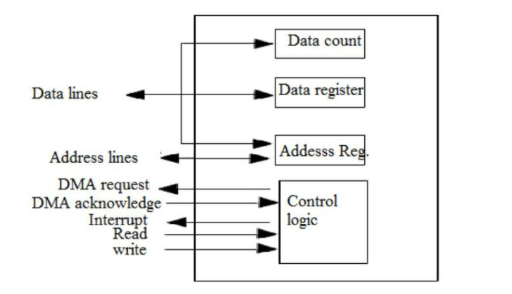
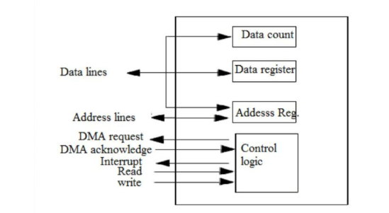

## 📌 Direct Memory Access (DMA) – Detailed Note

### 🔍 Definition:

**Direct Memory Access (DMA)** is a high-performance method used to transfer data **directly between memory and I/O devices** without **continuous CPU involvement**. A specialized hardware component known as the **DMA controller** manages this process, enabling faster data movement and freeing up the CPU to perform other tasks.

---

### 🧠 Why DMA?

In traditional I/O data transfer using programmed or interrupt-driven I/O, the CPU is involved in **each byte or word transfer**, making it inefficient for large blocks of data. DMA overcomes this limitation by **offloading the data transfer responsibility to the DMA controller**.

---

### 🧱 DMA Controller Components:

The DMA controller typically includes:

* **Address Register**: Holds the memory address for the next data transfer.
* **Count Register**: Tracks the number of bytes/words to transfer.
* **Control Logic**: Manages direction (read/write), mode of transfer, and handshaking with CPU.
* **Status Register**: Indicates completion or errors.

It also connects to:

* **Memory Bus**
* **I/O Devices**
* **CPU (via Bus Request/Grant lines)**

---

### ⚙️ Working of DMA:

1. **CPU Initiates Transfer**:

   * Sets up the DMA controller with:

     * Starting memory address
     * Data block size (count)
     * Transfer direction (to/from memory)
   * Issues a signal to start the DMA.

2. **Bus Arbitration**:

   * DMA requests control of the system bus by sending a **Bus Request (BR)**.
   * CPU acknowledges with a **Bus Grant (BG)** and becomes idle (bus relinquished).

3. **DMA Transfers Data**:

   * Acts as bus master.
   * Transfers data directly between memory and I/O device.
   * After each transfer, count is decremented and address is incremented.

4. **Completion**:

   * DMA sends an **interrupt** to the CPU to indicate transfer completion.
   * CPU resumes bus control and program execution.

---

### 🔁 DMA Transfer Modes:

#### a) 🚀 Burst Mode (Block Transfer)

* Entire block is transferred in one go.
* CPU is locked out until transfer completes.
* **Fastest** but **least cooperative** with CPU.

#### b) 🔄 Cycle Stealing Mode

* DMA transfers **one byte/word at a time**.
* CPU access is paused only briefly.
* Efficient for multitasking systems.

#### c) 🫥 Transparent Mode

* DMA operates **only when CPU is not using the bus**.
* Slowest but **non-intrusive** to CPU tasks.

---

### 📊 Comparison of DMA Modes:

| Mode             | CPU Interruption | Speed    | Use Case                          |
| ---------------- | ---------------- | -------- | --------------------------------- |
| Burst Mode       | High             | Fastest  | Large file or memory transfer     |
| Cycle Stealing   | Moderate         | Balanced | Real-time systems                 |
| Transparent Mode | None             | Slowest  | Background low-priority transfers |

---

### ✅ Advantages of DMA:

* **High-speed data transfer** without CPU bottleneck.
* **CPU is free** to execute other tasks during transfer.
* Ideal for **bulk data** movement (e.g., disk to memory, video buffering).
* **Reduces instruction overhead** and improves system throughput.

---

### ❌ Disadvantages of DMA:

* Can lead to **cache coherence issues**, especially in systems with memory caches.
* Requires **extra hardware (DMA controller)**, increasing system **cost and complexity**.
* Needs careful **bus arbitration** logic to avoid resource conflicts.

---

### 🧷 Real-World Use Cases:

* Audio/Video streaming devices
* Disk file systems (SSD/HDD transfers)
* Graphics rendering (Frame buffer transfers)
* Network card data buffering

---

### 🧠 Summary:

| Feature         | DMA                                |
| --------------- | ---------------------------------- |
| CPU Involvement | Only at start and end              |
| Speed           | Very fast                          |
| Efficiency      | High                               |
| Modes           | Burst, Cycle Stealing, Transparent |
| Key Benefit     | Frees CPU, fast data movement      |

DMA plays a **critical role in modern high-speed computing systems**, where CPU efficiency and real-time data transfers are essential.

---

This is a **block diagram of a DMA (Direct Memory Access) Controller**, which enables high-speed data transfer between I/O devices and memory **without CPU involvement**.

---

### 🔹 Components Explained:

1. **Data Lines**
   → Carry the actual data between memory and I/O devices.

2. **Address Lines**
   → Used to specify the memory address for the data transfer.

3. **Control Signals**

   * **DMA Request**: Signal from I/O device to request DMA service.
   * **DMA Acknowledge**: Signal from DMA controller granting permission to transfer data.
   * **Interrupt**: Sent to the CPU after completion of data transfer.
   * **Read / Write**: Control whether to read from or write to memory.

---

### 🔹 Internal Blocks:

1. **Data Register**
   → Temporarily holds data during transfer.

2. **Address Register**
   → Holds the memory address where data will be read from or written to.

3. **Data Count**
   → Keeps track of how many data words/bytes are yet to be transferred.

4. **Control Logic**
   → The brain of the DMA controller; manages all coordination:

   * Reads control signals from CPU.
   * Initiates transfers.
   * Updates count and address after each byte.
   * Generates interrupt when transfer completes.

---

### 🔄 How It Works (Simplified):

1. CPU sets up DMA by writing to address, data count, and control.
2. I/O device sends a **DMA Request**.
3. DMA Controller sends **DMA Acknowledge** and takes control of buses.
4. It moves data via **Data Register**, updates **Address** and **Count**.
5. On completion, it raises **Interrupt** to inform CPU.

---

This architecture enables efficient bulk data transfers (like disk-to-memory), reducing CPU load significantly.
