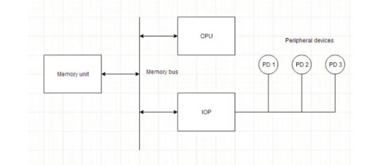

## 📘 Input-Output Processor (IOP)

### 🔍 Introduction:

An **Input-Output Processor (IOP)** is a specialized processor that **manages I/O operations independently** from the CPU. It reduces CPU burden by **offloading I/O tasks**, enabling faster and more efficient system performance.

---

### 🧠 Key Features of IOP:

* IOPs can **access main memory directly**.
* They execute **only I/O-related instructions**, unlike CPUs that execute general-purpose instructions.
* IOPs have their **own local control unit**, **registers**, and may have a **small instruction set** tailored for I/O.

---

### 📊 IOP-Based System Architecture (based on the image):

```
          +--------------------+       
          |    Peripheral      |       
          |     Devices        |       
          +---+---+---+--------+       
              |   |   |                
             PD1 PD2 PD3               
              |   |   |                
              v   v   v                
         +----------------+            
         |      IOP       | <---+       
         +----------------+     | I/O Bus
                  |             |       
                  v             |       
         +----------------+     |       
         |  Memory Bus    |<----+       
         +----------------+             
                  ^                     
                  |                     
          +----------------+            
          |      CPU       |            
          +----------------+            
```

---

### ⚙️ How IOP Works:

1. **CPU Initialization**:

   * CPU loads the address of the **I/O command block** into the IOP.
   * This command block contains:

     * Operation type (read/write)
     * Device ID
     * Memory buffer address
     * Word count

2. **Independent Execution**:

   * Once initialized, the IOP **executes the I/O instructions independently**, without CPU intervention.
   * Data is transferred between memory and peripheral devices directly.

3. **Completion Signal**:

   * On finishing the task, IOP sends an **interrupt signal** to the CPU.

---

### 📂 Instructions Used in IOP:

* **I/O Start**: Begin I/O operation.
* **Device Select**: Choose the correct device.
* **Read/Write**: Transfer data from/to memory.
* **Status Check**: Determine if the device is ready.

---

### 🧭 Comparison with CPU:

| Feature         | CPU                    | IOP                       |
| --------------- | ---------------------- | ------------------------- |
| Purpose         | Executes full programs | Executes I/O tasks only   |
| Instruction Set | General-purpose        | I/O-specific              |
| Memory Access   | Full access            | Only for I/O blocks       |
| Speed           | High (computational)   | Lower (for device sync)   |
| Control         | Main controller        | Subordinate or slave unit |

---

### ✅ Advantages of Using IOP:

* **Parallelism**: CPU and IOP can run simultaneously.
* **Efficient I/O Handling**: No CPU blocking for slow I/O.
* **System Scalability**: Supports multiple devices effectively.
* **Faster I/O Operations**: Especially in complex or large systems.

---

### ❌ Disadvantages:

* **Increased Hardware Cost**: Extra processor and logic.
* **Software Complexity**: IOP command programming needed.
* **Resource Coordination**: More complex interrupt and memory arbitration.

---

### 📌 Use Case Scenarios:

* **Mainframes and Minicomputers**
* **Disk/File Servers**
* **Real-Time Systems**
* **Embedded Systems with Complex I/O**

---

### 🧠 Summary:

* IOPs provide **dedicated I/O handling** capability.
* They operate **concurrently with the CPU**.
* IOPs are programmed via **command words** stored in memory.
* Their use leads to **improved CPU utilization and faster system response**.

