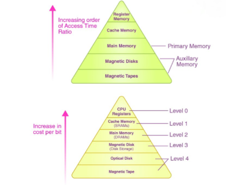

## 🧠 Memory Hierarchy in Computer Architecture

Memory hierarchy is a structured arrangement of storage systems in a computer, designed to provide a balance between **speed, cost, and capacity**. It organizes memory in levels, ranging from the **fastest but smallest and most expensive** at the top, to the **slowest but largest and cheapest** at the bottom.

### 📊 Pyramid Structure:

```
         Fastest / Most Expensive / Smallest
           -----------------------------
           |  Level 0: CPU Registers     |
           |  Level 1: Cache Memory      |
           |  Level 2: Main Memory (RAM) |
           |  Level 3: Secondary Memory  |
           |  Level 4: Tertiary Storage  |
           -----------------------------
         Slowest / Cheapest / Largest
```

---

## 🔢 Hierarchy Levels Explained

### **0️⃣ Level 0 – CPU Registers**

* Located inside the CPU.
* **Fastest** memory with access time of **2–5 ns**.
* Very **small size** (< 1 KB).
* Implemented using **flip-flops**.
* Stores intermediate data and instructions during computation.
* **Controlled by:** Compiler

---

### **1️⃣ Level 1 – Cache Memory**

* Located close to or within CPU.
* Access time: **3–10 ns**.
* Stores frequently accessed instructions/data.
* Size: \~**4 MB** or less.
* Implemented using **static RAM (SRAM)**.
* Divided into L1, L2, L3 levels.
* **Controlled by:** Hardware

---

### **2️⃣ Level 2 – Main Memory (Primary Memory or RAM)**

* Communicates directly with CPU and secondary storage.
* Access time: **80–400 ns**.
* Size: \~**2 GB** or more.
* Implemented using **dynamic RAM (DRAM)**.
* Stores data and programs in execution.
* **Controlled by:** Operating System

---

### **3️⃣ Level 3 – Secondary Memory**

* Devices like **Hard Disk Drives (HDDs)**, **Solid-State Drives (SSDs)**.
* Slower than RAM, but offers persistent storage.
* Access time: \~**5 ms**.
* Size: **>2 GB to several TBs**.
* Used for permanent data storage.
* **Controlled by:** OS or User

---

### **4️⃣ Level 4 – Tertiary Storage**

* Includes **magnetic tapes**, **optical disks**, backup drives.
* **Slowest**, but **largest** and **cheapest**.
* Used for archival, removable media.
* Size: **1–20 TB or more**.
* Access is manual or robotic.
* **Controlled by:** User or OS

---

## 📈 Comparison Table

| Memory Level     | Bandwidth   | Size   | Access Time | Controlled By    |
| ---------------- | ----------- | ------ | ----------- | ---------------- |
| Registers        | 4K–32K MB/s | < 1 KB | 2–5 ns      | Compiler         |
| Cache            | 800–5K MB/s | < 4 MB | 3–10 ns     | Hardware         |
| Main Memory      | 400–2K MB/s | < 2 GB | 80–400 ns   | Operating System |
| Secondary Memory | 4–32 MB/s   | > 2 GB | \~5 ms      | User or OS       |
| Tertiary Storage | < 4 MB/s    | > 1 TB | > 100 ms    | User             |

---

## 🧮 Usage & Importance

* Used to **optimize system performance** by minimizing latency and maximizing data availability.
* **Registers and Cache** speed up computation.
* **Main memory** holds active processes.
* **Secondary storage** stores OS, apps, and user files.
* **Tertiary memory** handles backups and archives.

---

## 🛠️ Role in System Design

* A well-designed memory hierarchy **bridges the CPU-memory speed gap**.
* Cache hierarchies are expanded to reduce latency.
* DRAM bandwidth is optimized for frequent access patterns.
* SSDs and HDDs are used for persistent but slower access.

---




This image illustrates the **Memory Hierarchy in Computer Architecture** using two pyramids:

---

### 🟢 Top Pyramid – **Access Time Hierarchy**

* This shows **increasing access time** as you move from **top (fastest)** to **bottom (slowest)**:

  ```
  ↑ Faster Access
  | Register Memory (Fastest)
  | Cache Memory
  | Main Memory
  | Magnetic Disks
  | Magnetic Tapes (Slowest)
  ↓ Slower Access
  ```
* **Register Memory** is the fastest (few nanoseconds), while **Magnetic Tapes** are the slowest (milliseconds or more).
* **Primary Memory** includes Register, Cache, and Main Memory.
* **Auxiliary Memory** includes Magnetic Disks and Tapes, used for bulk and backup storage.

---

### 🟣 Bottom Pyramid – **Cost per Bit and Hierarchical Levels**

* This shows **increasing cost per bit** and **memory levels (0–4)**:

  ```
  ↑ Higher Cost per Bit
  | Level 0: CPU Registers (Most expensive, smallest)
  | Level 1: Cache Memory (SRAMs)
  | Level 2: Main Memory (DRAMs)
  | Level 3: Magnetic Disk
  | Level 4: Optical Disk, Magnetic Tape (Cheapest, largest)
  ↓ Lower Cost per Bit
  ```

* Higher levels (closer to CPU) are **faster but costlier** and **smaller** in size.

* Lower levels are **slower but cheaper** and **larger** in capacity.

---

### 📌 Summary:

* **Top pyramid** → Focus on **speed (access time)**
* **Bottom pyramid** → Focus on **cost and size**
* Together, they highlight the **trade-off between speed, cost, and capacity**, which is essential in system design.
