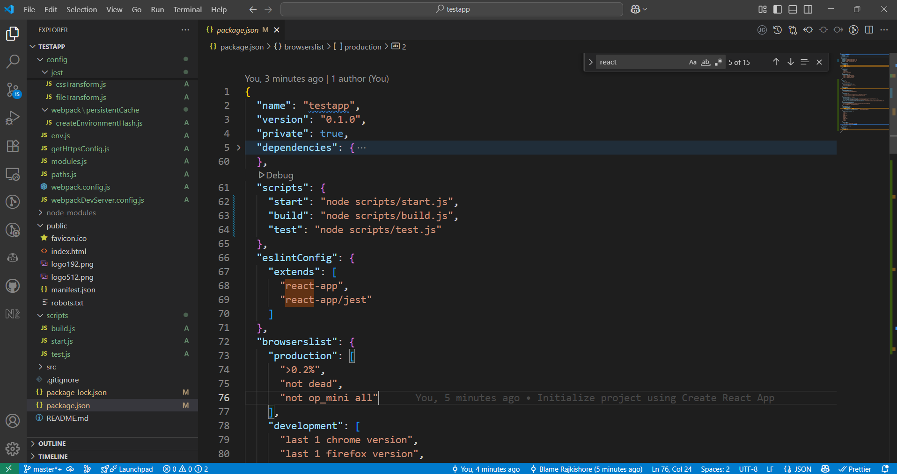

### 🧠 First Things First: Why Use Webpack With React?

While tools like **Create React App (CRA)** hide Webpack config under the hood, setting it up manually gives you **full control** over:

* Bundle size
* Code splitting
* Custom plugins/loaders
* Advanced optimizations
* Integration with monorepos or Module Federation

It’s a bit of work upfront, but worth it if you want a finely-tuned setup — or just want to **understand what’s going on behind the scenes**.

---

### 📦 Basic React + Webpack Setup (What You Actually Need)

#### ✅ 1. **Install Dependencies**

```bash
npm install react react-dom
npm install --save-dev webpack webpack-cli webpack-dev-server
npm install --save-dev babel-loader @babel/core @babel/preset-env @babel/preset-react
npm install --save-dev html-webpack-plugin
```

---

#### 🛠️ 2. **Babel Config (`.babelrc`)**

Babel will convert JSX and modern JS to something browsers understand.

```json
{
  "presets": ["@babel/preset-env", "@babel/preset-react"]
}
```

---

#### 📁 3. **Folder Structure (Minimal Setup)**

```
my-app/
├── public/
│   └── index.html
├── src/
│   └── index.jsx
├── webpack.config.js
└── .babelrc
```

---

#### ⚙️ 4. **Webpack Config**

```js
const path = require('path');
const HtmlWebpackPlugin = require('html-webpack-plugin');

module.exports = {
  entry: './src/index.jsx',
  output: {
    path: path.resolve(__dirname, 'dist'),
    filename: 'bundle.[contenthash].js',
    clean: true
  },
  module: {
    rules: [
      {
        test: /\.(js|jsx)$/,
        exclude: /node_modules/,
        use: 'babel-loader'
      }
    ]
  },
  resolve: {
    extensions: ['.js', '.jsx']
  },
  plugins: [
    new HtmlWebpackPlugin({
      template: './public/index.html'
    })
  ],
  devServer: {
    static: './dist',
    open: true,
    hot: true,
    port: 3000
  },
  mode: 'development'
};
```

---

### 🧪 What Happens When You Run Webpack?

* Webpack starts from `index.jsx` (your entry)
* Babel transpiles JSX and ES6+ to browser-friendly JS
* Webpack bundles it and injects the result into your `index.html` using `HtmlWebpackPlugin`
* `webpack-dev-server` spins up a local server for fast dev with hot reload

---

### 🚀 Additions for a Real Project

Once you're up and running, you can add:

* **CSS/SASS support** (`style-loader`, `css-loader`, `sass-loader`)
* **Asset loading** (images, fonts using `asset/resource`)
* **Code splitting** with dynamic `import()`
* **React Refresh** for instant component reloads
* **TypeScript support** via `ts-loader` or Babel

---

### 📝 Summary

| Step                  | What It Does                           |
| --------------------- | -------------------------------------- |
| Babel                 | Transpiles JSX and modern JS           |
| Webpack               | Bundles everything for the browser     |
| HtmlWebpackPlugin     | Injects bundle into your HTML          |
| webpack-dev-server    | Runs local dev server with HMR         |
| React + Webpack combo | Gives you full control and flexibility |

---

### 🎯 Final Thought

Setting up React manually with Webpack might feel like building your own kitchen — but once it’s done, you know **exactly how everything works**.

It’s great for learning, scaling big apps, or optimizing builds for performance.

---

> Q. What is `craco` then?


## 🛠️ What is CRACO?

**CRACO** stands for **Create React App Configuration Override**.

If you're using **Create React App (CRA)**, you probably know it gives you a zero-config setup to start building React apps fast. But here’s the catch:

> CRA **hides Webpack config** (and Babel, ESLint, etc.) under the hood — and doesn’t let you touch it… unless you eject. 😬

And **ejecting** is a one-way street — once you do it, you get full control, but you lose the convenience and upgradability.

That’s where **CRACO** comes in.

---

### 🚪 CRACO = “Let me tweak things without ejecting”

CRACO lets you **override CRA’s internal Webpack, Babel, and other configs** — *without ejecting*.

So instead of ejecting just to:

* Add a custom Babel plugin
* Enable Tailwind CSS
* Change Webpack aliases
* Adjust PostCSS or ESLint rules

…you can use CRACO and tweak whatever you want, safely.

---

### 🔧 How It Works

1. **Install CRACO**

```bash
npm install @craco/craco
```

2. **Replace CRA scripts in `package.json`**

```json
"scripts": {
  "start": "craco start",
  "build": "craco build",
  "test": "craco test"
}
```

3. **Create a `craco.config.js` file**

```js
module.exports = {
  webpack: {
    alias: {
      '@components': path.resolve(__dirname, 'src/components/')
    }
  }
};
```

Now you have control over aliases, Babel, PostCSS, plugins, etc., without ejecting.

---

### 🧠 When to Use CRACO

Use CRACO if:

* You want to keep using CRA’s convenience
* You need small customizations to Webpack or Babel
* You want to add Tailwind, SCSS modules, Module Federation, etc., without ejecting

Don't use CRACO if:

* You're doing a full custom Webpack setup (then just skip CRA)
* You’re okay with ejecting and owning the whole config

---

### 📝 Summary

| Feature          | Description                                     |
| ---------------- | ----------------------------------------------- |
| CRACO            | Tool to override CRA config without ejecting    |
| Works With       | Webpack, Babel, ESLint, PostCSS, Tailwind, etc. |
| Safe Alternative | Yes — you can always remove it later            |
| Use Case         | Tweak CRA config with minimal effort            |

---

### 🔚 Final Thought

> Think of CRACO as a clever little backdoor into CRA's locked config — it lets you customize without blowing the whole thing up.

---

> Q. Normally webpack can be used with react then why craco ?

## 🧠 So… if Webpack works with React, why use CRACO?

You're absolutely right — **React works perfectly fine with vanilla Webpack.** In fact, you can manually set up React + Webpack from scratch, and many advanced developers do this to get full control.

But most beginners (and even many pros) start with **Create React App (CRA)** for convenience.

And here’s where **CRACO enters the picture:**

> **CRACO is only needed if you're using Create React App (CRA) and want to customize its internal Webpack setup — without ejecting.**

---

### 🔁 Side-by-Side Comparison

| Approach                         | What You Get                         | When to Use                               |
|----------------------------------|--------------------------------------|-------------------------------------------|
| **React + Webpack (custom)**     | Full control from the start          | For large apps, microfrontends, or fine-tuned builds |
| **CRA (Create React App)**       | Zero config, batteries included      | Fast setup for MVPs, learning, small projects |
| **CRA + CRACO**                  | CRA convenience + Webpack control    | When you want to tweak things (like aliases, plugins) without ejecting |

---

### 🧪 So, When Do People Reach for CRACO?

Let’s say you're using CRA and you want to:
- Add **Tailwind CSS**
- Set up **custom Webpack aliases**
- Use **Module Federation**
- Inject a Babel plugin
- Modify ESLint behavior

CRA **doesn’t let you do any of that** out of the box unless you **eject** — which dumps all of CRA’s hidden config into your repo, making upgrades harder.

> CRACO is the in-between solution:  
> ✅ Gives you control,  
> ✅ Without losing CRA’s simplicity,  
> ❌ Without going full manual Webpack.

---

### 💭 Think of It Like This:

- If CRA is a ready-made kitchen
- And custom Webpack is building your kitchen from scratch
- Then **CRACO is like installing a few custom cabinets and appliances in CRA’s kitchen — without tearing down the whole thing**

---

### 📝 Final Verdict

- You **don’t need CRACO** if you’re writing your own Webpack config from scratch.
- You **do need CRACO** if you started with CRA and want deeper config control *without ejecting*.

So it’s not “CRACO vs Webpack” — it's more like **“CRACO vs ejecting”**, *within the CRA ecosystem*.

---

> Q. What happens if one ejects CRA ?

Ah — the infamous **“eject”** command in Create React App (CRA). It sounds powerful… and it is. But it’s also something you can’t undo easily.

Here’s a **natural, developer-style breakdown** of what really happens when you run:

```bash
npm run eject
```

---

## 💥 What Happens When You Eject from CRA?

### 1. 🧱 CRA Exposes All the Hidden Config

Before ejecting, CRA hides everything under the hood:

* Webpack config
* Babel config
* ESLint rules
* PostCSS setup
* Environment variable handling
* Scripts for build/test/dev

After ejecting:

> It dumps **all of that into your project**, making it visible and editable.

You now get:

```
config/
  webpack.config.js
  webpackDevServer.config.js
scripts/
  start.js
  build.js
  test.js
```

Plus `.babelrc`, `.eslintrc`, and more.

---

### 2. 🎯 You’re No Longer Using `react-scripts`

Before eject:

```json
"scripts": {
  "start": "react-scripts start",
  "build": "react-scripts build",
  "test": "react-scripts test"
}
```

After eject:




* `react-scripts` is gone from your project
* You're now running custom scripts located inside the `scripts/` folder

This means you're now **fully responsible** for maintaining and updating your build process.

---

### 3. ⚠️ It’s One-Way

There is **no built-in “undo” for ejecting**. Once you eject, you can’t go back unless:

* You have a Git commit to roll back to
* Or you recreate the project manually

---

### 4. 🛠️ You Gain Full Control

After ejecting, you can:

* Tweak Webpack however you want
* Add custom loaders/plugins
* Adjust Babel presets
* Use advanced features like Module Federation, custom code splitting strategies, etc.

So if you really need advanced tweaks — ejecting is a valid choice.

---

### 5. 😬 But You Also Take On Maintenance Headache

The downside?

* You’re now in charge of all the complexity that CRA used to manage for you.
* Upgrading Webpack or Babel? **Your problem now.**
* CRA updates won’t help you anymore — you're on your own path.

---

### 🔁 When Should You Eject?

Only eject if:

* You’re comfortable managing Webpack/Babel configs yourself
* You need deep customization that tools like **CRACO**, **react-app-rewired**, or **custom CRA templates** can’t handle
* You’re building something advanced like a design system, federated microfrontend shell, or enterprise tooling that needs full control

---

### 📝 Summary

| Action          | Result                                          |
| --------------- | ----------------------------------------------- |
| `npm run eject` | CRA dumps all internal config into your project |
| Pros            | Full control over Webpack, Babel, ESLint        |
| Cons            | No going back, full responsibility              |
| Alternative     | Use CRACO or react-app-rewired for light tweaks |

---

### 🎯 Final Thought

> Ejecting is like graduating from “React school” — CRA stops protecting you, and you’re now the grown-up in charge of the build system.

Just be sure you need it before you hit that button. Most teams avoid it unless they **absolutely need** full control.


> Q. After ejection, is it possible to upgrade to new version of react?

Yes, you can absolutely **upgrade React itself** after ejecting — but let’s break it down carefully, because there’s a big difference between:

### ✅ **Upgrading the React library**

vs

### ⚠️ **Upgrading the full Create React App (CRA) ecosystem**

---

## ✅ 1. Upgrading React (Core Library) — Yes, Totally Fine

After ejecting, you can still upgrade **React and ReactDOM** just like any other dependency.

For example:

```bash
npm install react@latest react-dom@latest
```

That will upgrade you to the latest React version (e.g., React 18+ or newer, depending on when you're reading this).

> 💡 This is completely safe — CRA ejecting doesn’t lock you out of React itself.

---

## ⚠️ 2. Upgrading CRA (the whole toolkit) — **Not Possible After Eject**

Once you eject, you are **no longer using `react-scripts`**, which means you’ve taken ownership of:

* Webpack config
* Babel setup
* PostCSS
* ESLint
* Build and test scripts

So if CRA releases a new version with:

* Webpack 5 updates
* Better build optimization
* Enhanced TypeScript support
* New plugins

👉 You won’t automatically get those updates anymore.

You'd have to manually:

* Compare your config with the new CRA changes
* Manually update your **Webpack, Babel, ESLint** versions
* Adjust config files and plugins accordingly

This can be time-consuming — and error-prone if you don't keep track of what's changed upstream.

---

## 🛠️ What You *Can* Still Upgrade After Ejecting

| Dependency               | Can You Upgrade? | Notes                             |
| ------------------------ | ---------------- | --------------------------------- |
| `react`, `react-dom`     | ✅ Yes            | Safe and recommended              |
| `webpack`, `babel`, etc. | ✅ But manual     | You maintain them now             |
| `react-scripts`          | ❌ No longer used | You’ve ejected from it            |
| CRA templates / scripts  | ❌ Not applicable | Those are part of `react-scripts` |

---

## 🧠 TL;DR

> Ejecting doesn’t block you from using **the latest React**,
> but you’re now **manually responsible** for the entire toolchain around it.

So yes — **you can upgrade React after ejecting**, but just be prepared to **test your build and webpack configs** when doing major upgrades.

