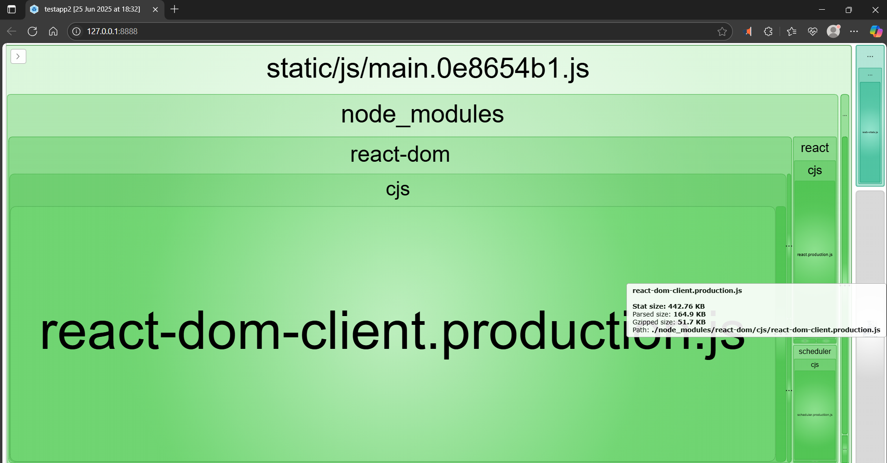

### 🧠 Why Should You Analyze Your Bundle?

Webpack is powerful, but it can **silently include way more code** than you expect.
Your app might feel sluggish or load slowly — and most of the time, it’s because your JavaScript bundle is **bloated** with:

* Entire libraries you're barely using
* Duplicate dependencies
* Huge polyfills or unused components

That’s where `webpack-bundle-analyzer` comes in.

> It gives you a **visual breakdown** of what’s inside your bundle — like a “X-ray scan” of your final production build.

---

## 🔧 Step-by-Step: How to Use `webpack-bundle-analyzer`

---

### ✅ 1. Install the Plugin

```bash
npm install --save-dev webpack-bundle-analyzer
```

---

### ✅ 2. Add It to Your Webpack Config

In `webpack.config.js`:

```js
const { BundleAnalyzerPlugin } = require('webpack-bundle-analyzer');

module.exports = {
  plugins: [
    new BundleAnalyzerPlugin()
  ]
};
```

---

### ✅ 3. Build Your App

```bash
npm run build
```

You’ll see something like this open in your browser:

```
http://127.0.0.1:8888/
```

It shows a **treemap** of your bundles, where each rectangle represents a module and its size in your final build.

---

## 🔍 What You Can Learn from the Report

### 🧱 1. **Which Packages Are the Heaviest**

If you see `moment.js` or `lodash` taking up half your bundle, it’s time to reconsider how you're importing them.

> Tip: Replace Moment with `date-fns`, or only import specific lodash functions.

---

### ♻️ 2. **Duplicate Dependencies**

If you see two copies of the same package (e.g., `react` or `core-js`), something is probably misconfigured in your dependency tree.

> This often happens in monorepos or microfrontend setups.

---

### 🧩 3. **Chunk Splitting Efficiency**

You can check:

* Are your vendors separated?
* Is lazy-loaded code in its own chunk?
* Did `SplitChunksPlugin` actually work?

---

### 📁 4. **Tree Shaking Effectiveness**

If you imported a utility file but only used one function — the rest *shouldn’t* be in your bundle.
If it is, you might not be tree shaking properly.

---

## 🧠 Advanced Options

You can configure it to generate a **static HTML report** (useful for CI/CD):

```js
new BundleAnalyzerPlugin({
  analyzerMode: 'static',
  openAnalyzer: false,
  reportFilename: 'bundle-report.html'
})
```

You can also run it separately using the CLI:

```bash
npx webpack-bundle-analyzer dist/stats.json
```

To do this, first generate the stats file:

```bash
webpack --profile --json > stats.json
```

---

### 📝 Summary

| Feature                    | What It Helps With                          |
| -------------------------- | ------------------------------------------- |
| Visual report              | See what’s taking up space in your bundle   |
| Identifies large libraries | Helps trim unused or oversized dependencies |
| Exposes duplication        | Spots repeated packages across chunks       |
| Shows tree shaking results | See what’s unused but still included        |
| Improves chunk strategy    | Confirms effective use of code splitting    |

---

### 🎯 Final Thought

> `webpack-bundle-analyzer` is one of those tools every frontend dev should have in their toolbox.
> It turns your build from a black box into something you can **understand, measure, and improve.**

---

> Q. how to check with create-react-app ?

Great question — if you're using **Create React App (CRA)** (without ejecting), Webpack is hidden under the hood. But you can **still use `webpack-bundle-analyzer`** — you just need to hook into the build process a bit differently.

---

## 🧪 How to Use `webpack-bundle-analyzer` with Create React App

There are **two main ways**, depending on whether you want to customize your CRA setup or keep it fully zero-config.

---

### ✅ **Option 1: Use `source-map-explorer` (Zero Config)**

If you're not using CRACO or ejecting, this is the fastest way:

#### 📦 Step 1: Install the tool

```bash
npm install --save-dev source-map-explorer
```

#### 🛠 Step 2: Edit your `package.json` scripts

```json
"scripts": {
  "analyze": "source-map-explorer 'build/static/js/*.js'"
}
```

#### ▶️ Step 3: Run a production build and analyze it

```bash
npm run build
npm run analyze
```

This opens a treemap view **just like webpack-bundle-analyzer**, showing what’s inside your bundle.

> CRA automatically includes source maps in production builds, so it just works.

---

### ✅ **Option 2: Use `webpack-bundle-analyzer` with CRACO or react-app-rewired**

If you want to use the real `webpack-bundle-analyzer` plugin (like in a custom Webpack setup), you’ll need to **override CRA’s config** using a tool like **CRACO**.

#### 📦 Step 1: Install dependencies

```bash
npm install --save-dev @craco/craco webpack-bundle-analyzer
```

#### 🛠 Step 2: Modify `package.json` to use CRACO

```json
"scripts": {
  "start": "craco start",
  "build": "craco build",
  "test": "craco test",
  "analyze": "ANALYZE=true craco build"
}
```

#### 🧠 Step 3: Create `craco.config.js`

```js
const { BundleAnalyzerPlugin } = require('webpack-bundle-analyzer');

module.exports = {
  webpack: {
    plugins: [
      ...(process.env.ANALYZE ? [new BundleAnalyzerPlugin()] : [])
    ]
  }
};
```

#### ▶️ Step 4: Run the analyzer

```bash
npm run analyze
```

This will build your app and open the full **webpack-bundle-analyzer** visual in the browser.

---

## 📝 Summary

| Method                    | Tool                 | Config Needed | Works With CRA           |
| ------------------------- | -------------------- | ------------- | ------------------------ |
| `source-map-explorer`     | Light treemap viewer | None          | ✅ Yes                    |
| `webpack-bundle-analyzer` | Full Webpack plugin  | CRACO needed  | ✅ Yes (with CRACO)       |
| Eject and customize       | Full control         | Heavy         | ✅ Yes (but irreversible) |

---

### 🎯 Final Tip

> For quick insights into bundle size, `source-map-explorer` is great.
> For deep dives and debugging Webpack config issues, `webpack-bundle-analyzer` (with CRACO) gives you the full picture.


---

> Note : The above implementation won't work for Windows. You need a tweak. 


On Windows, environment variables (like `ANALYZE=true`) aren't set the same way as on Linux/macOS.

---

## ✅ How to Fix `'ANALYZE' is not recognized...` on Windows

You have **two main options** to fix this in Windows:

---

### ✅ Option 1: Use `cross-env` (Recommended for cross-platform support)

#### 📦 Step 1: Install `cross-env`

```bash
npm install --save-dev cross-env
```

#### 🛠 Step 2: Update your `package.json` script

```json
"scripts": {
  "analyze": "cross-env ANALYZE=true craco build"
}
```

Now it works on **Windows, macOS, and Linux**.

#### ▶️ Then run:

```bash
npm run analyze
```

This should now trigger `BundleAnalyzerPlugin` and open the visual report in your browser.



---

### ✅ Option 2: Set `ANALYZE=true` directly in `craco.config.js` (no need for env var)

If you don’t want to install anything, you can hardcode the plugin for now:

```js
const { BundleAnalyzerPlugin } = require('webpack-bundle-analyzer');

module.exports = {
  webpack: {
    plugins: [new BundleAnalyzerPlugin()]
  }
};
```

Then just run:

```bash
npm run build
```

This will always trigger the analyzer when you build.

> 🧠 You can later wrap it in a flag if you want to keep the build clean.

---

### 📝 Final Tip

Stick with **`cross-env`** in teams or CI/CD — it’s safer and cleaner for shared projects.


> How to see the dependency graph of `webpack` ? 


Great question! If you want to **visualize the dependency graph** Webpack builds under the hood (the one it uses to decide what gets bundled), there are a few reliable ways to do it.

Here’s a **developer-friendly breakdown** of your options:

---

## 🔍 1. **Using `webpack-bundle-analyzer`** (Best Visual Graph)

This gives you a beautiful **interactive treemap** of all modules, how they’re connected, and how much space they take up.

### 🛠 Setup:

```bash
npm install --save-dev webpack-bundle-analyzer
```

Then in `webpack.config.js`:

```js
const { BundleAnalyzerPlugin } = require('webpack-bundle-analyzer');

module.exports = {
  plugins: [
    new BundleAnalyzerPlugin()
  ]
};
```

### ▶️ Run the build:

```bash
npm run build
```

A browser window will open with a **visual dependency graph** (like a module-by-module map).

---

## 📄 2. **Generate a Raw JSON Graph Using Webpack Stats**

If you want to go deeper — like **programmatically analyzing the graph** or feeding it into custom tooling:

### ▶️ Generate Stats JSON:

```bash
npx webpack --profile --json > stats.json
```

This file contains **everything Webpack knows**: every module, its size, its dependencies, chunk info, etc.

### 📦 View It Using Web Tools:

You can upload this file to:

* [https://webpack.github.io/analyse/](https://webpack.github.io/analyse/)
* Or use `webpack-bundle-analyzer` CLI like:

```bash
npx webpack-bundle-analyzer stats.json
```

---

## 🧠 3. **Webpack’s Internal Graph**

Webpack internally builds the graph based on:

* Your entry file(s)
* All static `import` / `require` statements

You won’t see this in the terminal by default, but tools like `stats.json` and analyzers reflect this internal graph.

---

## 🧪 Bonus: For Quick Glance in Dev

If you just want a feel for what’s in your bundle (no fancy UI):

```bash
npx webpack --display-modules --display-reasons --display-entrypoints
```

Or use:

```js
stats: 'verbose'
```

In `webpack.config.js` to log more detail in the terminal.

---

## 📝 Summary

| Method                       | Output Type       | Best For                   |
| ---------------------------- | ----------------- | -------------------------- |
| `webpack-bundle-analyzer`    | Interactive graph | Visualizing dependencies   |
| `stats.json` + analyzer site | Raw + visual      | Deep custom analysis       |
| `--display-modules` CLI flag | Terminal output   | Quick inspection           |
| `stats: 'verbose'` in config | Console log       | Debugging Webpack behavior |

---

### 🎯 Final Tip

> If you're trying to trim your bundle, or understand why a certain package is included, the visual graph can save **hours** of trial and error.
