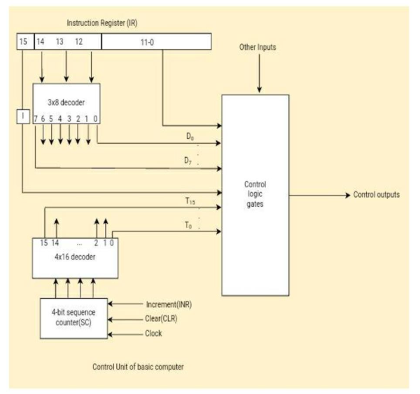
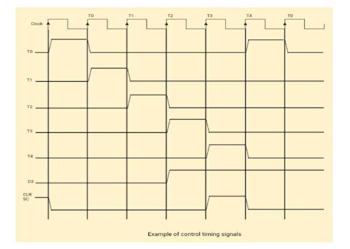

## 🧠 **Timing and Control Unit in a Basic Computer**

The **control unit** of a basic computer is responsible for **generating timing signals** and **activating control signals** to orchestrate instruction execution. This is achieved through a combination of a **sequence counter**, **decoders**, **clock pulses**, and **control logic gates**.

---

### 🕰️ **Role of Timing and Control**

A **master clock generator** drives all operations in the computer by generating **uniform clock pulses**. However, these pulses only take effect if **enabled by control signals**. The **control unit** determines when and where each signal should go, enabling:

* Instruction fetching
* Decoding
* Operand access
* Arithmetic or logical operations
* Input/output interactions

---

## 📦 **Control Unit Structure (from the Diagram)**




### 🔧 Main Components:

1. **Instruction Register (IR)**

   * Stores the current instruction.
   * Bits \[15] = Mode bit (I), bits \[14–12] = Opcode, bits \[11–0] = Address/Operand.

2. **3×8 Decoder**

   * Decodes the **3-bit opcode** (bits 12–14) into **8 operation lines**: D₀ to D₇.
   * Used for **memory-reference instructions**.

3. **1-bit Mode Flag (I)**

   * Comes from bit 15.
   * Distinguishes between:

     * **Memory-reference** (I = 0 or 1)
     * **Register-reference or I/O instructions** (Opcode = 111)

4. **4×16 Decoder**

   * Takes input from the **4-bit sequence counter (SC)**.
   * Generates timing pulses **T₀ to T₁₅**.

5. **Sequence Counter (SC)**

   * Controls the timing steps for instruction execution.
   * Responds to:

     * **Increment (INR)** – moves to next step.
     * **Clear (CLR)** – resets to 0.
   * Controlled by logic signals (like D₃T₄).

6. **Control Logic Gates**

   * Accept inputs:

     * Opcode lines (D₀–D₇)
     * Timing signals (T₀–T₁₅)
     * Mode bit (I)
     * IR\[11–0] and other control signals
   * Generate control signals that operate:

     * Registers (AC, DR, AR, etc.)
     * Memory and I/O
     * ALU and buses

---

## ⏱️ **Timing Signal Behavior (Waveform Diagram)**



### 📈 Waveform Overview

* The **x-axis** represents **clock cycles**.
* The **y-axis** shows timing signals: T₀, T₁, ..., T₄, D₃, CLR, and SC.

### 🧮 Clock & Timing Pulses

* Each positive clock transition triggers the SC to increment.
* SC values are decoded into timing signals (T₀ to T₁₅).
* Each **Tₙ** is active **for one clock cycle only**.

### 🔁 Sequence Behavior

1. **Initial State**: CLR is active → SC = 0000 → T₀ is active.
2. **T₀ to T₄**: SC increments with each clock pulse.
3. **D₃T₄ Condition**: If the **Opcode is D₃ (e.g., LDA)** and **T₄ is active**, the control logic triggers `SC ← 0`.
4. **SC Reset**: Instead of going to T₅, we go back to T₀ → begins next instruction cycle.

#### ⏳ Symbolically:

```
D₃T₄: SC ← 0
```

This is a **conditional clearing mechanism**.

---

## ⚙️ **Types of Control Organizations**

### 1. **Hardwired Control**

* Built using **flip-flops**, **decoders**, **AND/OR gates**.
* Fast, but **difficult to modify**.
* Control logic is encoded directly in circuitry.

### 2. **Microprogrammed Control**

* Uses a **control memory** containing microinstructions.
* Easier to modify: **just update the microcode**.
* Slower than hardwired, but **flexible and scalable**.

---

## ✅ **Assumptions in Basic Computer Timing**

* **Memory cycle time ≤ Clock cycle time**: So memory read/write completes within one clock cycle.
* **No wait states**: Simplifies design.
* This assumption doesn't hold in real-world systems with slower memory.

---

## 🔄 **Instruction Execution Cycle (Example)**

A typical instruction passes through:

| Step    | Timing Signal | Operation                             |
| ------- | ------------- | ------------------------------------- |
| Fetch   | T₀            | AR ← PC                               |
| Fetch   | T₁            | IR ← M\[AR], PC ← PC+1                |
| Decode  | T₂            | Decode IR\[14–12], extract address    |
| Execute | T₃–T₄         | Depends on instruction type           |
| Next    | T₅/T₀         | If SC not cleared, next step or reset |

---

## 📋 **Key Terminology Summary**

| Term       | Meaning                 |
| ---------- | ----------------------- |
| **IR**     | Instruction Register    |
| **SC**     | Sequence Counter        |
| **T₀–T₁₅** | Timing pulses           |
| **D₀–D₇**  | Decoded opcodes         |
| **I**      | Mode bit (from IR\[15]) |
| **CLR**    | Clear signal for SC     |
| **INR**    | Increment signal for SC |

---

## 🧾 **Conclusion**

The **Timing and Control Unit** of a basic computer coordinates the **sequential execution of instructions** using synchronized clock pulses, decoders, and control logic. By breaking each instruction into micro-operations triggered at specific timing pulses, the system can process commands reliably and predictably. Understanding this cycle is key to grasping how processors manage instruction execution at the hardware level.
