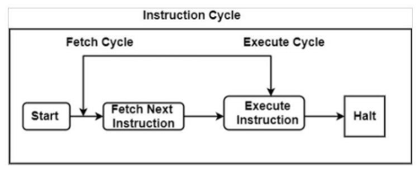
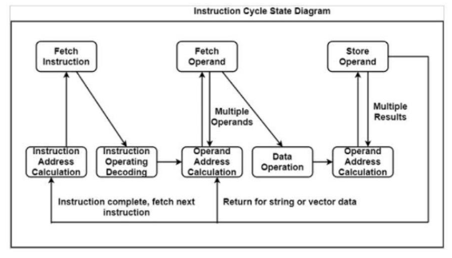

## 🧠 **Instruction Cycle in a Basic Computer**

A **computer program** consists of a sequence of instructions stored in the memory. The **instruction cycle** is the series of steps a CPU performs to **fetch**, **decode**, and **execute** each of these instructions, looping until a HALT instruction or external interrupt is encountered.

---

## 🔄 **Overview of Instruction Cycle**

The instruction cycle is divided into **two main phases**:

1. **Fetch Cycle**: Retrieves the instruction from memory.
2. **Execute Cycle**: Decodes and performs the operation.

After executing one instruction, the CPU **returns to the fetch phase** to retrieve the next instruction unless the program halts.



---

## 📘 **Phases of the Instruction Cycle**

### ✅ 1. **Instruction Fetch**

* The **Program Counter (PC)** contains the address of the instruction to be executed.
* The instruction is fetched from memory and placed into the **Instruction Register (IR)**.
* **PC is incremented** to point to the next instruction.

### ✅ 2. **Instruction Decode**

* The **Control Unit** decodes the opcode in the IR.
* Determines:

  * What operation to perform
  * If operands are needed
  * Addressing mode (direct/indirect)

### ✅ 3. **Address Calculation (if needed)**

* For **indirect addressing**, the actual operand address is retrieved from memory.
* For **direct addressing**, the address is taken directly from the instruction.

### ✅ 4. **Operand Fetch**

* Data is fetched from memory or I/O based on the decoded instruction.
* May involve reading multiple operands for complex instructions.

### ✅ 5. **Instruction Execution**

* The specified operation is performed using the operand(s).
* Can involve:

  * Arithmetic/logical operation (via ALU)
  * Data transfer (e.g., memory ↔ register)
  * I/O interaction
  * Program control (e.g., jumps, branches)

### ✅ 6. **Result Storage**

* The result of execution is written back to memory, a register, or sent to an output device.
* In write-type instructions, memory is updated.

### ✅ 7. **Repeat or Halt**

* If the instruction was not `HLT`, go back to the fetch cycle.
* If `HLT`, stop execution.

---

## 🔁 **Simple Instruction Cycle Diagram**

The first diagram illustrates the core loop of instruction processing:

```
Start → Fetch Instruction → Execute Instruction → Halt (optional)
                   ↑             ↓
                Fetch Next     (Repeat)
```

This shows the CPU perpetually fetching and executing instructions until halted.

---

## 🔄 **Detailed Instruction Cycle State Diagram**

The second diagram expands the simple cycle into **individual states** to highlight the complex operations:




### 🔄 Step-by-Step Explanation:

1. **Instruction Address Calculation**

   * Prepares address for the next instruction.
   * Adds a fixed value to current PC or updates via branch.

2. **Instruction Fetch**

   * Fetches instruction from memory → loads into IR.

3. **Instruction Decode**

   * Decodes opcode and identifies operands.
   * Determines control signals needed.

4. **Operand Address Calculation**

   * Calculates effective memory/I/O address for the operand.
   * Handles indexed, indirect, or relative modes.

5. **Operand Fetch**

   * Loads operand(s) into CPU register(s) from memory or I/O.

6. **Data Operation**

   * ALU performs the arithmetic/logic operation.
   * Could be a simple `ADD`, `SUB`, or control instruction.

7. **Store Operand**

   * Writes the result to memory or sends it to an output device.
   * In some cases, may repeat for multiple results (e.g., vectors).

---

## 📡 **Types of Data Transfers in Execution**

* **Processor–Memory**: Load/store operations
* **Processor–I/O**: Input/output device communications
* **Processor–Processor**: Rare, in multiprocessor systems
* **Data Operation**: Arithmetic, logical, control operations

---

## 🧾 **Summary Table**

| Step                        | Description                                |
| --------------------------- | ------------------------------------------ |
| Instruction Fetch           | Get instruction from memory (IR ← M\[PC])  |
| Instruction Decode          | Decode opcode and mode                     |
| Operand Address Calculation | Evaluate effective address (if indirect)   |
| Operand Fetch               | Get operand from memory or I/O             |
| Instruction Execution       | Perform operation (ADD, STORE, JUMP, etc.) |
| Result Storage              | Save result in memory or output device     |
| Repeat or Halt              | Go to next instruction or stop             |

---

## ✅ **Conclusion**

The **instruction cycle** forms the core mechanism through which computers operate. Each instruction undergoes **fetch → decode → execute** in a loop governed by the **control unit and timing logic**. A deeper breakdown into **states** (as in modern CPUs) allows flexible and modular instruction processing, essential for supporting **complex instructions**, **branching**, and **I/O interaction**.

