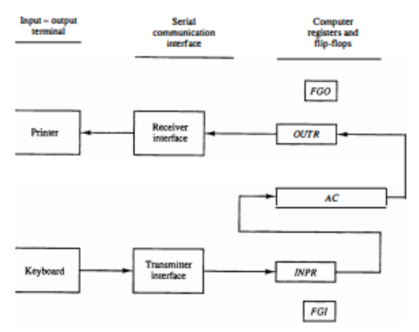

## 🖥️ **Input-Output and Interrupt in a Basic Computer**

A computer’s ability to **communicate with external devices**—such as keyboards, printers, and display units—is essential for practical use. This communication is established via **Input-Output (I/O) interfaces**. In the **basic computer model**, I/O operations are relatively simple but clearly demonstrate the core concepts of serial communication, register transfer, and synchronization.

---

## 🔌 **Overview of I/O Configuration**

The given diagram illustrates a minimalistic I/O system using:

* **A keyboard (input device)**
* **A printer (output device)**
* **Transmitter and receiver interfaces**
* **Two internal registers**: `INPR` and `OUTR`
* **Two flags**: `FGI` (Input flag) and `FGO` (Output flag)
* Communication is **serial between devices** but **parallel within the computer**.

---

## 📥 **Input Section (Keyboard → INPR → AC)**

### 🔹 Components:

* **Keyboard**: The user types input characters.
* **Transmitter Interface**: Converts keystrokes into serial data.
* **INPR (Input Register)**: Stores 8-bit alphanumeric input.
* **FGI (Input Flag)**: Flip-flop that indicates when new input is ready.

### 🔸 Data Flow:

1. When a key is pressed, the **transmitter interface** receives the serial data.
2. The **8-bit character** is loaded into the **INPR register**.
3. The **FGI flag is set to 1**, indicating data is available.
4. The CPU checks FGI:

   * If `FGI = 1`, it transfers data from **INPR to AC (Accumulator)** in parallel.
   * Then it **clears FGI to 0**, allowing the next input.
5. If `FGI = 0`, no transfer occurs.

### 🔁 Synchronization:

* Prevents overwriting of INPR while CPU is processing the current input.
* Ensures sequential input capture without data loss.

---

## 📤 **Output Section (AC → OUTR → Printer)**

### 🔹 Components:

* **OUTR (Output Register)**: Holds the 8-bit data to be printed.
* **Receiver Interface**: Sends serial data to the printer.
* **Printer**: Outputs the alphanumeric character.
* **FGO (Output Flag)**: Flip-flop indicating output readiness.

### 🔸 Data Flow:

1. The CPU loads data from **AC into OUTR** when **FGO = 1**.
2. Loading data into OUTR **resets FGO to 0**.
3. The **receiver interface** serially transmits data to the printer.
4. When printing is complete, **FGO is set back to 1**, allowing next character output.

---

## 🧠 **Key Registers and Flags**

| Component | Type       | Function                                         |
| --------- | ---------- | ------------------------------------------------ |
| `INPR`    | 8-bit Reg  | Holds keyboard input                             |
| `OUTR`    | 8-bit Reg  | Holds data to print                              |
| `FGI`     | 1-bit Flag | Input-ready flag (1 = data available)            |
| `FGO`     | 1-bit Flag | Output-ready flag (1 = ready to accept new data) |

---

## ⏱️ **Timing Consideration and Synchronization**

* Keyboard and printer are **slower** than the CPU.
* Flags (FGI, FGO) are used for **asynchronous synchronization**.
* The CPU checks flags **before accessing INPR or OUTR** to ensure correct timing.

---

## 🚨 **Interrupt Concept (Extension)**

Although not shown in the current control unit, real-world systems often use **interrupts** to improve I/O efficiency.

### 🔹 Without Interrupts (Polling):

* CPU repeatedly checks `FGI` and `FGO`.
* Wasteful if devices are slow.

### 🔹 With Interrupts:

* I/O devices **send interrupt signals** to CPU.
* CPU **pauses current task**, handles I/O, then **resumes**.

In basic computer models, **polling is used**, but the interrupt concept becomes important in more advanced systems.

---

## 🧾 **Summary Table**

| Aspect         | Input (Keyboard)                      | Output (Printer)                      |
| -------------- | ------------------------------------- | ------------------------------------- |
| Interface      | Transmitter                           | Receiver                              |
| Register       | INPR                                  | OUTR                                  |
| Flag           | FGI (1 = ready)                       | FGO (1 = ready)                       |
| Data direction | Keyboard → INPR → AC                  | AC → OUTR → Printer                   |
| Communication  | Serial (device) + Parallel (internal) | Serial (device) + Parallel (internal) |

---

## ✅ **Conclusion**

The **Input-Output system** in a basic computer is a simplified yet effective model for understanding how **registers, serial interfaces, and flags** coordinate communication between CPU and external devices. The **FGI and FGO flip-flops** ensure proper synchronization, while the **transmitter and receiver interfaces** handle serial data. This foundational architecture forms the basis for more complex I/O systems with **buffers, DMA, and interrupts**.

