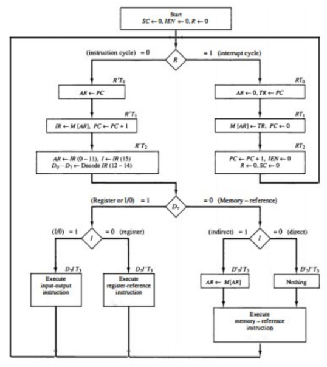

## 🧠 **Design of Basic Computer**

A **basic computer** is a simple model used to demonstrate fundamental computer organization and architecture concepts. It operates using a small set of instructions, registers, control logic, and a fixed data bus. While simplified compared to modern CPUs, it contains all essential components required to fetch, decode, and execute instructions.

---

## 🧱 **Key Hardware Components**

### 1. **Memory Unit**

* **Size**: 4096 words (4K), each **16 bits** wide.
* **Addressing**: 12-bit address range (0 to 4095).
* Stores both **instructions** and **data**.

---

### 2. **Registers (9 Total)**

| Register                      | Size   | Purpose                                   |
| ----------------------------- | ------ | ----------------------------------------- |
| **PC** (Program Counter)      | 12-bit | Holds the address of the next instruction |
| **AR** (Address Register)     | 12-bit | Stores memory addresses for access        |
| **IR** (Instruction Register) | 16-bit | Holds the current instruction             |
| **AC** (Accumulator)          | 16-bit | General-purpose register for ALU          |
| **DR** (Data Register)        | 16-bit | Temporarily stores memory data            |
| **TR** (Temporary Register)   | 16-bit | Stores intermediate results               |
| **SC** (Sequence Counter)     | 4-bit  | Generates timing signals (T0 to T15)      |
| **INPR**                      | 8-bit  | Holds input character (from keyboard)     |
| **OUTR**                      | 8-bit  | Holds output character (for printer)      |

---

### 3. **Flip-Flops (7 Total)**

| Flip-Flop | Function                                               |
| --------- | ------------------------------------------------------ |
| **I**     | Addressing mode bit (I = 0 → direct, I = 1 → indirect) |
| **E**     | Extended bit for carry in arithmetic                   |
| **S**     | Start-stop control                                     |
| **R**     | Interrupt enable flag                                  |
| **FGI**   | Input flag (set = new input ready)                     |
| **FGO**   | Output flag (set = ready to print)                     |
| **IEN**   | Interrupt enable (allows/disallows interrupts)         |

---

### 4. **Decoders**

| Decoder                   | Function                                          |
| ------------------------- | ------------------------------------------------- |
| **3×8 Operation Decoder** | Decodes 3-bit opcode into 8 operations (D₀ to D₇) |
| **4×16 Timing Decoder**   | Converts SC (0–15) into timing pulses T₀ to T₁₅   |

---

### 5. **Common Bus System**

* A **16-bit bidirectional data bus** used for transferring data among:

  * Registers ↔ Memory
  * Registers ↔ ALU
* Only one register can place data on the bus at a time.

---

### 6. **Control Logic Gates**

* Implements **control signals** based on:

  * Instruction decoding (from IR)
  * Timing signals (from SC)
  * Flags (FGI, FGO)
* Generates control for register transfers and ALU operations.

---

### 7. **Adder and Logic Unit**

* Performs:

  * Arithmetic operations (e.g., ADD)
  * Logical operations (e.g., AND, CMA)
* Input: AC and DR (Data Register)

---

## 🕹️ **Register Functions & Data Flow**

1. **Instruction Fetch Cycle**:

   * `PC → AR → IR ← M[AR]`
   * `PC` is incremented to point to next instruction.
   * `IR` holds the instruction to decode.

2. **Execution**:

   * Decoded instruction determines:

     * **Type**: Memory, Register, or I/O
     * **Addressing mode**: Direct or Indirect (based on I bit)
   * Data is fetched (if required), processed, and written back.

---

## 🔁 **Program Control via PC and Branching**

* `PC` is the driving register for sequential instruction flow.
* **Branching instructions (BUN/BSA)**:

  * Modify `PC` to alter the control flow.
  * Used for loops, conditionals, and subroutine calls.

---

## 📥 **Input/Output Mechanism**

### Input (Keyboard → INPR):

* `INPR` receives 8-bit serial data from the **keyboard**.
* `FGI = 1` → data is ready to transfer to `AC`.

### Output (AC → OUTR → Printer):

* `OUTR` sends 8-bit serial data to the **printer**.
* `FGO = 1` → ready to accept next data from `AC`.

---

## ⚙️ **Flowchart: Instruction Cycle and Interrupt Handling**

Referencing the **flowchart diagram**, the execution cycle follows this logic:

### ➤ Start:

* Initialize `SC = 0`, `IEN = 0`, `R = 0`.

---

### ➤ Instruction Cycle (if R = 0)

1. **T₀**: `AR ← PC`

2. **T₁**: `IR ← M[AR]`, `PC ← PC + 1`

3. **T₂**:

   * Decode IR:

     * `AR ← IR(0–11)`
     * `I ← IR(15)`
     * Decode IR(12–14) → get D₀ to D₇

4. **Instruction Type Check**:

   * If `D₇ = 1`:

     * I/O or Register instruction
     * If `I = 0`: Execute register-reference
     * If `I = 1`: Execute I/O instruction
   * Else:

     * Memory-reference instruction
     * If `I = 1`: Indirect → `AR ← M[AR]`
     * Execute memory instruction

---

### ➤ Interrupt Cycle (if R = 1)

1. **RT₀**: `AR ← 0`, `TR ← PC`
2. **RT₁**: `M[0] ← TR`, `PC ← 0`
3. **RT₂**: `PC ← PC + 1`, `IEN ← 0`, `R ← 0`, `SC ← 0`

This routine saves PC to memory location 0 and branches to service routine at address 1.

---

## ✅ **Summary Table**

| Component            | Role                                           |
| -------------------- | ---------------------------------------------- |
| **Memory (4K × 16)** | Stores instructions and data                   |
| **Registers**        | Temporarily hold data, instructions, addresses |
| **Flip-Flops**       | Flags for mode, interrupts, input/output       |
| **Decoders**         | Instruction decoding and timing generation     |
| **Bus**              | Transfers data across CPU                      |
| **Control Logic**    | Activates micro-operations                     |
| **ALU**              | Performs computations                          |

---

## 🧾 **Conclusion**

The **design of the basic computer** provides a clean, modular view of how modern computers internally operate. Despite its simplicity, it includes all essential components:

* **Memory**, **registers**, **ALU**, **control unit**, and **I/O**.
  The architecture is ideal for understanding **instruction cycles**, **interrupts**, and **data flow** at a hardware level.
