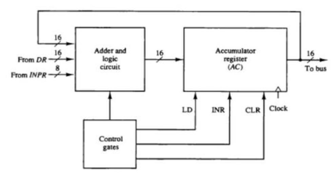
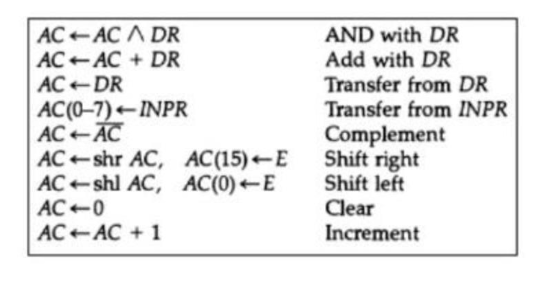

## 🧠 **Design of Accumulator Unit (AC)**

The **Accumulator (AC)** is a special-purpose register in a computer’s **Arithmetic Logic Unit (ALU)**. It plays a vital role in executing arithmetic and logic instructions by holding intermediate results, especially in a system that uses a **single-operand architecture** like a basic computer.

---

## 📥 **Role of the Accumulator**

1. **Temporary Storage**:
   AC stores intermediate results of arithmetic or logic operations (e.g., addition, AND, complement).

2. **Implicit Operand**:
   In most instructions, one operand is implicitly assumed to be in AC, reducing instruction size and improving performance.

3. **Multi-step Operations**:
   For operations involving multiple values (e.g., cumulative sum), AC stores the partial result which is updated step-by-step.

---

## 🧱 **Accumulator Unit Components (Diagram 1)**

### 🔹 Major Components:

1. **Adder and Logic Circuit**:

   * Accepts inputs from `DR`, `INPR`, or previous AC value.
   * Performs logic (AND, complement) or arithmetic (ADD, INC) operations.

2. **Accumulator Register (AC)**:

   * 16-bit register for storing intermediate results.
   * Connected to the **common bus** for data exchange.

3. **Control Gates**:

   * Generate control signals like:

     * `LD` (Load AC)
     * `INR` (Increment AC)
     * `CLR` (Clear AC)

4. **Clock Signal**:

   * Synchronizes data transfer into AC with system timing.

---

## ⚙️ **Input Sources to the Adder and Logic Circuit**

1. **From DR (Data Register)** – 16-bit operand from memory.
2. **From INPR (Input Register)** – 8-bit I/O data input (aligned with AC\[0–7]).
3. **From AC** – For operations like increment, complement, shift.

---

## 🔄 **Register Transfer Operations That Affect AC**

| Operation | RTL Statement             | Description                  |
| --------- | ------------------------- | ---------------------------- |
| AND       | `AC ← AC ∧ DR`            | Logical AND with DR          |
| ADD       | `AC ← AC + DR`            | Arithmetic addition          |
| LDA       | `AC ← DR`                 | Load value from DR           |
| INP       | `AC(0–7) ← INPR`          | Input lower 8 bits from INPR |
| CMA       | `AC ← ¬AC`                | One’s complement             |
| SHR       | `AC ← shr AC, AC(15) ← E` | Shift right, MSB from E      |
| SHL       | `AC ← shl AC, AC(0) ← E`  | Shift left, LSB from E       |
| CLA       | `AC ← 0`                  | Clear AC                     |
| INC       | `AC ← AC + 1`             | Increment AC                 |

---

## 🧮 **Microoperations Supported by Accumulator Logic**

| Operation              | Function                                |
| ---------------------- | --------------------------------------- |
| **Complement**         | Flip all bits of AC                     |
| **Clear**              | Set AC to 0                             |
| **Increment**          | Add 1 to current AC                     |
| **Shift Left/Right**   | Move bits and interact with E flip-flop |
| **Transfer from DR**   | Replace AC with memory operand          |
| **Transfer from INPR** | Input lower 8 bits of AC                |

---

## 🔁 **Working Cycle Example**

To execute the instruction `ADD M[X]`:

1. `DR ← M[X]` → memory data is loaded into DR.
2. `AC ← AC + DR` → Adder unit adds content of DR to AC.
3. Result is stored back in AC.

Similarly, for `AND`, the adder/logic unit computes `AC ∧ DR`.

---

## 🔌 **Control Signals Summary**

| Signal              | Function               |
| ------------------- | ---------------------- |
| **LD (Load)**       | Load new value into AC |
| **INR (Increment)** | Increment AC           |
| **CLR (Clear)**     | Clear AC to zero       |

These signals are generated by **control gates** based on decoded instruction and current timing signal (T₀–T₅).

---

## 🧾 **Conclusion**

The **Accumulator Unit** is a central element in basic computer architecture, acting as the heart of the ALU for holding temporary and final results. It interacts with:

* Memory (via DR),
* I/O devices (via INPR),
* The common bus,
* Control logic and flags (via LD, INR, CLR).

Its design simplifies the execution of instructions by reducing the need for multiple operand fields and helps demonstrate the core functioning of a CPU.
