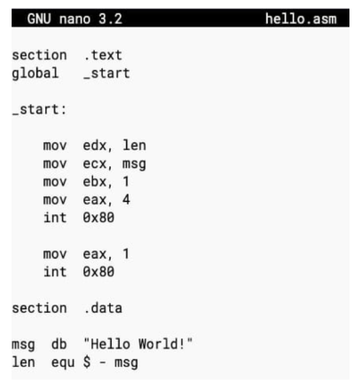

## 🧠 **Assembly Language: The Human-Readable Machine Code**

### 🔧 **Definition**

**Assembly language** (ASM) is a **low-level programming language** that provides symbolic representations of a computer's **machine instructions**. It is a human-readable form of binary instructions (machine code) tailored to a specific processor architecture.

While **machine language** consists of `0`s and `1`s, **assembly language** uses **mnemonics** (like `MOV`, `ADD`, `INT`) to make programming easier and more intuitive for humans.

---

## 🧱 **Why Assembly Language Exists**

* **Machine code is hard to read, write, and debug.**
* Assembly language serves as an **intermediate language** between high-level languages (e.g., C, Python) and machine code.
* It is specific to a **CPU family**, such as Intel x86 or ARM.

---

## 🖥️ **Structure of Assembly Programs**

An assembly program typically consists of:

1. **Text Section**: Contains the actual instructions to be executed.
2. **Data Section**: Contains constant or variable declarations.
3. **Entry Point**: Denoted by `_start` or `main`.

### 📄 **Example: hello.asm (x86 Linux Assembly)**

```asm
section .text
global _start

_start:
    mov edx, len        ; message length
    mov ecx, msg        ; message to write
    mov ebx, 1          ; file descriptor (stdout)
    mov eax, 4          ; syscall number for sys_write
    int 0x80            ; call kernel

    mov eax, 1          ; syscall number for sys_exit
    int 0x80            ; exit program

section .data
msg db "Hello World!"   ; message bytes
len equ $ - msg         ; length of the message
```

### 🧾 **Explanation**

* `mov edx, len`: Load message length into `edx`.
* `mov ecx, msg`: Load address of message into `ecx`.
* `mov ebx, 1`: File descriptor `1` (stdout).
* `mov eax, 4`: Linux syscall number for `write`.
* `int 0x80`: Software interrupt to call Linux kernel.
* `mov eax, 1` + `int 0x80`: Exit syscall.

---

## ✅ **Advantages of Assembly Language**

### 🧠 Technical Insight:

* Helps programmers understand **CPU internals**, instruction flow, and system calls.
* Reveals how software interacts with:

  * **BIOS**
  * **Operating system**
  * **Hardware components (I/O, memory)**

### ⚙️ Practical Benefits:

| Benefit                | Explanation                                              |
| ---------------------- | -------------------------------------------------------- |
| **Efficient**          | Requires **less memory and processing time**             |
| **Hardware Control**   | Allows direct manipulation of hardware registers         |
| **Speed**              | Ideal for **time-critical routines**                     |
| **Compactness**        | Suited for embedded systems or memory-resident programs  |
| **Interrupt Handling** | Useful for writing **Interrupt Service Routines (ISRs)** |

---

## 💬 **Why Is Assembly Language Still Useful?**

Even in a world of high-level languages, **assembly has key use cases**:

* Writing **bootloaders**
* Developing **device drivers**
* Creating **real-time embedded systems**
* Understanding **security exploits and reverse engineering**

Assembly language:

* Bridges the gap between **hardware and software**
* Offers **complete control** over the machine's behavior
* Is the best tool for **optimizing performance**

---

## ⚠️ **Challenges of Assembly Language**

| Limitation         | Description                                     |
| ------------------ | ----------------------------------------------- |
| **Complexity**     | Requires precise control and detailed knowledge |
| **No Portability** | Code is specific to one processor family        |
| **Verbose**        | Simple tasks require multiple lines             |
| **Error-prone**    | Minor mistakes can cause major bugs             |

---

## 📊 **Assembly vs Machine vs High-Level Language**

| Feature     | Machine Language | Assembly Language | High-Level Language      |
| ----------- | ---------------- | ----------------- | ------------------------ |
| Readability | None             | Moderate          | High                     |
| Control     | Complete         | High              | Abstracted               |
| Portability | None             | Low               | High                     |
| Speed       | Fastest          | Fast              | Depends on compiler      |
| Use Case    | CPU execution    | Embedded/devices  | App/software development |

---

## 🧾 **Conclusion**

**Assembly language** is the symbolic form of machine code that gives programmers powerful access to CPU-level operations. While it demands **deep technical knowledge**, its benefits in **efficiency, speed, and control** make it invaluable in areas like **system programming**, **embedded systems**, and **reverse engineering**. Though modern development often relies on high-level languages, understanding assembly offers unparalleled insight into **how computers truly work**.

