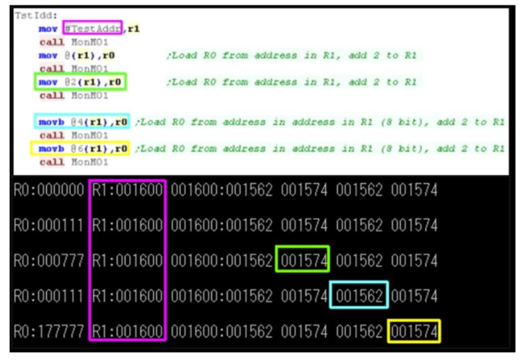

## 🧠 **The MACRO-11 Assembler**

**MACRO-11** is a **macro-enabled assembly language** designed by **Digital Equipment Corporation (DEC)** for the **PDP-11 minicomputer family**. It succeeded the earlier **PAL-11R** assembler, adding **macro capability**, which allowed programmers to define reusable instruction blocks (macros), improving code readability and maintainability.



---

## 🔧 **Overview of MACRO-11 and the PDP-11**

* Used on all major PDP-11 operating systems, including **RSX-11**, **RT-11**, and **Unix V6/V7**.
* Still recognized today in **OpenVMS** for its compatibility mode.
* Features full symbolic assembly with macros, conditionals, and advanced addressing modes.

---

## 🧩 **CPU Registers in PDP-11**

| Register  | Name                      | Purpose |
| --------- | ------------------------- | ------- |
| **R0–R5** | General-purpose registers |         |
| **R6**    | Stack Pointer (SP)        |         |
| **R7**    | Program Counter (PC)      |         |

> Note: Registers could be used for indexing, indirection, or immediate values depending on the **addressing mode**.

---

## 💾 **Memory and Addressing**

* **16-bit address space** = 64 KB max (from `000000` to `177777` in octal).
* **Memory is word-addressable**, with each word = 2 bytes.
* I/O registers are mapped into memory, especially in the top 4K address range (`160000` to `177777`).
* Vectors for **interrupt handling** and **traps** are located at **low memory addresses**.

---

## ⚙️ **Sample Code Explanation (from diagram)**

```asm
mov #TestAddr, r1       ; R1 = address TestAddr (immediate)
call MonM01             ; Call monitor function

mov 0(r1), r0           ; R0 = content at [R1]
call MonM01

mov 2(r1), r0           ; R0 = content at [R1+2]
call MonM01

movb @4(r1), r0         ; R0 = byte from address in address at R1+4
call MonM01

movb 6(r1), r0          ; R0 = byte at R1+6
call MonM01
```

### 🧠 Key Observations:

* **R1 is initialized with an immediate address** (e.g., `001600`), shown in **magenta**.
* **Each instruction** reads data from an offset relative to R1 using **indexed or indirect** addressing modes.
* The values fetched are stored in **R0**, and then printed via `MonM01`.

---

## 🧠 **Addressing Modes in Use**

| Mode             | Syntax        | Meaning                   |
| ---------------- | ------------- | ------------------------- |
| Immediate        | `#value`      | Literal constant          |
| Register         | `Rn`          | Register direct           |
| Indexed          | `offset(Rn)`  | Address = Rn + offset     |
| Indirect Indexed | `@offset(Rn)` | Address = M\[Rn + offset] |

> Example: `movb @4(r1), r0` means fetch the byte from **the memory address stored at location (R1 + 4)**.

---

## 🧮 **Memory Execution Trace (Bottom Image)**

* **Each row** shows register contents after a call.
* **Colored boxes** highlight memory content at fetched addresses:

  * **Green (`001574`)**: Loaded into `R0`
  * **Blue (`001562`)**: Loaded into `R0`
  * **Yellow (`001574`)**: Loaded again
* All loads follow a `mov` or `movb` instruction, and **R1 always stays at `001600`**, while **R0 changes** based on indirect or offset addressing.

---

## 🏗️ **Memory Management Evolution**

* Originally constrained by the 16-bit address space (64 KB).
* DEC introduced **memory expansion** techniques:

  * **18-bit and 22-bit** physical addressing for up to **4 MB** RAM.
  * **Instruction/Data space separation** (e.g., PDP-11/45 used 64KB for code + 32KB for data).
* Paging and overlays were used to manage larger programs in small memory footprints.

---

## 🔄 **Interrupts and Trap Handling**

* Low addresses contain **interrupt vectors**:

  * Two-word entries: **Program Counter (PC)** and **Processor Status Word (PSW)**
* On interrupt:

  * The **device’s vector** is placed on the bus.
  * The CPU **jumps** to the appropriate service routine.
* Software can trigger traps (e.g., `TRAP`, `EMT`, `IOT`) to request OS services.

---

## ✅ **Conclusion**

The **MACRO-11 assembler** for the PDP-11 family illustrates an elegant and compact assembly language with flexible **addressing modes**, **macro support**, and tight integration with hardware-level operations. Though limited to a **16-bit logical address space**, the PDP-11 architecture introduced powerful concepts like **memory-mapped I/O**, **interrupt vectors**, and **instruction/data separation**, many of which influenced later architectures like **VAX** and **modern RISC designs**.

The provided diagram showcases the **rich variety of addressing modes** and **register-level manipulation** typical of MACRO-11, emphasizing how PDP-11 systems efficiently accessed memory through indirect and indexed addressing.
