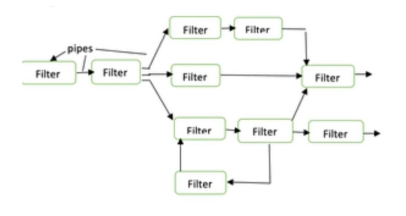

### 📘 **Data Flow Architecture – Explained with Visual Context**

---

#### 🔷 **Overview**

Data Flow Architecture is a **software and system design paradigm** where **execution is driven by data availability**, unlike the traditional **von Neumann** model that relies on a **program counter and sequential flow**.

In this architecture, the **entire software system** is viewed as a **series of transformations** applied to incoming data, which flows through the system in various topologies like **linear pipelines, trees, or graphs**.

---

#### 🖼️ **Diagram Interpretation (Image Above)**

The diagram provided is a **classic example of the Pipe and Filter architecture**, one of the three major types of data flow architectures. Here’s how it maps:

* **Rectangles = Filters**: Independent processing units.
* **Arrows = Pipes**: Channels that pass data from one filter to another.

You can observe **parallel flows**, **branching**, and **converging paths**, making it a **graph-based dataflow model** that supports **modular execution**, **reuse**, and **parallelism**.

---

### 🛠️ Types of Data Flow Architectures

#### 1. **Batch Sequential Architecture**

* Data is processed in batches.
* One module completes execution before passing data to the next.
* Uses temporary storage like files for inter-module communication.
* **Use case**: Bank statement generation, utility billing.

**✅ Pros**:

* Simple structure
* Easier to maintain individual modules

**❌ Cons**:

* High latency
* No concurrency or real-time interaction

---

#### 2. **Pipe and Filter Architecture** ✅ *(The Image Example)*

Each component (filter) processes data as soon as it receives it via a pipe and pushes it to the next. Filters work concurrently and independently.

##### 🔄 Filter

* Transforms input data to output.
* May operate **incrementally**.

**Types of Filters**:

* **Active**: Pulls data, processes, and pushes it.
* **Passive**: Waits for data to be pushed to it.

##### ➿ Pipe

* Stateless connectors carrying data streams (bytes, chars).
* Do not retain state across executions.

**✅ Pros**:

* Parallelism
* Low coupling
* Flexible composition
* Good for stream-based or large data transformations (e.g., compilers, video filters)

**❌ Cons**:

* Poor for dynamic interaction
* Performance cost for transforming formats
* No native inter-filter collaboration

---

#### 3. **Process Control Architecture**

Designed for **reactive systems** that adjust based on process variables (sensors, actuators).

**Components**:

* **Sensor**: Reads real-world data
* **Controller**: Modifies manipulated variable
* **Set Point**: Target value for control

**Use Cases**:

* Cruise control
* Nuclear reactor monitoring
* Embedded systems

---

### 🔄 Topology Variations

* **Linear**: Data flows in a straight line (e.g., A → B → C).
* **Tree**: Data branches out to multiple modules.
* **Graph**: Complex connections with possible cycles (like in the diagram).

---

### 🎯 Use Cases

* Compiler design
* ETL pipelines in data warehousing
* Multimedia streaming
* AI inference engines
* IoT sensor data pipelines
* Real-time analytics dashboards

---

### 📌 Conclusion

Data Flow Architecture promotes:

* **Modularity**
* **Scalability**
* **Parallel processing**
* **Maintenance ease**

But it also comes with **challenges** like managing dynamic control flows, interdependencies, and runtime reconfiguration.

Your diagram exemplifies a **hybrid graph-based Pipe and Filter** layout, ideal for **high-throughput data systems** where **modular, concurrent processing** is key.

