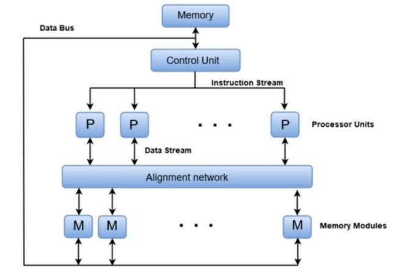
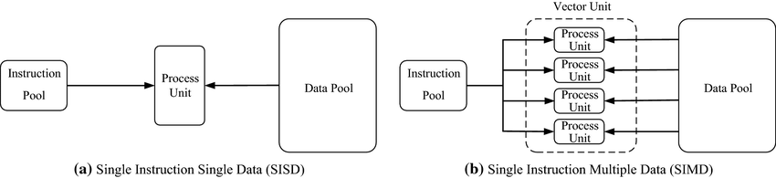

### 📘 **Data Flow Computing in Parallel Processing – Detailed Note**

---

#### 🧠 **What is Data Flow Computing?**

Data Flow Computing is a **computational model** where instruction execution is **driven by the availability of data operands**, not by a sequential program counter. This contrasts with traditional control-flow models, where instructions execute in a strict order.

In dataflow systems, operations **"fire"** when **all their input data is ready**, allowing **fine-grained parallelism** to be naturally exploited.

---

### 📷 **Diagram Analysis (Image Above)**

The image depicts a **data flow parallel processing architecture**, structured as follows:

* **Memory** holds the global data.
* **Control Unit** sends **instruction streams** to multiple processors.
* **Processor Units (P)** perform computation in parallel based on incoming data.
* **Alignment Network** manages data coordination between processors and memory.
* **Memory Modules (M)** store data and communicate with processors through the alignment network.

This architecture enables **multiple instructions** to act **simultaneously** on **distributed data**, supporting parallel computing principles like SIMD.

---

### ⚙️ **Key Concepts in Dataflow Parallelism**

#### 🔄 **Data-Driven Execution**

* Each instruction executes as soon as its **input data is available**, no waiting for a central clock.
* Promotes **concurrency** and **fine-grain parallelism**.
* Ideal for **high-performance computing**, **AI**, and **signal processing**.

#### 🔁 **Parallel Processing**

* Multiple processors handle different parts of a task **simultaneously**.
* Example: Data scientists use parallel systems to run simulations or train ML models faster.

---

### ⚡ **Design Phases for Parallel Algorithms**

1. **Partitioning**: Break the problem into smaller tasks that can execute independently.
2. **Communication Setup**: Ensure tasks have access to the data they need.
3. **Granularity Analysis**: Analyze the computation-to-communication ratio (coarse vs. fine grain).
4. **Optimization**: Reduce overall execution cost and improve performance.

---

### 🧩 **Execution Model: SIMD vs SISD**

#### ▶️ **SIMD (Single Instruction Multiple Data)**

* A single control unit sends the **same instruction** to multiple processors.
* Each processor executes it on **different pieces of data**.
* Suitable for: Image processing, matrix operations, neural networks.

**✅ Advantages:**

* Efficient for **uniform, large-scale** data tasks.
* Excellent **data parallelism**.

---

#### ▶️ **SISD (Single Instruction Single Data)**

* Classic single-core architecture.
* One instruction operates on one data item at a time.

**✅ Pros:**

* Lower power consumption.
* Simpler design, easier to debug.

**❌ Cons:**

* Limited speed, poor for complex or data-intensive tasks.

---

### 🔄 **Alignment Network Role**

In the diagram:

* Acts as a **switching fabric** that connects **Processor Units (P)** with **Memory Modules (M)**.
* Ensures correct **routing of data**, possibly supporting dynamic reallocation and load balancing.

---

### 💡 **Benefits of Data Flow Architecture in Parallel Processing**

* **Maximized CPU utilization** via parallel task triggering.
* **No central bottleneck**, allowing dynamic scheduling.
* **Deterministic execution**, as each task waits only for data, not sequential control.

---

### ❗ **Challenges**

* Difficult **hardware realization** (dataflow machines are complex).
* Overhead from **data tracking**, **token management**, and **synchronization**.
* Less effective for **control-heavy** or **interactive** applications.

---

### 🎯 **Use Cases**

* Scientific simulations
* Digital signal processing (DSP)
* AI model training (Tensor Processing Units use dataflow)
* Real-time graphics rendering (e.g., GPUs)

---

### 📝 **Conclusion**

Data flow computing in parallel processing allows systems to execute tasks as soon as data is ready—promoting **fine-grained parallelism**, **scalability**, and **performance**. While **SIMD** offers excellent throughput for repetitive data-heavy tasks, **SISD** remains useful for simpler applications.

Your diagram showcases a **hybrid dataflow architecture** where multiple processors are coordinated through a control unit and aligned via an intelligent memory-access network—perfect for high-performance parallel systems.

