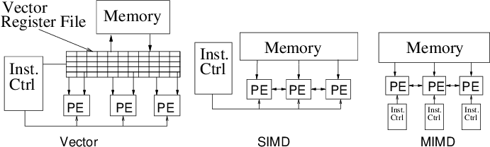

### 📘 **Vector Architecture – Detailed Notes**

---

#### 🧠 **What is Vector Architecture?**

**Vector Architecture** is a specialized form of **SIMD (Single Instruction Multiple Data)** architecture where a **single instruction operates on entire vectors**—that is, arrays of data elements—rather than on scalar values one at a time. It enables **high-throughput parallelism** in data processing, especially for numerical and scientific computations.



In vector architecture:

* **Programmers write code sequentially**, but execution happens **in parallel**.
* **Instruction-level control** is minimized; instead, **data-level parallelism** is emphasized.

---

### 🧩 **How Vector Architecture Works**

#### 🔄 **Vector Registers**

* Large registers store entire **vectors** (e.g., 64 64-bit elements).
* These are operated on as single entities by vector instructions.
* **Register-to-register operations** dominate, keeping memory accesses minimal and pipelined.

#### 📦 **Memory System**

* A **vector register file** handles collections of operands.
* Memory accesses are **amortized**: latency is incurred once per vector, not per element.
* Example: `LD VR <- A[3:0]` loads a vector of four values into a register in one instruction.

---

### 🔧 **Vector Instructions & Execution**

Vector instructions operate on multiple elements **simultaneously**:

* Example: `ADD VR <- VR, 1` adds 1 to every element in a vector.
* Vector processors use **wide, pipelined units** that are **slow but power-efficient**.
* No complex out-of-order logic is required (unlike superscalar CPUs).

#### ✅ **Vectorisation**

* **Vectorisable code**: When the compiler can convert scalar loops into vector instructions.
* **No loop-carried dependencies**: Key requirement for vectorisation.

Example of vectorised loop:

```
for (i = 0; i < 4; i++) {
  A[i] = (A[i] + 1) * 2;
}
```

Would translate to:

```
LD VR <- A[3:0]
ADD VR <- VR, 1
MUL VR <- VR, 2
ST A[3:0] <- VR
```

---

### 🔗 **Chaining**

* **Chaining** allows outputs from one vector instruction (e.g., ADD) to immediately serve as inputs to the next (e.g., MUL).
* Enables **concurrent execution** across vector functional units.
* Improves pipeline efficiency.

---

### ⏱️ **Performance Concepts**

#### 🕒 **Chimes**

* A **chime** is one time unit for executing a **convoy** (a set of vector instructions that can run in parallel).
* **Total time** = number of chimes × vector length (n).
* Fewer chimes → better utilization.

#### 📐 **Convoy**

* A **convoy** is a group of vector instructions without structural conflicts.
* Multiple convoys = serialized stages.
* Goal: Minimize number of convoys for optimal vector performance.

---

### 🔍 **Vector Architecture vs Array Processors**

| Feature           | Vector Processor                        | Array Processor                         |
| ----------------- | --------------------------------------- | --------------------------------------- |
| Execution         | One operation over time on all data     | All operations at the same time         |
| Hardware          | Deep pipelining, functional units reuse | Dedicated ALUs for every data point     |
| Space Utilization | Same operation in same space            | Different ops can run in the same space |
| Flexibility       | Higher                                  | Lower (rigid, static parallelism)       |

---

### 🌟 **Benefits of Vector Architecture**

* ✅ **Efficient pipelining** and **parallelism** (no intra-vector dependencies).
* ✅ **High instruction throughput** with less instruction bandwidth.
* ✅ **Prefetching-friendly**: memory access is predictable and regular.
* ✅ **Energy-efficient**: no complex scheduling logic required.
* ✅ **Loop simplification**: fewer branch instructions, more compact code.

---

### ⚠️ **Drawbacks of Vector Architecture**

* ❌ Only effective with **regular, structured parallelism**.
* ❌ Can **waste resources** if data size is small or irregular.
* ❌ **Memory bandwidth** can become a bottleneck if not well-matched to computation.
* ❌ Requires **careful mapping of data to memory banks** to avoid contention.

---

### 🧠 **Use Cases of Vector Architecture**

* High-performance scientific computing (HPC)
* Image/video processing
* Machine learning matrix ops
* Cryptography
* Supercomputers like Cray, NEC, and modern SIMD accelerators (AVX, NEON, SVE)

---

### 📝 **Conclusion**

**Vector architecture** simplifies the development of **high-performance, data-parallel programs**. Its design favors **pipelined execution**, **chaining**, and **data prefetching** to reduce latency and increase throughput. Although it shines in uniform tasks like signal/image processing, it may struggle in irregular or control-heavy workloads. Nonetheless, it's a cornerstone of modern **SIMD acceleration**, especially in domains like **AI, scientific computing, and media processing**.


