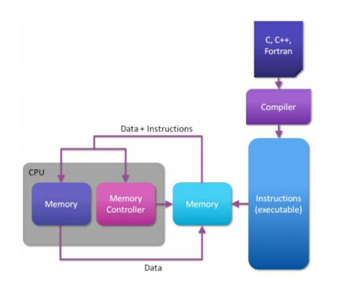

### 🧠 **Advanced Architecture Using Data Flow Computing – Detailed Note**

---

### 📘 **Concept of Data Flow Computing**

Dataflow computing is a **non-traditional computing model** where **program execution is governed by the availability of data**, rather than the control flow dictated by a program counter. In this model, a program is represented as a **directed graph**:

* **Nodes** = computation units
* **Edges** = data dependencies

This model is also referred to as:

* **Reactive programming**
* **Stream processing**

---

### 🧩 **Understanding the Images**

#### 📷 Images Overview:

* The **first image** depicts a **traditional control flow computing system**.
* The **second image** presents a **dataflow-oriented architecture**.

Let’s explain both to understand the contrast:

---

### 🧮 **Control Flow Computing (Traditional Architecture)**

In control-flow (von Neumann) systems:

1. Programs written in C, C++, or Fortran are compiled into **machine instructions**.
2. These instructions and data are stored in memory.
3. The **CPU core** fetches instructions and data, processes them, and writes results back to memory.
4. A **memory controller** manages the access between CPU and main memory.

📉 **Limitations**:

* Sequential execution model.
* Relies on caching and speculative techniques to improve performance.
* Bound by **memory latency** and **instruction bottlenecks**.
* Difficult to fully exploit **parallelism**.

---

### ⚙️ **Data Flow Computing (Advanced Architecture)**

In advanced dataflow architecture:

1. Programs are compiled into a **Dataflow Engine Configuration File** instead of linear machine code.
2. Computation happens on specialized units called **dataflow cores**.
3. Data moves directly between **dataflow cores**—no need to store intermediate results in memory.
4. Execution is **triggered by data availability**, not instruction sequence.

---

### 🔧 **Key Features of Dataflow Architecture**

| Feature                   | Description                                                                                 |
| ------------------------- | ------------------------------------------------------------------------------------------- |
| **Massive Parallelism**   | Thousands of lightweight cores execute concurrently.                                        |
| **Data-driven Execution** | Instructions execute as soon as input operands are available.                               |
| **Stream Processing**     | Data flows continuously between operators without full intermediate storage.                |
| **Low Memory Overhead**   | Reduces round-trips to memory by streaming outputs directly to next core.                   |
| **Custom Configuration**  | Applications compile into a **hardware configuration** rather than sequential instructions. |

---

### 🏭 **Ford Factory Analogy**

Think of:

* Traditional CPU cores as **multi-skilled workers** doing everything for each car.
* Dataflow cores as **specialized workers** on an assembly line, each doing one task efficiently as the car (data) moves forward.

This model:

* Improves throughput.
* Reduces energy consumption.
* Avoids idle time when data isn’t ready.

---

### 💡 **Benefits of Data Flow Computing**

✅ **Highly Parallel**: Parallelism is extracted naturally from the data dependencies.
✅ **Lower Latency**: Intermediate memory accesses are minimized.
✅ **Energy Efficient**: No speculative execution, no complex cache coherence needed.
✅ **Scalable**: Thousands of lightweight dataflow cores can be distributed across FPGAs or specialized ASICs.
✅ **Streaming-Friendly**: Ideal for real-time analytics, ML inference, video encoding, etc.

---

### ⚠️ **Challenges**

❌ Requires a shift in programming models (dataflow thinking).
❌ Difficult debugging due to distributed and asynchronous execution.
❌ Tooling (compilers, profilers) is less mature than traditional systems.
❌ Not suitable for **control-intensive** logic with frequent branching.

---

### 🎯 **Applications**

* **AI & ML inference engines**
* **Video encoding/decoding**
* **High-frequency trading**
* **IoT signal processing**
* **Scientific simulations**
* **FPGAs with dataflow overlay (e.g., Maxeler, Xilinx)**

---

### 📌 **Conclusion**

**Advanced dataflow architectures** offer a compelling alternative to traditional control flow systems by **maximizing concurrency**, **reducing memory overhead**, and **enabling low-latency processing**. They are especially effective for **streaming and compute-heavy** applications. As software tooling and hardware support mature, dataflow computing is expected to play a major role in the future of **energy-efficient, high-performance computing**.

