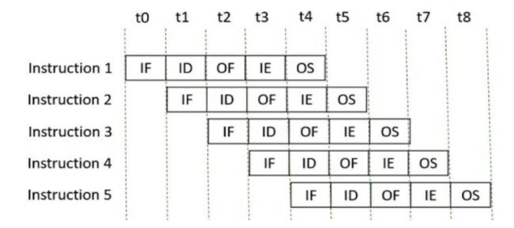
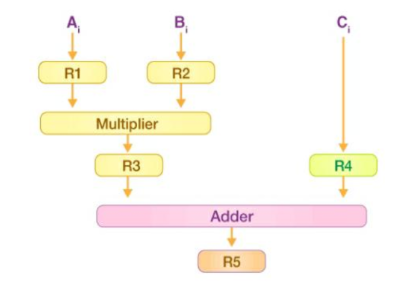

### 📘 **Instruction Pipelining – Basic Introduction and Concepts**

---

### 🧠 **Introduction to Instruction-Level Parallelism**

Processor performance is strongly tied to how efficiently instructions are executed. A key way to boost performance is through **parallelism**, which means executing multiple instructions simultaneously. One of the most effective and widely-used techniques to achieve this is **pipelining**.

---

### 🚀 **What is Pipelining?**

**Pipelining** is a hardware implementation technique where **multiple instruction steps are overlapped in execution**. Think of it as an assembly line in a factory — while one instruction is being executed, the next is being decoded, and another is being fetched.

---

### 🔄 **Pipelining Stages**

Although actual implementations may vary, the classic pipeline stages are:

| Stage  | Description                                                                  |
| ------ | ---------------------------------------------------------------------------- |
| **IF** | *Instruction Fetch*: Load instruction from memory into instruction register. |
| **ID** | *Instruction Decode*: Decode opcode and determine operation.                 |
| **AG** | *Address Generation*: Calculate memory address (optional).                   |
| **DF** | *Data Fetch*: Fetch operands from memory or register.                        |
| **EX** | *Execute*: Perform ALU operation or address calculation.                     |
| **WB** | *Write Back*: Store result back into register or memory.                     |

> Not every instruction uses every stage (e.g., some don’t need memory fetch), but most pass through at least the major ones.

---

### 📊 **Image Analysis – Pipelining Example**

#### 📷 **First Image: Instruction Pipeline Timeline**

This is a visual representation of **five instructions** executing over **time slots t0 to t8**, using five pipeline stages:

* **IF → ID → OF → IE → OS**

Each instruction enters the pipeline at a new time slot, enabling **concurrent execution**.

✅ Benefits Observed:

* After initial latency, one instruction completes per cycle (from t4 onward).
* Efficient use of hardware resources.

---

#### 📷 **Second Image: Data Dependency Pipeline (Example of Arithmetic Pipeline)**

This shows the **flow of data in arithmetic operations**:

* Inputs: Ai and Bi are loaded into **R1 and R2**
* Operands are sent to a **Multiplier**, producing R3
* Ci is loaded into **R4**
* R3 and R4 are sent to an **Adder**, producing final result R5

This pipeline illustrates:

* **Functional unit separation** (multiplier and adder).
* Clear **data flow** and **intermediate register usage**.
* The opportunity for **instruction chaining and forwarding**.

---

### 🛠️ **Pipelining Architecture**

* **Logical Pipeline**: Even though the hardware remains the same, the processor views the instruction execution as an ordered sequence of steps.
* **Physical Implementation**: Functional units (like ALU, multiplier, memory) are connected such that they operate **simultaneously** on **different instructions** or **parts of an instruction**.

---

### 🧩 **Types of Pipelining**

| Type                       | Description                                                                                              |
| -------------------------- | -------------------------------------------------------------------------------------------------------- |
| **Static Pipelining**      | All instructions go through all stages regardless of need.                                               |
| **Dynamic Pipelining**     | Instructions skip or reorder stages based on their specific requirements.                                |
| **Superpipelining**        | Increases the number of pipeline stages (narrow stages, higher clock speed).                             |
| **Superscalar Pipelining** | Multiple pipelines operate in parallel, allowing multiple instructions to be fetched/executed per cycle. |

---

### 💡 **Advantages of Pipelining**

✅ **Increased Throughput**: More instructions complete in less time.
✅ **Efficient Resource Utilization**: Every hardware unit is kept busy.
✅ **Instruction Lookahead**: Fetch next instructions while current is executing.
✅ **Supports Parallelism**: Essential for modern high-speed CPUs.

---

### ⚠️ **Challenges / Hazards**

| Hazard Type           | Description                                                                  |
| --------------------- | ---------------------------------------------------------------------------- |
| **Structural Hazard** | Hardware resource conflict (e.g., single memory unit for fetch and execute). |
| **Data Hazard**       | Dependency between instructions (e.g., instruction B needs result from A).   |
| **Control Hazard**    | Branch prediction failures causing pipeline flush.                           |

---

### 🔄 **Solutions to Hazards**

* **Forwarding/Bypassing**: Use result before it's officially written back.
* **Stalling**: Delay subsequent instructions until dependency is resolved.
* **Branch Prediction**: Guess next instruction path to reduce control hazard.

---

### 🧮 **Real-world Examples**

* **Cray-1**, **TI-ASC**, **Cyber-205**: Used **arithmetic pipelines** for floating point ops.
* **Modern CPUs**: Use dynamic pipelines, out-of-order execution, and superscalar techniques.

---

### 📝 **Conclusion**

Instruction pipelining is the **cornerstone of modern processor design**, enabling **faster execution**, **higher throughput**, and **more efficient use of resources**. While it introduces challenges like hazards and complexity in design, its performance gains far outweigh the drawbacks. Whether it’s in embedded chips or supercomputers, pipelining powers the execution of billions of instructions per second.

