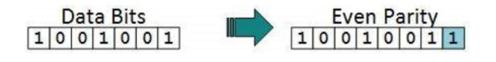
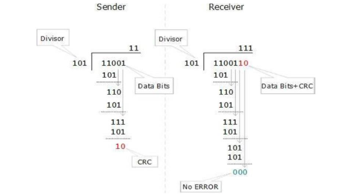

### 🔍 Error Detection and Correction

In digital communication, transmitted data is susceptible to errors due to **noise, signal interference, or hardware faults**. To ensure reliable data transmission, **error detection and correction** techniques are used, mainly implemented at the **Data Link Layer**.

---

### 🧭 Types of Errors

* **Single-bit error**: Only one bit of a data unit is altered.
* **Burst error**: Two or more bits in the data unit have changed, possibly over consecutive bits.

---

### ✅ Error Detection

Error detection ensures that **errors in the data stream are caught at the receiving end**. It does not correct the error but only notifies the system of its existence.

#### 1. **Parity Check**

A simple and widely used method:

* **Even parity**: An extra bit is added to ensure the total number of 1s is even.
* **Odd parity**: Ensures the number of 1s is odd.

**Example** (from image):

* Data: `1001001` has three 1s (odd).
* Parity bit added: `1` → makes total 1s = 4 (even).
* Transmitted frame: `10010011`

At the receiver end:

* Re-counts the 1s.
* If parity condition breaks, it flags the data as **corrupted**.

🔴 **Limitation**: Detects only **single-bit errors**. Multi-bit errors may go undetected.

---

#### 2. **Cyclic Redundancy Check (CRC)**

A powerful technique for detecting errors in **larger data blocks**.

**Steps (refer to second image):**

**At Sender:**

1. Choose a **divisor polynomial** (e.g., `101`).
2. Append zeros to the end of the data bits (length = divisor - 1).
3. Perform **binary division** using XOR.
4. The **remainder** is the CRC, appended to the data.

   * Data: `11001`, Divisor: `101`
   * CRC: `10`, Codeword sent: `1100110`

**At Receiver:**

1. Receives codeword: `1100110`
2. Divides it using same divisor `101`.
3. If remainder = `000`, **no error**.
4. If remainder ≠ `0`, **error detected**.

✅ CRC is very effective at detecting burst errors.

---

### 🛠️ Error Correction

When transmission environments **cannot tolerate retransmission** (e.g., satellite or real-time streaming), error correction becomes essential.

#### 1. **Backward Error Correction**

* If an error is detected, the receiver requests the sender to **retransmit the data**.
* Efficient when errors are **infrequent** and the **cost of retransmission is low**.

#### 2. **Forward Error Correction (FEC)**

* Uses **redundant bits** to correct errors **without retransmission**.
* Suitable for **noisy or one-way communication** (e.g., streaming, satellite).

##### 🔣 Hamming Code Example (Forward Error Correction)

* Adds **redundant bits (r)** to **data bits (m)**.
* Must satisfy: `2^r ≥ m + r + 1`
* These bits help **identify and correct** the exact position of the error.

---

### 📌 Summary Table

| Technique | Type       | Can Detect | Can Correct    | Suitable for          |
| --------- | ---------- | ---------- | -------------- | --------------------- |
| Parity    | Detection  | 1-bit      | ❌              | Simple data streams   |
| CRC       | Detection  | Burst      | ❌              | Network transmissions |
| ARQ       | Correction | ✅          | ✅ (via resend) | Reliable networks     |
| Hamming   | Correction | ✅          | ✅ (1-bit)      | Memory, modem systems |
