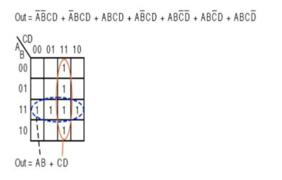
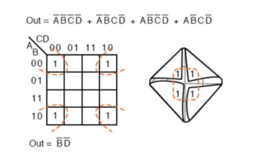
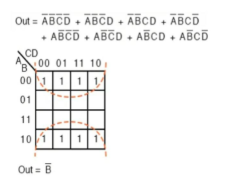

### **Karnaugh Map (K-map) Simplification – Up to 4 Variables**

Karnaugh Maps (K-maps) are a graphical method used to simplify Boolean expressions without needing complex algebraic manipulations. For up to four variables, K-maps provide a visual way to reduce logic functions to their minimal form efficiently.

---

### **Structure of 4-Variable K-map**

* The K-map for 4 variables (A, B, C, D) has 16 cells.
* Each cell represents a minterm and corresponds to a unique combination of input variables.
* Rows are labeled using the Gray code for variables A and B, and columns with Gray code for C and D.

---

### **Simplification Process**

1. **Plot the minterms** on the K-map where the output is `1` (for SOP).
2. **Group adjacent 1s** into blocks of size 1, 2, 4, 8, or even 16.

   * These blocks must be powers of two and rectangular.
   * The larger the block, the more simplified the result.
3. **Wrap-around** is allowed – the K-map is cyclic both horizontally and vertically.
4. **Each group gives one product term** by identifying common variables (same values) and dropping variables that change within the group.
5. **Combine all simplified product terms** using OR ( + ) to get the final minimal SOP expression.

---

### **Example Summaries from Provided Images**







#### ✅ **Example 1:**

Given:

```
Out = A'B'CD + A'BCD + ABCD + AB'C'D + AB'CD' + ABC'D
```

* Grouped into: two quads
* Groups: vertical (CD) and horizontal (AB)
* Final simplified output:

```
Out = AB + CD
```

#### ✅ **Example 2:**

Given:

```
Out = A'B'C'D' + AB'C'D' + A'BC'D' + ABC'D'
```

* Minterms all share `B'D'`, regardless of A or C.
* Final simplified output:

```
Out = B'D'
```

#### ✅ **Example 3:**

Given:

```
Out = A'B'C'D' + A'B'C'D + A'B'CD' + A'B'CD + AB'C'D' + AB'C'D + AB'CD' + AB'CD
```

* All 8 minterms share `B = 0`.
* Final simplified output:

```
Out = B'
```

---

### **Advantages of K-Map**

* Reduces Boolean expressions quickly.
* Ideal for simplifying logic with 2 to 4 variables.
* Minimizes hardware complexity in digital circuits.

### **Limitations**

* Becomes cumbersome for >4 variables.
* Not suitable for expressions with don’t care conditions in complex systems (unless manually plotted).

---

**Tip:** Fold corners and edges mentally when grouping – K-maps are “cylindrical” in adjacency logic.
