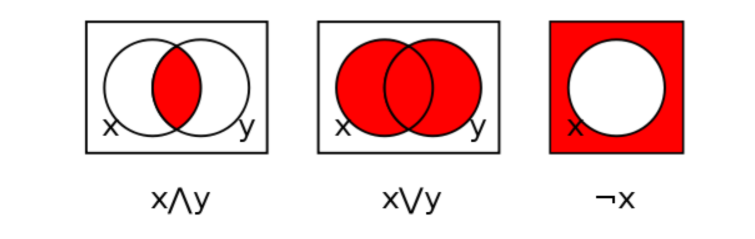

### **Chapter 9.1: Boolean Algebra in Circuit Design**


#### **What is Boolean Algebra?**

Boolean Algebra is a type of math that deals only with **True or False** values — just like how computers work with **1s and 0s**.

Instead of using numbers like in regular algebra, here we use **logic values**:

* `1` means **True**
* `0` means **False**

Boolean Algebra helps us **design and simplify logic circuits** — the building blocks of all digital devices like computers, mobile phones, and even washing machines!

---

#### **Why Is It Useful?**

Back in the 1930s, **George Boole** came up with this logic system. Later, **Claude Shannon** showed that this logic could be used to **analyze and build electronic circuits**.

---

#### **Basic Operations in Boolean Algebra**



There are **three main logic operations** (as shown in the image):

1. **AND (∧)**

   * Symbol: `x ∧ y`
   * Means: Both conditions must be true.
   * Venn diagram: Only the overlapping area of `x` and `y` is red.

2. **OR (∨)**

   * Symbol: `x ∨ y`
   * Means: At least one of the conditions must be true.
   * Venn diagram: All of `x`, `y`, and the overlap are red.

3. **NOT (¬)**

   * Symbol: `¬x`
   * Means: The opposite of the value.
   * Venn diagram: Everything **except** `x` is red.

---

#### **What Is a Boolean Expression?**

A Boolean expression is a logical sentence that returns either:

* `True` (1)
* or `False` (0)

Example:
`A AND B` is True only if **both A and B are True**.

---

#### **Some Important Terms:**

* **Boolean Variable**: Can only be 0 or 1 (False or True).
* **Boolean Function**: Uses variables, logic operators, and constants to create logic.
* **Complement**: The opposite value. If A = 1, then A' = 0.
* **Truth Table**: Shows all possible values for a logic function.

Example for 2 variables (A and B):

| A | B | A AND B | A OR B | NOT A |
| - | - | ------- | ------ | ----- |
| 1 | 1 | 1       | 1      | 0     |
| 1 | 0 | 0       | 1      | 0     |
| 0 | 1 | 0       | 1      | 1     |
| 0 | 0 | 0       | 0      | 1     |

---

#### **Boolean Algebra Rules:**

* Only two values: 1 (HIGH) and 0 (LOW)
* A + B = A OR B
* A . B = A AND B
* A' = NOT A

---

#### **Key Laws of Boolean Algebra**

These help simplify circuits:

1. **Commutative Law**

   * A + B = B + A
   * A . B = B . A
     (Order doesn’t matter)

2. **Associative Law**

   * A + (B + C) = (A + B) + C
   * A . (B . C) = (A . B) . C
     (Grouping doesn’t matter)

3. **Distributive Law**

   * A . (B + C) = A.B + A.C
   * A + (B . C) = (A + B) . (A + C)

4. **AND Laws**

   * A . 1 = A
   * A . 0 = 0
   * A . A = A
   * A . A' = 0

5. **OR Laws**

   * A + 0 = A
   * A + 1 = 1
   * A + A = A
   * A + A' = 1

6. **Inversion Law**

   * (A')' = A

---

#### **De Morgan’s Theorems (Very Important!)**

These help break down complicated logic:

1. **First Law:**

   * (A . B)' = A' + B'
   * Meaning: NOT (A AND B) = (NOT A) OR (NOT B)

2. **Second Law:**

   * (A + B)' = A' . B'
   * Meaning: NOT (A OR B) = (NOT A) AND (NOT B)

These are useful for simplifying logic gates in digital circuits.

---

#### **Real-Life Use**

Boolean Algebra is everywhere:

* Programming (if-else)
* Search engines (AND/OR keywords)
* Circuit design
* Microprocessors
* Control systems

---


## 🔌 Chapter 9.2: Representing Boolean Functions

---

### 🧠 What Is a Boolean Function?

A **Boolean function** is a logical expression made up of variables (like x, y, z), constants (0 and 1), and operations like:

* AND (`.` or ∧)
* OR (`+` or ∨)
* NOT (`'` or ¬)

These functions are the *core* of how logic gates in circuits work. You can write them in formulas, draw them as circuit diagrams, or represent them using **truth tables**.

---

### 💡 Example Boolean Function

Let’s take:
👉 `F = x'y + z`

Here’s what it means:

* If **x is 0** and **y is 1**, OR
* If **z is 1**,
  then **F will be 1**.

---

### 🎯 Different Ways to Represent Boolean Functions

1. **Algebraic Form** — Like `F = x'y + z`
2. **Truth Table** — Lists all input combinations and their output
3. **Logic Circuit** — Visual form using gates (AND, OR, NOT)

These forms are all *equivalent* — just different ways of looking at the same logic.

---

### 🔍 Circuit Diagram Breakdown (from image):

!\[Circuit Explanation]\(uploaded image)

Let’s look at the circuit step-by-step:

1. **First**, input `X` goes into a NOT gate → becomes `X'`
2. **Then**, `X'` and `Y` go into an AND gate → gives `X'.Y`
3. **Next**, the output of AND and input `Z` go into an OR gate →
   Final output: `F = (X'.Y) + Z`

---

### 🧾 Truth Table (from your image):

| x | y | z | f₁ = x'y’z + xy’z’ + xyz | f₂ = m₃ + m₅ + m₆ + m₇ |
| - | - | - | ------------------------ | ---------------------- |
| 0 | 0 | 0 | 0                        | 0                      |
| 0 | 0 | 1 | 1 → x’y’z                | 0                      |
| 0 | 1 | 0 | 0                        | 0                      |
| 0 | 1 | 1 | 1 → xyz                  | 1 → m₃                 |
| 1 | 0 | 0 | 1 → xy’z’                | 0                      |
| 1 | 0 | 1 | 0                        | 1 → m₅                 |
| 1 | 1 | 0 | 0                        | 1 → m₆                 |
| 1 | 1 | 1 | 1 → xyz                  | 1 → m₇                 |

---

### 📌 Canonical Forms

These are **standard formats** for writing Boolean expressions. There are two:

#### 1. **Sum of Minterms (SOP)**

You write **OR of all the minterms** (AND terms where output = 1)

Example for f₁:

```
f₁(x, y, z) = m₁ + m₄ + m₇  
           = x’y’z + xy’z’ + xyz
```

#### 2. **Product of Maxterms (POS)**

You write **AND of all the maxterms** where output = 0
It’s the **inverted form** of SOP.

Using De Morgan’s Law:

```
f₁ = (m₀ + m₂ + m₃ + m₅ + m₆)’  
   = M₀ . M₂ . M₃ . M₅ . M₆
```

---

### 💡 Minterm & Maxterm Rule

* **Minterm (mₙ)** → AND of each variable in either original or complemented form, based on binary input

  * Example: A = 0, B = 1, C = 1 → m₃ = A'BC
* **Maxterm (Mₙ)** → OR of variables where 1’s are complemented

  * Same input (A=0, B=1, C=1) → M₃ = A + B' + C'

**Relation:**
`mᵢ = (Mᵢ)’` and `Mᵢ = (mᵢ)’`

---

### ✅ Quick Examples:

* **SOP Form:**
  `f = x’y + yz’ + z` → terms joined by OR `+`, terms inside are AND
* **POS Form:**
  `f = (x + y)(y + z’)(z)` → ORs inside brackets, AND outside

---

### 🔄 Summary

| Term     | Format                     | Purpose                       |
| -------- | -------------------------- | ----------------------------- |
| Minterm  | AND expression (x’y’z)     | Used in SOP (Sum of Products) |
| Maxterm  | OR expression (x + y + z’) | Used in POS (Product of Sums) |
| SOP Form | m₁ + m₄ + m₇               | When output = 1               |
| POS Form | M₀ . M₂ . M₃ . M₅ . M₆     | When output = 0               |

---


## 📘 9.3 Principle of Duality 

---

### 🔁 What is the Principle of Duality in Boolean Algebra?

The **Principle of Duality** says that for **every valid Boolean expression**, there’s another expression — called its **dual** — which is also valid.

To form the dual:

1. Replace every **AND (·)** with **OR (+)**
2. Replace every **OR (+)** with **AND (·)**
3. Also, swap **0 with 1** and **1 with 0**

This principle shows that Boolean algebra is **symmetrical** — what’s true in one format is also true in its dual form.

---

### 🎯 Why It Matters:

This is useful because if we know one Boolean equation is true, we automatically know its **dual** is also true — without doing any extra calculation.

---

### 🔄 How to Apply Duality:

**Example 1:**

Given:
`1 · 0 = 0`

Dual:
`1 + 0 = 1`

✅ Both are valid!

---

**Example 2:**

Given:
`X + 0 = X`

Let’s find the dual:

* Change `+` to `·`
* Change `0` to `1`

Dual becomes:
`X · 1 = X`

✅ Again, correct!

---

**Example 3:**

Let’s try something a little more complex:

Given:
`X + 0 = 0 · 1`

First, simplify the right side:
`0 · 1 = 0`
So:
`X + 0 = 0`

Now, apply duality:

* Change `+` to `·` and `·` to `+`
* Change 0 ↔ 1

Dual becomes:
`X · 1 = 1`

✅ Still valid!

---

### 🧠 Duality Reference Table

| Operator / Value | Dual      |
| ---------------- | --------- |
| AND (`·`)        | OR (`+`)  |
| OR (`+`)         | AND (`·`) |
| 1                | 0         |
| 0                | 1         |
| A                | A         |
| A' (NOT A)       | A'        |

*(Note: NOT stays the same in duals — it’s unaffected)*

---

### ✂️ Reducing Boolean Expressions

One major use of Boolean algebra is to **simplify** logic expressions. A smaller, cleaner Boolean expression means:

* **Fewer logic gates** needed
* **Cheaper circuits**
* **More efficient hardware**

---

### ⚙️ How to Reduce Boolean Expressions

Here are some quick tips:

* **Remove duplicate terms**
* **Combine similar expressions**
* **Apply identities like A + A = A, A · A = A**
* **Drop terms that result in 0**

**Example:**

Given:
`XYZ + XY + XYZ + XY`

Step-by-step:

* Group: `(XYZ + XYZ) + (XY + XY)`
* Simplify: `XYZ + XY`

✅ Final simplified expression: `XYZ + XY`

---

### 💡 Boolean Tip:

Any time a term includes both a variable and its complement (like `A · A'`), it becomes 0:

```
A · A' = 0  
A + A' = 1
```

So if your expression has `XYZA' + XYZA`, this simplifies to:

```
XYZ(A + A') = XYZ(1) = XYZ
```

---

### 📝 Summary

* **Duality** helps create valid equivalent expressions by swapping AND ↔ OR, and 1 ↔ 0.
* Every Boolean identity has a **dual**, and it’s always true if the original is true.
* Reducing Boolean expressions makes logic circuits **simpler and cheaper**.
* Use identities and rules to **eliminate redundant terms**.

---

## 🖧 9.4 Design and Implementation of Digital Networks 

---

### 🔍 What is a Digital Network?

A **digital network** is a system built using digital technologies to handle:

* **Voice**
* **Video**
* **Data**
* **Other communication services**

It connects devices (like computers, phones, servers) through routers, switches, and access points to allow them to talk to each other. These networks form the backbone of **modern communication and business operations**.

---

### 🧱 Implementation: How Digital Networks Are Built

Digital networks are made up of small building blocks called **modules**. These can be:

* As simple as **logic gates**
* As complex as **CPUs**

The system is built **hierarchically** — smaller components come together to form bigger subsystems.

---

### 🌐 Network Devices You Should Know:

* **Routers** – Direct data between devices and networks
* **Switches** – Connect devices within a local area
* **Access Points** – Connect wireless devices
* **Controllers** – Manage the flow of data between routers (as seen in your diagram)

---

### 📦 Features of a Digital Network

1. **Centralized Management**
   Everything is monitored and controlled from one place — often cloud-based. Makes things more organized and scalable.

2. **Automation**
   Tasks like data routing and device communication are done automatically without manual setup.

3. **Security**
   These networks can detect threats — even from encrypted traffic — by analyzing data flow in real time.

4. **Virtualization**
   One physical network can be split into multiple **virtual networks**. Each one behaves like an independent network, allowing for flexibility and security.

---

### ✅ Advantages of Digital Networking

* **Scalable** – Can grow with your organization
* **Cost-effective** – More efficient for large networks
* **Highly Secure** – Better at identifying security threats
* **Agile** – Adapts quickly to changes
* **Network Analysis** – Constantly monitors performance

---

### ⚠️ Disadvantages

* **Single point of failure** – If the central controller fails, the whole network could go down.
* **Complex design** – Combining different devices, systems, and configurations makes it harder to manage.

---

### 🎯 Why Digital Networking Matters

In today's digital age, **businesses need fast and flexible networks**. Traditional networks can't keep up with modern needs — but digital networks can:

* Handle big changes in real-time
* Respond instantly to traffic
* Offer strong security and monitoring

They are essential for **digital transformation** in businesses.

---

### 🤖 Logic Gate Reference (from your uploaded chart)

| Gate | Symbol     | Function                        | Truth Table Result (F)       |
| ---- | ---------- | ------------------------------- | ---------------------------- |
| AND  | `x · y`    | Only true if both inputs are 1  | 1 only when x = 1, y = 1     |
| OR   | `x + y`    | True if at least one input is 1 | 1 when x or y = 1            |
| NOT  | `x'`       | Inverts the input               | 1 becomes 0, 0 becomes 1     |
| NAND | `(x · y)'` | Opposite of AND                 | 0 only when both x and y = 1 |
| NOR  | `(x + y)'` | Opposite of OR                  | 1 only when x = 0, y = 0     |
| XOR  | `x ⊕ y`    | True if inputs are different    | 1 when x ≠ y                 |
| XNOR | `(x ⊕ y)'` | True if inputs are same         | 1 when x = y                 |

---

### 📌 Summary

* **Digital networks** are powerful, scalable, and smart systems that allow modern communication and data exchange.
* They’re made of routers, switches, and logic-controlled systems.
* Centralized management and security make them essential in today's **cloud-driven and AI-enabled world**.
* Boolean logic gates (AND, OR, NOT, etc.) are the foundation of how data decisions are made inside these systems.


---

## 📘 9.5 Karnaugh Maps (K-maps) 

---

### 📌 What Is a Karnaugh Map?

A **K-map (Karnaugh Map)** is a **visual method** to simplify Boolean expressions — without needing to apply complex Boolean theorems manually.

Think of it as an upgraded version of a truth table. It helps reduce logical expressions to their simplest forms with **less effort**.

---

### 🎯 Why Use K-maps?

* Makes circuit designs simpler
* Minimizes the number of logic gates needed
* Faster and cleaner than applying Boolean rules step by step
* Especially useful when you have **3 to 4 variables**

---

### 📐 K-map Structure

* K-maps come in **2-variable, 3-variable, 4-variable**, and higher formats
* Each **cell** in a K-map represents a **minterm** (for SOP) or **maxterm** (for POS)
* Variable combinations are arranged in **Gray Code order**, not binary order — so only **one bit changes** between adjacent columns/rows

---

### ✍️ K-map Simplification Steps

1. **Choose** the K-map size depending on the number of variables (2, 3, 4...)
2. **For SOP**, place **1s** in the cells of the minterms
3. **For POS**, place **0s** in the cells of the maxterms
4. **Group** 1s (or 0s) into rectangles of size 1, 2, 4, or 8 (powers of 2)
5. **Each group** gives one term in the simplified Boolean expression
6. **Write** the final expression as:

   * Sum of Products (SOP)
   * Product of Sums (POS)

---

### ✅ SOP Example: 3-Variable K-map

You shared this function:

`F(A,B,C) = ∑(1,3,5,7)`

Fill the K-map with 1s at those positions. Then group them.

Groups (based on your image):

* Group of two 1s → x'y (2-variable term)
* Another group of two → z (1-variable term), etc.

Final simplified expression might look like:

```
F = A’C + BC
```

---

### ✅ POS Example: 3-Variable K-map

Example:
`F(A,B,C) = π(0,3,6,7)`

Steps:

* Plot 0s in cells 0, 3, 6, and 7
* Group the 0s (as large as possible)

From the image, the final expression is:

```
F = (A' + B') (B' + C') (A + B + C)
```

---

### ✅ SOP Example: 4-Variable K-map

You shared:
`F(P,Q,R,S) = ∑(0,2,5,7,8,10,13,15)`

Steps:

* 4-variable K-map = 4x4 grid
* Place 1s at the given positions
* Form groups of 4 where possible (to reduce variables)

Final expression is a **sum of product terms** from the groupings.

---

### ✅ POS Example: 4-Variable K-map

Given:
`F(A,B,C,D) = π(3,5,7,8,10,11,12,13)`

Place 0s at those cells in the 4-variable POS map.

Final simplified expression:

```
F = (C + D’ + B’) (C’ + D’ + A) (A’ + C + D) (A’ + B + C’)
```

---

### 🔎 Tips for Grouping in K-maps

* Groups must contain only **1s (SOP)** or **0s (POS)**
* Groups must be in **powers of 2**: 1, 2, 4, 8, etc.
* **Wrap around** edges (K-map is circular)
* Each 1 (or 0) should be in at least one group
* **Bigger groups = simpler expressions**

---

### 📊 Minterm vs Maxterm (Quick Recall)

| Form    | What to Place | Grouping Logic | Final Form        |
| ------- | ------------- | -------------- | ----------------- |
| **SOP** | Place 1s      | Group 1s       | Use AND in groups |
| **POS** | Place 0s      | Group 0s       | Use OR in groups  |

---

### 🧠 Summary

* **K-maps** simplify Boolean expressions visually and quickly.
* Use **1s for SOP**, **0s for POS**.
* Form **rectangular groups** and extract terms.
* Larger groups mean **fewer variables** → simpler circuits.

