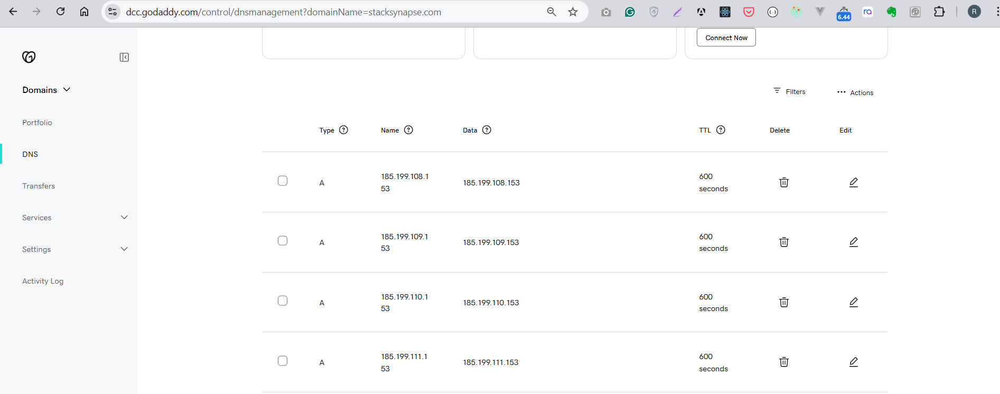
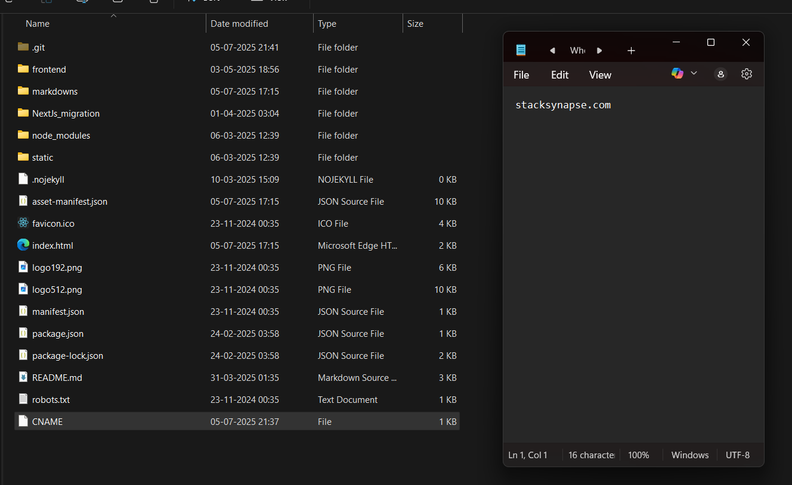
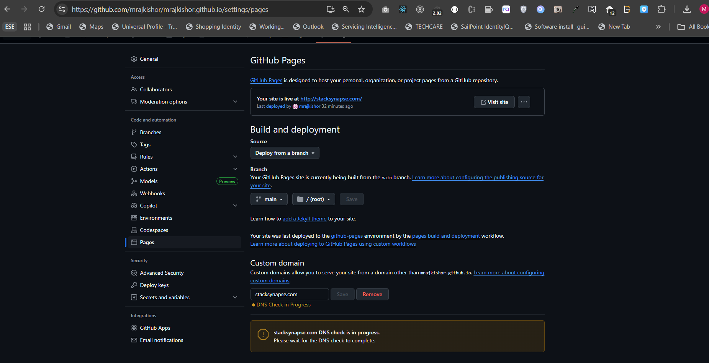
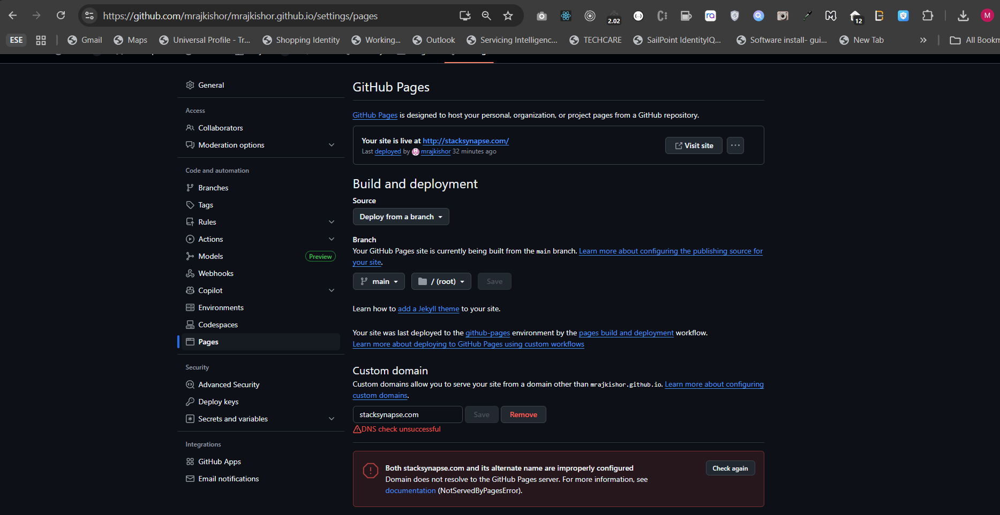
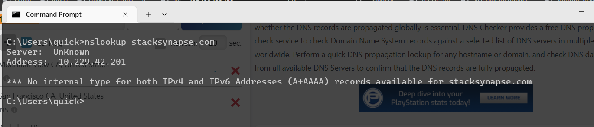
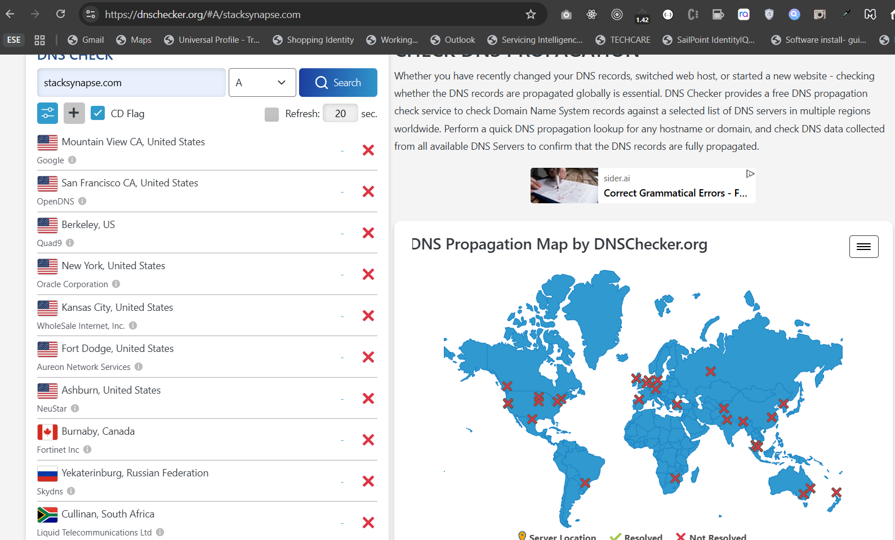
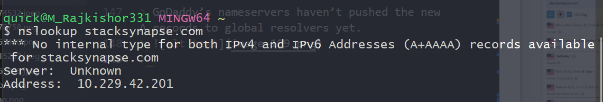
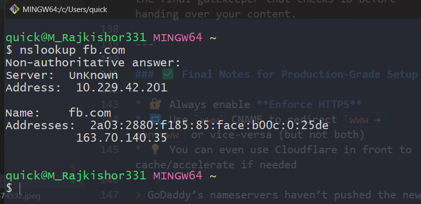
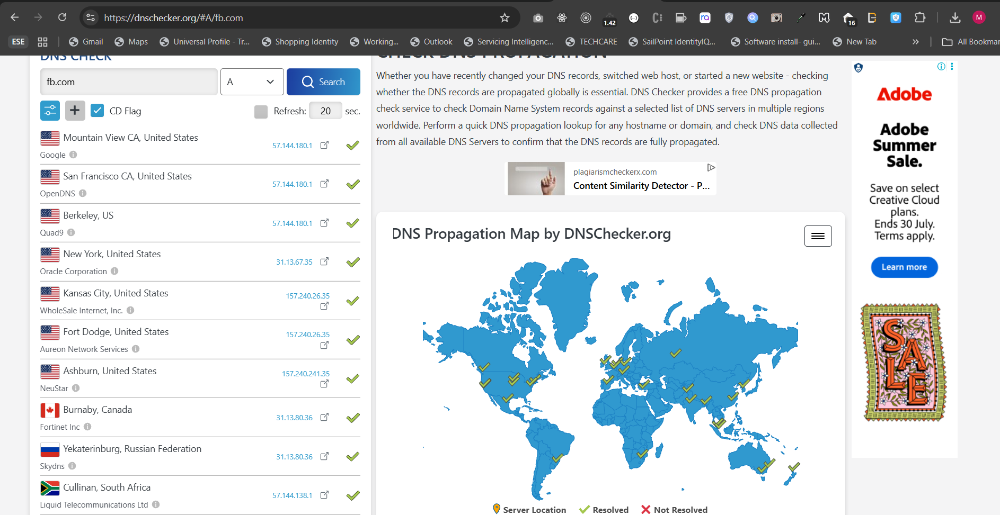

## 🌐 Understanding GitHub Pages + Custom Domain Mapping (with HTTPS) — A Deep Dive

---

### 🧩 1. What Actually Happens When You Map a Custom Domain to GitHub Pages?

At its core, domain mapping connects **your domain name** (e.g., `stacksynapse.com`) to **GitHub’s static file server**, so when someone types that URL, it serves your repo’s files.

This is done using:

* **A Records**: For root domain (`stacksynapse.com`)

* **CNAME Record**: For `www.stacksynapse.com`
* **CNAME File in GitHub**: Tells GitHub which domain it's allowed to respond to


But here’s where things get subtle — and where developers often get stuck.

---

### 🧠 2. The Role of DNS in This Flow

When someone types your custom domain in their browser, here’s what really happens:

1. **DNS Lookup** begins:

   * Browser asks: “Who owns `stacksynapse.com`?”
   * This query travels through a **chain of DNS resolvers** — from your OS to your ISP to global root servers.

2. **Resolver checks authoritative nameservers** (in your case, from GoDaddy):

   * It looks for **A records** → IPs like `185.199.108.153` (GitHub’s static servers)
   * Or **CNAME** if it's a subdomain like `www`

3. **Once resolved**, browser hits the GitHub Pages IP and loads your content.

4. Behind the scenes, GitHub checks:

   * “Is this domain pointing to our servers?”
   * “Is there a matching `CNAME` file in the repo authorizing this domain?”

If yes — **it serves your site**.

---

### 🛑 3. Why You See “Domain Not Served by Pages” (NotServedByPagesError)



This error happens when:



* DNS **hasn’t propagated** to enough resolvers
* GitHub **can’t confirm** your domain points to it
* You haven’t committed a valid `CNAME` file in the repo

GitHub uses its own internal DNS check from multiple global points. If those checks fail, the Pages system **refuses to serve the domain**.

This is a **security and routing protection**, to avoid domain hijacking or invalid mappings.

> P.S. 
> 

---

### 📡 4. DNS Propagation — The Silent Delay Monster

DNS is **not real-time**. Even if you set records in GoDaddy:

* Changes are cached across hundreds of global resolvers
* Some ISPs aggressively cache for hours
* Your own OS or router may also cache lookups

Propagation can take:

* ⏱ 5–15 mins in best case
* 🕓 24 hours in stubborn cases

---

### ⚙️ 5. How GitHub Enforces HTTPS After DNS Works

Once GitHub verifies your domain, it automatically:

* Provisions a free **Let's Encrypt SSL certificate**
* Associates the cert with `stacksynapse.com` and/or `www.stacksynapse.com`
* Enables you to check “**Enforce HTTPS**” — this rewrites all HTTP traffic to HTTPS

This process takes \~10–30 minutes after DNS resolution.

---

### 📁 6. What's the Role of the `CNAME` File in the Repo?

This file inside your GitHub Pages repo:

```
stacksynapse.com
```

Acts like a **declaration of authority**:

> “I, this repository, am allowed to serve content on behalf of this domain.”

==If this file is missing, GitHub refuses the custom domain — even if the DNS is perfect.==

---

### 🛡️ 7. Why Some DNS Setups Break Mapping (Common Gotchas)

* ❌ Having a wrong `CNAME` like `cname.stacksynapse.com` → breaks apex domain
* ❌ Using "Website Builder" or "Forwarding" features → overrides GitHub's IPs
* ❌ Forgetting to remove GoDaddy parking page
* ❌ Committing `CNAME` file with `https://` → it must be raw domain only

---

### 🧪 8. Diagnosing Like a Enterprise Engineer

Here’s how to methodically debug when GitHub Pages fails:

| Step                  | Command / Tool                                   | Expected                        |
| --------------------- | ------------------------------------------------ | ------------------------------- |
| Flush DNS             | `ipconfig /flushdns`                             | Clears old cached lookups       |
| Lookup IP             | `nslookup stacksynapse.com`                      | Should return 185.199.x.x       |
| Global Check          | [https://dnschecker.org](https://dnschecker.org) | Should be green ticks           |
| CNAME file            | In repo                                          | Must contain `stacksynapse.com` |
| GitHub Pages settings | Under `Settings → Pages`                         | Should reflect custom domain    |
| HTTPS Status          | Let’s Encrypt auto                               | Enabled within \~30 minutes     |

---

### 🧠 TL;DR Mental Model

> Domain mapping is like forwarding mail to a new house. DNS is the global address book. Propagation is postal delivery delay. GitHub is the final gatekeeper that checks ID before handing over your content.

---

### ✅ Final Notes for Production-Grade Setup

* 🔐 Always enable **Enforce HTTPS**
* 🔁 Use `www` CNAME to redirect `www → non-www` or vice-versa (but not both)
* 💡 You can even use Cloudflare in front to cache/accelerate if needed

> GoDaddy’s nameservers haven’t pushed the new A records to global resolvers yet.
> 
> 
>
> How it should actually appear when successfully nameservers are propagated. 
>
> 
> 
>
> DNS propagation is not instant — it can take up to 24–48 hours, especially for apex domains (@) using A records.
>
> There’s no technical issue in your setup anymore — just time and caching across the global DNS mesh.