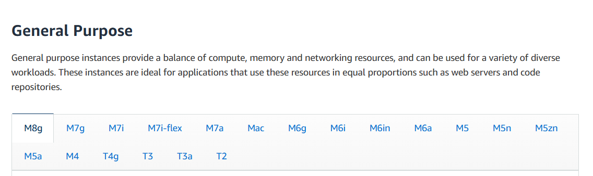
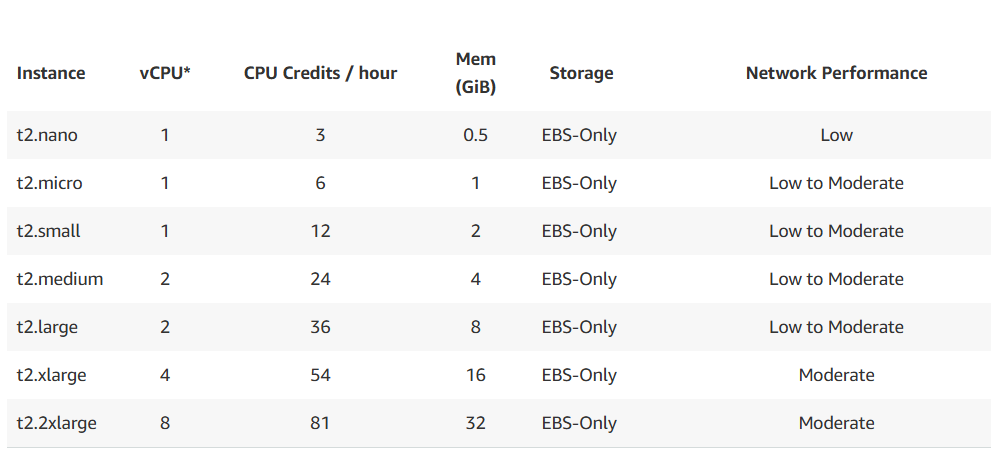
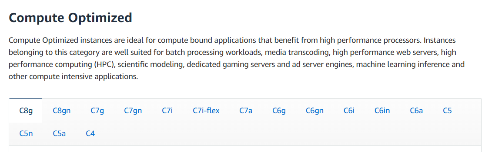
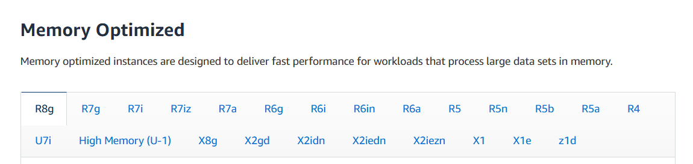
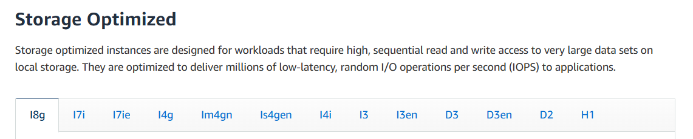
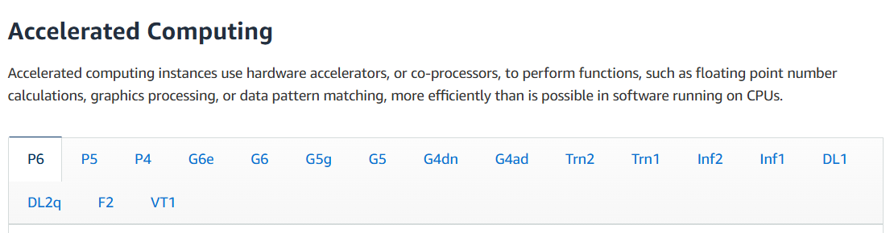

### 🧠 EC2 Instance Types 

Amazon EC2 provides a wide variety of **instance types**, each optimized for specific workloads. Instead of a one-size-fits-all server, AWS gives you options so you can pick what best suits your application — whether it’s a lightweight website or a high-performance database server.

---

### 🏷 EC2 Instance Naming Convention

Let’s decode a typical instance name: `m5.2xlarge`

* **`m`** → This is the **instance family** or class. It reflects the general purpose or type of workload (e.g., `m` for general-purpose, `c` for compute-optimized, `r` for memory-optimized, etc.).
* **`5`** → This is the **generation**. AWS continuously upgrades hardware, so newer generations offer better performance.
* **`2xlarge`** → This denotes the **size** of the instance within that family. It affects vCPUs, memory, bandwidth, and cost.

So, `m5.2xlarge` is a mid-size, 5th generation general-purpose instance.

---

### 🧩 Categories of EC2 Instance Types

AWS broadly categorizes instances based on performance focus. Let’s go over the main types:

---

### 1️⃣ **General Purpose Instances**

* **Best for**: Balanced workloads — web apps, code repos, small databases
* **Balanced performance across**: Compute, memory, and networking
* **Popular examples**: `t2.micro`, `t3`, `m5`
* **Why t2.micro?**
  It’s **part of the AWS Free Tier**, making it ideal for beginners, learners, or light applications.
  
---

### 2️⃣ **Compute Optimized Instances**

* **Best for**: Workloads that need lots of CPU power
* **Use cases**:

  * Batch processing
  * Media transcoding (video/audio conversion)
  * High-performance computing (HPC)
  * Machine learning inference
  * Gaming servers
* **Popular types**: `c5`, `c6g`, `c5n`

These instances are perfect when **CPU cycles** matter more than memory.

---

### 4️⃣ **Memory Optimized Instances**

* **Best for**: Applications that require **fast, high-capacity memory** for processing large datasets in memory
* **Use cases**:

  * High-performance **relational or non-relational databases** (like MySQL, Cassandra)
  * **Distributed cache systems** at web-scale (e.g., Memcached, Redis)
  * **In-memory BI (Business Intelligence) tools** like SAP HANA
  * Real-time applications dealing with **big, unstructured data** (logs, telemetry, etc.)

These instances are ideal when **RAM is the bottleneck**, not CPU or disk.

* **Popular instance families**:
  `r5`, `r5b`, `r6g`, `x1`, `x1e`, `z1d`, `High Memory`

They are frequently used in enterprise environments that need **ultra-fast analytics**, in-memory computing, or cache layers.

---

### 3️⃣ **Storage Optimized Instances**

* **Best for**: High-speed, large-volume storage access
* **Use cases**:

  * OLTP databases (fast read/write)
  * Relational & NoSQL DBs (like MySQL, MongoDB)
  * Caching systems (e.g., Redis)
  * Data warehouses & distributed file systems
* **Popular families**: `i3`, `d2`, `h1`

If your app frequently reads and writes huge data blocks, these are your go-to.

---

### ⚡ Accelerated Computing Instances

**Accelerated Computing** EC2 instances are purpose-built to offload complex computational tasks from the CPU to powerful **hardware accelerators** (also known as **co-processors**). These are ideal for workloads where standard CPUs fall short in terms of speed and efficiency — particularly in **AI/ML**, **HPC**, and **data-intensive graphics**.

These instances use devices like **GPUs**, **FPGAs**, and **custom accelerators** to handle operations such as:

* Floating-point arithmetic
* Deep learning model training/inference
* Scientific simulations
* Pattern recognition
* Video and image rendering

---

### 5️⃣ HPC Optimized Instances

**Best for**: Applications that require ultra-high performance computing power at scale — especially for complex simulations and tightly-coupled, parallel workloads.

#### Use cases:

* Scientific simulations in physics, chemistry, or fluid dynamics
* Genomics and molecular modeling in life sciences
* High-resolution weather forecasting and climate modeling
* Engineering workloads like FEA (Finite Element Analysis) and CFD (Computational Fluid Dynamics)
* Deep learning training at scale (especially distributed GPU training)
* Financial risk modeling and Monte Carlo simulations

These instances are designed for workloads that benefit from **low-latency networking**, **bare metal performance**, and **massive CPU scalability**.

#### Popular instance families:

`hpc6a`, `hpc6id`, `c6gn`, `c7g`, `u-24tb1.metal`

They are frequently used in **scientific research**, **enterprise R\&D**, and **AI/ML labs** where real-time, high-precision calculations or modeling are critical. Most support **Elastic Fabric Adapter (EFA)** for ultra-low network latency in clustered environments.

---

### 🔢 EC2 Instance Examples (Performance Comparison)

| Instance        | vCPU | Memory (GiB) | Storage         | Network Performance | EBS Bandwidth (Mbps) |
| --------------- | ---- | ------------ | --------------- | ------------------- | -------------------- |
| **t2.micro**    | 1    | 1            | EBS-Only        | Low to Moderate     | –                    |
| **t2.xlarge**   | 4    | 16           | EBS-Only        | Moderate            | –                    |
| **c5d.4xlarge** | 16   | 32           | 400 GB NVMe SSD | Up to 10 Gbps       | 4,750                |
| **r5.16xlarge** | 64   | 512          | EBS Only        | 20 Gbps             | 13,600               |
| **m5.8xlarge**  | 32   | 128          | EBS Only        | 10 Gbps             | 6,800                |

👉 **Note**: `t2.micro` is **free tier eligible** for up to 750 hours/month. Perfect for dev, test, or small apps.

---

### 💡 Summary – Choosing the Right Instance

Your summary table is excellent — it concisely captures the core instance families and their intended use cases. Just one key category is missing: **HPC Optimized Instances**.

---

### 💡 Summary – Choosing the Right Instance

| Instance Type                                      | Best For                                               |
| -------------------------------------------------- | ------------------------------------------------------ |
| **General Purpose** (`t`, `m`)                     | Everyday apps, dev/test environments, balanced needs   |
| **Compute Optimized** (`c`)                        | CPU-heavy apps like machine learning, media processing |
| **Memory Optimized** (`r`, `x`, `z`)               | RAM-intensive apps like large DBs, in-memory analytics |
| **Storage Optimized** (`i`, `d`, `h`)              | High IOPS, data warehousing, real-time file systems    |
| **Accelerated Computing** (`p`, `inf`, `trn`, `f`) | GPU/AI/ML workloads, video rendering, inference        |
| **HPC Optimized** (`hpc`, `u`)                     | Large-scale simulations, parallel processing, EDA/HPC  |

---

### 🔗 Bonus

Want to compare all instance types in real-time with pricing, performance, and specs?
Check this great community tool:
👉 [https://instances.vantage.sh](https://instances.vantage.sh)

