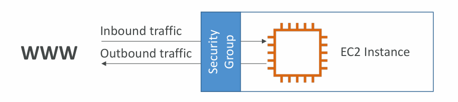
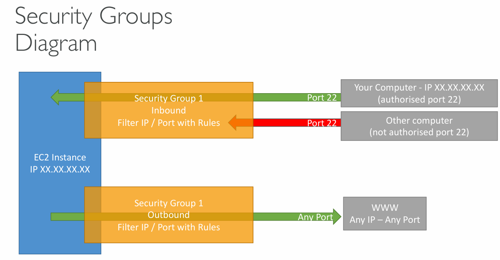
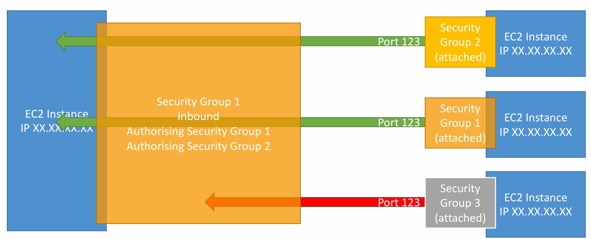

### 🔐 Introduction to AWS Security Groups

**Security Groups** are a core part of network security in AWS. Think of them as **virtual firewalls** that protect your EC2 instances. They control how traffic flows **in and out** of your instance — based on IPs, protocols, and port numbers.

Security groups are *stateful*, meaning if you allow incoming traffic on a port, the response traffic is automatically allowed — no need to explicitly define outbound rules for that session.

---

### 🔍 How Security Groups Work

* You can define **inbound rules** (who can connect to your instance).
* You can define **outbound rules** (what your instance can talk to).
* Each rule can specify:

  * **Protocol** (TCP, UDP, etc.)
  * **Port range** (e.g., 22 for SSH, 80 for HTTP)
  * **Source** or **destination** (an IP address or another security group)

💡 **Important:**
Security groups contain only **allow rules** — there are no "deny" rules.

---

### 🔧 Real-Life Example

| Type       | Protocol | Port | Source            | Purpose            |
| ---------- | -------- | ---- | ----------------- | ------------------ |
| HTTP       | TCP      | 80   | 0.0.0.0/0         | Public web traffic |
| SSH        | TCP      | 22   | 122.149.196.85/32 | Admin’s IP only    |
| Custom TCP | TCP      | 4567 | 0.0.0.0/0         | Java App Port      |

* **0.0.0.0/0** means any IPv4 address (open to the world).
* **/32** specifies a single IP address — very strict.

---

### 🧭 Inbound vs Outbound (With Diagram Logic)

Security Groups can be visualized like this:

* **Inbound Rules**: Filter traffic **coming into** the EC2 instance
  ➜ Allow traffic only from trusted IPs and specific ports
* **Outbound Rules**: Filter traffic **going out** of the EC2 instance
  ➜ By default, **all outbound traffic is allowed**

💡 Example:

* You might allow inbound SSH (port 22) only from your office IP.
* But allow outbound HTTP/HTTPS to access the internet or APIs.

---

### 🔁 Referencing Other Security Groups

Instead of allowing traffic by IP, you can **allow another security group** as a source.

📘 Example Use Case:

* Allow traffic **from a load balancer’s security group** to reach your app EC2 instances.
* This is more dynamic and secure than hardcoding IPs.

### Diagram:

* SG1 allows inbound on port 123 only from SG1 and SG2 (trusted instances).
* SG3 is not referenced — so its traffic on the same port is denied.

---

### 🔍 Things to Know (Tips & Best Practices)

* ✅ **Can be attached to multiple instances**
* ✅ **Tied to a VPC/region**, not global
* ✅ **Lives outside the instance** — traffic blocked at SG never reaches the OS
* 🔐 **Use a separate security group just for SSH access**
* ⛔ If your app is unreachable (timeout) → it’s likely a **Security Group issue**
* ❌ If app says “connection refused” → app is not running or listening

---

### 🧱 Default Behavior

| Traffic Type     | Default Behavior |
| ---------------- | ---------------- |
| Inbound Traffic  | 🔴 **Blocked**   |
| Outbound Traffic | 🟢 **Allowed**   |

This means you **must explicitly allow** any inbound connection you expect (like web, SSH, etc.), but **your instance can connect out** (e.g., to fetch updates, call APIs) without needing outbound rules.

---

### 🧠 Summary

| Feature                    | Behavior |
| -------------------------- | -------- |
| Allow rules only           | ✅ Yes    |
| Deny rules supported       | ❌ No     |
| IP-based filtering         | ✅ Yes    |
| Security group referencing | ✅ Yes    |
| Stateful                   | ✅ Yes    |
| Regional / VPC-scoped      | ✅ Yes    |

Security groups are simple yet powerful. Use them carefully to limit exposure while keeping your apps functional and reachable by the right parties.

