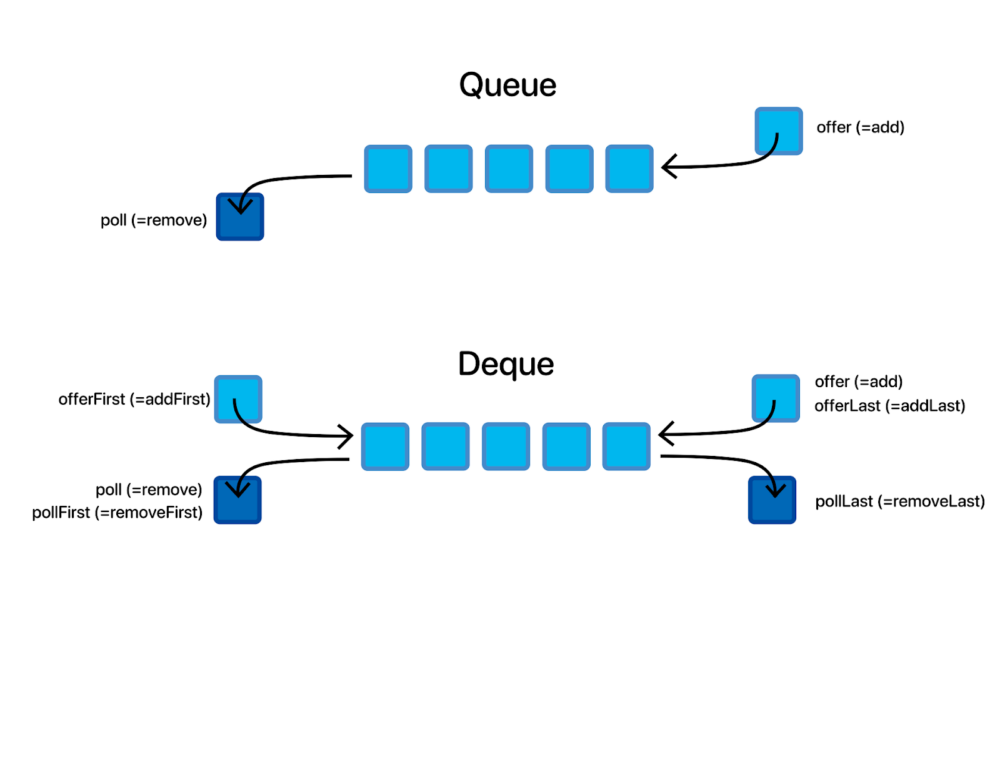

# ==Monotonic stack (in java)==

A **monotonic stack** is a stack that maintains its elements in a **monotonic order** — either **increasing** or **decreasing** — depending on the problem you're solving. It’s particularly useful in problems involving:

* Next Greater Element
* Daily Temperatures
* Histogram Maximum Area
* Sliding Window Maximum
* Stock Span Problem

---

### 🔧 Monotonic Stack Types:

* **Monotonic Increasing Stack:**
  Elements are kept in **increasing order** from bottom to top.
  Useful for finding the **next smaller element**.

* **Monotonic Decreasing Stack:**
  Elements are kept in **decreasing order** from bottom to top.
  Useful for finding the **next greater element**.

---

### 📌 Java Template: Monotonic Increasing Stack

This example finds the **next smaller element to the right** for each element in an array:

```java
import java.util.*;

public class MonotonicStack {
    public static int[] nextSmallerElements(int[] nums) {
        int n = nums.length;
        int[] result = new int[n];
        Stack<Integer> stack = new Stack<>(); // stores indices

        for (int i = n - 1; i >= 0; i--) {
            while (!stack.isEmpty() && nums[stack.peek()] >= nums[i]) {
                stack.pop(); // remove all elements >= current
            }

            result[i] = stack.isEmpty() ? -1 : nums[stack.peek()];
            stack.push(i); // push current index
        }

        return result;
    }

    public static void main(String[] args) {
        int[] nums = {5, 2, 6, 1, 3};
        System.out.println(Arrays.toString(nextSmallerElements(nums)));
        // Output: [2, 1, 1, -1, -1]
    }
}
```

---

### 📌 Java Template: Monotonic Decreasing Stack

This example finds the **next greater element**:

```java
public static int[] nextGreaterElements(int[] nums) {
    int n = nums.length;
    int[] result = new int[n];
    Stack<Integer> stack = new Stack<>();

    for (int i = n - 1; i >= 0; i--) {
        while (!stack.isEmpty() && stack.peek() <= nums[i]) {
            stack.pop();
        }

        result[i] = stack.isEmpty() ? -1 : stack.peek();
        stack.push(nums[i]);
    }

    return result;
}
```

---

### 💡 Real Use Cases

| Problem                            | Monotonic Stack Type | Purpose                  |
| ---------------------------------- | -------------------- | ------------------------ |
| **Daily Temperatures**             | Decreasing           | Find next warmer day     |
| **Largest Rectangle in Histogram** | Increasing           | Track boundaries         |
| **Stock Span**                     | Decreasing           | Track price drops        |
| **Next Greater Element**           | Decreasing           | Track next larger number |

---

# ==Monotonic queue (in Java)==


A **Monotonic Queue** in Java is a specialized data structure (usually built with `Deque`) that always maintains its elements in **sorted order** — either increasing or decreasing — which makes it ideal for **sliding window max/min** problems.

Unlike a regular queue, a monotonic queue removes elements from the back that violate the monotonic condition when new elements are added.




---

### ✅ Use Case: Find Maximum in Sliding Window (Monotonic Decreasing Queue)

Here’s how you implement a **monotonic decreasing queue** to get the maximum in a sliding window:

---

### 🔧 Java Implementation

```java
import java.util.*;

public class MonotonicQueueJava {
    public static int[] maxSlidingWindow(int[] nums, int k) {
        Deque<Integer> deque = new ArrayDeque<>();
        int[] result = new int[nums.length - k + 1];
        int idx = 0;

        for (int i = 0; i < nums.length; i++) {
            // 1. Remove indices that are out of the window (from left)
            while (!deque.isEmpty() && deque.peekFirst() <= i - k) {
                deque.pollFirst();
            }

            // 2. Maintain decreasing order in deque
            while (!deque.isEmpty() && nums[deque.peekLast()] < nums[i]) {
                deque.pollLast();
            }

            // 3. Add current element's index (to right)
            deque.offerLast(i);

            // 4. Append the maximum (front of the deque) to result
            if (i >= k - 1) {
                result[idx++] = nums[deque.peekFirst()];
            }
        }

        return result;
    }

    public static void main(String[] args) {
        int[] nums = {1, 3, -1, -3, 5, 3, 6, 7};
        int k = 3;
        System.out.println(Arrays.toString(maxSlidingWindow(nums, k)));
        // Output: [3, 3, 5, 5, 6, 7]
    }
}
```

---

### 🧠 Key Concepts:

| Step                               | Explanation                                                          |
| ---------------------------------- | -------------------------------------------------------------------- |
| `deque.peekFirst() <= i - k`       | Remove index if it's outside the current window                      |
| `nums[deque.peekLast()] < nums[i]` | Maintain decreasing order by removing smaller elements from the back |
| `deque.offerLast(i)`               | Push the current index                                               |
| `deque.peekFirst()`                | Always points to the maximum in current window                       |

---

### 🔄 To make it for **minimum**, reverse the comparison:

```java
while (!deque.isEmpty() && nums[deque.peekLast()] > nums[i]) {
    deque.pollLast();
}
```

---

# ==Monotonic stack vs monotonic deque== 

**Monotonic Stack** and **Monotonic Deque (or Queue)** are similar in idea (keeping values in a monotonic order), but they differ in **usage**, **structure**, and **problem types**.

---

### 🧠 1. Core Concept

| Concept         | Monotonic Stack                                | Monotonic Deque / Queue                   |
| --------------- | ---------------------------------------------- | ----------------------------------------- |
| Data Structure  | **Stack** (LIFO, one end)                      | **Deque** (Double-ended queue)            |
| Access Points   | One end — push/pop from top                    | Both ends — insert/remove from front/back |
| Maintains Order | Increasing or decreasing                       | Increasing or decreasing                  |
| Used For        | **Next Greater/Smaller Element** type problems | **Sliding Window Max/Min** problems       |

---

### 🧱 2. Structural Difference

| Feature            | Monotonic Stack              | Monotonic Deque                          |
| ------------------ | ---------------------------- | ---------------------------------------- |
| Remove outdated?   | No need (not sliding window) | Yes — remove elements outside the window |
| Can skip elements? | Yes — pop smaller elements   | Yes — pop from back while inserting      |
| Windowed access?   | Not typical                  | Yes — designed for windowed ranges       |

---

### ✅ 3. When to Use What?

| Problem Type                                                                           | Use                                          |
| -------------------------------------------------------------------------------------- | -------------------------------------------- |
| **Next Greater Element**, **Stock Span**, **Daily Temperatures**                       | ✅ Monotonic Stack (LIFO, lookahead problems) |
| **Sliding Window Max/Min**, **Longest Subarray in Window**, **Windowed Range Queries** | ✅ Monotonic Deque (sliding window problems)  |

---

### 🔁 4. Code Comparison

**Monotonic Stack (Next Greater Element):**

```java
Stack<Integer> stack = new Stack<>();
for (int i = nums.length - 1; i >= 0; i--) {
    while (!stack.isEmpty() && stack.peek() <= nums[i]) stack.pop();
    result[i] = stack.isEmpty() ? -1 : stack.peek();
    stack.push(nums[i]);
}
```

**Monotonic Deque (Sliding Window Maximum):**

```java
Deque<Integer> deque = new ArrayDeque<>();
for (int i = 0; i < nums.length; i++) {
    while (!deque.isEmpty() && deque.peekFirst() <= i - k) deque.pollFirst();
    while (!deque.isEmpty() && nums[deque.peekLast()] < nums[i]) deque.pollLast();
    deque.offerLast(i);
    if (i >= k - 1) result[idx++] = nums[deque.peekFirst()];
}
```

---

### 🎯 Summary

| Feature               | Monotonic Stack      | Monotonic Deque |
| --------------------- | -------------------- | --------------- |
| Structure             | Stack (1 end)        | Deque (2 ends)  |
| Usage Pattern         | One-time scan        | Sliding window  |
| Typical Problems      | Next greater/smaller | Window max/min  |
| Access Elements       | Top only             | Front & back    |
| Handles Window Limits | No                   | Yes             |
