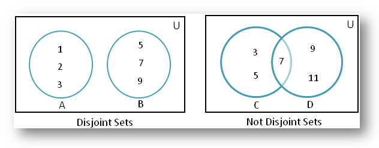
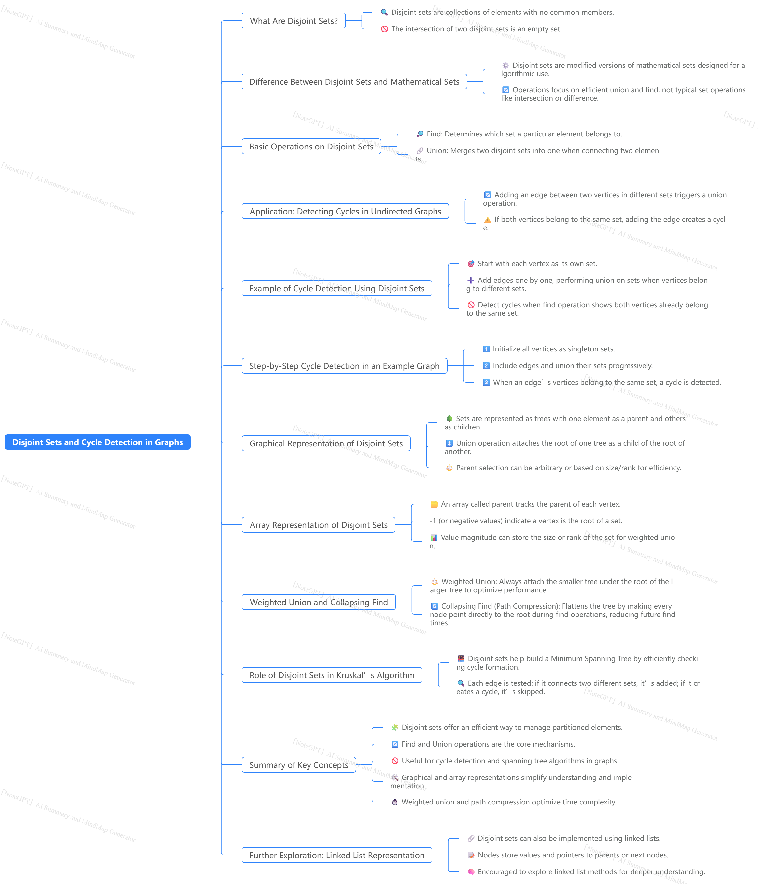

# 🔷 Union-Find (Disjoint Set Union - DSU)

---

## ✅ 1. **Concept**

The **Union-Find** data structure (also called **Disjoint Set Union - DSU**) is used to **track a set of elements partitioned into a number of disjoint (non-overlapping) subsets**.

It supports two primary operations:

* **Find(x)** → Determine the representative (root) of the set containing element `x`.
* **Union(x, y)** → Merge the sets containing `x` and `y`.

It’s the backbone of efficient **graph connectivity algorithms**, especially when dealing with:

* Dynamic connectivity
* Cycle detection
* Minimum spanning trees (like Kruskal’s Algorithm)
* Grid unions (like in "Number of Islands" problems)

---

## 🧠 2. **Real-World Analogy**

Imagine students grouped into clubs. Each student belongs to only one club at a time. You need to:

* Find out which club a student belongs to
* Merge two clubs together

---

## ⚙️ 3. **Core Operations**

### ✅ `Find(x)` – Path Compression (Optimized)

Finds the representative of the set containing `x`. With **path compression**, we flatten the tree during lookup, making future lookups faster.

```python
def find(x):
    if parent[x] != x:
        parent[x] = find(parent[x])  # Path compression
    return parent[x]
```

### ✅ `Union(x, y)` – Union by Rank / Size

Merges two disjoint sets by attaching the shorter tree to the root of the taller tree to avoid creating tall trees.

```python
def union(x, y):
    root_x = find(x)
    root_y = find(y)
    if root_x == root_y:
        return
    if rank[root_x] > rank[root_y]:
        parent[root_y] = root_x
    elif rank[root_x] < rank[root_y]:
        parent[root_x] = root_y
    else:
        parent[root_y] = root_x
        rank[root_x] += 1
```

---

## ⏱️ 4. **Time and Space Complexity**

| Operation        | Complexity |
| ---------------- | ---------- |
| `find(x)`        | `O(α(n))`  |
| `union(x, y)`    | `O(α(n))`  |
| Space Complexity | `O(n)`     |

> `α(n)` is the **inverse Ackermann function**, which grows extremely slowly (practically constant for all real-world inputs).

---

## 🔩 5. **Use Cases and Applications**

### ✅ Graph Problems

* **Connected Components** (`Number of Provinces`, `Friend Circles`)
* **Cycle Detection** in undirected graphs
* **Minimum Spanning Tree** (Kruskal's algorithm)
* **Dynamic Connectivity** (online union queries)

### ✅ Grid Problems

* **Number of Islands**
* **Percolation Systems**
* **Flood Fill Variants**

### ✅ Other Domains

* **Network Connectivity**
* **Image Segmentation**
* **Clustering algorithms** in Machine Learning

---

## 💡 6. Optimizations

### ✅ Path Compression

Compresses the tree height during `find()` → almost constant-time queries.

### ✅ Union by Rank / Size

Always attach the smaller tree under the bigger one → avoids skewed trees.

These two optimizations **combined** result in **near-constant time operations**, formally `O(α(n))`.

---

## 🚧 7. Limitations

* Not designed to **remove** elements from sets.
* Not suited for problems where sets overlap (non-disjoint).
* For directed graphs (like detecting cycles), needs careful adaptation or different structures (e.g., Tarjan’s Algorithm).

---

## 📦 8. Python Implementation (Clean Version)

```python
class UnionFind:
    def __init__(self, n):
        self.parent = list(range(n))
        self.rank = [0] * n

    def find(self, x):
        if self.parent[x] != x:
            self.parent[x] = self.find(self.parent[x])  # Path compression
        return self.parent[x]

    def union(self, x, y):
        rootX = self.find(x)
        rootY = self.find(y)
        if rootX == rootY:
            return False  # Already connected
        if self.rank[rootX] < self.rank[rootY]:
            self.parent[rootX] = rootY
        elif self.rank[rootX] > self.rank[rootY]:
            self.parent[rootY] = rootX
        else:
            self.parent[rootY] = rootX
            self.rank[rootX] += 1
        return True
```


## Java Implementation 

### ✅ Java Code — UnionFind / Disjoint Set Union

```java 

public class UnionFind {
    private int[] parent;
    private int[] rank;

    // Constructor to initialize parent and rank
    public UnionFind(int n) {
        parent = new int[n];
        rank = new int[n];

        // Initially, each node is its own parent
        for (int i = 0; i < n; i++) {
            parent[i] = i;
            rank[i] = 0; // Optional, default is 0
        }
    }

    // Find with path compression
    public int find(int x) {
        if (parent[x] != x) {
            parent[x] = find(parent[x]); // Path compression
        }
        return parent[x];
    }

    // Union by rank
    public boolean union(int x, int y) {
        int rootX = find(x);
        int rootY = find(y);

        // Already in the same set
        if (rootX == rootY) {
            return false;
        }

        // Union by rank
        if (rank[rootX] < rank[rootY]) {
            parent[rootX] = rootY;
        } else if (rank[rootX] > rank[rootY]) {
            parent[rootY] = rootX;
        } else {
            parent[rootY] = rootX;
            rank[rootX]++;
        }

        return true;
    }

    // Test the UnionFind class
    public static void main(String[] args) {
        int n = 5; // Number of elements
        UnionFind uf = new UnionFind(n);

        // Union operations
        uf.union(0, 1);
        uf.union(1, 2);
        uf.union(3, 4);

        // Check connections
        System.out.println("Is 0 connected to 2? " + (uf.find(0) == uf.find(2))); // true
        System.out.println("Is 0 connected to 4? " + (uf.find(0) == uf.find(4))); // false

        // Connecting 2 and 4
        uf.union(2, 4);
        System.out.println("Is 0 connected to 4 now? " + (uf.find(0) == uf.find(4))); // true
    }
}
```

> Output:
> Is 0 connected to 2? true
Is 0 connected to 4? false
Is 0 connected to 4 now? true


--- 

## Theoretical Explanation: 

This code is an implementation of **Union-Find** (also known as **Disjoint Set Union – DSU**), which is a classic data structure for efficiently keeping track of **disjoint sets** and quickly answering the questions:

* "Are two elements in the same set?" (**find** operation)
* "Merge the sets containing two elements." (**union** operation)

> In mathematics, two sets are considered disjoint if they have no elements in common; their intersection is an empty set (or null set). In simpler terms, if you were to compare two disjoint sets, you wouldn't find a single element that exists in both sets. 
> 


> ==__YT Code__==: https://www.youtube.com/watch?v=eTaWFhPXPz4

> __Note__: 
> Disjoint-set (kruskal's algorithm) only detects cycle in un-directed graph. Because union operator merge two sets, it doesn't care about their direction, while disjoint set detects cycle whether its directed or undirected. For more.. follow the ==YT Code==. For Directed Graph, there is topological sort (Kahn's Algo) for Cycle detection. 

> Disjoint sets are not exactly how its in maths, its bit modified for programming convenience. 
> It is used by Krushkal's algo to detect cycles in a graph. 

> __YT Theory__: https://www.youtube.com/watch?v=wU6udHRIkcc&t=382s
> <ins>MindMap:
> 


---

## **1. Theoretical Idea**

Imagine you have `n` elements, each starting in its own group (set). As operations happen, some sets get merged, and you want to keep track of connectivity efficiently.

Union-Find is built around two main operations:

### **a) Find (with Path Compression)**

* Purpose: Determine the *representative* (root) of the set an element belongs to.
* Path Compression Optimization: While finding the root, you make each visited node point directly to the root.
* This flattens the tree structure, making future lookups faster (almost O(1) amortized).

---

### **b) Union (by Rank)**

* Purpose: Merge two sets by connecting their roots.
* Rank Optimization: Attach the shorter tree to the taller one to keep the tree shallow.
* Rank here is **not the actual height**, but a rough estimate to guide merges.

---

## **2. How This Code Implements It**

### **Data Members**

```java
private int[] parent; // parent[i] = parent of i, or i itself if it's the root
private int[] rank;   // rank[i] = approx. height of tree rooted at i
```

---

### **Constructor**

```java
for (int i = 0; i < n; i++) {
    parent[i] = i; // each node is its own parent
    rank[i] = 0;   // trees start with height 0
}
```

This starts with `n` *disconnected* single-node sets.

---

### **Find with Path Compression**

```java
if (parent[x] != x) {
    parent[x] = find(parent[x]); // recursive compression
}
return parent[x];
```

* If a node isn’t its own parent, recursively find its root and directly link it to that root.
* This reduces tree depth, so future lookups are faster.

---

### **Union by Rank**

```java
int rootX = find(x);
int rootY = find(y);
if (rootX == rootY) return false; // already connected

if (rank[rootX] < rank[rootY]) {
    parent[rootX] = rootY; // attach smaller to bigger
} else if (rank[rootX] > rank[rootY]) {
    parent[rootY] = rootX;
} else {
    parent[rootY] = rootX; // equal rank → choose one root
    rank[rootX]++;         // increase rank since height grows
}
return true;
```

This ensures that trees stay as flat as possible, making both `find` and `union` very fast.

---

## **3. Time Complexity (Theoretical)**

* Without optimizations: `O(n)` per operation in the worst case.
* With **Path Compression + Union by Rank**:

  * Amortized time is `O(α(n))`, where `α(n)` is the **inverse Ackermann function**.
  * For all practical values of `n` (even up to the size of the internet), `α(n)` ≤ 4, so operations are *almost constant time*.

---

## **4. Example Walkthrough**

Let's run `n = 5` elements: `{0}, {1}, {2}, {3}, {4}`

1. `union(0, 1)` → merge sets `{0,1}`
2. `union(1, 2)` → merges `{0,1}` with `{2}` → `{0,1,2}`
3. `union(3, 4)` → `{3,4}`
4. `find(0) == find(2)` → true (same set)
5. `find(0) == find(4)` → false (different sets)
6. `union(2, 4)` → `{0,1,2,3,4}`
7. `find(0) == find(4)` → true


<ins>Explanation of this example: 

### Step-by-step parent tree representation:

**Initial:**

```
0   1   2   3   4
(each is its own parent)
```

**After `union(0, 1)`**:

```
0   2   3   4
|
1
```

(parent\[1] = 0, rank\[0] = 1)

**After `union(1, 2)`** (find(1) → 0, so attach 2 to 0):

```
  0
 / \
1   2
3   4
```

**After `union(3, 4)`**:

```
  0       3
 / \       \
1   2       4
```

**After `union(2, 4)`** (find(2) → 0, find(4) → 3, merge these roots):

```
    0
   /|\
  1 2 3
       \
        4
```


---

## **5. Common Applications**

* **Dynamic connectivity** (graph algorithms like Kruskal’s MST)
* **Connected components detection**
* **Network connectivity**
* **Image segmentation**
* **Percolation theory**
* **Tracking friend groups in social networks**


---

### ✅ Example Usage (e.g. Leetcode 547 — Number of Provinces)

```java
public class Solution {
    public int findCircleNum(int[][] isConnected) {
        int n = isConnected.length;
        UnionFind uf = new UnionFind(n);

        for (int i = 0; i < n; i++) {
            for (int j = i + 1; j < n; j++) {
                if (isConnected[i][j] == 1) {
                    uf.union(i, j);
                }
            }
        }

        Set<Integer> uniqueProvinces = new HashSet<>();
        for (int i = 0; i < n; i++) {
            uniqueProvinces.add(uf.find(i));
        }

        return uniqueProvinces.size();
    }
}
```


---

## 🧪 9. Problem Examples

| Problem                                                                                                                               | Description                              |
| ------------------------------------------------------------------------------------------------------------------------------------- | ---------------------------------------- |
| [547. Number of Provinces](https://leetcode.com/problems/number-of-provinces/)                                                        | Count disjoint sets (connected groups)   |
| [684. Redundant Connection](https://leetcode.com/problems/redundant-connection/)                                                      | Cycle detection in undirected graph      |
| [1319. Number of Operations to Make Network Connected](https://leetcode.com/problems/number-of-operations-to-make-network-connected/) | Minimum operations to connect components |
| [990. Satisfiability of Equality Equations](https://leetcode.com/problems/satisfiability-of-equality-equations/)                      | Apply DSU to symbolic equality reasoning |

---

## 🧩 10. Advanced Variants

### ✅ DSU on Trees (Heavy-Light Decomposition)

Used in segment trees and LCA (Lowest Common Ancestor) problems.

### ✅ Persistent DSU

Used in version-controlled environments (e.g., rollbacks in time-travel queries).

### ✅ Weighted DSU

Attach weights to edges and support range queries.

---

## 💬 11. Common Interview Traps

| Trap                                                | Fix                                                |
| --------------------------------------------------- | -------------------------------------------------- |
| Forgetting to compress paths in `find()`            | Always apply `parent[x] = find(parent[x])`         |
| Not using `union by rank/size`                      | Causes poor performance on skewed trees            |
| Thinking DSU works on **directed** graphs           | DSU is designed for **undirected** graphs          |
| Using `union()` blindly without checking connection | Use return value to detect already-connected nodes |

---

## 🔚 Summary

| Feature           | Description                                             |
| ----------------- | ------------------------------------------------------- |
| Data Structure    | Union-Find / Disjoint Set Union                         |
| Primary Use       | Track connectivity between disjoint sets                |
| Operations        | `find()`, `union()`                                     |
| Optimizations     | Path Compression + Union by Rank/Size                   |
| Time Complexity   | Nearly `O(1)` for most real inputs                      |
| Use in Interviews | Cycle detection, MST, clustering, islands, connectivity |
| Advanced Use      | Version control, DSU on trees, grid unions              |


