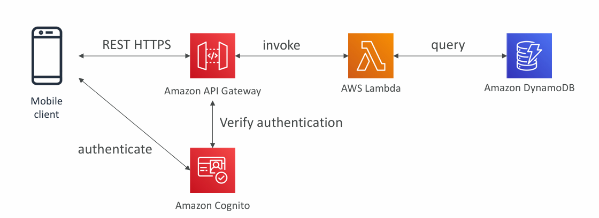
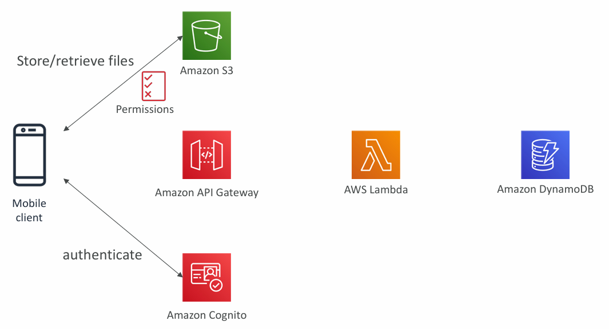
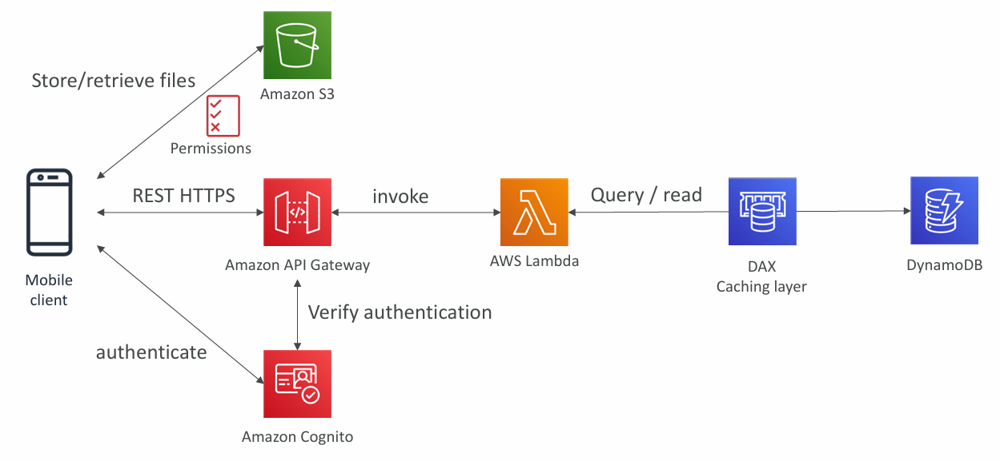
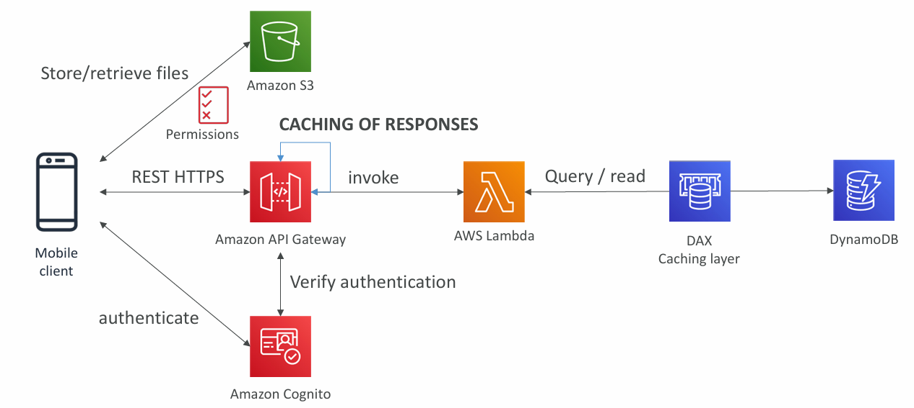

## **Serverless Architectures for Mobile Application: MyTodoList**

### **Overview**

The goal is to design and implement a mobile application named **MyTodoList** using a **serverless architecture** on AWS. The application requirements dictate a fully managed, scalable backend that exposes a REST API over HTTPS, supports direct user access to their own storage space in S3, and handles authentication securely. Additionally, since the app’s read operations significantly outweigh write operations, the design must ensure **high read throughput**.

---

## **Functional Requirements**

1. **REST API with HTTPS**

   * Expose core application functionality as a RESTful API secured with HTTPS.
2. **Serverless Backend**

   * Use AWS managed services to avoid infrastructure provisioning and maintenance.
3. **S3 Direct Access**

   * Users can directly store/retrieve files from **Amazon S3** in their own isolated folders.
4. **Authentication**

   * Managed authentication via **Amazon Cognito** with temporary, restricted-access credentials.
5. **High Read Scalability**

   * Database must handle large numbers of read requests efficiently.
6. **Optimized Data Access**

   * Since most operations are reads, employ caching strategies.

---

## **Architecture Components**

### **1. REST API Layer**

* **Amazon API Gateway**

  * Entry point for mobile client requests.
  * Handles request validation, throttling, and integrates with authentication.
* **AWS Lambda**

  * Executes backend business logic without managing servers.
  * Invoked by API Gateway on each request.
* **Amazon DynamoDB**

  * NoSQL database for storing to-do items.
  * Scales automatically with workload.

**Flow:**

1. Mobile client sends HTTPS request to API Gateway.
2. API Gateway verifies authentication with Cognito.
3. API Gateway invokes Lambda.
4. Lambda queries DynamoDB.
5. Response returns to client.

---

### **2. Direct User Access to S3**

* **Amazon Cognito**

  * Issues ==temporary== AWS credentials with restricted IAM policies.
  * Ensures users only access their personal S3 folders.
* **Amazon S3**

  * Stores user-specific files (attachments, images, etc.).
  * Policies enforce folder-level permissions.

**Flow:**

1. Mobile client authenticates with Cognito.
2. Cognito returns temporary credentials.
3. Client directly interacts with S3 (upload/download).

---

### **3. Handling High Read Throughput**

* **DynamoDB Accelerator (DAX)**

  * In-memory caching layer for DynamoDB.
  * Reduces read latency from milliseconds to microseconds.
  * Ideal for frequent reads of relatively static data.

**Flow:**

1. Lambda queries DAX instead of DynamoDB directly.
2. If the item is cached, DAX returns instantly.
3. If not cached, DAX fetches from DynamoDB and stores it for future reads.

---

### **4. API Gateway Caching**

* API Gateway can cache entire REST responses.
* ==Reduces repeated Lambda executions for the same request.==
* Particularly useful when:

  * ==Data doesn’t change frequently.==
  * ==Same request is sent multiple times.==

---

## **Security Model**

* **Authentication & Authorization**

  * Handled by **Amazon Cognito**.
  * OAuth/OpenID Connect tokens ensure secure API access.
* **Access Control**

  * IAM roles and policies restrict each user to their own data in S3 and DynamoDB.

---

## **Key Benefits of This Architecture**

* **No Server Management** – All backend components are fully managed.
* **Scalability** – Auto-scales based on load (Lambda, DynamoDB, API Gateway).
* **Cost Efficiency** – Pay-per-use model; no idle server cost.
* **High Performance Reads** – Combination of DAX and API Gateway caching reduces latency.
* **Secure Data Access** – Temporary credentials and fine-grained IAM policies prevent data leakage.

---

## **Key Points**

1. **Serverless REST API** using HTTPS, API Gateway, Lambda, DynamoDB.
2. **Cognito for Temporary AWS Credentials** – Enables direct S3 access with restricted policy.
3. **DynamoDB Read Caching** – Implemented via DAX for microsecond reads.
4. **API Gateway Caching** – Reduces redundant Lambda calls for repeated requests.
5. **Security** – Authentication and authorization via Cognito, integrated into API Gateway.

