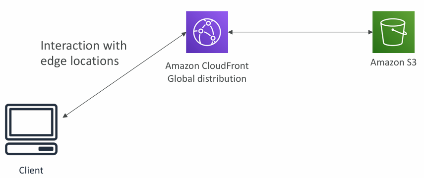
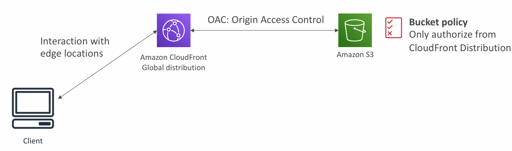
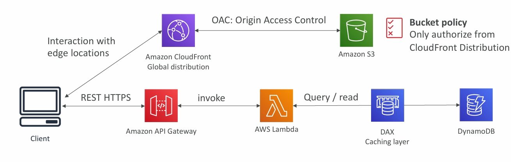
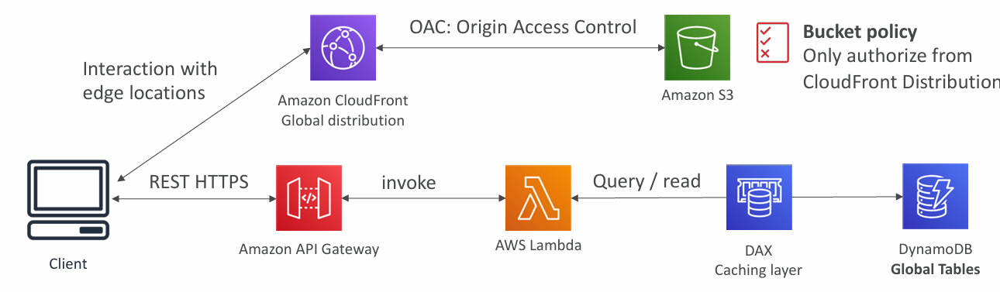
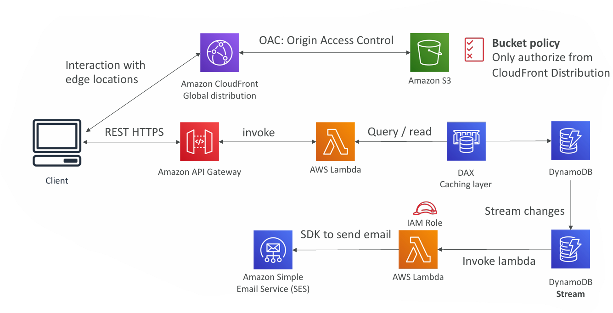
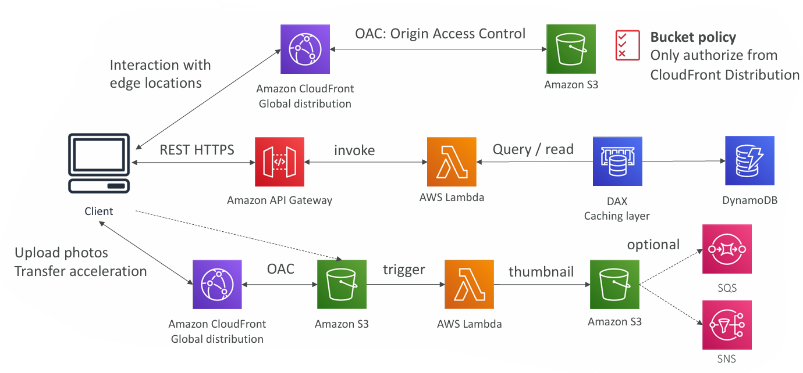
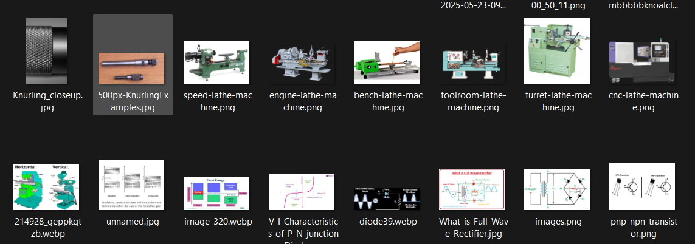

## **Serverless Hosted Website – MyBlog.com**

### **1. Requirements Overview**

The MyBlog.com platform is designed as a **serverless, globally scalable website** with the following characteristics:

* **Global scalability** – Serve content efficiently to users worldwide.
* **High read-to-write ratio** – Blogs are infrequently written but often read, so the architecture must prioritize **fast read performance**.
* **Static + Dynamic Content** –

  * Static: HTML, CSS, JS, images.
  * Dynamic: Blog API (e.g., retrieving posts, user interactions).
* **Caching** – Minimize database and API load where possible.
* **Automated Workflows**:

  * New subscriber → receive welcome email.
  * Photo upload → automatic thumbnail generation.

---

## **2. Serving Static Content Globally**

* **Amazon S3**

  * Stores static website assets (HTML, CSS, JS, images).
  * Cost-effective, highly available.
* **Amazon CloudFront**
  
    
  
  * **Global CDN** with edge locations to reduce latency.
  * Serves cached content from the nearest edge location to the user.
* **Security via Origin Access Control (OAC)**
    
    

  * CloudFront is the ==only allowed origin== to access S3 content.
  * S3 bucket policy explicitly ==denies all other direct requests.==

---

## **3. Public Serverless REST API**

* **Amazon API Gateway**

  * Handles REST HTTPS requests from the client for dynamic content.
* **AWS Lambda**

  * Executes backend logic (retrieving blog data, processing requests).
* **Amazon DynamoDB + DAX**

  * **DynamoDB**: Highly scalable NoSQL database for storing blog metadata and user subscriptions.
  * **DAX (DynamoDB Accelerator)**: In-memory caching for low-latency reads.
* **CloudFront Integration**

  * Static content served via CloudFront; dynamic API bypasses it and uses API Gateway directly.
* **Note**: ==No Cognito required since this API is public.==

---

## **4. Global Data Distribution**

* **DynamoDB Global Tables**

  * Replicates data across multiple AWS regions.
  * Enables low-latency reads/writes for global users.
  * Ensures data consistency and disaster recovery.

---

## **5. Automated Welcome Email Flow**

* **DynamoDB Streams**

  * Captures new subscriber entries.
  * Triggers a Lambda function.
* **AWS Lambda**

  * Uses an IAM role with permissions for **Amazon SES**.
  * Sends welcome emails automatically.
* **Amazon SES (Simple Email Service)**

  * Cost-effective, serverless email sending solution.

---

## **6. Automatic Thumbnail Generation Flow**

* **Image Upload**

  * Users upload photos via CloudFront to S3 (with Transfer Acceleration for speed).
* **S3 Event Notification**

  * On file upload, triggers a Lambda function.
* **AWS Lambda**

  * Generates thumbnail from uploaded image.
  * Saves thumbnail back to S3.
* **Optional Notifications**

  * Uses **SNS** (publish/subscribe) or **SQS** (queue processing) to notify other services or users.

> __Note__: Thumbnail is a small copy of a larger picture on a computer, shown in this way to allow more to be seen on the screen: You can choose whether you would like to view your photos as thumbnails or in a slide show. 
<ins>Example 1:

Example 2: 

---

## **7. Summary of AWS Services Used**

1. **Amazon S3** – Static content storage.
2. **Amazon CloudFront** – Global CDN for low-latency delivery.
3. **API Gateway** – Serverless REST API management.
4. **AWS Lambda** – Event-driven backend logic.
5. **Amazon DynamoDB + DAX** – High-performance NoSQL database with caching.
6. **DynamoDB Global Tables** – Multi-region replication.
7. **DynamoDB Streams** – Real-time triggers for workflows.
8. **Amazon SES** – Serverless email sending.
9. **Amazon SNS / SQS** – Event notification and queuing.
10. **OAC + Bucket Policies** – Secure content delivery.

---

## **8. Benefits of the Architecture**

* **Scalability** – Fully managed, auto-scaling backend.
* **Low Latency** – CloudFront and DAX caching reduce delays.
* **Cost Efficiency** – Pay-as-you-go model with no server provisioning.
* **Global Reach** – Content and data served from nearest AWS region.
* **Security** – Strict IAM roles, OAC, and bucket policies prevent unauthorized access.
* **Automation** – Email and image processing workflows are fully serverless.

