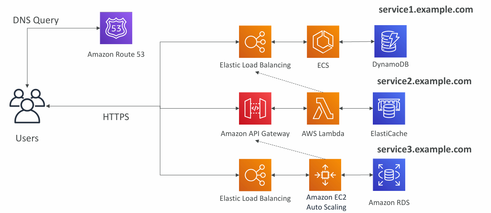
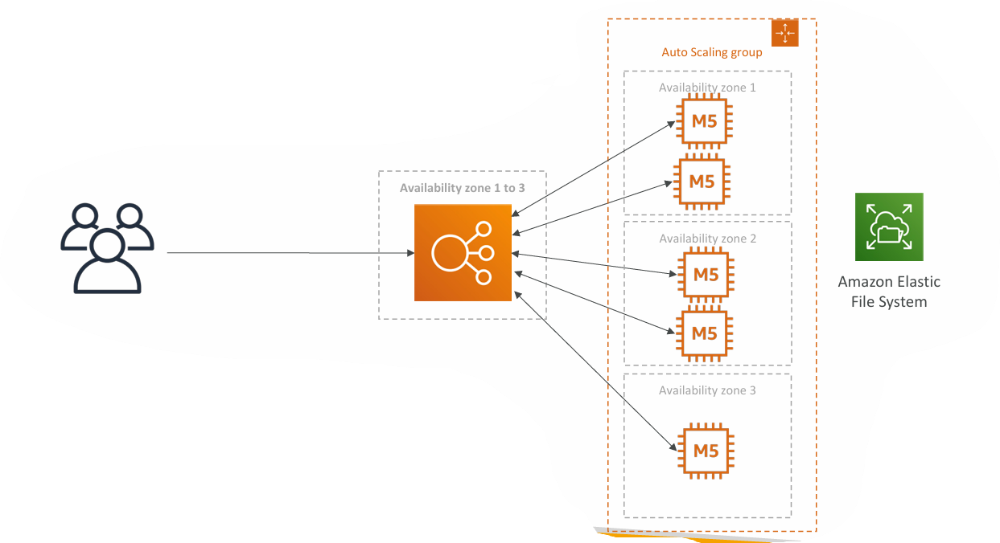
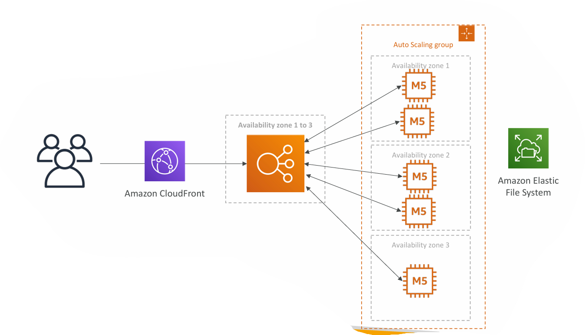

**Microservices Architecture & Software Update Offloading**:

---

## **1. Microservices Architecture**

### **Goal**

* Transition from a monolithic to a **microservices architecture**.
* Enable **independent development lifecycles** for each service.
* Services interact with each other using **REST APIs**.
* Each service’s architecture can be customized independently (different storage, compute, scaling patterns).

---

### **2. Microservices Environment Design**

* **Amazon Route 53**

  * Manages DNS queries and routes users to the correct service endpoint.
* **Service1: service1.example.com**

  * Load balanced with **Elastic Load Balancing**.
  * Runs on **ECS** (Elastic Container Service).
  * Uses **DynamoDB** for storage.
* **Service2: service2.example.com**

  * Exposed via **Amazon API Gateway**.
  * Compute layer is **AWS Lambda**.
  * Uses **ElastiCache** for in-memory data.
* **Service3: service3.example.com**

  * Load balanced with **Elastic Load Balancing**.
  * Runs on **Amazon EC2 Auto Scaling** instances.
  * Uses **Amazon RDS** for relational database storage.

---

### **3. Microservices Design Considerations**

* **Freedom of Design**

  * Teams can choose different compute/storage stacks for each service.
* **Communication Patterns**

  * **Synchronous**: API Gateway, Load Balancers.
  * **Asynchronous**: SQS, Kinesis, SNS, S3-triggered Lambdas.
* **Challenges**

  * Overhead of creating and managing many services.
  * Server utilization inefficiency.
  * Complexity of managing multiple versions.
  * Increased client-side integration effort.
* **Serverless Patterns to Reduce Challenges**

  * API Gateway and Lambda scale automatically and are pay-per-use.
  * APIs can be cloned and reproduced quickly.
  * API Gateway + Swagger integration can auto-generate client SDKs.

---

## **4. Software Updates Offloading**

### **Problem**

* EC2 application distributes software updates.
* When new updates are released, there is a **traffic spike** leading to:

  * High EC2 CPU usage.
  * High bandwidth costs.
* Updates are **static files** but are served directly from the EC2 fleet.
* Goal: Reduce EC2 load and cost without rewriting the application.

> <ins>__In brief__: 
> ### **Scenario**
>
> * **Current setup**:
>
>   * An application is hosted on **Amazon EC2**.
>   * One of its functions is to distribute **software update files** (e.g., installers, patches).
>   * Updates are **not frequent** (maybe once a week/month).
> 
> * **Problem during updates**:
>
>   * When a new update is released, **many users request it at the same time**.
>   * The update file is **large** and served  **directly from EC2**.
>   * This causes:
>
>       * **High CPU usage** on EC2 (serving files takes processing resources).
>        * **High bandwidth costs** (data transfer from EC2 to the internet is expensive).
>       * **Auto Scaling** kicks in to handle the load → increases costs further.
>
> * **Key requirement**:
>
>    * **Do not change application code**.
>    * Find a way to **reduce EC2 CPU load** and  **save network transfer costs**.

---

### **5. Current State**

* Users access the application via **Elastic Load Balancer**.
* Behind the ELB:

  * Auto Scaling Group with EC2 instances across multiple Availability Zones.
  * **Amazon Elastic File System (EFS)** stores update files.
* All requests hit the EC2 instances directly.

> <ins>__In brief__: 
> ### **Why this happens**
>
> * Even though update files are **static** (unchanging once released), every user download still hits the EC2 servers directly.
> * EC2 instances have to repeatedly read the file and send it over the network for every request.
> * This is **inefficient** — same file served thousands of times.

---

### **6. Optimized Solution: Amazon CloudFront**

* Introduce **CloudFront** in front of the application.
* CloudFront caches **static software update files** at edge locations.
* Edge caching means:

  * EC2 serves fewer requests.
  * Reduced bandwidth costs.
  * Lower load on Auto Scaling Group (less scaling needed).
* No changes needed to existing EC2 application code.

> <ins>In brief:  
>
> ### **How to solve without changing the app**
>
> * Introduce a **content delivery network (CDN)** like **Amazon CloudFront** in front of EC2.
> * **CloudFront caching**:
>
>   1. First request → CloudFront fetches file from EC2 (origin).
>   2. Stores it at **edge locations** around the world.
>   3. Subsequent requests are served **from cache** near the users, **bypassing EC2**.
> * Benefits:
>
>    * **Huge drop in EC2 CPU usage**.
>    * **Reduced network traffic from EC2** → big cost savings.
>    * Faster downloads for users (closer edge servers).
>    * No code changes needed — just DNS and infrastructure adjustments.

---

### **7. Benefits of CloudFront for Update Distribution**

1. **No Architecture Change** – Only add CloudFront in front.
2. **Edge Caching** – Serves static files closer to the user.
3. **Reduced Scaling Needs** – ASG scales less often.
4. **Cost Savings**

   * EC2 cost reduction.
   * Lower bandwidth charges.
   * Reduced network traffic to origin servers.
5. **High Availability & Scalability** – CloudFront is managed and scales automatically.
6. **Optimized CPU Usage** – EC2 is freed from handling large file transfers.
7. **Improved User Experience** – Faster download speeds due to closer edge locations.

---

## **8. Key Takeaways**

* Microservices allow flexible service design but introduce complexity in scaling, deployment, and integration.
* Serverless patterns like **API Gateway + Lambda** can simplify microservice scaling and reduce operational overhead.
* CloudFront is a cost-effective way to offload **high-volume static content delivery** from EC2, improving performance and reducing infrastructure costs.

