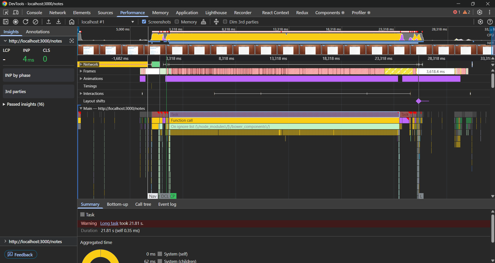

# **How Browsers Parse HTML into DOM**

---

## **1. Concept**

When you open a web page, the browser needs to transform your **HTML code** (which is just plain text) into a **live, interactive document structure** that scripts and CSS can manipulate.
This transformation happens in a **multi-stage parsing and rendering process** handled by the browser’s engine (e.g., Blink in Chrome, WebKit in Safari, Gecko in Firefox).

The core output of HTML parsing is the **DOM (Document Object Model)** — an in-memory tree representation of the HTML document.

---

## **2. Step-by-Step Lifecycle: Parsing HTML into DOM**

### **Step 0 — Fetching HTML**

* **From network** (HTTP/HTTPS request) or **from cache** (memory/disk).
* Received in chunks (streamed), not as a single file.
* Starts parsing before the entire document is downloaded (HTML is **incrementally parsed**).

---

### **Step 1 — Input Stream Preprocessing**

* Browser converts **bytes → characters** using the document’s encoding (UTF-8, ISO-8859-1, etc.).
* HTML5 spec requires this **character decoding** to happen before tokenization.

---

### **Step 2 — Tokenization (Lexical Analysis)**

* The **HTML tokenizer** scans characters and breaks them into **tokens**:

  * Start tags: `<div>`
  * End tags: `</div>`
  * Self-closing tags: ``
  * Text nodes
  * Comments: `<!-- comment -->`
  * Doctype: `<!DOCTYPE html>`
* Tokenizer uses a **state machine** — HTML parsing is **context-sensitive** (inside `<script>` behaves differently than in `<body>`).

---

### **Step 3 — Tree Construction**

* Tokens are fed into the **Tree Construction Stage**.
* The **DOM Tree** starts forming node-by-node:

  * Element nodes for tags
  * Text nodes for inline text
  * Comment nodes
* **Implicit tag insertion**:

  * If `<html>` or `<body>` missing, the parser inserts them automatically.
  * `<tbody>` may be auto-inserted inside `<table>`.

---

### **Step 4 — Handling Scripts During Parsing**

* **Blocking behavior**:
  If a `<script>` tag without `async` or `defer` appears, HTML parsing **pauses**:

  * Browser executes the script immediately (can modify the DOM via `document.write`).
  * Parsing resumes afterwards.
* **`async`**: Script fetched in parallel, executed as soon as it’s ready (may run before parsing completes).
* **`defer`**: Script fetched in parallel but executed after parsing completes.

---

### **Step 5 — DOM Completion**

* Once all HTML tokens are processed and scripts executed:

  * The **`DOMContentLoaded`** event fires.
  * The DOM is now ready for interaction.

---

## **3. How DOM Relates to Rendering**

Parsing HTML into DOM is **just the first stage** of the Rendering Lifecycle:

1. **HTML Parsing** → DOM Tree
2. **CSS Parsing** → CSSOM Tree
3. **DOM + CSSOM** → **Render Tree**
4. **Layout** (reflow) → Calculate element positions and sizes
5. **Painting** → Fill pixels (text, colors, borders, images)
6. **Compositing** → Merge painted layers into final image

---

## **4. Key Browser Internals Optimizations**

* **Speculative Parsing**: While blocking scripts are downloading, the browser may still scan ahead to find other resources (images, CSS, more scripts).
* **Incremental Parsing**: DOM is built progressively as HTML streams in.
* **Preload Scanner**: Detects `link rel="stylesheet"` and `` early to fetch resources in parallel.
* **GPU Compositing**: Offloads final visual composition to GPU for performance.

---

## **5. Example Timeline of Events**

```
[0 ms]  Receive first HTML bytes
[5 ms]  Start tokenizing → <html>, <head>, <link>, ...
[10 ms] Encounter blocking <script>, pause DOM construction
[12 ms] Execute script
[15 ms] Resume parsing
[25 ms] DOM completed → DOMContentLoaded
[30 ms] CSS + layout + paint → First Render
```

---

## **6. Important Points for FAANG-Level Interviews**

* **DOM ≠ HTML** — HTML is source text, DOM is a runtime object model.
* **Parsing is single-threaded** — The parser and JS execution share the main thread.
* **Render-blocking scripts** slow down DOM creation; defer/async improves performance.
* **Speculative preloading** is key for faster page loads.
* **Incremental rendering** means users may see partial content before DOM completion.

---

Let’s go into **real-world browser tracing** so you can actually *see* how the HTML parsing → DOM building → render lifecycle happens, exactly the way an interviewer would expect you to analyze it in DevTools.

---

# **Browser DevTools Tracing: HTML → DOM → Rendering**

---

## **1. Opening the Performance Tab in Chrome**

1. Open Chrome DevTools (`F12` or `Ctrl+Shift+I` / `Cmd+Opt+I` on Mac).
2. Go to the **Performance** panel.
3. Enable **Screenshots** (checkbox at top).
4. Hit the **Record** button (●).
5. Reload the page (Ctrl+R / Cmd+R).
6. Stop recording after the page loads.




You now have a detailed **timeline trace** of what the browser did from the moment it started fetching HTML to the first pixel being painted.

---

## **2. What You’ll See in the Timeline**

### **Top Bar**

* **Loading**: Network requests for HTML, CSS, JS, images.
* **Scripting**: JavaScript execution time (blocking or async).
* **Rendering**: Style recalculation, layout (reflow), paint.
* **Painting & Compositing**: GPU work to draw pixels.

---

### **Main Thread Track**

Here’s the sequence you’ll typically see for HTML parsing:

1. **Parse HTML**

   * The HTML tokenizer converts incoming text into tokens.
   * DOM nodes are created progressively.
   * Long green bar labeled “Parse HTML” in the main thread.

2. **Recalculate Style**

   * Happens after CSS is parsed.
   * If CSS arrives late, style recalculation is delayed.

3. **Layout (Reflow)**

   * Computes element positions and sizes from the DOM + CSSOM.

4. **Paint**

   * Rasterizes shapes, text, images into paint layers.

5. **Composite Layers**

   * GPU merges layers into the final frame.

---

## **3. Identifying Blocking Points**

* **Script Pause in HTML Parsing**:
  In the trace, you’ll see:

  * Parse HTML → **pause** (script download & execute) → resume Parse HTML.
* **CSS Blocking Render**:

  * `link rel="stylesheet"` without `media` can delay render until CSSOM is ready.

---

## **4. Example Walkthrough**

Let’s say we have a page:

```html
<!DOCTYPE html>
<html>
<head>
  <link rel="stylesheet" href="styles.css">
  <script src="main.js"></script>
</head>
<body>
  <h1>Hello</h1>
</body>
</html>
```

**DevTools Timeline Might Look Like:**

```
[  0 ms] Request HTML
[ 20 ms] Parse HTML starts
[ 25 ms] Request styles.css
[ 30 ms] Request main.js
[ 35 ms] HTML parsing pauses → main.js execution
[ 50 ms] Resume parsing → DOM complete
[ 55 ms] CSSOM ready → Style recalculation
[ 60 ms] Layout
[ 65 ms] Paint
[ 70 ms] First Contentful Paint (FCP)
```

---

## **5. Metrics to Watch (FAANG-level Focus)**

* **DOMContentLoaded (DCL)** — When HTML parsing finishes and the DOM is ready.
* **First Contentful Paint (FCP)** — First text/image rendered.
* **Largest Contentful Paint (LCP)** — Largest visual element displayed.
* **JavaScript Long Tasks** — Blocks parsing and user interaction.
* **Blocking Time** — Periods where the main thread can’t respond to input.

---

## **6. Optimizations You Can Spot**

From the trace, you might notice:

* Blocking scripts → Suggest `defer` or `async`.
* Late CSS → Suggest `preload` critical CSS.
* Large layout shifts → Suggest reserving space (avoid CLS).
* Long paint times → Suggest image optimization or GPU-accelerated layers.

---

✅ **Pro Tip for Interviews**:
If they give you a **slow page** and ask “what’s happening under the hood,”
you can pull up DevTools → Performance, filter to “Parse HTML,” and explain exactly:

* Where parsing paused
* Which resources caused delays
* How DOM/CSSOM merge timing affects rendering

---

### <ins>CIQnA

## **1. Theory Questions**

### **Q1. What’s the difference between HTML and the DOM?**

**A:**

* **HTML**: The static source code sent from the server — plain text.
* **DOM**: A dynamic, in-memory tree structure created by the browser’s parser from HTML.
* DOM can be modified by JavaScript after parsing; HTML remains unchanged unless reloaded.

---

### **Q2. Explain the steps the browser takes to parse HTML into a DOM.**

**A:**

1. **Fetch HTML** from network or cache.
2. **Decode bytes → characters** (UTF-8, etc.).
3. **Tokenize** into HTML tokens using a state machine.
4. **Tree Construction**: Build DOM nodes from tokens.
5. **Handle scripts** (pause parsing if blocking).
6. **Emit DOMComplete** → DOMContentLoaded event fires.

---

### **Q3. How do blocking scripts affect DOM construction?**

**A:**

* Parsing pauses when the browser encounters `<script>` without `defer`/`async`.
* Script is fetched (if external), executed, and may modify the DOM.
* Only after execution does parsing resume.
* This can delay **DOMContentLoaded** and **First Paint**.

---

### **Q4. What’s the difference between DOMContentLoaded and load events?**

**A:**

* **DOMContentLoaded**: Fires after the HTML is parsed and DOM is ready (doesn’t wait for images, stylesheets, iframes).
* **load**: Fires after all resources (images, CSS, scripts) are fully loaded.

---

### **Q5. How does HTML parsing interact with CSS parsing?**

**A:**

* HTML parsing → DOM, CSS parsing → CSSOM.
* CSS is **render-blocking**: browser won’t paint until CSSOM is ready.
* HTML parsing continues even if CSS isn’t ready (unless JavaScript that depends on CSS is encountered).

---

### **Q6. What is speculative parsing?**

**A:**

* While the main parser is blocked (e.g., by a script), the browser runs a **preload scanner** to look ahead for resources (`<link>`, ``) and fetch them early to reduce blocking.

---

## **2. Performance & Optimization Questions**

### **Q7. How can you optimize DOM construction speed?**

**A:**

* Use `defer` or `async` on scripts to avoid blocking.
* Place scripts at the end of `<body>` if not deferred.
* Minimize DOM size and nesting.
* Avoid inline scripts that block parsing.
* Split large HTML into modular templates for streaming.

---

### **Q8. Which metrics in DevTools help measure parsing performance?**

**A:**

* **DOMContentLoaded (DCL)**
* **First Contentful Paint (FCP)**
* **Largest Contentful Paint (LCP)**
* **Blocking Time**
* **Long Tasks** in Main Thread

---

### **Q9. How would you debug slow DOM building in Chrome?**

**A:**

* Use **Performance Tab** → filter for "Parse HTML" events.
* Look for pauses in parsing → check if caused by script execution.
* Inspect Network tab for slow resource loads.
* Use Coverage tool to see unused CSS/JS.

---

## **3. Advanced / Tricky Questions**

### **Q10. Is DOM construction synchronous or asynchronous?**

**A:**

* DOM construction is **synchronous** with respect to HTML parsing and JavaScript execution — they share the same main thread.
* But network fetching is asynchronous.

---

### **Q11. What happens if HTML is malformed?**

**A:**

* HTML5 parser is fault-tolerant; inserts missing tags automatically.
* For example, `<p>` without closing tag will be auto-closed when a block element starts.
* This is called **error correction in tree construction**.

---

### **Q12. Can the DOM be partially interactive before full parsing completes?**

**A:**

* Yes. Browsers progressively render as DOM nodes are created.
* However, user interaction might be delayed if the main thread is blocked.

---

### **Q13. How does streaming HTML affect DOM parsing?**

**A:**

* Browsers parse HTML incrementally as chunks arrive.
* Useful for **server-side rendering (SSR)** — first bytes can render before the full page loads.

---

### **Q14. What’s the difference between DOM Tree and Render Tree?**

**A:**

* **DOM Tree**: Structure of all nodes (including hidden elements like `<head>`).
* **Render Tree**: Combines DOM nodes with CSS styles, excluding invisible elements (`display:none`).

---

### **Q15. Why can a style change cause reflow but a class change cause repaint only?**

**A:**

* **Reflow**: Layout recalculation due to size/position changes.
* **Repaint**: Only visual appearance changes (color, background) without layout changes.


