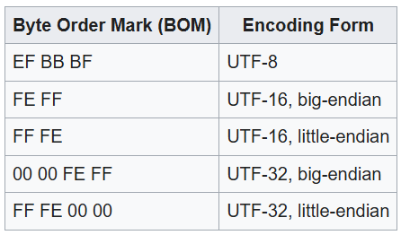

# **Character Encoding (`<meta charset="UTF-8">`)**

---

## **1. Concept Overview**

**Internationalization (I18n)** in HTML ensures that your web content can be correctly displayed for users across **different languages, writing systems, and symbols**.

At the heart of this is **character encoding** — the mapping between **binary data** and **human-readable characters**.

The HTML tag:

```html
<meta charset="UTF-8">
```

tells the browser **which encoding to use when interpreting the document**.

Without the correct encoding declaration, text may be misinterpreted, resulting in **garbled or broken characters** (commonly called “mojibake”).

---

## **2. What is Character Encoding?**

A **character encoding** maps characters (like `A`, `あ`, `₹`, `🙂`) to numerical code points and then to binary.

Example with `A`:

1. Unicode code point: `U+0041`
2. UTF-8 encoding: `01000001` (binary `0x41`)

### **Why it Matters**

* The **same byte sequence** can mean different characters depending on encoding.
* Example:

  * In UTF-8: `0xC3 0xA9` → `é`
  * In ISO-8859-1: same bytes might produce a different symbol.

---

## **3. The Role of `<meta charset="UTF-8">`**

### **What it Does**

* It declares that **this HTML document is encoded in UTF-8**.
* It must appear **in the first 1024 bytes** of the HTML for the browser to detect it early.
* UTF-8 can encode **all Unicode characters** (1,112,064 code points), making it the de facto standard.

### **Placement Example**

```html
<!DOCTYPE html>
<html lang="en">
<head>
  <meta charset="UTF-8">
  <title>I18n Example</title>
</head>
<body>
  <p>こんにちは, World! 🌍</p>
</body>
</html>
```

---

## **4. Why UTF-8 is the Standard Today**

* **Universal Coverage**: Supports all scripts (Latin, Cyrillic, Arabic, Chinese, Emoji).
* **Backwards Compatibility**: ASCII characters are represented the same in UTF-8.
* **Web Standard**: W3C and WHATWG recommend UTF-8 as the default for HTML5.
* **Interoperability**: Works well across browsers, APIs, and storage systems.

**Stat:** As of 2025, over **98% of web pages** use UTF-8 (W3Techs data).

---

## **5. How Browsers Determine Encoding**

The browser decides encoding from:

1. **HTTP `Content-Type` header** (highest priority):

   ```
   Content-Type: text/html; charset=UTF-8
   ```
2. **`<meta charset>`** in HTML `<head>`.
3. **Byte Order Mark (BOM)** — in some cases (especially UTF-16/UTF-32).

4. **Heuristic detection** — if no declaration is found (may guess wrong).

💡 **Tip:** Always align **HTTP header** and **meta tag** to avoid mismatch.

---

## **6. Problems Without Proper Encoding**

* **Mojibake**: Garbled characters when UTF-8 text is interpreted as ISO-8859-1.
* **Data Loss**: Writing non-ASCII characters in wrong encoding can corrupt stored data.
* **Security Issues**: Encoding confusion can be exploited in XSS payload obfuscation.
* **Broken Search & Indexing**: Search engines may misinterpret words.

Example (wrong encoding):

```
Expected: "café"
Got: "café"
```

---

## **7. UTF-8 Encoding Details**

* **Variable-length**: Uses 1–4 bytes per character.
* **Encoding ranges**:

  * 1 byte: U+0000 – U+007F (ASCII)
  * 2 bytes: U+0080 – U+07FF
  * 3 bytes: U+0800 – U+FFFF
  * 4 bytes: U+10000 – U+10FFFF (includes emoji & rare symbols)

Example:

| Character | Unicode | UTF-8 Bytes (Hex) |
| --------- | ------- | ----------------- |
| `A`       | U+0041  | 41                |
| `ñ`       | U+00F1  | C3 B1             |
| `🌍`      | U+1F30D | F0 9F 8C 8D       |

---

## **8. Best Practices for Character Encoding in HTML**

1. **Always declare UTF-8** in HTML:

   ```html
   <meta charset="UTF-8">
   ```
2. **Also set in HTTP headers**:

   ```
   Content-Type: text/html; charset=UTF-8
   ```
3. **Place early** — before any non-ASCII characters.
4. **Save files in UTF-8** in your editor/IDE.
5. **Ensure database encoding matches** (e.g., `utf8mb4` in MySQL).
6. **Test with multilingual content** (including emoji).
7. **Avoid relying on browser guessing** — declare explicitly.

---

## **9. Performance & Parsing Note**

* **Why in first 1024 bytes?**
  Browsers parse HTML in chunks; if the encoding is unknown, it must guess until the `<meta charset>` is found. If it guesses wrong, it must re-parse → wasted CPU cycles and slower FCP.
* **HTML5 Simplification**: Older HTML required a longer form:

  ```html
  <meta http-equiv="Content-Type" content="text/html; charset=UTF-8">
  ```

  Now just `<meta charset="UTF-8">` is enough.

---

## **10. Common Interview Questions**

**Q1:** *Why is UTF-8 preferred over UTF-16 for the web?*
**A:** UTF-8 is backward compatible with ASCII, more space-efficient for English-heavy content, avoids BOM confusion, and is the web standard.

**Q2:** *If your site is showing mojibake, how would you debug?*
**A:** Check:

1. File save encoding in IDE.
2. `<meta charset>` presence and placement.
3. HTTP `Content-Type` header.
4. Database/table encoding and connection settings.
5. Double encoding issues in backend.

**Q3:** *Can `<meta charset>` fix already corrupted text?*
**A:** No — it only tells the browser how to interpret bytes. If data is stored incorrectly, you must fix it at the source.

---

## **11. Real-World Failure Case**

**Background:** A global e-commerce platform had product descriptions in multiple languages.
**Problem:** Japanese and Arabic text appeared as `?????` in some browsers.
**Cause:**

* HTML had `<meta charset="UTF-8">`, but server was sending:

  ```
  Content-Type: text/html; charset=ISO-8859-1
  ```
* Browser followed HTTP header (higher priority), causing encoding mismatch.

**Fix:** Align server HTTP headers and HTML `<meta charset>` to UTF-8.

---

## **12. Key Takeaways**

* UTF-8 is **the universal standard** for HTML5 encoding.
* `<meta charset="UTF-8">` ensures proper rendering of multilingual and emoji-rich text.
* Always **match** server HTTP headers with your HTML declaration.
* Misaligned or missing encoding causes **user-facing corruption** and SEO issues.
* Correct placement in the HTML head speeds up parsing.

---


# **HTML Character Encoding Decision Guide**


## **1. Default Choice**

* ✅ **Always use `UTF-8`** for HTML5:

  ```html
  <meta charset="UTF-8">
  ```
* Also set in **HTTP header**:

  ```
  Content-Type: text/html; charset=UTF-8
  ```

---

## **2. When to Consider Alternatives**

| Encoding           | When to Use                                      | Drawbacks                                                          |
| ------------------ | ------------------------------------------------ | ------------------------------------------------------------------ |
| UTF-16             | Rare — internal text processing for certain apps | Not ASCII-compatible, BOM issues, larger size for ASCII-heavy docs |
| ISO-8859-1         | Legacy support for old Latin-1 systems           | Limited characters, no emoji                                       |
| Shift-JIS / GB2312 | Legacy Japanese/Chinese sites                    | Poor multilingual mixing, not web standard                         |
| UTF-32             | Internal text processing, not web delivery       | Very large size, not efficient for HTML                            |

💡 **Rule**: Only use non-UTF-8 if you’re **forced** by legacy data or system constraints.

---

## **3. Encoding Decision Map**

```
Do you need multilingual / emoji support?
           ├── Yes → UTF-8
           └── No
               ├── Legacy system requirement?
               │      ├── Yes → Use matching legacy encoding
               │      └── No → UTF-8
```

---

## **4. Production Readiness Checklist**

### **HTML**

* [ ] `<meta charset="UTF-8">` is the **first element** in `<head>` before any non-ASCII characters.
* [ ] File saved as UTF-8 without BOM (unless explicitly needed).

### **Server**

* [ ] HTTP `Content-Type` header matches (`charset=UTF-8`).
* [ ] Static file server / CDN preserves encoding headers.

### **Database**

* [ ] Schema & tables use UTF-8 (`utf8mb4` in MySQL for emoji support).
* [ ] Client connection (`SET NAMES utf8mb4`) matches table encoding.

### **Testing**

* [ ] Insert multilingual + emoji content in staging.
* [ ] View in multiple browsers and OS locales.
* [ ] Validate encoding with `file` command (Linux) or editor info.

---

## **5. Debugging Encoding Issues**

**Symptoms**

* Garbled text (`é` instead of `é`)
* Question marks (`???`) in place of characters
* Missing emoji

**Checklist**

1. Confirm browser’s detected encoding (DevTools → Network → Response Headers).
2. Ensure HTML `<meta charset>` exists and is early in `<head>`.
3. Check server HTTP `Content-Type` matches.
4. Verify file storage encoding in IDE.
5. Inspect DB column encoding and connection charset.
6. Avoid double encoding/decoding in backend.

---

## **6. Quick Interview Responses**

**Q:** *Why is UTF-8 the default choice for HTML5?*
**A:** It’s ASCII-compatible, supports all Unicode characters, is more space-efficient than UTF-16 for typical web text, and is the web standard per W3C.

**Q:** *How would you fix mojibake in a web app?*
**A:** Align file encoding, `<meta charset>`, HTTP header, and DB connection settings to UTF-8. Ensure all layers handle UTF-8 consistently.

**Q:** *Can `<meta charset>` override the HTTP header?*
**A:** No — HTTP `Content-Type` has higher priority. Always align both.


